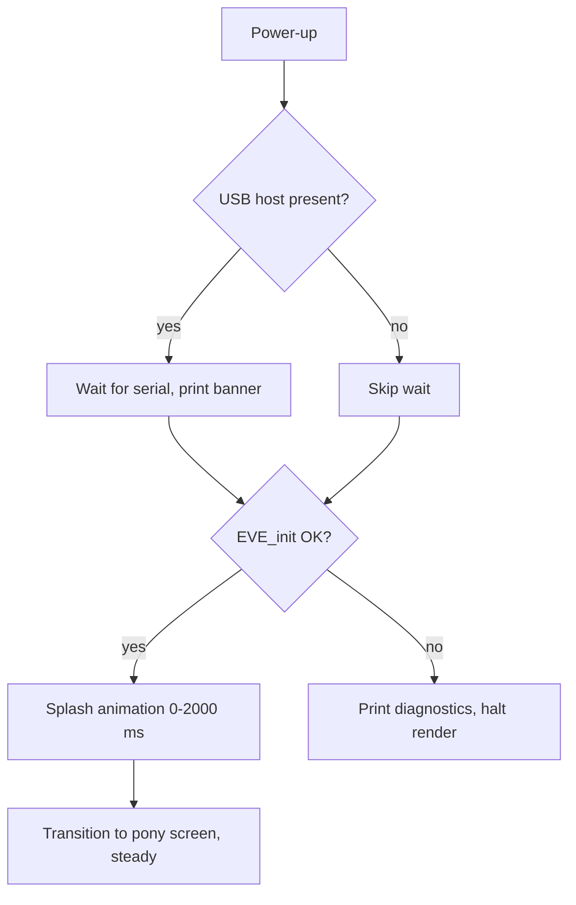
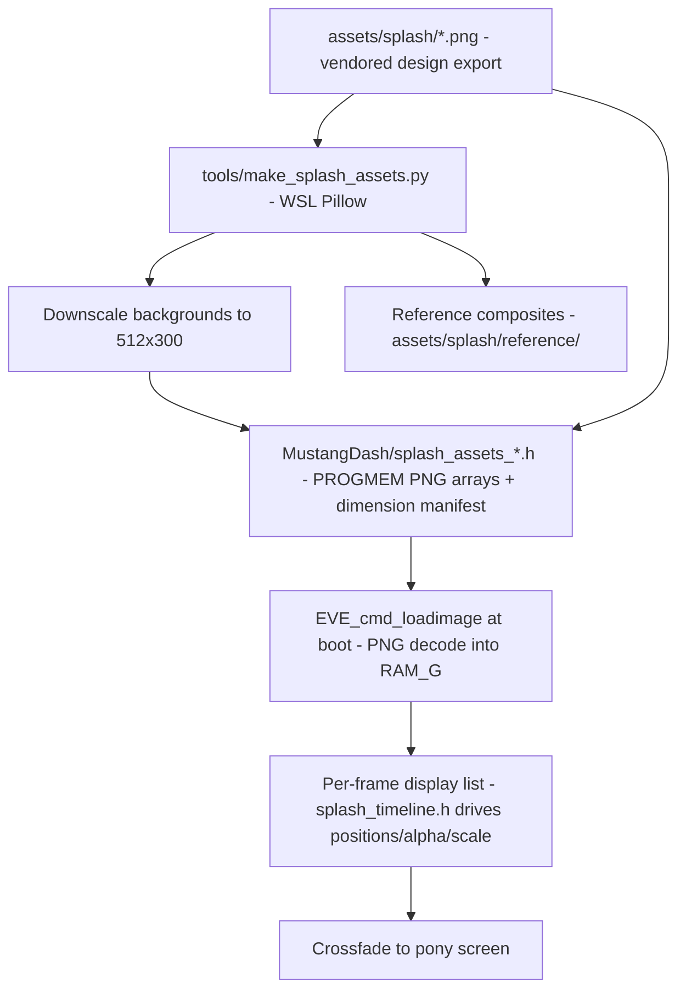

# Boot Splash - Plan

## Goal Capsule

- **Objective:** Play a 2-second animated Mustang boot splash on power-up, in one of three compiled-in themes, then crossfade to the existing pony screen.
- **Product authority:** Kevin's Claude Design export — the animation spec and handoff notes vendored at `assets/splash/README.md` and `assets/splash/HANDOFF.md` (U1) — plus the three reference final-frame images and the decisions in the Product Contract below.
- **Execution profile:** Firmware change on the `MustangDash` sketch plus host-side tooling and tests. Build with `./scripts/compile.sh` or `pio run`; host tests via `wsl -- bash -lc "./tests/run-tests.sh"` on Windows. Bench hardware (Teensy 4.1 + RVT70H panel) is available for final visual verification.
- **Stop conditions:** Stop and surface rather than guess if the RAM_G budget cannot hold a theme's working set plus the pony bitmap (see Assumptions), or if the animation cannot hold 50 fps at 8 MHz SPI.
- **Open blockers:** None.

---

## Product Contract

### Summary

Implement the Claude Design boot-splash spec on the Teensy 4.1 / RVT70H firmware: a 2000 ms animated sequence (bars slide in, emblem pops with overshoot, wordmark and year rise, accent line sweeps) that plays immediately on power-up and hands off to the existing pony screen. All three themes — blue, red, checkered — ship in the firmware, selected by a build-time switch.

### Key Decisions

- **All three themes compiled in, chosen at build time.** The panel has no touch input, so runtime selection has no input path; a single build-time setting keeps theme swaps to a rebuild instead of a re-export. Teensy 4.1's 8 MB flash holds all three asset sets comfortably.
- **Splash hands off to the pony screen rather than holding its final frame.** The pony screen stays the standing display; the splash is strictly a boot animation. This keeps two brand screens alive until a real dash UI replaces the pony screen.
- **Serial wait becomes conditional on a USB host.** The current firmware always blocks up to 2 s for the serial monitor before touching the display (`MustangDash/MustangDash.ino:60-64`). In the car that reads as 2 s of black before the splash. The firmware should wait only when a USB host is actually present — instant in the car, banner-safe on the bench.
- **Assets ship embedded in the Teensy firmware and load into display RAM at boot** — the same path the pony PNG uses today. The display module's own flash and the EVE Asset Builder pipeline stay out of scope; the project has no flash-programming workflow and doesn't need one for this.

### Requirements

**Splash rendering and animation**

- R1. The splash implements the spec's 2000 ms timeline: background visible from 0 ms; bars/strips slide in 200–840 ms; emblem scales up with overshoot 360–1000 ms; wordmark and year rise 760–1360 ms; accent line sweeps open from center 1040–1640 ms; hold 1640–2000 ms. Easing is ease-out cubic, emblem uses ease-out back, per the spec's formulas.
- R2. The animation is smooth to the eye — no visible stepping, no flicker at load — targeting the spec's 50–60 fps render loop.
- R3. The held final frame matches the three reference final-frame images pixel-close at 1024×600, with element positions from the spec's layout table.
- R4. The checkered theme uses its variant assets: checker blocks in place of chrome bars, the checker accent line, and full-width checker strips at the top and bottom edges.

| Element | Window (ms) | Motion |
|---|---|---|
| Background | 0–2000 | static |
| Bars / checker blocks and strips | 200–840 | slide in from off-screen left/right, fade 0→1 |
| Emblem | 360–1000 | scale 0.70→1.00 about center with overshoot, fade 0→1 |
| Wordmark + year | 760–1360 | rise 26 px to final, fade 0→1 |
| Accent line | 1040–1640 | scale X 0→1 about center |
| Hold | 1640–2000 | final composition steady |

**Theming**

- R5. All three themes (blue, red, checkered) are embedded in the firmware image.
- R6. One build-time setting selects the active theme; changing themes requires only editing that setting and rebuilding.

**Boot behavior**

- R7. The splash starts promptly after power-up with no unconditional delay: the firmware waits for the serial monitor only when a USB host is connected.
- R8. When the splash completes, the display transitions to the existing pony screen, which remains the standing display.
- R9. If display init fails, the existing serial diagnostics (init return code, `REG_ID` readout) are preserved and the firmware does not hang or render.

**Assets**

- R10. The design assets, the spec documents (`README.md`, `HANDOFF.md`), and the three reference final-frame images are vendored into the repo so the splash can be rebuilt and verified without the external Downloads folder.

### Key Flows

- F1. Boot in the car (no USB host)
  - **Trigger:** 12 V accessory power arrives; Teensy boots with no USB host attached.
  - **Steps:** Firmware skips the serial wait; display init runs; splash plays 0–2000 ms; transition to pony screen.
  - **Outcome:** Splash visible within display-init time of power-on; pony screen steady thereafter. **Covers R1, R7, R8.**
- F2. Boot on the bench (USB host attached)
  - **Trigger:** Upload or power-up with the laptop connected.
  - **Steps:** Firmware waits for the serial monitor (bounded, as today); boot banner prints; then the same splash-to-pony sequence as F1.
  - **Outcome:** Diagnostics captured, splash unchanged. **Covers R7, R9.**
- F3. Display init failure
  - **Trigger:** `EVE_init()` returns non-OK (panel unplugged, wiring fault).
  - **Steps:** Failure diagnostics print exactly as the current firmware does; no splash, no render loop.
  - **Outcome:** Bench debugging path preserved. **Covers R9.**

### Acceptance Examples

- AE1. **Covers R7.** Given the Teensy is powered from a USB wall adapter (power, no host), when it boots, then the splash begins as soon as display init completes — no 2-second black pause.
- AE2. **Covers R7, R9.** Given the bench serial-capture workflow is running, when the firmware boots, then the boot banner (pins, panel, init result, `REG_ID`) is captured as it is today.
- AE3. **Covers R5, R6.** Given the build-time theme setting is changed from blue to checkered and the firmware rebuilt, when it boots, then the checkered splash plays with strips, blocks, and checker line — no other source edits.
- AE4. **Covers R3.** Given the splash reaches its hold phase, when compared against the matching reference final-frame image, then layout, colors, and element positions visibly match at 1024×600.

### Scope Boundaries

- Runtime theme switching — no input hardware exists; build-time only.
- The display module's onboard flash and the EVE Asset Builder pipeline — assets stay embedded in the Teensy firmware.
- A real dash UI (gauges, vehicle data) — the pony screen remains the post-splash display until that work happens.

### Dependencies / Assumptions

- The design export currently lives outside the repo (Kevin's Downloads, `Custom Mustang dash screen/export/firmware-assets`); R10 vendors it in. The three reference final frames come from the same design session (one folder above `firmware-assets` in the original download); if the files are unavailable, U2's converter reconstructs them deterministically by compositing the assets at the spec's final positions.
- The display chip's bitmap RAM is 1 MB (`libraries/FT800-FT813/src/EVE.h:103`); a full-screen 1024×600 background at 16-bit color needs 1.2 MB, so the background will not be a byte-exact copy of the PNG. The soft radial gradients tolerate a downscaled-and-upscaled bitmap with no visible difference — accepted during scoping.
- The animation renders by rebuilding the display list per frame, which the existing library and SPI link already support; no new hardware or wiring is required.

---

## Planning Contract

**Product Contract preservation:** unchanged, except the former Outstanding Questions section — all four items were marked deferred-to-planning and are resolved below as KTD-1 through KTD-4.

### Key Technical Decisions

- KTD-1. **Background as a half-resolution bitmap scaled 2× on-chip** (512×300 RGB565, drawn with a bitmap transform to fill 1024×600). Preserves the designed vignette exactly where a procedural gradient would approximate it, and costs 307 KB of RAM_G instead of an impossible 1.2 MB. The converter (U2) produces the downscaled PNG; bilinear bitmap filtering hides the upscale on these soft gradients. Any drawn dimension above 511 px exceeds the base `BITMAP_SIZE`/`BITMAP_LAYOUT` bit fields — the draw setup must also emit the `_H` companion words (the library ships active inline `BITMAP_SIZE_H`/`BITMAP_LAYOUT_H` helpers, `libraries/FT800-FT813/src/EVE.h:649-687`); this applies to the 1024×600 output window, the 512-wide source's 1024-byte linestride, and the 1024-wide checker strips.
- KTD-2. **On-chip PNG decode at boot, not pre-converted raw bitmaps.** Assets embed as PNG byte arrays and decode into RAM_G with `EVE_cmd_loadimage`, the exact pattern the pony logo already uses (`MustangDash/MustangDash.ino:102`). PNGs with alpha decode to ARGB4, opaque PNGs to RGB565. Keeps flash cost low (~0.5 MB for all three themes vs several MB raw) and adds no new asset pipeline. Boot-time decode cost is tens of milliseconds, invisible next to `EVE_init()`.
- KTD-3. **Splash-to-pony transition is a ~400 ms crossfade** driven by `DL_COLOR_A`: per frame, draw the splash composition at alpha 255−a and the pony screen elements at alpha a. Both asset sets are resident in RAM_G, so the crossfade is one display list per frame. A clean cut is the documented fallback if the mixed-alpha frame exceeds budget.
- KTD-4. **USB-host detection via the Teensy core's `usb_configuration` flag** (nonzero once the host enumerates, `cores/teensy4/usb_dev.h`): wait a short bounded window (~500 ms) for enumeration; only if it occurs, extend the wait for the serial monitor (DTR) up to the current 2 s total. No host → no enumeration → boot proceeds immediately. Validate the flag's behavior on the bench during U5; the fallback is the bounded timeout that exists today.
- KTD-5. **Animation timing lives in a pure, host-testable header** (`MustangDash/splash_timeline.h`): element windows, easing functions, and per-element position/alpha/scale math with no Arduino or EVE dependencies — the `backlight_wave.h` precedent. The renderer consumes it; the invariant suite tests it on the host.
- KTD-6. **Frame pacing by `millis()`, rebuilding the display list each frame with plain (non-burst) calls**, matching the existing code style. Per-frame traffic is small (~60 display-list words; all bitmap data already in RAM_G), far below what 8 MHz SPI sustains at 60 fps. The renderer counts frames and prints the count over serial after the splash as a measurable smoothness check.
- KTD-7. **Raw display-list words via the library's shipped inline helpers.** The vendored `EVE.h` ships active `static inline` helpers for `VERTEX2F`, `COLOR_A`, `SCISSOR_XY`, and `SCISSOR_SIZE` (`libraries/FT800-FT813/src/EVE.h:867-1026`) — only the legacy `//#define` lines are commented out, so use the helpers directly with `EVE_cmd_dl()` rather than defining local macros. The sketch's existing local `VERTEX2F` macro (`MustangDash/MustangDash.ino:39`) is redundant with the shipped helper; U4 may drop it after verifying the call sites. The emblem pop uses the shipped `EVE_cmd_translate`/`EVE_cmd_scale`/`CMD_LOADIDENTITY`/`CMD_SETMATRIX` coprocessor API (`libraries/FT800-FT813/src/EVE_commands.h:423-464`).

### High-Level Technical Design

Asset flow, from design export to pixels:

RAM_G budget (worst case = checkered theme + pony bitmap resident):

| Asset | Decoded format | Bytes |
|---|---|---|
| Background 512×300 | RGB565 | 307,200 |
| Emblem 200×200 | ARGB4 | 80,000 |
| Wordmark 700×80 | ARGB4 | 112,000 |
| Checker blocks 240×52 | ARGB4 | 24,960 |
| Checker line 300×14 | ARGB4 | 8,400 |
| Checker strip 1024×26 | ARGB4 | 53,248 |
| Year 200×28 | ARGB4 | 11,200 |
| Pony 480×300 | ARGB4 | 288,000 |
| **Total** | | **≈ 885 KB of 1,048 KB** |

Blue/red themes total ≈ 847 KB (chrome bars 240×45 and accent line 340×40 in place of the checker set, no strips). RAM_G addresses are compile-time constants computed from the dimension manifest, packed sequentially from 0.

### Assumptions

- The BT817's PNG decoder uses the top of RAM_G as scratch during `CMD_LOADIMAGE`. The budget leaves ~160 KB of headroom at the top; U4 verifies decode order (largest first, from address 0) so scratch never overlaps loaded assets. If a decode corrupts a loaded asset, fall back to decoding the pony PNG after the splash completes instead of up front.
- `usb_configuration` is exposed by the Teensy 4 core under the default `USB_SERIAL` build. If it is not usable, U5 falls back to a shorter unconditional wait (~500 ms) and the plan's instant-on goal degrades gracefully; note it in the PR.

---

## Implementation Units

### U1. Vendor the design export into the repo

- **Goal:** The splash assets, spec, and handoff notes live in the repo; the build never depends on the Downloads folder.
- **Requirements:** R10
- **Dependencies:** none
- **Files:** `assets/splash/` (14 PNGs, `README.md`, `HANDOFF.md` copied from the export), `assets/splash/reference/` (the three final-frame images if available from the original download; otherwise created by U2)
- **Approach:** Straight copy from `C:\Users\kevin\Downloads\Custom Mustang dash screen\export\firmware-assets` (external source location; everything in-repo thereafter). Keep original filenames — the spec's layout table references them.
- **Test scenarios:** Test expectation: none — asset vendoring, no behavior.
- **Verification:** All 14 PNGs plus the two docs present under `assets/splash/`; spec layout table filenames resolve against the directory listing.

### U2. Asset conversion tool: PNGs to firmware headers

- **Goal:** A repeatable script turns the vendored PNGs into compilable PROGMEM headers, downscales the backgrounds, and emits reference composites for visual acceptance.
- **Requirements:** R3, R5, R10
- **Dependencies:** U1
- **Files:** `tools/make_splash_assets.py` (new), generated `MustangDash/splash_assets_blue.h`, `MustangDash/splash_assets_red.h`, `MustangDash/splash_assets_checkered.h`, `MustangDash/splash_assets_common.h` (emblem, wordmark, year variants, dimension manifest), `assets/splash/reference/splash-{blue,red,checkered}.png`
- **Approach:** Run under WSL Pillow like `tools/pony.py`. Backgrounds: downscale to 512×300, re-encode as opaque PNG. Transparent assets: pass through unchanged. Emit each as a `static const uint8_t ... PROGMEM` array with `#define` width/height, plus per-theme totals so RAM_G offsets are compile-time constants. Composite the reference frames from the spec's layout table (deterministic reconstruction of the final frame).
- **Test scenarios:** Test expectation: none — build tooling; correctness is verified by the invariant checks below and U4's on-panel acceptance.
- **Verification:** Script is idempotent (re-run produces identical headers); generated headers compile; per-theme decoded-size totals match the plan's RAM_G budget table; reference composites visually match the user-approved final frames.

### U3. Splash timeline: pure animation math, host-tested

- **Goal:** All timing, easing, and per-element interpolation lives in one dependency-free header the host test suite can pin.
- **Requirements:** R1
- **Dependencies:** none
- **Files:** `MustangDash/splash_timeline.h` (new), `tests/test_splash_timeline.c` (new), `tests/run-tests.sh` (register the new test)
- **Approach:** Element window constants (200/840, 360/1000, 760/1360, 1040/1640, hold to 2000); `ease_out_cubic`, `ease_out_back` (spec coefficients 2.7/1.7); per-element functions mapping `now_ms` to position, alpha 0–255, and scale — including bar slide endpoints (left −150→138, right 934→646), wordmark/year 26 px rise, and accent-line width factor. Follow `backlight_wave.h`'s pure-header pattern.
- **Test scenarios:**
  - Progress clamps: before an element's window → 0; after → 1.
  - `ease_out_cubic(0)=0`, `(0.5)=0.875`, `(1)=1`.
  - `ease_out_back(0)=0`, `(1)=1`, and it overshoots (max over the window > 1.0).
  - Window constants equal the spec values (static asserts).
  - Covers AE4 (math half): at `now=2000` every element reports final position, alpha 255, scale 1.0 — left bar x=138, right bar x=646, wordmark offset 0.
  - At `now=0` animated elements report alpha 0 and start positions.
- **Verification:** `wsl -- bash -lc "./tests/run-tests.sh"` passes 5/5 (existing 4 plus this).

### U4. Splash renderer and crossfade

- **Goal:** The firmware plays the 2000 ms splash for the selected theme and crossfades into the existing pony screen.
- **Requirements:** R1, R2, R3, R4, R6, R8
- **Dependencies:** U2, U3
- **Files:** `MustangDash/MustangDash.ino` (splash render functions, theme asset loading, crossfade), `MustangDash/splash_config.h` (new: `SPLASH_THEME` select defaulting to blue)
- **Approach:** At boot (after `E_OK`): hold the backlight dark (duty 0) through asset decode, and set it steady only after the first splash frame has been composed and swapped — the decode window must not flash a lit blank panel (R2). Decode the selected theme's PNGs plus the pony PNG into RAM_G per the budget layout, largest first from address 0; reference all three themes through a `const` theme-descriptor table (pointers, sizes, dimensions per theme) indexed by `SPLASH_THEME`, so the linker keeps every asset set in flash (R5) and the flash-delta check stays meaningful. Render loop: `t = millis() - t0`; rebuild the display list each frame — background bitmap with a 2× transform (`CMD_LOADIDENTITY`/`EVE_cmd_scale`/`CMD_SETMATRIX`) and the output window set via `BITMAP_SIZE_H` + `BITMAP_SIZE` (bilinear, 1024×600) plus `BITMAP_LAYOUT_H` for the >511 dimensions per KTD-1; bars/blocks at interpolated x with `DL_COLOR_A`; emblem under a translate-scale-translate transform about (512, 224), its draw window sized for the overshoot peak (ease-out-back max ≈ 1.1 → ≥ 220×220) with vertex and pivot offset so the emblem stays centered throughout; wordmark/year at interpolated y; accent line behind an expanding scissor rect; checkered theme adds the two edge strips (bottom one offset 13 px). After 2000 ms, crossfade ~400 ms per KTD-3, then hand off to the pony screen (rendered by the existing `draw_dash()`, kept unchanged). Print the rendered-frame count over serial. Use the shipped inline `SCISSOR_XY`/`SCISSOR_SIZE` helpers per KTD-7; declare prototypes for all new functions (offline ctags shim).
- **Execution note:** Bring this up on the bench incrementally — static final frame first (validates layout and asset decode against the reference image), then animate. That splits R3 acceptance from R1/R2 acceptance.
- **Test scenarios:** Test expectation: none host-side — rendering is hardware-verified (the math it consumes is pinned by U3). Bench scenarios:
  - Covers AE4: hold-phase frame vs reference composite for the active theme — layout, colors, positions match.
  - Covers AE3: rebuild with `SPLASH_THEME` = checkered → strips, blocks, checker line render (R4).
  - Covers R2: serial frame count ≥ 100 frames for the 2000 ms window (≥ 50 fps); no visible stepping or flicker on video; no edge clipping of the emblem at peak overshoot; panel stays dark until the first splash frame (no lit blank flash).
  - Crossfade reaches the pony screen with no dropped/black frames; pony screen identical to today's afterward.
- **Verification:** Both build paths compile clean (`./scripts/compile.sh`, `pio run`); bench checks above pass on the panel.

### U5. Conditional serial wait

- **Goal:** Boot is instant with no USB host; the bench banner capture keeps working when a host is attached.
- **Requirements:** R7, R9
- **Dependencies:** U4 (sequencing only — same `setup()`; land after U4 so bench diagnostics stay stable during animation bring-up)
- **Files:** `MustangDash/MustangDash.ino` (replace the unconditional wait at the top of `setup()`)
- **Approach:** Per KTD-4: bounded ~500 ms window watching `usb_configuration`; if enumeration occurs, extend up to the current 2 s for `Serial` (DTR). Keep the banner and all failure diagnostics unchanged (R9). Guard the flag reference so non-`USB_SERIAL` builds still compile.
- **Test scenarios:**
  - Covers AE1: boot from a USB wall adapter — splash starts without the 2 s pause (stopwatch/video).
  - Covers AE2: boot via the bench capture workflow — full banner captured as today.
  - Covers F3: with the panel unplugged, failure diagnostics still print on the bench.
- **Verification:** Both AE bench checks pass; no regression in the serial-capture workflow.

---

## Verification Contract

| Gate | Command / method | Proves |
|---|---|---|
| Host invariant suite | `wsl -- bash -lc "./tests/run-tests.sh"` (VS Code task "Tests: invariant suite") | U3 timeline math, existing display-profile/pin/backlight invariants — 5/5 pass |
| Firmware build (arduino-cli) | `./scripts/compile.sh` | Sketch + generated headers compile clean, no warnings |
| Firmware build (PlatformIO) | `pio run` | Second toolchain agrees; upload path ready |
| Asset regeneration | `wsl -- python3 tools/make_splash_assets.py` twice | Idempotent headers; sizes match the RAM_G budget |
| Bench acceptance | `pio run -t upload` + serial capture + eyeball vs `assets/splash/reference/` | AE1–AE4, frame-count ≥ 100/2000 ms, crossfade clean |

Flash/RAM deltas: expect flash to grow by roughly the embedded PNG total (~0.5 MB, well inside 8 MB); RAM1/RAM2 usage should be unchanged apart from small statics — a large jump signals assets landed in RAM instead of flash (`PROGMEM` missing).

---

## Definition of Done

- All five units implemented; every R1–R10 traceable to landed code or vendored assets.
- Host suite passes 5/5; both build paths compile clean and agree.
- Bench-verified on the panel: all four Acceptance Examples, including a theme-swap rebuild (AE3) and the wall-adapter instant-on check (AE1).
- The plan's serial diagnostics remain intact end-to-end (banner, init result, `REG_ID`, new frame count).
- No abandoned experiments in the diff; generated headers match a clean run of the converter; `assets/splash/` is complete per R10.
