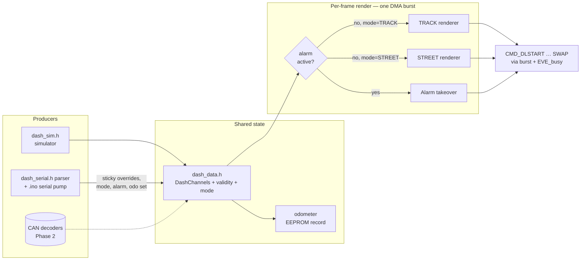

# Dash Layout - Plan

## Goal Capsule

- **Objective:** Recreate the Claude Design "EVE Triple Dash" center 7" screen on the RVT70H at native 1024×600 — TRACK and STREET modes, alarm takeover, telltales, odometer — driven by a built-in simulator with serial override until CAN lands. As part of the round (user-directed): migrate the boot splash's assets from RAM_G to the panel's onboard QSPI flash, so RAM_G belongs entirely to the dash fonts and the splash crossfades directly into the dash.
- **Product authority:** The design handoff vendored into the repo (README spec, interactive HTML mock, two reference renders — vendored by U1 into `assets/dash-design/`), plus the decisions in this contract.
- **Open blockers:** None.

---

## Product Contract

### Summary

Build the production dash for the center 7" panel from the design handoff: two switchable views (TRACK: shift lights, GPS-speed hero, RPM bar, lap/delta column; STREET: dual sweep gauges with non-linear speedo, telltale dots, odometer) plus a full-screen flashing alarm takeover. A firmware simulator feeds every channel until CAN integration, controllable over serial and via a `/dash` Claude command. Typography is real: Saira Condensed and Chakra Petch converted to EVE bitmap fonts. The boot splash transitions into the dash; the pony screen retires.

### Key Decisions

- **Native 1024×600, proportional rescale.** The design doc targets 800×480; the RVT70H is 1024×600. All layout scales proportionally (the design doc itself directs "treat all layout as proportional percentages of the panel"). Acceptance against the reference renders is therefore proportional — geometry, colors, and hierarchy must match; no pixel-diff.
- **Simulator behind the future CAN's data interface.** Live channels (rpm, speed, temps, pressures, laps, PMU states…) flow through one data interface; the simulator implements it now, the CAN decoders (Coyote Gen 4 control pack, 2× ECUMaster PMU16, RaceCapture) implement it later without touching render code.
- **Serial override is the bench control surface.** A line-based serial protocol forces values, states, mode, and alarms (`set rpm 3500`, `mode track`, `alarm oilp`, `odo set 24318`); a repo `/dash` Claude command wraps it. Mode switching arrives via this path now and via a CAN message later — same instant-swap behavior either way.
- **Full Phase 1 including odometer persistence.** EEPROM-backed odometer/trip ships now, fed by simulated distance; `odo set` corrects the accumulated fiction when real data arrives.
- **Custom EVE fonts via our own converter.** Saira Condensed (numerals, multiple sizes up to the hero) and Chakra Petch (labels) convert to EVE bitmap fonts with a Pillow-based tool in `tools/` — no EVE Asset Builder. This is the round's main new tooling; ROM fonts are not an acceptable fallback for the hero numerals per the spec's "high-fidelity, final" typography.
- **All rendering is procedural.** The design uses no raster assets — arcs, pills, LEDs, and lattices are display-list geometry. RAM_G is spent on fonts, not bitmaps.

### Requirements

**Design package and fidelity**

- R1. The design handoff (README spec, `Eve Race Dash.dc.html` + `support.js` interactive mock, both reference renders) is vendored into the repo so the dash can be built and verified without the external Downloads folder.
- R2. Layout, colors, typography, spacing, and gauge geometry follow the design doc's tokens and geometry spec, proportionally scaled to 1024×600; the two reference renders are the visual acceptance targets.

**TRACK mode**

- R3. Shift lights: 15 LEDs across the top, linear 0–8000 RPM (533 RPM each); LEDs 1–10 green, 11–13 amber, 14–15 red; above 7600 RPM all 15 flash red at ~8 Hz.
- R4. GPS SPEED hero numeral (left two-thirds) with label and MPH unit, per the spec's type hierarchy.
- R5. RPM linear bar with live value (white below 7100, amber 7100–7600, red above 7600), gold fill turning red above 7600, redline marker at 96%, and 0/2/4/6/8 scale marks.
- R6. Right column: LAP TIME readout and DELTA value with center-zero delta bar — green filling left when ahead of best, red filling right when behind, ±1.0 s full scale.

**STREET mode**

- R7. Dual sweep gauges sharing the spec's 240° gauge geometry: dominant speedometer (0–200 MPH, non-linear — 0–140 occupies 82.35% of sweep, 140–200 compressed, high labels smaller/dimmer) and smaller tachometer (0–8000, static red-zone arc 7600–8000, fill red above 7600), each with needle, gold value arc, and hub readout.
- R8. Warning telltale dots (FUEL / OIL / ECT / VOLTS) in a dead-front row: near-invisible when off, filled + glowing + colored label when triggered, per the spec's thresholds.
- R9. Odometer at bottom center (label, value, MI).

**Alarm takeover (both modes)**

- R10. A full-screen overlay flashing between bright-red and near-black at ~2.8 Hz preempts everything while any alarm condition holds: OIL PRESSURE < 29 psi, OIL TEMP > 248°F, COOLANT > 217°F, with priority oil pressure > oil temp > coolant; content shows WARNING header, alarm title, live value, and limit line per the spec.
- R11. Missing data never renders a stale alarm; absent channels display `--`.

**Data, simulator, and serial control**

- R12. All live channels flow through one data interface; the built-in simulator implements it with realistic motion (RPM/speed through gears using the vehicle constants, temps warming, lap timer running) so every visual state — thresholds, flash, alarms, delta — is reachable on the bench.
- R13. A line-based serial protocol overrides any channel or state: at minimum set <channel> <value>, mode track|street, alarm <which|off>, odo set <miles>, and a way to resume pure simulation.
- R14. A `/dash` Claude command in the repo wraps the serial protocol (e.g. `/dash set-rpm 3500`), following the `/reboot-dash` skill pattern.
- R15. Gauges update smoothly at ≥ 30 fps; mode switches are instant.

**Persistence and boot flow**

- R16. Odometer and trip persist across power cycles (EEPROM), integrated from (currently simulated) distance; `odo set` reseeds the stored value.
- R17. The boot splash crossfades into the dash, which becomes the standing display; the pony screen is removed from the boot flow. Existing serial boot diagnostics and the splash's visual behavior are unchanged (its asset storage moves to panel flash — see KTD11).

### Key Flows

- F1. Normal boot
  - **Trigger:** Power-up (car or bench).
  - **Steps:** Splash plays as today (from panel flash); it crossfades into the dash in its default mode; simulator starts feeding channels; render loop runs continuously.
  - **Outcome:** Live dash within roughly today's splash-to-screen timing of power-on. **Covers R12, R15, R17.**
- F2. Mode switch
  - **Trigger:** `mode street` / `mode track` over serial (later: CAN message).
  - **Steps:** Next frame renders the other view; no animation, no state loss (odometer, lap data, alarm state carry over).
  - **Outcome:** Instant swap, per spec. **Covers R13, R15.**
- F3. Alarm lifecycle
  - **Trigger:** Any alarm channel crosses its threshold (sim, override, or later CAN).
  - **Steps:** Takeover overlay preempts the active mode, flashing at ~2.8 Hz, showing the highest-priority active alarm with its live value; when the condition clears (or `alarm off`), the previous mode view returns.
  - **Outcome:** Un-missable alarm; no stale alarms. **Covers R10, R11.**
- F4. Bench control via Claude
  - **Trigger:** `/dash set-rpm 7700` in Claude Code.
  - **Steps:** Skill sends the line over the serial port; firmware acks; shift lights flash red on the panel.
  - **Outcome:** Every threshold and state testable from the conversation. **Covers R13, R14.**

### Acceptance Examples

- AE1. **Covers R3.** Given RPM is forced to 7700, when TRACK mode is shown, then all 15 shift LEDs flash red at ~8 Hz and the RPM value and bar render red.
- AE2. **Covers R5.** Given RPM is 7300, then the RPM value renders amber and the bar fill remains gold (amber pre-warning band is 7100–7600).
- AE3. **Covers R6.** Given the sim lap is 0.4 s ahead of best, then the delta reads green negative and the delta bar fills left of center at 40% of the half-width (±1.0 s equals full half-width).
- AE4. **Covers R7.** Given speed is 160 MPH, then the speedo needle sits in the compressed 140–200 region and the 160 label renders smaller and dimmer than the 0–140 labels.
- AE5. **Covers R8.** Given fuel level is forced to 2.0 gal, then the FUEL telltale lights amber while the other three dots stay dead-front dark.
- AE6. **Covers R10.** Given oil pressure 25 psi and coolant 220°F simultaneously, then the takeover shows OIL PRESSURE (higher priority), and clears to the prior view only when both conditions clear.
- AE7. **Covers R16.** Given the odometer reads 24,318 and power is cycled, then it resumes at 24,318; after `odo set 12000`, it resumes at 12,000.
- AE8. **Covers R2.** Given each mode's rendered screen is compared to its reference render, then layout proportions, colors, and type hierarchy visibly match at 1024×600.

### Scope Boundaries

- The two 5" side screens (ENGINE, TIMING/ROAD) — designed, explicitly Phase 2.
- All CAN and RaceCapture integration — the Coyote Gen 4 control pack, both PMU16s, GPS/lap timing, and CAN-driven mode switching arrive later behind the R12 data interface.
- Units toggle and accent variants from the mock's Tweaks panel — MPH and gold are final.
- Physical bezel LEDs (turn signals, future telltale LEDs) — hardware, not screens.

#### Deferred to Follow-Up Work

- Raising SPI clock above 8 MHz after `EVE_init()` (BT817 allows up to 30 MHz post-init) — not needed for 30 fps; revisit if frame budget ever tightens.
- Compiling static DL fragments into RAM_G and replaying via `CMD_APPEND` — an optimization with no current need.
- `EVE_busy()` timeout hardening (carried over from the splash round's advisory finding).

### Dependencies / Assumptions

- TRACK mode's lap/delta/position values are simulator fiction until RaceCapture integration — convincing for demos, meaningless on a real track day.
- Custom fonts fit RAM_G comfortably: the dash uses no bitmap assets and the splash renders from panel flash (KTD11), so the full 1 MiB belongs to font glyphs.
- The Teensy 4.1's EEPROM emulation (4284 bytes, wear-leveled flash) handles odometer persistence.
- Vehicle constants and warning thresholds are taken verbatim from the vendored design README (redline 8000, shift 7600, T56 ratios, 3.73 final, 26" tires, threshold table).
- Saira Condensed and Chakra Petch are OFL-licensed (Google Fonts) and safe to vendor and convert.

---

## Planning Contract

### Product Contract preservation

Product Contract changed in one place:

- **R8** — telltales gain a third visual state ("no data": muted gray, distinct from dead-front dark and lit) beyond the spec's two. Reason: R11's own validity model — with only two states, a lost sensor renders identically to "confirmed OK", silently defeating the telltale's purpose.

One user-directed architecture addition beyond the original contract: the boot splash's assets migrate from Teensy-PROGMEM-to-RAM_G into the panel's onboard QSPI flash (KTD11, U12). This is a storage rearchitecture of the already-shipped splash — its animation, themes, and timing contract stay identical — and it is what makes R17's direct crossfade possible alongside the dash fonts (an earlier draft of this plan had to substitute a fade-through-black because splash assets and fonts could not share RAM_G).

Everything else is unchanged.

### Key Technical Decisions

- **KTD1 — Fonts: legacy 148-byte EVE bitmap fonts in L4, built by our own converter.** `tools/make_dash_fonts.py` (Pillow + numpy, run under WSL, deterministic like `tools/make_splash_assets.py`) rasterizes vendored TTFs into fixed-cell L4 glyph sheets (4 bpp — half the RAM_G of L8, visually fine for anti-aliased text) plus the legacy 148-byte metric block per font instance (128 width bytes, format, stride, width, height, glyph pointer — layout per BT81x Programming Guide §5.4.1). Glyphs are stored only for each instance's character subset (digits + punctuation for numeral fonts; A–Z0–9 for label fonts); `firstchar` goes to `EVE_cmd_setfont2()`. The legacy block only addresses character codes 0–127, so the two non-ASCII glyphs are remapped into unused ASCII cells — the degree-sign artwork renders into `F_VAL`'s `*` cell and the middle-dot artwork into `F_LABEL`'s `;` cell — and firmware strings use the remapped bytes; the converter asserts every glyph code in every subset is < 128. The design's letter-spacing is baked into the width bytes (EVE has no tracking control). Glyph sheets are zlib-compressed into PROGMEM headers and uploaded at boot with `EVE_cmd_inflate()`; metric blocks (with the boot-time RAM_G glyph address patched in) are written raw with `EVE_memWrite_flash_buffer()`. Fonts register on bitmap handles 0–14 (15 is widget scratch, 16–31 are ROM fonts); `CMD_SETFONT2` emits DL commands, so each frame's burst re-registers the fonts it uses (~5 words each). The extended/xfont format (UTF-8) is deliberately not used — ASCII subsets suffice.
- **KTD2 — Arcs and needles are polylines; no CMD_ARC on BT817.** Verified: `CMD_ARC` exists only on BT82x; the vendored library has no arc command. The 240° sweeps render as `EVE_LINE_STRIP` polylines with `LINE_WIDTH` round caps (stroke ≈ 9–10 design units scaled), one segment per ~3° (≤81 vertices for a full sweep), endpoints precomputed with float `sinf/cosf` on the 600 MHz M7 (the library's `EVE_polar_cartesian` is 1°/int8 resolution — too coarse). Needles are 2-vertex `EVE_LINES` with round caps. All gauge geometry uses `VERTEX2F` (±1023.9 px at 1/16-px precision) — `VERTEX2II` tops out at x=511 and cannot address the right half of the panel. Coordinates are clamped on-screen before emission (the splash round's wraparound lesson).
- **KTD3 — Boot handoff: direct crossfade, fonts uploaded before the splash starts.** With splash assets living in panel flash (KTD11), RAM_G is empty at boot: `setup()` runs `EVE_init()` → `EVE_init_flash()` (attach + flashfast; `REG_FLASH_SIZE` printed in the banner) → font upload into RAM_G (~0.3–0.6 s at 8 MHz for ~250 KB — replaces today's comparable splash-PNG upload, so time-to-splash stays roughly what it is now; the backlight is dark until the first splash frame either way) → `run_splash()` renders from flash → the existing 400 ms crossfade ramp blends splash out / dash in, exactly the R17 contract. If a font upload faults (`EVE_busy()` reports and auto-recovers coprocessor faults), retry that instance once; on repeat failure, log the error over serial and boot the dash anyway with ROM font 31 substituted for the failed instance — a degraded dash beats a black panel in a car. If `EVE_init_flash()` fails (no/corrupt flash), skip the splash entirely and go straight to the dash, logging the failure — the dash never depends on flash. Before the crossfade begins, the channel struct is explicitly initialized (validity bitmask all-invalid, then the simulator stepped once) so the first visible dash frame shows plausible values and an uninitialized channel can never flash a false alarm takeover at power-up.
- **KTD4 — Data interface: a channels struct with validity bits.** `MustangDash/dash_data.h` defines only the channels a Phase-1 renderer or alarm consumes (rpm, speed_mph, ect_f, oil_temp_f, oil_press_psi, volts, fuel_gal, lap_ms, last_ms, best_ms, delta_s, ambient_f) as a plain struct plus a per-channel validity bitmask and the dash mode. Channels with no current consumer (AFR, IAT, fuel pressure, throttle/brake, lap number, position — all 5"-screen or Phase-2 material) are deliberately left out; adding a field when a consumer arrives is a one-line change, per the plan's own no-current-need precedent. Producers fill it: the simulator now, CAN decoders later. Renderers read only this struct; an invalid channel renders `--` and can never assert an alarm (R11). One rendering convention covers every non-text element backed by an invalid channel (a needle has no `--` glyph): needles and value arcs park at their zero/rest position at dead-front opacity, bar fills render empty, shift lights render dark, and telltales render a distinct muted "no data" state (dim gray dot + label, visibly different from both dead-front dark and lit) so a lost sensor is never mistaken for "confirmed OK" — a telltale's whole job is surfacing faults.
- **KTD5 — Simulator: pure host-testable header, display units.** `MustangDash/dash_sim.h` steps the state with an injected `dt_ms` (no `millis()` inside): RPM ramps through gears using the vehicle constants (shift at ~7900 → drop to ~5200; per-gear speed from `MPH = RPM × 26 / (ratio × 3.73 × 336)`), temps warm from ambient toward operating values then oscillate gently, oil pressure tracks RPM, ~62 s lap cycle updates last/best, delta is a smooth ±0.8 s blend, fuel burns down, STREET mode cruises (~2500 RPM, ~60 MPH). All values in display units (MPH, °F, psi, gal, V). Deterministic given the same seed/dt sequence — host-testable.
- **KTD6 — Serial protocol: newline-terminated ASCII lines, parser as a pure header.** On the existing USB serial (115200): `set <channel> <value>`, `clear <channel>` (marks the channel invalid), `mode track|street`, `alarm oilp|oilt|clt|off` (forces the matching channel past/off its threshold), `odo set <miles>`, `sim on|off` (resume pure simulation / freeze), `status`, `help`. Overrides are sticky per channel until `clear`-ed or `sim on`. Every command is acked with one `ok …` or `err …` line; the firmware prints nothing else after boot, so the boot banner and RAM_G diagnostics coexist untouched. `MustangDash/dash_serial.h` holds the tokenizer/parser as pure functions (line in → command struct out) — host-testable; only the thin `Serial.available()` pump and command application live in the `.ino`.
- **KTD7 — Odometer: raw `avr/eeprom.h` C API, tenth-mile integers.** The record `{magic, version, odo_tenths (uint32), trip_tenths (uint32), crc8}` lives at a fixed EEPROM offset. The raw C API (`eeprom_read_block`/`eeprom_write_block`) is used instead of the `EEPROM.h` class library because the offline sandbox toolchain vendors only `cores` + `SPI` (the class lib would silently break that build path); the Teensy 4.1 core's emulation is wear-leveled flash, 4284 bytes. Write cadence: on each 0.1 mi increment (~every 6 s at 60 MPH) and on `odo set`; a CRC-invalid or blank record initializes to zero.
- **KTD8 — Frame pipeline: one DMA burst per frame, free-running.** `loop()` becomes: pump serial → step simulator/apply overrides (dt from `millis()`) → integrate odometer → evaluate alarms → build the frame as a single burst (`EVE_start_cmd_burst()` … `_burst` calls … `EVE_end_cmd_burst()`), then poll `EVE_busy()` before starting the next. The Teensy DMA buffer caps a burst at 1024 words; the STREET frame (the heaviest: two arcs + ticks + labels + needles + telltales + odometer + font registrations) is estimated ≈ 500–700 words. If measurement shows growth past ~900 words, split the frame into two bursts with an `EVE_busy()` wait between — a known, planned fallback, not a redesign, and one the first full STREET frame may need immediately (an independent estimate puts it at 650–750 words before headroom). The 8 KB display list (2048 entries) is the second budget; text widgets expand per glyph. DL usage is measured without violating KTD6's quiet-serial contract: during the boot handoff (before the crossfade) the firmware builds one un-swapped throwaway DL per mode, reads `REG_CMD_DL`, and prints both figures as part of the boot banner; after boot, DL/burst word counts are reported only inside the `status` ack.
- **KTD9 — Layout: mock coordinates × (1024/620, 600/400) as named constants.** The mock draws the 7" at 620×400; positions and rectangular extents in `MustangDash/dash_layout.h` are the mock values scaled per-axis by 1.652/1.5 (computed at build time via macro helpers, values rounded to int px). Rotationally symmetric dimensions — gauge radii, tick radii, needle length, LED/point diameters, arc stroke widths — scale by the single Y factor 1.5 so the 240° gauges stay circular (per-axis scaling would stretch them into ellipses ~10% wider than tall and visibly fail AE8); gauge centers still place by the per-axis factors. The layout header names the split explicitly (e.g. `LX()`/`LY()` for positions, `LR()` for radial dimensions). The non-linear speedo mapping is exactly the mock's: `f(v) = (v/140)·0.8235` for v ≤ 140, else `0.8235 + ((v−140)/20)·0.0588`; sweep angle `a = 210° − f·240°`. Colors come verbatim from the design tokens; the screen background is flat `#080b0f` (explicitly sanctioned by the spec in lieu of the radial gradient). The alarm background alternates a `CMD_GRADIENT` vertical `#d92020 → #700c0c` with near-black `#260606`.
- **KTD11 — Splash assets live in the panel's QSPI flash as ASTC, rendered directly from flash.** The RVT70H module carries a NOR flash chip on the BT817's QSPI (per Riverdi's EVE4 product documentation; exact size probed at boot via `REG_FLASH_SIZE`). Splash assets convert to ASTC-compressed bitmaps (the only format the BT817 renders straight from flash — no RAM_G residency at all): detail elements (emblem, wordmark, bars, year, checker pieces) at ASTC 4×4, soft gradient backgrounds at ASTC 8×8 and now at **full 1024×600 resolution** (the old 512×300 + 2× bilinear trick existed only to fit RAM_G). The float-reconstruction blur from the banding fix is retained ahead of encoding; the Bayer dither is dropped for flash assets (ordered noise fights block compression) — banding re-checked on the panel. Provisioning: the converter emits a single flash image (BT817 unified blob in the first 4096 bytes, then the asset pack for **all three themes** with a trailing version/CRC marker); the firmware embeds it in PROGMEM and runs `CMD_FLASHUPDATE` at boot only when the stored marker differs (first boot ~seconds, every later boot a no-op). Rendering uses `EVE_cmd_setbitmap`/`BITMAP_EXT_FORMAT` with flash-addressed sources (32-byte blocks per the library's ASTC notes); the splash timeline, draw order, and theme selection are untouched. Net Teensy flash: the ~206 KB of splash PNG headers are deleted; the embedded flash image adds ~1 MB (all three themes, full-res) — ~13% of the 8 MB part.
- **KTD10 — Every pure computation lives in a host-testable header.** Gauge fractions/angles, shift-light count and flash state, threshold→color classification, delta-bar geometry, lap-time formatting, odometer integration, sim stepping, and serial parsing all follow the `splash_timeline.h` pattern (stdint-only, `static inline`, no Arduino/EVE includes) with matching `tests/test_*.c` registered in `tests/run-tests.sh`. Every new `.ino` function gets an explicit forward prototype (offline ctags shim requires it).

### High-Level Technical Design

Boot sequence (KTD3/KTD11): `setup()` → serial wait + banner → `EVE_init()` → `EVE_init_flash()` + provision check (`CMD_FLASHUPDATE` when the asset marker differs) → upload fonts to RAM_G (inflate glyphs + write metric blocks, log totals) → throwaway per-mode DLs for the banner's DL-usage figures → `run_splash()` rendering ASTC bitmaps from flash → direct 400 ms crossfade into the dash → `loop()` free-runs the pipeline above.

### RAM_G and Flash Budget

Font instances (L4 = 0.5 byte/px; cell sizes are plan-time estimates the converter will print exactly):

| Instance | Face / weight | ~px height (1024×600) | Glyph set | Est. RAM_G |
|---|---|---|---|---|
| `F_HERO` | Saira Cond 700 | ~216 | `0-9`, `-` (11) | ~130 KB |
| `F_BIG` | Saira Cond 700 | ~96 | `0-9 :.-` (14) | ~30 KB |
| `F_MID` | Saira Cond 600 | ~52 | `0-9 :.-+` (15) | ~11 KB |
| `F_VAL` | Saira Cond 600 | ~32 | `0-9 :.-+°` (16) | ~5 KB |
| `F_SMALL` | Saira Cond 600 | ~26 | `0-9 .` (11) | ~3 KB |
| `F_TITLE` | Chakra Petch 700 | ~72 | `A-Z` + space (27) | ~38 KB |
| `F_LABEL` | Chakra Petch 600 | ~20 | `A-Z0-9 /·"` (~40) | ~6 KB |
| `F_TINY` | Chakra Petch 500 | ~15 | same | ~4 KB |

Total ≈ **230–280 KB** decoded in RAM_G, which the fonts now have entirely to themselves — the splash renders from panel flash and touches RAM_G not at all (KTD11). The converter emits the exact packed table and the firmware logs `RAM_G: fonts N bytes (headroom M)` at boot, per the documented budgeting pattern. The alarm value (~174 px spec) renders in `F_HERO` — one shared hero instance instead of a ninth.

Panel flash layout (KTD11; sizes are plan-time estimates, the converter prints exact figures):

| Region | Content | Est. size |
|---|---|---|
| 0–4 KB | BT817 unified blob (flashfast driver) | 4 KB |
| asset pack | 3 × full-res 1024×600 bg @ ASTC 8×8 | ~460 KB |
| asset pack | detail elements (emblem, wordmark, bars, lines, years, checker) @ ASTC 4×4 | ~300–500 KB |
| trailer | version/CRC marker | bytes |

Teensy flash (`data`) change: −206 KB (splash PNG headers deleted) + ~1 MB (embedded flash image for provisioning) + 100–150 KB (zlib font glyphs) ≈ **net +0.9–1 MB** of the Teensy 4.1's 8 MB.

### Assumptions

Recorded per headless planning (no scoping confirmation was possible in pipeline mode); the splash-to-flash migration itself is a user decision, not an assumption:

- The panel's QSPI flash is populated and large enough (Riverdi's EVE4 documentation says every module carries one; size probed at boot via `REG_FLASH_SIZE`). If `EVE_init_flash()` fails on the bench, U12 falls back to the shipped RAM_G splash architecture and the boot handoff reverts to a fade-through-black — documented exit, not a redesign of the dash.
- ASTC 8×8 on the float-reconstructed full-res backgrounds is band-free enough on the panel (the Bayer-dither stage is dropped for flash assets; bench-verify, step up to 4×4 or 6×6 if gradients suffer).
- The simulator and thresholds operate in the README's display units (MPH, °F, psi); the mock's internal metric state is not replicated.
- The alarm value sharing `F_HERO` (~216 px vs the spec's ~174 px) is an acceptable substitution.
- Default boot mode is TRACK (the mock's default); `mode` changes are runtime-only (not persisted) until CAN owns the input.
- `tools/pony.py` stays in the tree as historical tooling; `MustangDash/pony_png.h` and the pony draw code are deleted.

### Risk Analysis & Mitigation

- **Burst/DL overflow as screens grow** (highest likelihood): STREET is estimated 500–700 words against a 1024-word burst and 2048-entry DL. Mitigations are designed in, not hoped for: per-frame word counter, one-time `REG_CMD_DL` log, and the planned two-burst split (KTD8). Trigger point: sustained > 900 words.
- **Font pipeline is the long pole** (highest impact): a wrong metric block renders garbage with no error. Mitigations: block-layout invariants host-tested (U2), one-font hardware smoke before building all instances (U6 execution note), ROM-font-31 degraded fallback on upload fault (KTD3).
- **EEPROM wear**: worst case ~1 write/6 s at highway speed = ~600/hr against a wear-leveled 4284-byte emulation spreading writes over 63 flash sectors — decades of margin; `odo set` misuse can't change the order of magnitude. Corrupt/blank records CRC-fail into a clean zero init (never garbage miles).
- **L4 legibility at small sizes**: 15–20 px labels may look thin; the converter keeps a per-instance L8 flag (Deferred Notes) with negligible budget impact.
- **Flash growth**: net ~+1 MB Teensy `data` (embedded panel-flash image + font glyphs, minus the deleted splash PNG headers) — ~13% of the Teensy 4.1's 8 MB; noted so the build-size invariant watchers aren't surprised.
- **Panel-flash provisioning**: a bad or interrupted `CMD_FLASHUPDATE` leaves a stale asset pack — the CRC marker catches it and the next boot re-provisions; a genuinely absent/dead flash chip degrades to skipping the splash (KTD3), never to a broken dash. ASTC encoding is pinned to one encoder version and single-threaded flags so the flash image is deterministic like every other generated asset.
- **Serial protocol vs. boot diagnostics**: collision avoided structurally — firmware emits nothing after boot except command acks (KTD6), so `/dash` reads are unambiguous.

---

## Implementation Units

### U1. Vendor the design package and fonts

- **Goal:** The dash builds and verifies from in-repo sources alone.
- **Requirements:** R1, R2.
- **Dependencies:** none.
- **Files:** `assets/dash-design/README.md`, `assets/dash-design/Eve Race Dash.dc.html`, `assets/dash-design/support.js`, `assets/dash-design/renderings/01-track-mode.png`, `assets/dash-design/renderings/02-street-mode.png` (copied verbatim from the Downloads handoff); `assets/fonts/SairaCondensed-*.ttf`, `assets/fonts/ChakraPetch-*.ttf` + `assets/fonts/OFL-*.txt` (downloaded from Google Fonts, weights 500/600/700).
- **Approach:** Straight copy; include each font's OFL license file. Update the plan's Goal Capsule wording is not needed — the vendored path is already cited.
- **Test scenarios:** Test expectation: none — asset vendoring; verified by U2 consuming the files.
- **Verification:** Files exist in-repo; renderings open; TTFs load in Pillow under WSL.

### U2. Font converter and generated font headers

- **Goal:** `tools/make_dash_fonts.py` deterministically converts the vendored TTFs into PROGMEM font headers per KTD1.
- **Requirements:** R2 (typography); KTD1.
- **Dependencies:** U1.
- **Files:** `tools/make_dash_fonts.py` (new), `MustangDash/dash_fonts.h` (generated: per-instance zlib glyph arrays, raw 148-byte metric block templates, W/H/stride/firstchar/handle defines, decoded-total footer comment), `tests/test_dash_fonts.c` (new), `tests/run-tests.sh` (register the new step).
- **Approach:** For each instance in the KTD/budget table: rasterize the glyph subset with Pillow `ImageFont` at the target px, measure a common cell (max ink box + tracking padding from the design's letter-spacing), quantize 8-bit alpha → L4 (2 px/byte, even-width stride), pack glyphs consecutively from `firstchar`, zlib-compress the sheet, and emit the metric block with width bytes = advance (glyph + tracking) and `gptr` left as a placeholder the firmware patches with the boot-time RAM_G address. Deterministic output (fixed Pillow rendering, no timestamps); print a budget table (per-instance decoded bytes, totals) matching the plan's. Follow `tools/make_splash_assets.py` conventions (WSL, `newline="\n"`, do-not-edit banner).
- **Execution note:** Prove the format end-to-end early — a minimal one-font smoke render on hardware (U6) before polishing all eight instances.
- **Test scenarios:**
  - Re-running the converter produces byte-identical output (determinism gate, same as the splash converter).
  - Generated header compiles standalone (`-fsyntax-only` in the host test run).
  - Metric-block invariants asserted in `tests/test_dash_fonts.c`: block is 148 bytes per instance; width bytes are zero below `firstchar` and nonzero for every glyph in the subset; stride × height × glyph-count equals the decoded sheet size; declared format is L4.
  - Every glyph code in every subset is < 128 (the ° and · remaps per KTD1 — converter refuses non-ASCII codes).
- **Verification:** Converter runs under WSL; determinism check passes; budget table printed matches the header footer.

### U3. Dash math header and host tests

- **Goal:** All gauge/threshold/format math exists as pure, host-tested functions before any rendering.
- **Requirements:** R3, R5, R6, R7, R10 (math halves); KTD9, KTD10.
- **Dependencies:** none (parallel with U1/U2).
- **Files:** `MustangDash/dash_math.h` (new), `MustangDash/dash_layout.h` (new, scaled layout constants), `tests/test_dash_math.c` (new), `tests/run-tests.sh` (register the new step).
- **Approach:** `static inline`, stdint/float only: `dash_speed_frac()` (the exact mock knee mapping), `dash_gauge_angle(frac)` (210° − f·240°, radians), point-on-arc helpers, `dash_shift_led_count(rpm)` + `dash_shift_flash(rpm, ms)` (533 RPM/LED, 8 Hz square wave), `dash_rpm_color_state(rpm)` (white/amber/red at 7100/7600), threshold classifiers for every telltale/alarm channel (the README threshold table), `dash_delta_fill(delta_s)` (signed half-width fraction, clamp ±1.0), `dash_fmt_lap(ms, buf)` (`m:ss.mmm`, `--:--.---` when invalid), odometer tenth-mile integration step.
- **Test scenarios:**
  - Covers AE3: delta −0.4 s → fill −0.40 of half-width; ±1.0 clamps at full.
  - Covers AE4 (math half): `dash_speed_frac(140)` = 0.8235; `f(160)` = 0.8823; `f(200)` ≈ 1.0; monotone across the knee.
  - Covers AE2: 7300 → amber value state, gold bar; 7599 amber; 7600+ red.
  - Shift LEDs: 0 RPM → 0 lit; 533·k boundaries; 7600+ → flash mode; 8 Hz toggle from ms values.
  - Thresholds: each channel at (limit−ε, limit, limit+ε) classifies per the README table (e.g. oil press 29.1/29.0/28.9).
  - Lap format: 0 → `0:00.000`; 58120 → `0:58.120`; 62 s rollover; invalid → `--:--.---`.
  - Odometer: 60 MPH for 6 s ≈ +0.1 mi tenths accumulation; no drift from repeated small steps (integer tenths + remainder carry).
  - `_Static_assert` pins: sweep = 240°, knee constants, redline 8000, shift 7600, LED count 15.
- **Verification:** New run-tests step passes under WSL (suite count bumps accordingly).

### U4. Data model and simulator

- **Goal:** The single data interface (channels + validity + mode) and a realistic simulator behind it.
- **Requirements:** R12; KTD4, KTD5.
- **Dependencies:** U3 (shares vehicle-constant defines).
- **Files:** `MustangDash/dash_data.h` (new), `MustangDash/dash_sim.h` (new), `tests/test_dash_sim.c` (new), `tests/run-tests.sh`.
- **Approach:** Per KTD4/KTD5. The struct is the only contract renderers see; validity is a bitmask with one bit per channel; the sim marks everything valid, `clear` drops bits. Sim stepping takes `(state*, dt_ms)`; gear/RPM/speed follow the vehicle constants; STREET cruise per the mock. No randomness beyond a tiny deterministic LCG jitter seeded constant.
- **Test scenarios:**
  - Long-run bounds: 10 min simulated → rpm ∈ [0, 8000], speed ∈ [0, 210], temps within physical bands, fuel monotonically non-increasing.
  - Gear consistency: at any tick, speed ≈ RPM-derived MPH for the current gear within tolerance.
  - Shift behavior: RPM reaching ~7900 in gears 1–5 increments gear and drops RPM into the ~5200 band.
  - Lap cycle: last/best update at rollover; best only improves.
  - Alarm reachability: forcing oil_press channel to 25 classifies as the highest-priority alarm via U3's classifiers.
  - Validity: cleared channel bit survives sim steps (sim must not resurrect overridden/cleared channels while an override is active).
- **Verification:** New run-tests step passes; sim state visibly plausible when wired in U6.

### U5. Serial command parser

- **Goal:** The bench control protocol parses and applies per KTD6.
- **Requirements:** R13; KTD6.
- **Dependencies:** U4 (command effects target the data model).
- **Files:** `MustangDash/dash_serial.h` (new: tokenizer, channel-name table, command struct, parse function), `tests/test_dash_serial.c` (new), `tests/run-tests.sh`.
- **Approach:** Pure parse: `dash_parse_line(const char*, DashCommand*)` → ok/err with an error reason enum; no Serial types in the header. Channel names mirror the struct fields (`rpm`, `speed`, `ect`, `oilt`, `oilp`, `volts`, `fuel`, `delta`, `lap`, `best`, `ambient`). Application (override table, mode, alarm forcing, odo reseed) is a small pure function over the data model.
- **Test scenarios:**
  - Happy: `set rpm 3500`, `set oilp 25.5`, `mode street`, `alarm oilt`, `alarm off`, `odo set 24318.2`, `sim on`, `clear ect`, `status`, `help` all parse to the right command struct.
  - Errors: unknown channel, missing value, non-numeric value, out-of-range (negative rpm), overlong line (>63 chars), empty line → distinct err reasons; parser never writes past buffers.
  - Case/whitespace tolerance: `SET RPM 3500`, trailing `\r` (CRLF terminals).
  - Sticky semantics: `set` marks override; sim step doesn't clobber; `clear` invalidates; `sim on` drops all overrides.
- **Verification:** New run-tests step passes.

### U12. Splash migration to panel QSPI flash

- **Goal:** The shipped splash renders from the panel's flash as ASTC with zero RAM_G residency; visual behavior, themes, and timing are unchanged.
- **Requirements:** R17 (enables the direct crossfade); KTD11.
- **Dependencies:** none (parallel with U1–U5; U6 depends on it).
- **Files:** `tools/make_splash_flash.py` (new: sources the same `assets/splash/` PNGs, emits the ASTC flash image + `MustangDash/splash_flash.h` with the embedded image and per-asset flash addresses/formats/dims), `MustangDash/MustangDash.ino` (flash init + provisioning; `load_splash_assets()`/`draw_loaded()`/`draw_splash_background()` reworked to flash-sourced ASTC bitmaps via `EVE_cmd_setbitmap` + `BITMAP_EXT_FORMAT`), delete `MustangDash/splash_assets_common.h` and the three per-theme PNG headers, trim `tools/make_splash_assets.py` to its reference-composite output only (the PNG-header emission it exists for is superseded), `tests/run-tests.sh` + a small invariant test if the address table warrants one.
- **Approach:** Per KTD11. Converter pipeline: float-reconstruct backgrounds (reuse `smooth_dither_background`'s blur stages minus the Bayer step) at full 1024×600, encode via a pinned `astcenc` (single-threaded, fixed flags) — 8×8 for backgrounds, 4×4 for detail elements; concatenate blob + assets + CRC marker into one image, 32-byte-align every asset. Firmware: `EVE_init_flash()`, marker compare, `CMD_FLASHUPDATE` only on mismatch (progress line in the banner); splash draw sites switch `BITMAP_SOURCE` to flash addresses (address/32 with the flash bit) and drop the `EVE_cmd_scale` 2× path for backgrounds (now native res). Splash timeline math (`splash_timeline.h`) untouched — its tests keep passing unmodified.
- **Execution note:** Bench-gate early — `EVE_init_flash()` + `REG_FLASH_SIZE` probe on real hardware before writing the converter; if the chip is absent, stop and fall back per Assumptions.
- **Test scenarios:**
  - Converter determinism: re-run → byte-identical flash image and header.
  - Address-table invariants (host test): every asset offset 32-byte aligned, inside the image, non-overlapping; marker CRC matches content.
  - Bench: all three themes build and the flashed theme plays visually identical to the current splash (frame count ~122/2000 ms, animation timeline intact); second boot logs "flash assets current" and skips provisioning; backgrounds show no banding regression.
- **Verification:** Splash indistinguishable at arm's length from the RAM_G version; boot-to-splash time no worse than today; `REG_FLASH_SIZE` and provisioning status in the banner.

### U6. Boot handoff, font upload, and the live frame loop

- **Goal:** The firmware boots splash → direct crossfade → dash and free-runs the render pipeline; pony retires.
- **Requirements:** R15, R17; KTD1, KTD3, KTD8.
- **Dependencies:** U2, U3, U4, U5, U12.
- **Files:** `MustangDash/MustangDash.ino` (rework: remove pony code + `pony_png.h`, add font upload, crossfade retarget, `loop()` pipeline, serial pump, forward prototypes), delete `MustangDash/pony_png.h`.
- **Approach:** Per KTD3/KTD8. Font upload before `run_splash()`: for each instance, `EVE_cmd_inflate()` the glyph sheet to its packed address, patch `gptr` into a RAM copy of the metric block, `EVE_memWrite_flash_buffer()` it, log totals. The existing 400 ms crossfade retargets from pony to the dash frame (splash elements fade out via the current alpha ramp while the dash renders in at rising `COLOR_A`). The `eve_ready` guard is retained: on `EVE_init()` failure the font upload and render pipeline are skipped entirely, but `loop()` still pumps serial and acks commands (`status` reports the init failure) so the bench control surface survives a dead panel. Frame top re-registers used fonts with `EVE_cmd_setfont2_burst()`. First implementation renders a minimal dash frame (hero speed + labels in real fonts) to prove KTD1 on hardware before U7/U8 fill the modes in. Keep the frame builder chunk-aware (word counter + planned two-burst fallback per KTD8). Throwaway per-mode DLs measured into the boot banner per KTD8.
- **Execution note:** Smoke-first — flash and capture the serial banner + a photo after the minimal frame; don't build both full modes on an unproven font path.
- **Test scenarios:** Host-side: none new (hardware-facing glue) beyond compile gates. Behavioral proof is the U2 metric-block test + bench: boot reaches the dash through a direct crossfade, `REG_ID` 0x7C banner unchanged, `RAM_G: fonts …` line shows the expected total, hero numeral renders cleanly at 8 MHz, ≥30 fps frame counter over serial (`status` reports fps).
- **Verification:** Both build paths compile clean (`./scripts/compile.sh` and `pio run`); bench boot shows splash crossfading straight into the dash; `status` over serial acks.

### U7. TRACK mode renderer

- **Goal:** TRACK screen per the spec: shift lights, hero, RPM bar, lap/delta column.
- **Requirements:** R3, R4, R5, R6.
- **Dependencies:** U6.
- **Files:** `MustangDash/MustangDash.ino` (or a `dash_render_track` section within it), `MustangDash/dash_layout.h`.
- **Approach:** Shift lights: 15 `EVE_POINTS` (~30 px dia scaled) + a dimmer larger point behind lit LEDs for glow; colors/flash from U3. Hero: label (`F_LABEL`), speed (`F_HERO`), MPH (`F_LABEL`), right-aligned digits via `EVE_cmd_number` options or manual placement. RPM bar: `RECTS` track + fill pill (LINE_WIDTH-rounded RECTS), redline marker line at 96%, scale marks + `F_SMALL` digits, live value in `F_VAL` colored by state. Right column: hairline divider (1 px RECTS), LAP TIME (`F_MID`), DELTA value + center-zero bar from U3's fill math. Invalid channels render `--`.
- **Test scenarios:** Math is U3-covered. Bench acceptance: Covers AE1 (`set rpm 7700` → all-red 8 Hz flash + red bar/value), AE2 (7300 → amber value, gold fill), AE3 (delta −0.4 → left green fill ≈ 40%), plus `clear speed` → hero shows `--`, and `clear rpm` → RPM value `--`, bar fill empty, all 15 shift LEDs dark (the KTD4 invalid-channel convention, not a freeze at last value).
- **Verification:** Side-by-side vs `renderings/01-track-mode.png` (proportional, AE8); serial-driven AE walk passes on the bench.

### U8. STREET mode renderer

- **Goal:** STREET screen per the spec: dual sweep gauges, telltales, odometer.
- **Requirements:** R7, R8, R9.
- **Dependencies:** U6, U7 (rendering patterns established in U7 are reused).
- **Files:** `MustangDash/MustangDash.ino`, `MustangDash/dash_layout.h`.
- **Approach:** Per KTD2/KTD9: background arc track, gold value arc (LINE_STRIP up to current frac), tach red-zone static segment (7600–8000 in `#5c1616`), ticks (2-vertex LINES r80→88 scaled), tick labels (`F_SMALL`/dimmer past the knee), needle (2-vertex LINES, white, round cap), hub disc (POINTS) + hub readouts (`F_BIG`/`F_VAL`). Telltale row: 4 dead-front POINTS + `F_TINY` labels, lit state colored + glow point per U3 thresholds. Odometer: `F_LABEL` + `F_SMALL` from the persisted value. Segment counts sized so the whole frame stays inside one burst (KTD8).
- **Test scenarios:** Math U3-covered (knee mapping, angles). Bench: Covers AE4 (`set speed 160` → needle in compressed region, dim small 160 label), AE5 (`set fuel 2.0` → FUEL amber, others dead), needle sweep smooth 0→200 with `set speed` steps, tach red fill >7600, `clear speed` → speedo needle parks at rest at dead-front opacity with empty value arc and `--` hub, `clear ect` → ECT dot renders the muted no-data state (visibly distinct from dead-front dark).
- **Verification:** Side-by-side vs `renderings/02-street-mode.png` (AE8); burst word count logged < 900.

### U9. Alarm takeover and missing-data discipline

- **Goal:** The full-screen alarm preempts both modes; stale alarms are impossible.
- **Requirements:** R10, R11.
- **Dependencies:** U6.
- **Files:** `MustangDash/MustangDash.ino`, `MustangDash/dash_math.h` (priority/classify already in U3).
- **Approach:** Alarm evaluation each frame from valid channels only: highest-priority active alarm wins (oilp > oilt > clt). Overlay frame: alternating background at 2.8 Hz (from ms math, U3) — `CMD_GRADIENT` red radial approximation vs `#260606` flat — WARNING header (`F_LABEL` letterspaced, `#ffd9d9`), title (`F_TITLE`), live value (`F_HERO`), limit line (`F_LABEL`). Exit restores the prior mode view with no state loss.
- **Test scenarios:** U3 covers priority/thresholds. Bench: Covers AE6 (`set oilp 25` + `set ect 220` → OIL PRESSURE takeover; `set oilp 60` → COOLANT takeover; `set ect 200` → dash returns), `clear oilp` while alarming on oilp → alarm drops (invalid ≠ alarming), `alarm oilt` / `alarm off` forcing path works.
- **Verification:** Flash cadence ~2.8 Hz by eye/video; both modes preempted and restored.

### U10. Odometer persistence

- **Goal:** Odometer/trip survive power cycles; `odo set` reseeds.
- **Requirements:** R16.
- **Dependencies:** U4, U6.
- **Files:** `MustangDash/dash_odo.h` (new: record layout, CRC8, integration/write-decision as pure functions), `MustangDash/MustangDash.ino` (eeprom read/write glue), `tests/test_dash_odo.c` (new), `tests/run-tests.sh`.
- **Approach:** Per KTD7. Pure header owns the record struct, CRC, "should we write now" cadence logic, and tenth-mile accumulation; the `.ino` supplies `eeprom_read_block`/`eeprom_write_block` calls only. Boot: validate CRC+magic → load or init zero; log the loaded value in the boot banner region.
- **Test scenarios:**
  - CRC round-trip: encode → decode intact; single-byte corruption → invalid → init-to-zero path.
  - Covers AE7 (logic half): accumulate to 24318.0, serialize, deserialize → 24318.0; `odo set 12000` reseeds both record and accumulator (trip preserved).
  - Write cadence: exactly one write per 0.1 mi crossing; no writes while stationary; `odo set` writes immediately.
  - Version/magic mismatch → init path, no garbage values.
- **Verification:** Bench: drive sim ≥0.1 mi, power-cycle (reboot), value resumes; `odo set 12000` then reboot → 12000 (AE7 full).

### U11. `/dash` Claude command

- **Goal:** Bench control from the conversation: `/dash set-rpm 3500`, `/dash mode street`, `/dash alarm oilp`, `/dash status`.
- **Requirements:** R14.
- **Dependencies:** U5, U6 (protocol live on hardware).
- **Files:** `.claude/skills/dash/SKILL.md` (new).
- **Approach:** Follow `.claude/skills/reboot-dash/SKILL.md` exactly: minimal frontmatter with trigger-rich description; resolve the port per-OS (Windows COM4 via `System.IO.Ports.SerialPort` 115200 8N1 DTR/RTS, macOS/Linux `/dev/tty.usbmodem*`); translate skill args (`set-rpm 3500` → `set rpm 3500`, pass-through for full commands); write the line, read the `ok`/`err` ack with a short timeout, report it; failure notes point at the flaky-cable solution doc.
- **Test scenarios:** Test expectation: none — agent skill; verified by live use in U7–U10 bench walks.
- **Verification:** `/dash set-rpm 7700` from a session flashes the panel and returns `ok`.

---

## Verification Contract

- **Host suite:** `wsl -- bash -lc "./tests/run-tests.sh"` — existing 5 steps plus new steps for dash math, sim, serial parser, odometer, and font-header invariants (suite grows to ~10). All pass.
- **Builds:** `./scripts/compile.sh` and `pio run` both clean, no warnings; the two workstation paths still agree byte-for-byte (the tracked invariant). Flash `data` growth ≈ +100–150 KB acknowledged in the PR.
- **Converter determinism:** re-running `wsl -- python3 tools/make_dash_fonts.py` and `tools/make_splash_flash.py` yields no diff (pinned astcenc version/flags).
- **Bench acceptance (requires the panel):** flash via `pio run -t upload`; walk AE1–AE8 with `/dash` commands per the unit verifications above; confirm the splash plays from panel flash (banner shows `REG_FLASH_SIZE` + provisioning status; second boot skips provisioning) and crossfades directly into the dash; all three themes still compile; `status` reports ≥ 30 fps.
- **Regression:** boot banner and splash diagnostics unchanged; `REG_ID` 0x7C line intact; no serial output after boot except command acks.

## Definition of Done

- All R1–R17 implemented (R8 per the preservation note); AE1–AE8 pass on hardware; the splash plays from panel flash with the direct crossfade; host suite green; both build paths clean; design package + fonts vendored with licenses; pony code removed; `/dash` skill works end-to-end; plan/docs updated with any execution-time discoveries.

---

## Sources & Research

- Vendored design handoff (`assets/dash-design/` after U1): README spec, interactive mock (exact knee math read from the mock's script), reference renders.
- BT81x Series Programming Guide v2.8 (BRT_AN_033, brtchip.com): CMD_SETFONT2 semantics (handles 0–31, firstchar), legacy 148-byte font block layout (§5.4.1), CMD_ARC absent on BT81x (BT82x-only, BRT_AN_086). Load-bearing for KTD1/KTD2.
- Vendored library findings (file:line verified this session): `EVE_cmd_setfont2` `libraries/FT800-FT813/src/EVE_commands.h:437`; `EVE_cmd_inflate` `:257`; `EVE_memWrite_flash_buffer` `:206`; PROGMEM-safe `fetch_flash_byte` `src/EVE_target/EVE_target_Arduino_Teensy4.h:132`; `EVE_DMA` enabled `:70`, burst buffer 1025 words `:73`; `VERTEX2F` ±15-bit `src/EVE.h:1026`, `VERTEX2II` 9-bit `:1038`; `LINE_WIDTH` 12-bit `:904`; FIFO 4096 / DL 8192 `:104`; flash API `EVE_init_flash` `src/EVE_commands.c:1457`, `EVE_cmd_flashupdate` `:953`, ASTC formats `src/EVE.h:1096-1109`, `BITMAP_EXT_FORMAT` `:1162`, ASTC-from-flash 32-byte-block note `src/EVE_commands.c:3680`.
- Riverdi EVE4 product documentation (riverdi.com, RVT70HSBNWN00 page): the module carries a dedicated flash chip on QSPI to the BT817Q for display assets — load-bearing for KTD11; exact size probed at boot.
- Institutional learnings applied: RAM_G decoded-byte budgeting + boot logging (`docs/solutions/design-patterns/eve-ram-g-budgeting-multi-theme-splash-assets.md`); VERTEX2F 1/16-px + wraparound clamp (splash round); pinned display profile/pins/backlight are untouchable without datasheet re-verification (`docs/solutions/best-practices/riverdi-rvt70h-vs-ritft70-eve-display-profile-selection.md`); Teensy 4.1 EEPROM = 4284 B wear-leveled (`cores/teensy4/avr/eeprom.h`, E2END 0x10BB).

## Deferred Implementation Notes

Execution-time unknowns, deliberately unresolved here:

- Exact glyph cell sizes/advances per font instance (converter prints them; budget table gets corrected numbers).
- Exact burst word counts per mode (logged once at runtime; drives the two-burst fallback decision).
- Whether the hero numeral wants slight tracking tightening at 216 px (judge on the panel).
- CMD_GRADIENT's look for the alarm background vs a flat bright red (judge on the panel; spec sanctions flat).
- L4 vs L8 for the two smallest label fonts if 15–20 px L4 looks thin on the panel (swap is a converter flag; budget impact negligible).
- How astcenc lands in the WSL toolchain (Ubuntu 20.04 has no package: pinned GitHub release binary vs build-from-source — either works; pin the version either way).
- ASTC block-size per asset class if the 8×8 backgrounds band or the 4×4 elements shimmer (both are converter flags; flash budget is not a constraint).
- Whether `status` stays single-line (fps, mode, odo, DL words packed) or the `/dash` skill's ack reader accepts a short multi-line response.
