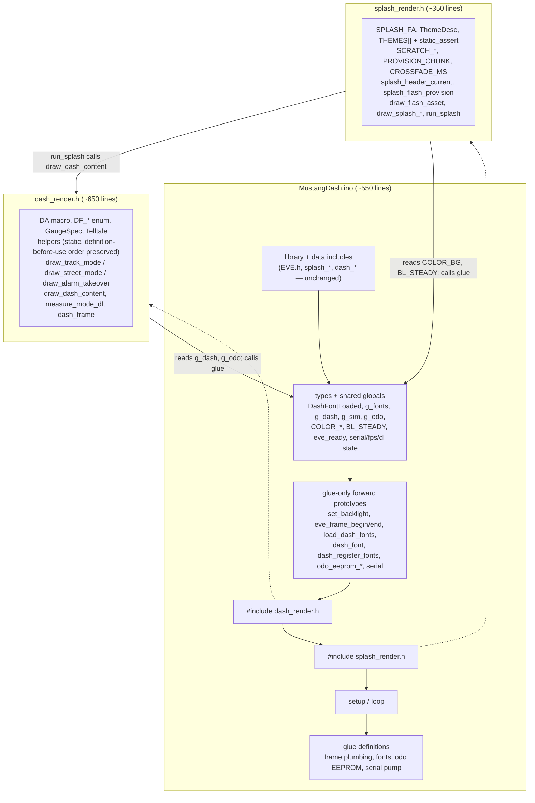

# refactor: split MustangDash.ino into splash_render.h and dash_render.h

## Summary

`MustangDash/MustangDash.ino` crossed 1000 lines (565 → ~1480) during the dash-layout feature, holding five concerns in one file. This plan executes the deferred P1 review finding: move splash provisioning/rendering into `MustangDash/splash_render.h` and the gauge/mode/alarm renderers into `MustangDash/dash_render.h`, leaving the `.ino` as setup/loop/glue (~550 lines). Pure code motion — no behavior change, no signature change, no reformatting. The verification gate is the repo's standing invariant: `./scripts/compile.sh` and `pio run` both succeed clean and produce byte-identical output **to each other**.

---

## Problem Frame

The review finding (docs/residual-review-findings/feat-dash-layout.md, "Decision gate"):

> **P1 — `MustangDash/MustangDash.ino:1` — file crossed 1000 lines (565 → ~1480), five concerns in one file.** Suggested split: splash rendering → `splash_render.h`, gauge/mode/alarm renderers → `dash_render.h`, leaving the `.ino` as setup/loop/glue. Deferred because it is a structural design call that interacts with the offline build's explicit-prototype convention.

The split was deferred out of the feature PR to keep the review trail clean. It is now its own change, done as a small follow-up PR.

## Requirements

- **R1** — Splash concerns (flash provisioning + splash rendering + crossfade sequence) live in `MustangDash/splash_render.h`.
- **R2** — Dash rendering concerns (drawing helpers, TRACK/STREET renderers, alarm takeover, mode dispatch, frame/DL-measure wrappers) live in `MustangDash/dash_render.h`.
- **R3** — The `.ino` keeps only setup/loop and glue: EVE frame plumbing, backlight, font loading, serial pump, odometer EEPROM, simulator state, and the shared globals.
- **R4** — Pure code motion: every moved function keeps its exact signature, storage class, body text, and comments. No renames, no reformatting, no behavior change.
- **R5** — Both workstation build paths (`./scripts/compile.sh` and `pio run`) succeed clean and agree byte-for-byte with each other after the split (the repo's standing invariant; agreement with the *pre-refactor* binary is **not** required — code motion legitimately reorders emitted functions).
- **R6** — The offline sandbox build convention survives: every function that remains in the `.ino` keeps an explicit forward prototype (no-op ctags shim provides no auto-prototyping there).
- **R7** — Host invariant suite still passes 11/11 (proves no pure header was disturbed).

---

## Key Technical Decisions

- **KTD1 — Single-TU textual inclusion; fixed include order.** The `.ino` is one translation unit; the new headers are included by it exactly once. The `.ino`'s final layout is: existing library/data includes → type definitions and shared globals → glue-only forward prototypes → `#include "dash_render.h"` → `#include "splash_render.h"` → `setup`/`loop` → glue function definitions. `dash_render.h` must come first because `run_splash` (splash side) calls `draw_dash_content` (dash side); nothing in `dash_render.h` references splash code.
- **KTD2 — "Extern-style" state access means direct file-scope global access, not parameter threading.** Because the headers are included after the shared globals (`g_dash`, `g_odo`, `g_fonts` stays glue-private, `COLOR_*`, `BL_STEADY`) are defined, header code references them directly — no literal `extern` declarations are needed in a single TU, and none should be added (the globals are `static`, and `extern` redeclarations of internal-linkage objects are a portability trap). Each new header documents its state/glue dependencies in its leading comment block instead, matching the house convention of dependency-contract comments.
- **KTD3 — Prototype block trims to glue-only.** Functions moved into the headers are defined before first use (headers precede `setup`/`loop`), so their prototypes are removed from the `.ino`'s forward-declaration block. Functions staying in the `.ino` (`set_backlight`, `eve_frame_begin`, `eve_frame_end`, `load_dash_fonts`, `dash_font`, `dash_register_fonts`, `odo_eeprom_load`, `odo_eeprom_write`, `pump_serial`, `handle_serial_line`) keep their explicit prototypes, positioned **before** the two new includes so header code can call them (R6).
- **KTD4 — Type placement follows consumers.** `ThemeDesc`, `THEMES[]` (with its `static_assert`), and the `SPLASH_FA` macro move into `splash_render.h`; `GaugeSpec`, `Telltale`, the `DF_*` font-index enum, and the `DA` macro move into `dash_render.h`. This is safe with respect to the PIO auto-prototype hoisting hazard: PIO scans only the `.ino` for prototype generation, and after the move no `.ino`-resident prototype references these types. `DashFontLoaded`/`g_fonts` stay in the `.ino` (owned by glue-side `load_dash_fonts`/`dash_font`).
- **KTD5 — The colours block stays in the `.ino`.** `COLOR_BG` is used by all three concerns (glue frame plumbing, dash renderers, splash crossfade); splitting the 25-line `COLOR_*` block across files to relocate the dash-only constants isn't worth breaking up a coherent block. Shared visual constants are config, which is glue's home. (Alternative considered: move the block into `dash_render.h` — works under KTD1's include order, but leaves glue and splash reading their clear color out of the dash header.)
- **KTD6 — Font glue stays in the `.ino`.** `load_dash_fonts` (boot-time inflate) is unambiguously glue; `dash_font`/`dash_register_fonts` are called from dash renderers every frame but are font infrastructure over glue-owned `g_fonts`. All three stay, prototyped ahead of the includes.
- **KTD7 — Splash provisioning goes with splash rendering.** `splash_header_current`/`splash_flash_provision` (plus `SCRATCH_HDR`, `SCRATCH_BUF`, `PROVISION_CHUNK`, `CROSSFADE_MS`) are splash-asset-specific and touch no dash state; they move to `splash_render.h` so all splash concerns live in one file.
- **KTD8 — New headers use house include guards but are documented as non-pure.** `#ifndef DASH_RENDER_H` style guards per the hand-written-header convention. Unlike `dash_math.h` et al., these headers are EVE/Arduino-dependent, reference file-scope globals, and are **not** host-testable — their leading comments state this so nobody adds them to the test suite's pure-header list.

---

## High-Level Technical Design

Post-split translation-unit order and dependency flow:

The one cross-header edge (`run_splash` → `draw_dash_content`) is what fixes the include order in KTD1.

---

## Implementation Units

### U1. Extract dash rendering into dash_render.h

**Goal:** All dash rendering moves verbatim to `MustangDash/dash_render.h`; the `.ino` shrinks and still builds on both paths.

**Requirements:** R2, R4, R5, R6

**Dependencies:** none

**Files:**
- Create: `MustangDash/dash_render.h`
- Modify: `MustangDash/MustangDash.ino`

**Approach:** Move, verbatim and in their current relative order: the `DA` macro, the `DF_*` anonymous enum, `GaugeSpec`, `Telltale`, `dash_color`, the static helpers (`dash_state_text_color`, `draw_pill`, `draw_arc`, `draw_gauge_chrome`, `draw_gauge_needle_hub`, `draw_gauge_ticks`, `street_speedo`, `street_tach`, `street_telltales`), `draw_track_mode`, `draw_street_mode`, `draw_alarm_takeover`, `draw_dash_content`, `measure_mode_dl`, and `dash_frame`. That list is an inventory grouped by kind, not the move order — the file's existing top-to-bottom order (`DF_*` enum through `dash_frame`, with the `street_*` helpers interleaved after `draw_track_mode`) is the order the header must reproduce. The static helpers carry no prototypes — preserving their current definition-before-use order inside the header is mandatory. In the `.ino`: add `#include "dash_render.h"` after the forward-declaration block and before `setup`; delete the moved dash functions' prototypes from that block (keep the glue prototypes **and** the seven splash prototypes — splash functions are still `.ino`-resident until U2; only the dash prototypes leave in this unit). `GaugeSpec`/`Telltale` leave the top-of-file "dash state" section with this unit; `DashFontLoaded`, `g_fonts`, `g_dash`, and the rest of the state/colour blocks stay.

**Execution note:** Before touching anything, run both builds on the clean pre-refactor tree and hash both paths' `.hex` artifacts to establish the parity baseline — if they already differ for HEX-format reasons (record length, EOL conventions), pin U3's gate to a format-insensitive comparison (`objcopy -O binary` payloads plus the documented section-size agreement) and record that as the invariant's operational form. Then build both paths (`./scripts/compile.sh` and `pio run`) after this unit alone, before starting U2 — a half-moved tree that builds on one path but not the other localizes the fault to this unit.

**Patterns to follow:** Hand-written header house style (`dash_math.h`): `#ifndef DASH_RENDER_H` guard, leading block comment naming the file's job and its dependency contract (reads `g_dash`/`g_odo`; calls `dash_font`, `dash_register_fonts`, `eve_frame_begin/end`; uses `COLOR_*` — all owned by the `.ino`), per KTD8 explicitly marked non-pure/not-host-tested.

**Test scenarios:** Test expectation: none — pure code motion with no behavioral change; the new header is EVE-dependent and not host-testable. Verification is the build gate below.

**Verification:** Both build paths compile clean; their reported FLASH/RAM section sizes agree exactly with each other.

### U2. Extract splash rendering + provisioning into splash_render.h

**Goal:** All splash concerns move verbatim to `MustangDash/splash_render.h`; the `.ino` is down to setup/loop/glue.

**Requirements:** R1, R3, R4, R5, R6

**Dependencies:** U1 (include order — `splash_render.h` needs `draw_dash_content` visible)

**Files:**
- Create: `MustangDash/splash_render.h`
- Modify: `MustangDash/MustangDash.ino`

**Approach:** Move, verbatim: the `SPLASH_FA` macro, `ThemeDesc`, `THEMES[]` with its `static_assert` (asserts `SPLASH_THEME_*` ordinal order — must travel together), `SCRATCH_HDR`, `SCRATCH_BUF`, `PROVISION_CHUNK`, `CROSSFADE_MS`, `splash_header_current`, `splash_flash_provision`, `draw_flash_asset`, `draw_splash_background`, `draw_splash_emblem`, `draw_splash_elements` (with its internal `SPLASH_A`/`#undef` pair), and `run_splash`. In the `.ino`: add `#include "splash_render.h"` immediately after `#include "dash_render.h"`; delete the moved prototypes from the forward-declaration block (after this unit the block holds only the ten glue functions in KTD3). `g_theme` stays in the `.ino` (glue-owned config; `setup` indexes `THEMES[g_theme]`, which works because the header precedes `setup`). Tidy the `.ino`'s file-header comment to mention the two render headers.

**Execution note:** Build both paths again after this unit; then confirm the forward-declaration block matches KTD3's glue-only list exactly.

**Patterns to follow:** Same house style as U1; leading comment documents the dependency contract (calls `draw_dash_content` from `dash_render.h`, `eve_frame_begin/end`/`set_backlight` from the `.ino`; reads `COLOR_BG`, `BL_STEADY`) and the include-order requirement (must be included after `dash_render.h`).

**Test scenarios:** Test expectation: none — pure code motion; same rationale as U1.

**Verification:** Both build paths compile clean and agree; the `.ino` is roughly 550 lines holding only setup/loop/glue.

### U3. Verify the invariants and close out the residual finding

**Goal:** Prove nothing moved but text: suite green, build paths byte-identical to each other, firmware behaves identically on the bench; the residuals doc records the split as done.

**Requirements:** R5, R7

**Dependencies:** U1, U2

**Files:**
- Modify: `docs/residual-review-findings/feat-dash-layout.md` (mark the decision-gate item resolved with the date and new header names)
- Test: `tests/run-tests.sh` (existing suite, run not modified)

**Approach:** Run the full host suite under WSL (11/11 expected — the split touches no pure header, so any failure means an accidental edit). Build both workstation paths and compare beyond the size lines: hash the two paths' output artifacts against each other using the comparison form pinned by U1's baseline step (`.hex` hashes, or `objcopy -O binary` payloads if HEX formatting differed at baseline) to confirm byte-identity of the invariant pair. Verify the forward-declaration block mechanically, not by eyeball: extract the declared names from the block and diff them against KTD3's ten-function glue list, so a pruned or stale prototype fails this closeout instead of a future offline-sandbox build. Reflash the panel and smoke the firmware over serial via the `/dash` skill: boot banner sane, `status` acks with sane fps/DL words, `mode track`/`mode street` both render. Then update the residuals doc.

**Execution note:** Byte-identity is between the two build paths post-refactor, not against the pre-refactor binary — code motion reorders emitted functions, so a pre/post binary diff is expected and not a failure.

**Patterns to follow:** CLAUDE.md's test-run rule (`wsl -- bash -lc "./tests/run-tests.sh"`); the `/dash` skill's COM4 pattern for the bench smoke.

**Test scenarios:**
- Host suite: all 11 steps pass unchanged.
- Build parity: `scripts/compile.sh` and `pio run` both clean; artifacts hash-identical between paths under the baseline-pinned comparison form.
- Prototype block: extracted declaration names diff clean against KTD3's ten-function list.
- Bench smoke: `status` returns `ok`-prefixed report with fps ≈ 60 and DL words matching the pre-split boot diagnostic (405/644 of 2048); TRACK and STREET both render on command.

**Verification:** All three scenario groups pass; residuals doc updated.

---

## Scope Boundaries

**In scope:** the file split exactly as the review finding specified, plus the residuals-doc closeout.

**Out of scope (true non-goals):**
- Any behavior, naming, or signature change; any reformatting of moved code (breaks `git diff --color-moved` reviewability and risks codegen drift).
- Making the render headers host-testable or adding them to the test suite.
- Further decomposition of the glue (serial/odo/fonts could each be headers too — not asked for, not needed at ~450 lines).

**Deferred to Follow-Up Work:**
- CLAUDE.md currently describes the sketch as a single file; a one-line mention of the render headers can ride along in this PR's commit if natural, but no broader doc restructuring.

---

## Risks & Dependencies

- **Static-helper ordering** (`draw_pill`, `street_*`, etc. have no prototypes): moving them out of relative order breaks compilation. Mitigation: move each section as one contiguous block, preserving internal order (R4).
- **PIO prototype hoisting** previously broke on `GaugeSpec`; post-split PIO scans only the (now small) `.ino`, and no remaining prototype references a moved type. Mitigation: both-path build after each unit (Execution notes, U1/U2).
- **`THEMES[]` ↔ `static_assert` separation** would silently drop the theme-ordinal guard. Mitigation: named explicitly in U2's move list.
- **CRLF/line-ending drift** in new files could churn the diff: match the repo's existing header line endings (`.gitattributes` governs).
- **Bench dependency:** U3's smoke test needs the panel on COM4; if the bench is unavailable, the build-parity + suite gates still hold and the smoke moves to a follow-up note rather than blocking the PR — flag it in the PR body if skipped.

## Assumptions

Pipeline mode resolved these without a confirmation gate:

- "Byte-identical" in the task statement means the two workstation build paths agreeing **with each other** post-refactor (the CLAUDE.md invariant), not binary identity with the pre-refactor firmware — the latter is impossible under code motion and was never the invariant.
- "Extern-style state access" means renderers keep reading file-scope globals directly (no parameter threading), per KTD2 — not literal `extern` declarations, which are unnecessary and hazardous in a single TU with `static` globals.
- Splash **provisioning** (not just rendering) belongs in `splash_render.h` (KTD7); the residual finding says "splash rendering", and provisioning is splash-asset-specific code with no dash coupling.

## Sources & Research

- docs/residual-review-findings/feat-dash-layout.md — the originating P1 finding (quoted in Problem Frame).
- Structural map of `MustangDash/MustangDash.ino` (fresh read this session): banner sections, globals table, prototype block, order-sensitive items — drove KTD1–KTD7.
- docs/solutions/tooling-decisions/offline-teensy41-arduino-cli-toolchain-in-egress-restricted-sandbox.md — the no-op ctags shim consequence behind R6/KTD3.
- BUILD.md ("Two build paths… byte-identical output") and CLAUDE.md Verified state — the R5 invariant and its meaning.
- tests/run-tests.sh — confirmed no test compiles or pins the `.ino`; the split is invisible to the suite (R7 is a no-regression check, not new coverage).

## Definition of Done

- `MustangDash/splash_render.h` and `MustangDash/dash_render.h` exist with the KTD4/KTD7 contents; `MustangDash.ino` holds only setup/loop/glue with a glue-only prototype block.
- `wsl -- bash -lc "./tests/run-tests.sh"` reports 11/11.
- `./scripts/compile.sh` and `pio run` both clean; their artifacts hash-identical to each other under the comparison form pinned by U1's baseline step.
- Bench smoke passed (or explicitly deferred with reason in the PR body).
- Residuals doc marks the split finding resolved.
