# Triple Dash Side Panels - Plan

## Goal Capsule

- **Objective:** Bring the two 5" side panels alive on the existing Teensy 4.1, rendering the design handoff's ENGINE (left) and TIMING/ROAD (right) layouts in lockstep with the center dash, fed by the simulator/serial data path.
- **Product authority:** Product Contract below; side-screen content authority is `assets/dash-design/README.md` (the "EVE Triple Dash" handoff); hardware authority is `docs/hardware/three-panel-pin-reference.md`.
- **Open blockers:** None. Bench verification (U9) requires the side panels physically wired; every other unit gates on host tests and both build paths.
- **Product Contract preservation:** changed — Key Decisions "no rescale layer" clause corrected (the design authors the 5" screens on a 420×320 mock canvas scaled to native 800×480, per the design doc's own scaling directive — product intent unchanged); R5's channel enumeration gained the PMU16 output readings the left screen displays (within R5's stated "every reading the side layouts display" intent); PMU FAULT-state display deferred to the CAN round (no fault source exists on the sim path).

---

## Product Contract

### Summary

Phase 2 of the triple dash: the two Riverdi 5" panels (SM-RVT50HQBNWN00, 800×480 native) flank the shipped 7" center and render the handoff's side layouts as authored. All three screens switch TRACK/STREET together, one Teensy drives everything, and the data model grows the new channels the side layouts display, simulated and serial-controllable until the CAN round.

### Key Decisions

- **One Teensy drives all three panels.** No sync hardware, no sync protocol, one firmware, one `DashState`. Cost accepted knowingly: the vendored EVE library is single-display and single-profile-per-build by design, so this round includes library-layer extension work — the round's main technical risk. Planning research (see Planning Contract) found the surgery contained: ~150–300 lines across three library files. The decision stands unless a hard stop or massive complexity emerges, at which point the owner reconsiders.
- **Alarm takeover is center-only.** During an active alarm the sides keep their live layouts — the ENGINE screen keeps showing the actual oil pressure number during the exact event you'd want to watch it. The alarm set itself (oil pressure, oil temp, coolant) is unchanged this round.
- **Simulator first; CAN is its own later round.** Side screens ship bench-testable on the existing simulator + serial-override path. New channels land in the same channel model CAN will feed later.
- **Design layouts as authored.** The design specifies the 5" screens on a 420×320 mock canvas scaled to the native 800×480 panel (its own directive: "scale all dimensions in this document by ×1.90 (5″)"); side rendering scales through dedicated layout macros exactly as the center scales its 620×400 mock to 1024×600. Content authority stays with the design doc; no re-design.
- **Boot: sides fade in after the center's splash.** Sides stay dark through the 2000 ms center splash, then fade in during its ~400 ms crossfade, driven by one shared boot-complete trigger. No side-screen splash assets, therefore no QSPI flash provisioning on the 5" panels this round.

### Requirements

**Screens and layout**

- R1. The left 5" panel renders the design's ENGINE screen: TRACK = 4×2 hairline grid (OIL P, ECT, FUEL P, AFR L / OIL T, IAT, VOLTS, AFR R) plus the PMU16 outputs strip (PUMP / FAN 1 / FAN 2 chips with amps and total); STREET = 2×2 mini sweep gauges (OIL P, ECT, OIL T, VOLTS), per `assets/dash-design/README.md`.
- R2. The right 5" panel renders the design's TIMING (track) / ROAD (street) screen: TRACK = lap number, position, LAST/BEST/PRED times, throttle and brake percent bars, bottom grid (FUEL, LAPS remaining, AMB, odometer); STREET = fuel sweep gauge plus TRIP A, RANGE, AMB, TIME, per the same design doc.

**Mode and alarm behavior**

- R3. All three screens switch TRACK/STREET together and instantly — the existing Dash Mode contract extends unchanged to the sides.
- R4. Alarm takeover renders on the center screen only; both side screens keep their live layouts while an alarm holds.

**Data model and simulation**

- R5. The channel model grows to cover every reading the side layouts display — AFR left/right, IAT, fuel pressure, throttle %, brake %, lap number, position, predicted lap, time of day, and PMU output amps for pump / fan 1 / fan 2 — with the same validity semantics as existing channels. LAPS-remaining and RANGE are derived from fuel per the design's stated formulas, not raw channels; TRIP A reads the existing odometer trip.
- R6. The simulator generates plausible values for every new channel, and the serial protocol gains `set`/`clear` support for each, at parity with existing channels.
- R7. Invalid or missing channels on the side screens follow the established dead-front convention: `--` text, empty fills, parked needles — never false data.

**Boot and degradation**

- R8. On power-up the side screens stay dark through the center's splash, then fade their layouts in during the center's crossfade into the dash — driven by one shared boot-complete trigger, never per-panel timers that could drift apart.
- R9. A dead, disconnected, or init-failed panel stays dark and has no effect on the other screens — each panel initializes and renders independently, and the center never depends on the sides.

**Topology and performance**

- R10. One Teensy 4.1 drives all three panels, wired per `docs/hardware/three-panel-pin-reference.md`: shared SPI (SCLK 13, MOSI 11, MISO 12); center CS 14 / PD 17 (unchanged); left CS 15 / PD 20; right CS 16 / PD 21. At most one panel's CS is ever asserted at a time.
- R11. Target 60 fps on all three screens; if the shared-bus budget cannot hold that, reducing side-screen refresh while the center keeps 60 is the approved fallback.
- R12. Cluster brightness is one setting: a single brightness state drives all three panels together (and, in a later stage, the physical telltale LEDs). No per-panel brightness exists anywhere in the firmware, UI, or protocol.

### Acceptance Examples

- AE1. **Covers R3.** Given all three screens live in TRACK, when `mode street` arrives, all three swap to their STREET layouts together with no intermediate mismatched frame.
- AE2. **Covers R4.** Given oil pressure drops below the alarm threshold, the center flashes the takeover while the left ENGINE screen continues showing the live OIL P value and the right screen is unchanged; when the alarm clears, the center returns to the active mode view.
- AE3. **Covers R8.** From power-up: sides dark for the full center splash, fading in during the crossfade, ending with all three screens live simultaneously.
- AE4. **Covers R9.** With the right panel's cable disconnected at power-up, the center and left screens boot and run normally and serial commands ack as usual; the right panel is simply dark.
- AE5. **Covers R5, R6, R7.** `set afr_l 12.8` over serial shows 12.8 in the left screen's AFR L cell; `clear afr_l` returns that cell to `--`; the simulator repopulates it when sim ownership resumes.

### Success Criteria

- All five acceptance examples pass on the physical three-panel bench.
- Measured frame rate meets R11's target (or the fallback is invoked explicitly and recorded, never silently).
- The shipped center-screen experience is unchanged when both sides are connected and when both are absent.

### Scope Boundaries

**Deferred for later**

- CAN integration (Coyote Gen 4 control pack, 2× PMU16, RaceCapture) — its own round; it feeds the channel model this round creates. Mode switching stays on the serial/sim path until then.
- PMU output FAULT-state display (the red FAULT chip in the design) — no fault source exists on the sim path; lands with CAN.
- Side-screen splash animation and any 5"-panel flash provisioning.
- Any new alarm conditions (e.g., fuel pressure) — the alarm set stays oil pressure / oil temp / coolant this round.
- Time-of-day from the Teensy 4.1 RTC — TIME is a sim-fed channel this round.

**Outside this product's identity**

- Touch input (panels are the no-touch variant).
- The bezel's physical turn-signal LEDs (hardware, not screens).
- Re-designing or "improving" the side layouts — the handoff is the authority.

### Dependencies / Assumptions

- Hardware in hand: 2× **SM-RVT50HQBNWN00 V2.0A** (5.0", 800×480, BT817, IPS, no touch).
- The EVE library carries the matching `EVE_RVT50H` profile values (800×480, BT817) — verified; note the library marks that profile "untested" upstream, so first light on the 5" panels carries normal bring-up risk.
- Pin assignments are fixed by `docs/hardware/three-panel-pin-reference.md`: R10's CS/PD table, plus reserved pins planning must not collide with — CAN1 22/23, CAN2 0/1, telltale LEDs 2–9, buttons 24–27.
- The BT817's post-init SPI ceiling (30 MHz rated on these panels vs the current 8 MHz) provides the bandwidth lever for R11; implementation measures and picks the operating point.
- The 5" modules carry onboard QSPI flash per the hardware handoff/datasheets — unused this round.
- Bench power watch item: three panels' logic on the Teensy's 3.3 V regulator draws ~0.52 A combined; if flicker/reset appears during soak, panel VDD moves to a dedicated 3.3 V source.
- Handoff reconciliation — three of the handoff's check-items are already satisfied or superseded by the shipped repo and must not be re-introduced: the center's splash self-provisions its flash from firmware (no STM32 eval-board step), the correct profiles are `EVE_RVT70H`/`EVE_RVT50H` (the handoff's "EVE_RiTFT70-equivalent" wording is the documented near-miss trap), and the splash-to-dash crossfade already runs with no black frame.

---

## Planning Contract

### Key Technical Decisions

- **KTD1 — Multi-panel support is a contained patch to the vendored library, not a fork.** Research mapped the exact surface: `EVE_CS`/`EVE_PDN` are consumed only by four one-line inline functions in `libraries/FT800-FT813/src/EVE_target/EVE_target_Arduino_Teensy4.h`; every timing macro funnels into the single re-callable `EVE_write_display_parameters()` in `EVE_commands.c`; and the library keeps **no host-side FIFO offset** (the BT817's `REG_CMDB_WRITE` hardware FIFO owns it), so per-panel state reduces to the pins, the timing set, the pixel-clock value, and the `fault_recovered` flag. **API shape (pinned):** the library defines its own panel-config struct (pins, timing fields, pixel-clock discriminant); `EVE_select_panel(const <panel-config>*)` stores the pointer as the selected-panel state; the init path, `EVE_write_display_parameters()`, `enable_pixel_clock()`, and `CoprocessorFaultRecover()` all read the selected descriptor, with the compile-time macro path as the default when no panel was ever selected (single-panel builds of the library stay source-compatible). `fault_recovered` becomes per-panel, and the fault getter + the sketch's `status` surface attribute faults to the panel that raised them. DMA setup runs once, not per init. Estimated ~150–300 lines across `EVE_target_Arduino_Teensy4.h`, `EVE_cpp_target.cpp`, `EVE_commands.c/.h`. Everything else — all `EVE_cmd_*`, memRead/Write, burst machinery — is already panel-agnostic. U1's sketch glue maps `dash_panels.h` rows into the library struct.
- **KTD2 — Panel-switch safety invariants.** `EVE_select_panel()` refuses to switch while `cmd_burst` is active or a DMA transfer is in flight (`EVE_dma_busy`): the Teensy DMA completion callback deasserts CS asynchronously, and a mid-flight switch would deassert the wrong pin and wedge the bus. Rendering starts in plain (non-burst) mode as today, so both invariants are structural at first light — but burst/DMA is the sanctioned second rung of the R11 bandwidth ladder (KTD8), and these guards exist precisely to make that rung panel-safe. The DMA-busy spin gets a timeout-with-assert rather than a bare spin, so a lost completion event surfaces as a diagnosable fault instead of a boot hang.
- **KTD3 — Panel identity lives in a pure descriptor header.** A new stdint-only `MustangDash/dash_panels.h` carries the three-panel table: CS/PD pins, width/height, and the full timing set per panel (RVT70H values for center, RVT50H values for the sides — the second profile can't come from `EVE_config.h`, which compiles exactly one). Host-testable: pins pinned against `docs/hardware/three-panel-pin-reference.md`, RVT50H timings pinned against the library's own profile block, so drift in either direction fails the suite. Sketch glue binds the table to the library's panel-select API.
- **KTD4 — Side coordinate system mirrors the center's convention.** The design authors the 5" screens on a 420×320 mock canvas; `dash_layout.h` grows `DASH5_LX` (×800/420), `DASH5_LY` (×480/320 = ×1.5), and `DASH5_LR` (radial by Y only, keeping circles circular) alongside the center's `DASH_LX/LY/LR`. Pure header, host-tested like the existing macros.
- **KTD5 — Channel encoding.** Thirteen new channels: `afr_l`, `afr_r`, `iat`, `fuelp`, `throttle`, `brake`, `lapn` (lap number), `pos`, `pred`, `time` (minutes-since-midnight, rendered hh:mm), `pump`, `fan1`, `fan2` (PMU output amps; 0 renders OFF, >0 renders ON with the amp figure). **Mask widening is part of this decision:** 25 channels exceed the current `uint16_t` validity/override/cleared masks (`DASH_CH_BIT` casts to `uint16_t`; `tests/test_dash_sim.c` static-asserts `DASH_CH_COUNT <= 16`) — `DashState.valid/.overridden/.cleared` widen to `uint32_t`, the `DASH_CH_BIT`/`DASH_CH_ALL` casts follow, every mask consumer in `dash_sim.h`/`dash_serial.h` is swept, and the static-assert moves to `<= 32`. LAPS-remaining and RANGE are `dash_math.h` derivations from fuel per the design's formulas (`range = gal × 16 mi/gal`; laps from per-lap burn); TRIP A reads `dash_trip_miles()`. New warning thresholds (fuel pressure red < 43 psi, IAT amber > 131 °F, AFR amber > 13.8) join `dash_math.h` as constants + classifiers, rendering colors only — the alarm set is unchanged (R4, Scope Boundaries).
- **KTD6 — Fonts.** The design's side type scale mostly reuses the shipped ladder (grid values 31 px ≈ `DF_VAL` 32 px; labels/chips on `DF_LABEL`/`DF_TINY`; mini-gauge hubs on `DF_MID`/`DF_VAL`), but LAP 42 px / POS 30 px fall between rungs: `tools/make_dash_fonts.py` gains one 42 px instance (`DF_LAP`), regenerated deterministically. Each BT817 has its own 1 MiB RAM_G, so the full font set uploads to **each** panel at boot (~280 KB per panel — comfortable); handles and the metric-block format are unchanged.
- **KTD7 — Rendering structure extends the single-TU header architecture.** Shared drawing primitives (`dash_color`, `dash_state_text_color`, `draw_pill`, `draw_arc`, the gauge helpers, and the `DA` alpha macro pattern) move from `dash_render.h` into a new `dash_draw.h` (pure code motion, same discipline as the ino-split); new `engine_render.h` and `timing_render.h` hold the side compositions. Include order in the `.ino`: `dash_draw.h` → `dash_render.h` → `engine_render.h` → `timing_render.h` → `splash_render.h`.
- **KTD8 — Frame loop and bandwidth.** Each `loop()` iteration renders panels sequentially: select panel → build DL → swap, center first. Each BT817 has its own 2048-word DL RAM, so budgets are per-panel (center measured 405 words TRACK / 644 words STREET against that per-panel 2048 ceiling; side layouts estimated at a few hundred each). The single sketch-level `SPISettings` rises from 8 MHz to a measured post-init operating point (≤ 30 MHz rated; all three `EVE_init()`s complete at ≤ 11 MHz first, then one bus-wide raise). **Operating-point acceptance is fps AND read integrity, never fps alone:** plain-mode frame health is read-dominated (`EVE_busy()` polls `REG_CMDB_SPACE`, where any 2-LSB read corruption is indistinguishable from a coprocessor fault and triggers a disruptive spurious recovery), so the chosen clock must pass a per-panel read-soak (see U9) with zero spurious faults, independent of frame rate. **The R11 bandwidth ladder, in order, before any user-visible degradation:** (1) measure per-panel frame time at boot and print it in the banner alongside DL usage; (2) switch per-panel DL transfer to burst+DMA — one CS assertion per frame instead of per command; the KTD2 guards make this panel-safe, and a panel's DMA flight can overlap the next panel's DL build; (3) defer the full coprocessor drain (`eve_frame_end`'s busy-spin) to the next visit of that panel instead of blocking between panels; (4) only then render sides every Nth frame while the center renders every frame. The crossfade is wall-clock-bound, so three-panel rendering inside it lowers fade frame rate rather than stretching it — U9 measures the fade's frame rate and it must stay visually smooth (≥ 30 fps).
- **KTD9 — Boot orchestration.** Init all three panels at ≤ 11 MHz (per-panel PD cycle, `REG_ID` check, per-panel timing write), force backlight duty 0 on every panel immediately after its init (the library's init defaults duty to 25% — a lit blank side panel would break the dark-boot contract; defining `EVE_BACKLIGHT_PWM 0` in the already-patched `EVE_config.h` closes even the few-ms init window at zero patch cost), upload fonts to each healthy panel, then run the center's flash check + splash exactly as today. A single `boot_complete` transition drives the side fade-in inside the center's existing crossfade loop. Per-panel `ok` flags (init failure → panel dark, skipped in the frame loop) implement R9. `EVE_init_flash()` remains center-only. **Boot budget:** power-to-first-splash-frame is measured and printed in the boot banner; a dead panel costs up to ~467 ms extra (the library's fixed init delays plus its 400 ms `REG_ID` poll timeout) — if the bench shows that penalty matters, parameterizing the side panels' `REG_ID` timeout is in-scope for U2's patch surface. **Brightness sequencing:** during boot, backlight writes are per-panel and center-scoped (duty-0 enforcement at init; `run_splash` lights the center for the splash); the unified `dash_brightness` setter — one value written to `REG_PWM_DUTY` on every healthy panel in the same call — becomes the only brightness path from `boot_complete` onward, and its first call at side fade-in raises all three together. This boot-phase carve-out satisfies R12: no steady-state per-panel brightness exists.

### High-Level Technical Design

Boot and steady-state flow across the three panels:

```mermaid
flowchart TB
    subgraph boot["Boot (SPI at 8 MHz)"]
        A["for each panel in dash_panels.h:<br/>select -> PD cycle -> EVE_init variant<br/>-> per-panel timings -> duty 0 -> ok flag"]
        B["raise SPI to measured operating point"]
        C["for each healthy panel:<br/>upload dash fonts to its RAM_G"]
        D["center only: flash CRC check /<br/>provision -> splash (sides stay dark)"]
        E["boot_complete: crossfade loop renders<br/>center splash-out + dash-in AND<br/>side layouts fading in, same alpha ramp"]
        A --> B --> C --> D --> E
    end
    subgraph frame["loop() steady state"]
        F["pump_serial -> sim step -> odometer"]
        G["select CENTER -> dash_frame<br/>(mode or alarm takeover)"]
        H["select LEFT -> engine_frame (mode)"]
        I["select RIGHT -> timing_frame (mode)"]
        F --> G --> H --> I --> F
    end
    E --> F
    style D fill:#1a1a2e,stroke:#888
```

The panel-select seam (KTD1/KTD2) is the only new library concept: everything between `select` calls is the existing single-panel code path, unchanged.

### Assumptions

- Pipeline mode resolved these without confirmation: the PMU strip and the LAP/POS font rung are treated as R1/R5 clarifications (the design displays them; the Product Contract's intent covers them), not scope growth; the sim feeds TIME as a plain channel; the SPI operating point is measured at implementation rather than fixed in the plan.
- U9's bench gates require the side panels wired (in progress per the hardware handoff). If the bench isn't ready when implementation completes, implementation PRs may merge with U9 explicitly deferred in the PR body (host tests, builds, and center-only regression still gate those PRs) — but the deferral waives only the *timing* of U9, never the bar: the round's Success Criteria and Definition of Done remain unmet until the bench evidence lands.

---

## Implementation Units

### U1. Panel descriptor table (pure header + test)

**Goal:** `MustangDash/dash_panels.h` — stdint-only descriptor table for the three panels: CS/PD pins, width/height, full timing set (HSIZE, VSIZE, HCYCLE, HOFFSET, HSYNC0/1, VCYCLE, VOFFSET, VSYNC0/1, SWIZZLE, PCLKPOL, CSPREAD, pixel-clock discriminant), and panel roles (center/left/right).

**Requirements:** R10; KTD3

**Dependencies:** none

**Files:**
- Create: `MustangDash/dash_panels.h`
- Create: `tests/test_dash_panels.c`
- Modify: `tests/run-tests.sh`

**Approach:** Follow the pure-header house style (`dash_math.h`: include guard, stdint-only, leading dependency-contract comment, static-inline accessors if any). Center carries the RVT70H values with its 51 MHz `PCLK_FREQ`; sides carry the RVT50H values with their PCLK divider 3 — the table needs a discriminant for the two pixel-clock forms. Pins verbatim from `docs/hardware/three-panel-pin-reference.md`.

**Patterns to follow:** `MustangDash/dash_math.h` header discipline; `tests/test_dash_odo.c` test structure.

**Test scenarios:**
- Pins pinned: center 14/17, left 15/20, right 16/21; all six distinct; none collide with reserved pins (0–9, 22–27) or the SPI trio (11/12/13).
- Center timing row equals the library's RVT70H profile values; side rows equal the RVT50H profile values, cross-checked against the Riverdi RVT50HQBNWN00 datasheet before pinning. The failure message names the **datasheet** as the tiebreaker authority — the library's RVT50H block is marked "untested" upstream, so if bench bring-up forces a timing deviation, `dash_panels.h` and this pin move together with the deviation documented, rather than the test defending unverified values.
- Resolutions: center 1024×600, sides 800×480.

**Verification:** New test passes under WSL; suite count grows by one; both firmware builds unaffected (header not yet consumed).

### U2. Vendored library multi-panel patch

**Goal:** The EVE library can drive N panels: runtime CS/PD, per-panel timing/pixel-clock at init and fault-recovery, `EVE_select_panel()` with switch guards.

**Requirements:** R10; KTD1, KTD2

**Dependencies:** U1 (struct shape informs the API's parameter set)

**Files:**
- Modify: `libraries/FT800-FT813/src/EVE_target/EVE_target_Arduino_Teensy4.h`
- Modify: `libraries/FT800-FT813/src/EVE_cpp_target.cpp`
- Modify: `libraries/FT800-FT813/src/EVE_commands.c`, `libraries/FT800-FT813/src/EVE_commands.h`

**Approach:** Pins become runtime state consumed by the four inline pin functions; `EVE_write_display_parameters()` and `enable_pixel_clock()` parameterized (existing compile-time-macro path preserved as the default so a single-panel build of the library stays source-compatible); `CoprocessorFaultRecover()` uses the selected panel's pixel-clock values; `fault_recovered` becomes per-panel; the DMA completion callback latches the CS pin of the in-flight transfer; `EVE_select_panel()` spins/asserts on `cmd_burst == 0` and `EVE_dma_busy == 0` before swapping. `EVE_init_dma()` guards against double registration.

**Execution note:** Keep the patch minimal and upstream-diffable — this is a vendored library; every hunk should be attributable to multi-panel support. Verify the center-only path first: after this unit, the unmodified center must build and behave identically on both build paths (size lines are allowed to move — the library changed — but center-only bench behavior must not).

**Patterns to follow:** The library's own `EVE_start_cmd_burst()` DMA-busy guard; the repo's byte-parity discipline between the two build paths.

**Test scenarios:** Test expectation: none host-side — the EVE library is not host-compiled; replacement verification is the build gate on both paths plus U9's bench matrix. The switch-guard invariants get a bench assertion in U9 (panel-select during a deliberately long transfer).

**Verification:** Both build paths compile clean and agree on section sizes; center-only smoke on the bench (existing panel) shows unchanged behavior at this commit.

### U3. Channel model expansion

**Goal:** Thirteen new channels through `dash_data.h`, sim curves, serial protocol, and the new thresholds/derivations in `dash_math.h`.

**Requirements:** R5, R6, R7; KTD5

**Dependencies:** none (parallel-safe with U1/U2)

**Files:**
- Modify: `MustangDash/dash_data.h`, `MustangDash/dash_math.h`, `MustangDash/dash_sim.h`, `MustangDash/dash_serial.h`
- Test: `tests/test_dash_serial.c`, `tests/test_dash_sim.c`, `tests/test_dash_math.c`

**Approach:** Widen the state masks first (KTD5): `DashState.valid/.overridden/.cleared` `uint16_t` → `uint32_t`, `DASH_CH_BIT`/`DASH_CH_ALL` casts follow, sweep every mask consumer in `dash_sim.h`/`dash_serial.h`, and move the `test_dash_sim.c` static-assert from `<= 16` to `<= 32`. Then extend the channel enum (12 → 25), name table, range table (`dash_ch_range_`), help text, and sim curves (deterministic LCG house rules; plausible ranges: AFR 11–15 tracking rpm load, IAT ambient+delta, fuel pressure ~43–50 steady, throttle/brake anticorrelated 0–100, lap counter incrementing with lap timer, pos small integer, pred near last-lap, time advancing minutes, PMU amps steady bands with fan cycling). Add `DASH_FUELP_RED_PSI`, `DASH_IAT_AMBER_F`, `DASH_AFR_AMBER` constants + classifiers, and `dash_laps_remaining()` / `dash_range_mi()` derivations per the design formulas.

**Execution note:** Red-first where the harness allows: update the `DASH_CH_COUNT` static-assert and name round-trip tests before the enum change and watch them fail, then implement.

**Patterns to follow:** Existing per-channel switch cases in `dash_serial.h`; sim curve shapes in `dash_sim.h`; threshold constants/classifiers in `dash_math.h`.

**Test scenarios:**
- Covers AE5 (host half): `set afr_l 12.8` parses, applies, reads back 12.8; `clear afr_l` invalidates; sim repopulates on resume.
- Name↔id round trip for all 25 channels; range rejection above/below each new channel's bounds; help text mentions every channel.
- Sim determinism: two sims from the same seed produce identical new-channel streams; all values inside declared ranges over a long run.
- Threshold classifiers: fuel pressure 42.9 → red, 43.1 → normal; IAT 132 → amber; AFR 13.9 → amber; boundary values exact.
- Derivations: range = fuel × 16 exactly; laps-remaining at design burn rate; both return not-computable when fuel is invalid.
- Mask width: channel 24's bit sets/clears correctly in all three masks; a full-mask `DASH_CH_ALL` round-trip covers ids 0–24.

**Verification:** Suite green with expanded assertions; `DASH_CH_COUNT` pin updated to 25 with the enum, not after it.

### U4. Side layout macros + font ladder extension

**Goal:** `DASH5_LX/LY/LR` scaling macros for the 420×320 → 800×480 mapping, and the 42 px `DF_LAP` font instance.

**Requirements:** R1, R2; KTD4, KTD6

**Dependencies:** none (parallel-safe)

**Files:**
- Modify: `MustangDash/dash_layout.h`, `tools/make_dash_fonts.py`
- Regenerate: `MustangDash/dash_fonts.h`
- Modify (tests): `tests/test_dash_math.c` (layout section), `tests/test_dash_fonts.c` (new-instance invariants) — both exist

**Approach:** Mirror the center macros exactly (integer-rounding form included); radial macro scales by Y only. Add one generator instance at 42 px; regenerate deterministically under WSL; the new instance appends to the handle ladder without renumbering existing handles (the metric-block format invariants all still hold).

**Test scenarios:**
- `DASH5_LX(420) == 800`, `DASH5_LY(320) == 480`, `DASH5_LX(0) == 0`; rounding matches the center macros' convention at half-pixel inputs; `DASH5_LR` scales a 118-mock-px gauge height to 177 panel px.
- Fonts: instance count 9; the 42 px instance obeys every existing invariant (148 B metrics, format 2 per `EVE.h:190`, even cells, zlib magic); total decoded bytes still under the RAM_G ceiling assert.

**Verification:** Suite green; regenerated `dash_fonts.h` byte-stable across two runs.

### U5. Extract shared drawing primitives (dash_draw.h)

**Goal:** `dash_color`, `dash_state_text_color`, `draw_pill`, `draw_arc`, `draw_gauge_chrome/needle_hub/ticks`, `GaugeSpec`, and the alpha-scaling macro move verbatim from `dash_render.h` into `MustangDash/dash_draw.h` so side renderers can use them.

**Requirements:** KTD7

**Dependencies:** none (but lands before U6/U7)

**Files:**
- Create: `MustangDash/dash_draw.h`
- Modify: `MustangDash/dash_render.h`, `MustangDash/MustangDash.ino` (include order)

**Approach:** Pure code motion, same discipline as the ino-split (verbatim line slices, preserved order, house include guards, non-pure header documented as such). The `DA` macro becomes a shared `dash_draw.h` definition with its `#undef` moved to the last consumer, or per-header define/undef pairs — implementer picks the cleaner form and documents it in the header contract comment.

**Execution note:** Prove motion the way the ino-split did: multiset-compare old vs new text, and both build paths must keep exactly agreeing section sizes at this commit.

**Test scenarios:** Test expectation: none — pure code motion of EVE-bound code; verification is the build-parity gate.

**Verification:** Both paths clean, sizes agree; center renders unchanged.

### U6. Engine screen renderer (left)

**Goal:** `MustangDash/engine_render.h` — TRACK 4×2 grid + PMU strip; STREET 2×2 mini sweep gauges; header row; dead-front convention throughout.

**Requirements:** R1, R3, R4, R7; AE2, AE5; KTD4–KTD7

**Dependencies:** U3, U4, U5

**Files:**
- Create: `MustangDash/engine_render.h`

**Approach:** Compositions built from `dash_draw.h` primitives at `DASH5_*` coordinates; colors and thresholds from the design token table via `dash_math.h` classifiers; PMU chips render OFF (gray) at 0 amps, ON (green + amps) above 0, per KTD5; invalid channels dead-front per the center's conventions. Single-TU header included by the `.ino` after `dash_render.h`.

**Patterns to follow:** `dash_render.h`'s composition style (street_speedo/street_telltales); the design README's ENGINE section as content authority.

**Test scenarios:** Test expectation: none host-side (EVE-bound rendering); the data behavior it displays is covered by U3's host tests; visual acceptance is U9's AE walk against the design doc.

**Verification:** Builds clean both paths; DL usage for both engine modes measured at boot and printed in the banner, comfortably under 2048 words.

### U7. Timing screen renderer (right)

**Goal:** `MustangDash/timing_render.h` — TRACK lap/pos/times + throttle/brake bars + bottom grid + odometer; STREET fuel sweep + TRIP A / RANGE / AMB / TIME.

**Requirements:** R2, R3, R4, R7; KTD4–KTD7

**Dependencies:** U3, U4, U5

**Files:**
- Create: `MustangDash/timing_render.h`

**Approach:** As U6; LAP renders in the new `DF_LAP` instance; lap times reuse `dash_fmt_lap`; LAPS-remaining and RANGE render the U3 derivations; TIME renders hh:mm from the minutes channel; odometer footer reads the same odometer state the center does.

**Patterns to follow:** `dash_render.h` track-mode right column (lap/delta panel) for the times block; U6 for structure.

**Test scenarios:** Test expectation: none host-side — same rationale as U6; `dash_fmt_lap` and the derivations are already host-covered by U3.

**Verification:** Builds clean both paths; DL usage for both timing modes printed and under budget.

### U8. Boot + frame orchestration

**Goal:** The `.ino` drives three panels end to end: multi-panel init with per-panel `ok` flags, duty-0 enforcement, 3× font upload, boot-complete side fade-in, unified brightness, sequential frame loop, SPI raise, per-panel DL diagnostics, status extensions.

**Requirements:** R3, R8, R9, R10, R11, R12; AE1–AE4; KTD8, KTD9

**Dependencies:** U1, U2, U5, U6, U7

**Files:**
- Modify: `MustangDash/MustangDash.ino`
- Modify: `MustangDash/dash_serial.h` (status additions, if any parsing changes), `.claude/skills/dash/SKILL.md` (protocol doc)

**Approach:** Setup: pinMode/idle for all three CS/PD pairs; per-panel init loop over `dash_panels.h` (select → init with panel timings → duty 0 → `ok` flag; a failed panel logs once and is skipped everywhere after); SPI raise after the last init; fonts uploaded per healthy panel; center-only flash + splash unchanged; crossfade loop gains the side fade-in on the shared `boot_complete` alpha ramp (R8). Loop: serial → sim → odometer → render center (mode/alarm) → render left (mode) → render right (mode), skipping dead panels (R9). `dash_brightness` + single setter writing every healthy panel (R12) replaces the direct `set_backlight` calls from `boot_complete` onward per KTD9's brightness sequencing; `status` gains per-panel health (`eve=ok,ok,--`), per-panel DL figures, and per-panel fault attribution.

**Execution note:** Bench-first verification is the right proof here — this unit is orchestration glue over hardware; unit-test theater would prove nothing. The AE walk in U9 is this unit's real test. Keep the explicit-prototype convention: every new `.ino`-resident function gets a forward prototype in the glue block.

**Patterns to follow:** The existing setup/loop structure; the ino-split's glue-only prototype-block discipline.

**Test scenarios:** Test expectation: none host-side beyond U3's protocol coverage; AE1–AE4 execute on the bench in U9.

**Verification:** Both build paths clean and size-agreeing; boot banner reports three panels' init results, per-panel DL usage, and fps.

### U9. Bench verification + docs closeout

**Goal:** The AE walk passes on the physical three-panel bench; performance is measured against R11; hardware truths and skill docs updated.

**Requirements:** All AEs; R11; Success Criteria

**Dependencies:** U8; the side panels physically wired (hardware handoff says wiring in progress)

**Files:**
- Modify: `CLAUDE.md` (hardware truths: per-panel pins, SPI operating point, verified state), `docs/hardware/three-panel-pin-reference.md` (mark bench-verified items), `.claude/skills/dash/SKILL.md`
- Test: the five AEs on hardware

**Approach:** Reflash; walk AE1–AE5 over the `/dash` serial surface; validate the chosen SPI operating point on **both axes**: fps (all three screens, plus the crossfade's frame rate ≥ 30 fps) and read integrity (per panel at the chosen clock: a tight read-soak of `REG_ID` — 0x7C every time — and `REG_CMDB_SPACE` — zero `(space & 3) != 0` hits — over ≥ 1M reads); record boot timing from the banner (power-to-first-splash-frame, all-healthy and dead-panel cases). AE4 by physically disconnecting the right panel. Panel-switch guard probe (attempt a select during a long transfer — expect refusal, not a wedged bus). 30-minute soak: the per-panel fault counters must end at **zero** (any spurious fault at speed disqualifies the operating point, independent of fps) while watching for the 3.3 V regulator strain symptoms from the handoff. **Timing-bring-up contingency:** if a side panel reads `REG_ID` 0x7C but shows no/unstable/rolling image, suspect the RVT50H timing set (not wiring) — adjust `dash_panels.h` from the Riverdi datasheet and move U1's pin with the deviation documented. For SPI-silent failures, the handoff's debugging reference applies (REG_ID first, SCLK/MOSI continuity before suspecting MISO).

**Test scenarios:**
- Covers AE1–AE5 as written in the Product Contract, on hardware.
- fps: all three at 60, or the fallback invoked and recorded per R11.
- Center-only regression: with both sides disconnected, behavior matches the shipped Phase-1 firmware.

**Verification:** All AEs pass; measurements recorded in CLAUDE.md's verified state; if the bench is not ready, this unit is explicitly deferred in the PR body with the host/build gates green — never silently skipped.

---

## Verification Contract

| Gate | Command / method | Applies to |
|---|---|---|
| Host invariant suite (grows ~2 tests: panels, plus expanded channel/font/layout assertions) | `wsl -- bash -lc "./tests/run-tests.sh"` | U1, U3, U4 |
| Both build paths clean, section sizes exactly agreeing | `./scripts/compile.sh` and `pio run` | every unit |
| Center-only bench regression | existing panel, `/dash` smoke | U2, U5 |
| Three-panel AE walk + fps measurement + soak | `/dash` serial surface on the wired bench | U8, U9 |

## Definition of Done

- All nine units landed; host suite green; both build paths agree on section sizes at every commit.
- AE1–AE5 pass on the three-panel bench. (Implementation PRs may merge ahead of this with U9 explicitly deferred in the PR body, but the round is not Done until this bullet is true — the deferral moves the date, not the bar.)
- R11's outcome is measured and recorded on both axes — frame rate target met (or fallback invoked explicitly) AND the operating point passes the read-integrity soak with zero spurious faults.
- CLAUDE.md hardware truths and the `/dash` skill doc reflect the three-panel reality.

---

## Sources / Research

- `assets/dash-design/README.md` — side-screen layouts, mock-canvas scaling directive (420×320 → ×1.90/×1.5), design tokens, warning thresholds, derivation formulas; content authority for R1/R2.
- `docs/hardware/three-panel-pin-reference.md` — pin table (R10), RiBus mapping, unified-brightness and boot-sync rules, bench debugging reference, power watch item.
- Library research map (this planning run, file:line-verified): CS/PD consumed in four inline functions (`EVE_target_Arduino_Teensy4.h`); all timing macros consumed only by `EVE_write_display_parameters()` (`EVE_commands.c:1694-1723`); no host-side FIFO offset (hardware `REG_CMDB_WRITE`); per-chip globals limited to `cmd_burst`, `fault_recovered`, DMA buffer state; `CoprocessorFaultRecover()` hardcodes compile-time pclk (`EVE_commands.c:414-419`) — the per-panel fault-recovery fix in KTD1; RVT50H timing values at `EVE_config.h:797-818` (marked "untested" upstream); full re-init per switch rejected (≥67 ms fixed delays + RAM_G loss).
- Render/data research map (this planning run): side value inventory incl. PMU strip; font ladder sizes vs design's 42/30 px; DL budget per-chip (center measured 405/644 of 2048); test extension points (`test_dash_serial.c` `DASH_CH_COUNT` pin, sim determinism, threshold classifiers).
- `MustangDash/dash_data.h`, `dash_serial.h`, `dash_sim.h`, `dash_math.h`, `dash_layout.h` — the model this round extends; `docs/plans/2026-07-10-001-refactor-ino-split-plan.md` — the single-TU header architecture U5–U7 extend.
- Panel label (photo, 2026-07-10): SM-RVT50HQBNWN00 V2.0A ×2 in hand.
