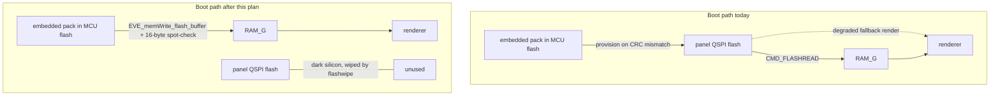

# F767 First Light and MCU-Direct Splash - Plan

## Goal Capsule

**Objective.** Tonight: the NUCLEO-F767ZI drives the center 7" RVT70H through splash-into-dash with the gauges animating from the simulator, splash assets staged MCU flash -> RAM_G. Permanently: MCU-direct staging becomes the primary splash architecture on every target, the EVE-flash provisioning machinery is deleted, and the center panel's now-obsolete flash contents get a full wipe.

**Product authority.** Kevin.

**Product Contract preservation.** Requirements R1-R10 unchanged from the 2026-07-21 brainstorm. Planning resolved both deferred questions in place (center-only staging; one staging progress line), added R12 (full panel-flash wipe — Kevin, 2026-07-21, superseding the earlier keep-sector-0 lean after establishing the 2026-07-20 ESE session had already rewritten sector 0), and revised R11 (Kevin, 2026-07-21): the backlight tries the Nucleo's USB-fed 5 V first for a single-cable bring-up, with the bench supply as fallback — replacing the brainstorm's external-supply-only rule.

**Stop conditions.** Bench gates are ordered; do not proceed past a failing gate (a wrong first gate indicts wiring or toolchain, not firmware). The clock walk never accepts a step on frame rate.

---

## Product Contract

### Summary

Rewrite splash staging so the firmware-embedded asset pack is written directly into RAM_G at boot on all targets, delete the EVE-flash provisioning and flash-source fallback machinery, and use that path for first light on the NUCLEO-F767ZI tonight: one 7" panel on the already-committed SPI1 pin plan, splash, crossfade, sim-driven live dash, serial ack — plus the bench prep (ST-LINK toolchain, wiring map, backlight rules) that gets the board from box to lit panel in one evening, and a guarded full wipe of the center panel's retired QSPI flash.

### Problem Frame

The F767ZI arrives today; the H755 mule arrives later in the week. The `env:nucleo_f767` build environment and its three-panel pin plan are already committed, so tonight is a hardware evening, not a porting evening — but the splash currently boots through the panel's EVE QSPI flash (provision-on-CRC-mismatch, then stage flash -> RAM_G), which both writes panel flash over brand-new untested jumper wiring and depends on flash init succeeding before any splash renders. The asset pack is already embedded in MCU flash as the provisioning source, so the panel-flash round trip adds risk and code without adding capability. Separately, a 2026-07-20 EVE Screen Editor bench session loaded a generated flash image to the center panel at address 0 — its flash contents (sector 0 included) are an obsolete ESE image, not factory state.

### Key Decisions

- **MCU-direct staging is the primary splash path on every target, and the EVE-flash machinery is deleted** (provisioning, header/CRC check, flash-source render fallback — git history preserves them). The pack is embedded in MCU flash either way, so provisioning saved no MCU flash; the staging transport is the same SPI command path the font inflate already proves on every rig; and boot no longer depends on the panel's flash init or contents at all. A failed staging check skips that asset — there is no flash fallback to fall back to.
- **Boot staging cost is accepted as clock-bound.** Roughly 0.6 s at the proven 8 MHz operating point, shrinking toward ~0.15 s near the panels' 30 MHz rating. Not a reason to keep the EVE-flash path.
- **First light runs at 8 MHz; the clock walks up afterward.** 8 MHz is the only operating point ever proven on hand wiring, and 24 MHz has failed on this bench before. The per-asset staging spot-check doubles as a read-integrity signal for the walk.
- **The migration plan's splash verification gate is rewritten, not left stale.** "Splash plays from provisioned panel flash; CRC no-op on second boot" in [docs/plans/2026-07-21-001-refactor-stm32-migration-plan.md](2026-07-21-001-refactor-stm32-migration-plan.md) becomes "splash plays from RAM_G staged from the embedded pack." The H755 external-NOR option ("optionally hosting the splash pack") is unaffected — it would relocate the embedded pack, not resurrect EVE-flash provisioning.
- **The center panel's QSPI flash is retired and gets a full-chip wipe, sector 0 included.** Its contents are an obsolete ESE image; the flashfast blob is intentionally destroyed. If panel flash is ever wanted again, a blob reprovision (ESE/EAB) is the recovery path.

### Requirements

**Splash architecture (all targets)**

- R1. At boot, the active theme's splash assets stage directly from the firmware-embedded pack into RAM_G; the panel's EVE flash is neither read nor written anywhere in the boot path.
- R2. The EVE-flash provisioning, pack-header verification, and flash-source render fallback are removed; an asset that fails its staging check is skipped for the session.
- R3. Per-asset staging verification against the embedded pack is retained as the guard between the SPI link and the renderer.
- R4. The migration plan's splash verification gate is updated to the MCU-direct wording (per Key Decisions).
- R5. The host invariant suite stays green; the pack format and its layout tests are untouched — only the pack's destination changes.

**F767 first light (tonight)**

- R6. The center 7" RVT70H runs on the committed `env:nucleo_f767` SPI1 pin plan, single panel; the absent side panels retire cleanly at boot as they do today.
- R7. Success line: splash plays from RAM_G, crossfades into the live dash, the gauges animate from the built-in simulator, and the serial protocol acks `status` over the ST-LINK VCP.
- R8. First light runs at the 8 MHz operating point. A same-night Clock Walk may raise it, accepted per step by read integrity (staging checks, register reads) — never by frame rate.

**Bench prep (before wiring)**

- R9. The ST-LINK upload path is proven on the Windows workstation — driver installed, `pio run -e nucleo_f767 -t upload` flashes the board, VCP enumerates — before the panel is connected.
- R10. A Nucleo-header -> RiBUS wiring map for the center panel is written to `docs/hardware/` before wiring, in the discipline of [three-panel-pin-reference.md](../hardware/three-panel-pin-reference.md).
- R11. Backlight power follows the tiered plan in KTD9 — Nucleo 5 V first for the fastest single-cable bring-up, bench supply as the fallback; the BLGND continuity beep-check identifies the backlight end before 5 V is applied from any source (standing bench rule).

**Panel flash retirement**

- R12. A guarded bench serial command performs a full-chip erase of the center panel's QSPI flash (sector 0 included), and a subsequent boot is unaffected by the empty flash.

### Acceptance Examples

- AE1. **Covers R2, R3.** Given a staging spot-check miscompare on one asset, when the splash runs, then that asset is absent for the session, the remaining assets render from RAM_G, and no flash-source read is attempted.
- AE2. **Covers R8.** Given a Clock Walk step where a staging check or register read fails, when the step is evaluated, then the clock retreats to the last clean step regardless of the frame rate observed.
- AE3. **Covers R12.** Given the wipe command without its confirmation argument, when it is received, then nothing is erased and the command acks `err`.

### Scope Boundaries

- Three-panel bring-up on the F767 — the pin plan supports it; tonight is one panel.
- Anything H755 (arrives later this week; owned by the migration plan).
- Peripherals with no hardware attached tonight: CAN, telltales, FRAM, switches — their stubs compile and stay dormant.
- Teensy strip-out — still gated on the migration plan's U8, unchanged by this work.
- Accepting any operating point above 8 MHz beyond what tonight's read-integrity walk actually proves.
- Odometer persistence on the F767 mule — no backend exists on this target (Teensy EEPROM today, FRAM on the carrier); the odometer resets each power cycle tonight and that is accepted.

### Dependencies / Assumptions

- The Nucleo's ST-LINK enumerates on this Windows box once ST's STSW-LINK009 driver is installed — the first ST-LINK hardware on this machine, so the driver step is real. The VCP needs no separate driver on Windows 11 (in-box `usbser.sys`).
- The Nucleo's 3.3 V rail (LD39050, 500 mA) carries the panel's logic (~150 mA) within the 500 mA USB budget; use a real root port. The backlight's USB feasibility is unknown until tried — KTD9's tiered plan owns the escalation, and LD5 is the signal.
- The existing bench 5 V supply and the center panel's FFC breakout carry over from the Teensy rig; breakout pad N = RiBus pin N was continuity-verified per unit, and must be re-verified on any new breakout.
- The center panel's flash contents are a 2026-07-20 ESE image (loaded to address 0); nothing in this plan reads them.

---

## Planning Contract

### Key Technical Decisions

- **KTD1 — Staging transport: `EVE_memWrite_flash_buffer` from the embedded pack, pack format byte-identical.** The staging loop in `splash_stage_theme_to_ramg` swaps `EVE_cmd_flashread(addr, a->addr, len)` for a direct write of `&splash_flash_pack[a->addr - SPLASH_FLASH_BASE]` — the same offset arithmetic the spot-check already uses, and the same write primitive provisioning used. `tools/make_splash_flash.py`, `splash_flash.h`, and `tests/test_splash_flash.c` stay untouched (R5); the asset table's flash-address fields are reinterpreted as pack offsets plus the historical 4096 base. The spot-check (16-byte readback vs pack) survives as the read-integrity guard (R3).
- **KTD2 — Deletion set: everything that touches panel flash leaves the boot path.** `splash_flash_provision()`, `splash_header_current()`, the flash-source arm of `splash_bitmap_source()` (a staged address of 0 now means skip, not fall back), the `SCRATCH_HDR`/`SCRATCH_BUF`/`PROVISION_CHUNK` constants, and the boot-time flash init/detect in `MustangDash.ino`. Consequence for bench diagnostics: the documented corruption signature loses its "flash init 0x01" leg; staging miscompares and font-inflate `EVE_cmd_getptr` verification are the surviving read-integrity signals.
- **KTD3 — RAM_G budget restated for splash-and-fonts coexistence.** Fonts occupy 273,120 B from address 0 (RAM_G's prior sole tenant); the largest theme stages ≤ ~281 KB above `g_ramg_fonts_end` with 64-byte alignment padding; peak residency ≈ 566 KB of the 1 MiB, ≈ 458 KB headroom, and the provisioning scratch region near the top is gone. The overflow guard in the staging loop stays. (Budget technique per `docs/solutions/design-patterns/eve-ram-g-budgeting-multi-theme-splash-assets.md`.)
- **KTD4 — Staging is center-panel-only.** The sides have no splash assets and hold black until the shared boot-complete fade-in; nothing stages to their RAM_G beyond fonts. Resolves the brainstorm's deferred question; matches current behavior.
- **KTD5 — Clock walk protocol on the F767.** Init and first light at 8 MHz (BT817 mandates ≤ 11 MHz for every byte of `EVE_init()`); walk one step at a time; each step accepted only by read integrity — re-run staging spot-checks, `REG_ID` reads, font `EVE_cmd_getptr` verify — never by frame rate (fps can sag with faults=0 under read corruption; reads fail before writes). Ceiling 30 MHz absolute. The Teensy delayed-sample-point trick is LPSPI-specific; whether the F7 SPI has an equivalent knob is an execution-time question for the first failing step.
- **KTD6 — Wiring lands on verified Zio positions (no soldering).** PA5=D13 (CN7-10), PA6=D12 (CN7-12), PB5=D22 (CN7-13, direct connection — no solder-bridge work; the SB121/SB122 fork only affects D11, which is avoided), PF13=D7 (CN10-2), PF14=D4 (CN10-8), GND at CN7-8 and CN10-5, 3V3 at CN8-7. Morpho CN11/CN12 are unpopulated through-holes on Nucleo-144 and are not used. Verified against UM1974 and the STM32duino `variant_NUCLEO_F767ZI` sources (2026-07-21).
- **KTD7 — Panel-flash wipe: a guarded serial command, full-chip erase.** `flashwipe` requires a confirmation argument; on confirm it attaches the flash (basic mode suffices — no blob needed for erase) and issues the library's full-chip flash erase, destroying the ESE image and the blob. The command parses through the host-tested serial layer and follows the protocol's `ok`/`err` ack discipline. It stays in the protocol as a guarded maintenance command.
- **KTD8 — Splash boot diagnostics: one staging summary line.** The deleted provisioning serial output is replaced by the existing staged-summary print (asset count, top address, headroom) plus per-asset miscompare/overflow lines already present. Resolves the brainstorm's second deferred question.
- **KTD9 — Power strategy: tiered, fastest-first (Kevin, 2026-07-21).** Plan A — everything from the one ST-LINK USB cable: board, panel logic 3.3 V (CN8-7), and backlight from the Nucleo's +5V pin (CN8-9, sourced through regulator U6, 500 mA max). Known risk: boot drives the backlight to full duty (128) at the crossfade, and a 1000-nit 7" backlight at full brightness likely exceeds the 500 mA ceiling — the USB power-fault LED (LD5) lighting or the board resetting at boot-complete is the expected failure signature, and it is non-destructive (UM1974 section 6.4: LD5 = consumption over 500 mA, switch to external power). Plan B — move only the BLVDD/BLGND pair to the bench buck at 5.00 V with shared ground (the Teensy rig's known-good arrangement); logic stays USB-fed. Backlight capacity problems are always solved by Plan B — external board power never helps the backlight, whose current bypasses the board entirely under Plan B. Plan C — only if USB power is flaky for the board itself: VIN on CN8 pin 15 at 7-12 V with JP3 moved to pins 5-6, JP1 OFF, and the UM1974-mandated ordering — external supply on first, USB plugged after (Table 7/8 and section 6.4.3; VIN input current is capped 250-800 mA depending on voltage). E5V is the manual's other 5 V input but its pin (CN11-6) lives on the unpopulated morpho header — soldering required, so it is not tonight's path. Escalate A -> B -> C only on observed failure, never preemptively.

### Sources & Research

- **`docs/hardware/datasheets/um1974-nucleo-144-mb1137.pdf`** — ST's UM1974 Nucleo-144 user manual, vendored (Kevin, 2026-07-21). The authority for any board unknown that comes up at the bench: jumpers (Tables 4/6/8), power sources and ordering (Table 7, section 6.4), Zio/morpho pinout tables. The manual covers many MB1137 board variants — read only the NUCLEO-F767ZI columns/rows when extracting facts.
- Live verification (2026-07-21): UM1974 Zio/solder-bridge/power tables and STM32duino `variant_NUCLEO_F767ZI.h/.cpp` (pin table in KTD6); PlatformIO ST-LINK docs + ST STSW-LINK009 (driver story); ST-LINK V2-1 firmware-update recommendation.
- Institutional: `docs/solutions/architecture-patterns/bt817-flash-render-streaming-bandwidth-ceiling.md` (why RAM_G staging is the vendor-endorsed architecture — the justification for deleting the flash path); `docs/solutions/integration-issues/spi-run-clock-24mhz-overclock-corrupts-eve-coprocessor-reads.md` and `docs/solutions/architecture-patterns/dash-carrier-pcb-buffered-spi-topology-30mhz-clock-contract.md` (KTD5's walk rules); `docs/solutions/design-patterns/eve-ram-g-budgeting-multi-theme-splash-assets.md` (KTD3); `docs/solutions/tooling-decisions/astc-swizzle-validated-against-eve-asset-builder.md` (do not touch the swizzle — it is differentially validated); `docs/solutions/ui-bugs/eve-font-format-l4-l2-confusion-serial-verification-blind-spot.md` (eyes-on-panel is a required acceptance signal); `docs/solutions/integration-issues/eve-panel-bringup-no-usb-enumeration-diagnosis.md` (bench hazard checklist); `docs/solutions/integration-issues/backlight-pwm-4khz-audible-whine.md` (REG_PWM_HZ override must survive on the F767 path).

---

## High-Level Technical Design

Firmware shape: `splash_render.h` keeps its structure — `ThemeDesc`, the staging loop, `splash_bitmap_source`, and all draw/timeline code survive; only the staging transport and the flash machinery change. The `.ino` loses the provision/flash-init boot steps and gains the `flashwipe` command handler.

---

## Implementation Units

### U1. MCU-direct staging rewrite and provisioning deletion

**Goal:** Splash stages embedded-pack -> RAM_G on every target; all EVE-flash splash machinery is gone; docs that describe it are scope-noted.
**Requirements:** R1, R2, R3, R4, R5; KTD1-KTD4, KTD8.
**Dependencies:** none.
**Files:** `MustangDash/splash_render.h`; `MustangDash/MustangDash.ino` (boot sequence); `docs/plans/2026-07-21-001-refactor-stm32-migration-plan.md` (verification-gate wording, R4); `CLAUDE.md` (boot-splash blurb + a bench-truth line that the center panel's flash, sector 0 included, holds a 2026-07-20 ESE image); scope notes in `docs/solutions/architecture-patterns/bt817-flash-resident-astc-assets.md` (firmware half deleted; pipeline half survives), `docs/solutions/architecture-patterns/bt817-flash-render-streaming-bandwidth-ceiling.md` (fallback removed), `docs/solutions/design-patterns/eve-ram-g-budgeting-multi-theme-splash-assets.md` (splash re-enters RAM_G).
**Approach:** Per KTD1/KTD2. Keep the staging loop's overflow guard and spot-check; a spot-check failure zeroes the asset's staged address and the draw path skips assets with address 0. Do not touch `tools/make_splash_flash.py`, `splash_flash.h` generation, or the swizzle. Keep the Teensy env fully working — this is an all-targets change, and the Teensy bench is the reference rig until the migration's U8.
**Execution note:** run the host suite (`wsl -- bash -lc "./tests/run-tests.sh"`) before and after; it is the regression net. `test_splash_flash.c` and `test_splash_timeline.c` must pass unchanged — if either needs edits, the change has drifted out of scope.
**Test scenarios:** host suite green with zero test-file changes; `pio run -e teensy41`, `-e nucleo_f767`, `-e h743`, `-e riverdi_f469` all build clean; grep proves no remaining call sites of the deleted functions.
**Verification:** all four envs build; host suite green; on the Teensy bench rig (if exercised before tonight) splash renders identically from RAM_G.

### U2. Windows ST-LINK toolchain proof

**Goal:** The board flashes and talks before the panel is ever connected.
**Requirements:** R9.
**Dependencies:** none (board arrival gates execution, not planning).
**Files:** none (workstation setup; findings worth keeping land in `BUILD.md` only if something surprises).
**Approach:** Install ST's STSW-LINK009 driver (or STM32CubeProgrammer, which bundles it); plug the Nucleo into a root USB port; run the ST-LINK firmware updater once (V2-1 boards ship stale); `pio run -e nucleo_f767 -t upload` (default `upload_protocol = stlink` via PlatformIO's bundled OpenOCD); open the VCP COM port at 115200 and confirm the boot banner and a `status` ack with no panel attached (panels retire, dash loop runs headless).
**Test scenarios:** Test expectation: none — bench-only; the gate is upload success + VCP `status` ack.
**Verification:** firmware uploads; VCP enumerates as a COM port; `status` acks `ok`.

### U3. Nucleo setup and wiring guide

**Goal:** A verified Nucleo setup + wiring doc — jumpers, power plan, and pin map — that runs tonight step-by-step and survives to the three-panel follow-on.
**Requirements:** R10, R11; KTD6, KTD9.
**Dependencies:** none.
**Files:** `docs/hardware/nucleo-f767-center-panel-wiring.md` (new).
**Approach:** The doc is the Bench Runbook (appendix of this plan) plus the wiring table per KTD6: signal, MCU pin, Zio position, breakout pad (pad N = RiBus pin N per the verified MTCELL mapping), wire color column left to fill at the bench. Jumper section (all verified against the vendored UM1974, F767ZI/MB1137): factory defaults are JP3 on U5V (pins 3-4), JP1 OFF, JP5 (IDD) ON, both CN4 jumpers ON (onboard ST-LINK mode; both OFF hands the ST-LINK to an external target via the CN6 SWD connector — that, not CN4, is the external programming connector). Nothing moves tonight unless Plan C fires (JP3 to pins 5-6 for VIN). Standing rules carried: KTD9's A/B/C power tiers, common ground across board/supply/panel, BLGND (pads 19-20) beep-to-GND check before backlight power from any source, FFC down-side contact at the panel, continuity re-verification on any breakout not previously tested. Include the left/right SPI2/SPI4 pin sets from the committed pin plan as a reference appendix for the three-panel night.
**Test scenarios:** Test expectation: none — documentation; verification is the bench following it.
**Verification:** doc exists; every wire and jumper tonight is placed from the doc, not from memory.

### U4. First light and clock walk

**Goal:** R7's success line on the bench, then a read-integrity-gated walk above 8 MHz.
**Requirements:** R6, R7, R8; KTD5.
**Dependencies:** U1, U2, U3.
**Files:** `CLAUDE.md` (record the accepted F767 operating point as a bench truth); `MustangDash/MustangDash.ino` only if the walk needs a temporary clock override hook.
**Approach:** Follow the Bench Runbook (appendix) steps 5-11. Staged gates, in order: (1) wiring per U3's doc, continuity + BLGND beep before power; (2) power-on under KTD9 Plan A, `REG_ID == 0x7C`; (3) first light at 8 MHz — splash from RAM_G with the staging summary line clean, crossfade (watch LD5 here — full backlight duty lands at this moment; on trip, drop to Plan B and re-run), sim-driven gauges moving, eyes-on-panel check against the known dash look (serial health alone cannot see render corruption), `status` ack; (4) clock walk — raise one step, re-run staging spot-checks + `REG_ID` + font-getptr reads, accept or retreat per KTD5, stop at the last clean step. Record the accepted operating point and which power plan the night settled on.
**Test scenarios:** Test expectation: none — bench-only; the Verification Contract's bench gates are the checklist.
**Verification:** all four gates pass; accepted operating point recorded.

### U5. Panel-flash full wipe

**Goal:** The center panel's QSPI flash is empty — the obsolete ESE image and blob are gone.
**Requirements:** R12; KTD7.
**Dependencies:** U1 (firmware side); bench run after U4 (never before first light — the wipe is orthogonal and must not share the night's critical path).
**Files:** `MustangDash/MustangDash.ino` (or the serial-command header if parsing lives there); the host serial test file covering command parsing.
**Approach:** Add `flashwipe` with a required confirmation argument per KTD7. On confirm: attach flash in basic mode, full-chip erase via the library's flash-erase command, report `ok` on completion (this takes tens of seconds on a 64 MB part — the ack waits). Without the argument: `err`, no action.
**Test scenarios:** Covers AE3. host serial test: `flashwipe` without argument -> `err` and no erase path invoked; `flashwipe` with wrong argument -> `err`; with correct argument -> dispatches to the wipe handler (handler itself is EVE-bound, host-stubbed). Bench: run the wipe, power-cycle, confirm boot and splash are unaffected (R12) and flash status reads detached/empty.
**Verification:** host suite green including the new parsing cases; bench wipe completes with `ok`; post-wipe boot is indistinguishable from pre-wipe.

---

## Verification Contract

- Host invariant suite green via `wsl -- bash -lc "./tests/run-tests.sh"` — all existing tests unchanged (`test_splash_flash.c`, `test_splash_timeline.c` in particular), plus U5's serial-parsing cases.
- `pio run -e teensy41 -e nucleo_f767 -e h743 -e riverdi_f469` all build clean.
- Bench gates, in order:
  - upload via ST-LINK succeeds; VCP `status` acks with no panel attached
  - wiring and jumpers placed from `docs/hardware/nucleo-f767-center-panel-wiring.md`; BLGND beep-check passed before backlight power from any source; power plan settled per KTD9's A -> B -> C escalation with the outcome recorded
  - `REG_ID == 0x7C` at 8 MHz
  - splash plays from RAM_G (staging summary line clean, no miscompare), crossfades into the dash, gauges animate from the simulator, eyes-on-panel look matches the known dash
  - `status` acks over the VCP
  - clock walk: each accepted step passed staging spot-check + `REG_ID` + font-getptr re-verification; final operating point recorded in `CLAUDE.md`
  - `flashwipe` guard: bare command acks `err`; confirmed command completes `ok`; post-wipe power cycle boots identically

## Definition of Done

R7's success line observed on the bench at 8 MHz or better, every Verification Contract gate passed, the accepted operating point, settled power plan, and panel-flash state recorded in `CLAUDE.md`, and no dead provisioning code or stale doc claims left behind (the U1 doc set updated). Follow-on work (three-panel F767, H755, CAN) stays with the migration plan.

---

## Appendix — Bench Runbook (tonight)

The numbered sequence U2-U5 execute. Each step gates the next; on a failure, stop and diagnose at that step.

1. Install ST's STSW-LINK009 ST-LINK USB driver (or STM32CubeProgrammer, which bundles it). No separate VCP driver is needed on Windows 11.
2. Plug the Nucleo into a root USB port (no hub). Run the ST-LINK firmware updater once (V2-1 boards commonly ship stale firmware).
3. Verify jumpers at factory defaults: JP3 on U5V (pins 3-4), JP1 OFF, JP5 ON, both CN4 jumpers ON. Nothing else moves tonight (UM1974 section 3, out-of-box configuration).
4. `pio run -e nucleo_f767 -t upload`. Open the VCP COM port at 115200: boot banner appears, `status` acks `ok` with no panel attached (missing panels retire; the dash loop runs headless). This completes U2 — the toolchain is proven before the panel exists.
5. Power off (unplug USB). Wire the panel per the U3 table: SCLK -> D13 (CN7-10), MISO -> D12 (CN7-12), MOSI -> D22 (CN7-13), CS -> D7 (CN10-2), PD -> D4 (CN10-8), panel logic VDD (pad 1) -> 3V3 (CN8-7), panel GND (pad 2) -> GND (CN7-8 or CN8-11).
6. Continuity checks before any power: if this breakout was never bench-verified, beep pad-frame vs pad 20 to confirm pad N = RiBus N; always beep pads 19-20 (BLGND) to pad 2 (GND) to positively identify the backlight end. FFC contacts face down at the panel.
7. Backlight, Plan A (single-cable): BLVDD pads 17-18 -> Nucleo +5V (CN8-9), BLGND pads 19-20 -> GND (CN8-11). Doubled jumpers on each pair.
8. Power up (USB only). Watch the boot: the splash runs at low duty, then the crossfade sets full backlight duty — that instant is where Plan A fails if it's going to. Signature: red LD5 lights or the board browns out/resets.
9. On Plan A failure: unplug, move only BLVDD/BLGND to the bench buck at 5.00 V, tie buck GND to Nucleo GND, re-power. This is Plan B — the Teensy rig's proven arrangement.
10. If USB power is flaky for the board itself (resets without the backlight involved): Plan C — 7-12 V into VIN (CN8 pin 15), JP3 moved to pins 5-6, JP1 OFF; mandatory order: external supply ON first, USB plugged after (UM1974 6.4.3). USB stays connected for ST-LINK and the VCP.
11. Run U4's gates: `REG_ID == 0x7C`, first light (staging line clean, crossfade, sim gauges, eyes-on-panel), `status` ack, then the KTD5 clock walk. Afterward, U5's `flashwipe` — never before first light.
