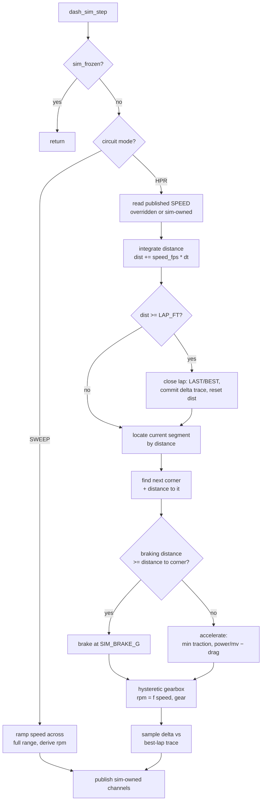

# feat: High Plains Raceway Lap Simulation - Plan

## Goal Capsule

**Objective.** Two related goals, both aimed at making the bench dash exercise channels that are currently static or fictional.

1. **Real laps.** Replace TRACK mode's fictional 62-second driving cycle with a distance-based lap of High Plains Raceway, driven by a physical acceleration model using the car's real specification. Lap time becomes an output of the simulation rather than a hardcoded constant. The retired fictional circuit is reborn as a deliberate range-sweep test fixture.
2. **Session realism.** Wrap those laps in a repeating 20-minute track session so coolant, oil, and fuel behave over a session instead of flatlining minutes after boot — coolant settling early, oil still climbing late, and fuel draining across roughly two sessions per tank.

The second goal was added during authoring and is not merely a detail of the first: it accounts for U8, U9, R13–R15, and S6–S7, and it is the reason `dash_math.h` is in scope.

**Product authority.** This conversation (2026-07-22). No separate brainstorm artifact was written; the Product Contract below captures the decisions made in dialogue.

**Open blockers.** None.

---

## Summary

TRACK mode drives a real 2.55-mile lap of High Plains Raceway with the car's speed integrated into track position, rather than a lap clock running independently. Acceleration comes from a traction/power/drag model using the actual vehicle spec, so lap time, shift points, and the tach sawtooth all emerge from the driving instead of being authored. A separate sweep fixture preserves full-range channel coverage that a real circuit cannot provide.

---

## Problem Frame

The TRACK simulator today is a **time-keyed driving cycle**, not a lap. `dash_sim.h:208` computes `lap_frac = lap_ms / SIM_LAP_ROLLOVER_MS`, so a 10-segment table of fictional corners is indexed by fraction-of-a-fixed-62-seconds. Three consequences follow:

1. **Lap time is an input.** Every lap is exactly 62.000 s. `LAST` and `BEST` are the same constant forever, and `DELTA` is decorative — a two-sine blend (`dash_sim.h:268`) with no relationship to how the car is actually driving.
2. **The speeds are fantasy for this car.** Segment targets reach 196 mph and the gearbox climbs into 6th (`dash_sim.h:196-207`) — figures authored for no particular car, indexed off a clock. The replacement's speeds are not authored at all: they fall out of the vehicle spec and the circuit, and whatever gears that demands are the gears used.
3. **The tach sawtooth is therefore wrong.** Because rpm is derived from road speed through the selected gear (`dash_sim.h:262`), fantasy speeds produce a shift pattern with no relationship to the real drivetrain. The rpm trace is the most visible element of a track dash, and it is currently meaningless.

The dash renders no gear indicator (`dash_data.h:27-55` has no gear channel), so gearing is only ever observed *through* the tach. That makes the sawtooth the primary correctness signal for this work.

**The fictional circuit was, however, doing a second job nobody designed for it.** Its 196 mph targets swept the full speedo dial, all six gears, and redline in top gear. A real HPR lap does not reach the top of the dial or use 6th, so replacing it outright would silently delete that coverage — the sweep behavior is preserved deliberately rather than incidentally.

**Two further channels are effectively dead today, which U8 and U9 address.** Coolant and oil share a single 90 s warmup constant (`dash_sim.h:280-284`), so both reach operating temperature within about five minutes of boot and never move again. Fuel burns at a flat `0.02f / 60.0f` gal/s (`dash_sim.h:75`) — 1.2 gal/hr, roughly 0.04 gal per lap — which is invisible on the gauge. Neither the temperature gauges nor the fuel gauge can be meaningfully exercised on the bench as a result.

---

## Product Contract

### Requirements

- **R1.** TRACK mode simulates a lap of High Plains Raceway: 2.55 miles (13,464 ft), 15 turns, clockwise.
- **R2.** Lap position is derived from integrated road speed, not from elapsed time. A lap completes when the car crosses the lap distance.
- **R3.** Lap time is an emergent output. `LAP`, `LAST`, `BEST`, and `PRED` reflect actual simulated driving and vary lap to lap.
- **R4.** Acceleration is physically modeled from the vehicle specification: traction-limited at low speed, power-limited at high speed, opposed by aerodynamic drag.
- **R5.** The vehicle specification is: 2,900 lb with driver; **511 whp measured on a dyno in Denver**; close-ratio T56 Magnum; 3.73 final drive; 315/30R18 (25.44 in diameter) on all four corners; 8,000 rpm redline.
- **R6.** Corner speeds and braking points produce a realistic rpm sawtooth. **Gear selection is emergent** — the car uses whatever gears the physics and the gearbox hysteresis actually call for, including 5th on the front straight. No gear range is asserted.
- **R7.** Driver skill is a single tunable constant representing a moderate — not expert — driver. It scales corner speeds below the car's limit and widens lap-to-lap variation.
- **R8.** `DELTA` is computed against a stored best-lap time-versus-distance trace, replacing the sine-wave placeholder.
- **R9.** When `SPEED` is overridden via the serial protocol, lap position integrates from the overridden value, so the displayed speed and lap progression stay consistent.
- **R10.** The simulator remains deterministic and free of `rand()`/`time()`, per the existing contract in `MustangDash/dash_sim.h`.
- **R11.** STREET mode behavior is unchanged, with two deliberate exceptions inherited from the shared model: the split coolant/oil thermal constants (R13) and the load-proportional fuel burn (R15) apply in both modes. STREET's *driving* behavior is untouched.
- **R12.** A **range-sweep fixture** is selectable from the serial protocol. Its purpose is exercising every channel across its full display range — all six gears, redline, the top of the 200 mph speedo, and the shift-light ladder — not simulating a circuit. HPR is the default; the fixture is opt-in.

- **R13.** TRACK runs as a repeating **20-minute session** that opens with a cold standing-start out-lap. Coolant and oil temperature climb from cold across the session, on separate time constants: coolant settles early, oil is still rising late.
- **R14.** A session ends on the first lap completion at or after the 20-minute mark — the car finishes its in-lap and never resets mid-lap.
- **R15.** Fuel depletes at a realistic, load-proportional rate (~0.6 gal per lap). It **does not** reset with the session; it refills only on reaching empty, at a lap boundary.

### Success Criteria

- **S1.** A simulated lap is **plausible for this car at HPR** — the reference band is 1:55–2:10, and the observed default is recorded in the plan as an observation rather than a target. Context: published times for 450–500 hp / 3,200–3,400 lb cars at HPR are 2:04–2:10 on street tires, and this car has better power-to-weight and far more grip, so landing under 2:00 is a legitimate result and not a defect. The band is a sanity bound that catches a broken model, not a number to tune toward.
- **S2.** Consecutive laps differ by a visible margin (roughly 0.3–1.5 s), so `LAST`, `BEST`, and `DELTA` show movement.
- **S3.** On the bench, the tach sweeps to the shift point and resets a plausible number of times per lap. **Peak front-straight speed is whatever the model produces** — the computed figure from the stated constants is roughly 165–175 mph, and that is treated as the expected result rather than a number to tune away from.
- **S4.** The sweep fixture drives speed across 0–200 mph and rpm across idle–redline, visiting all six gears.
- **S5.** Host test suite passes (`./tests/run-tests.sh`, run under WSL on Windows).
- **S6.** Over a 20-minute bench session the coolant gauge visibly rises and settles while the oil gauge is still climbing at minute 15, and both drop at the session rollover.
- **S7.** Over the same session the fuel gauge falls visibly — roughly half a 12-gallon tank — and carries its level into the next session.

### Scope Boundaries

**In scope:** the TRACK driving model in `MustangDash/dash_sim.h`, the sweep-fixture selector in `MustangDash/dash_serial.h`, the fuel-burn constant in `MustangDash/dash_math.h` (U9), and their host tests.

**Deferred for later:**
- Real corner radii and elevation-derived corner speeds. The stated fidelity bar is "reasonable, not exact" — corner speeds are hand-authored per turn. **Amended during execution:** corner *duration* is in scope (U10), because without it the lap ran 34 s fast. Corner radius is still derived from the authored limit speed and `SIM_LATERAL_G`, not measured from the track.
- A driver *model* (trail braking, corner entry/exit shaping, missed apexes, tire warm-up). Driver skill is one constant.
- Track selection across multiple real circuits. HPR is compiled in; the sweep fixture is not a second circuit.
- Re-calibrating `DASH_SPEED_MAX` / `DASH_SPEED_KNEE` (`dash_math.h:30-31`). The speedo dial stays 200 mph; the sweep fixture is what exercises its upper range.

**No criterion verifies geometric fidelity to HPR.** Every realism check in this plan tests the model against inputs the plan itself authored — corner-entry speeds against authored targets, lap time against a tuned constant, variation against a chosen jitter magnitude. Randomize the 14 apportioned segment lengths and re-tune the driver constant and S1, S2, S3, S6, S7, V3 and V4 all still pass. The criteria establish that the model is internally consistent and bench-plausible; the fidelity bar is "reasonable, not exact" per KTD2/KTD3, and that is deliberate.

**Not in scope:** STREET mode's driving and cruise behavior, the renderers, and the alarm system. STREET does inherit the shared thermal-constant split (R13) and load-proportional fuel burn (R15), so its code path and tests are in scope for exactly those two changes.

### Key Decisions

- **KTD1. Distance-based lap over the fixed clock.** The alternative — reskinning the segment table while keeping time-keyed segments — was rejected: it cannot make lap time emergent, so the timing channels would stay synthetic and the dash-validation payoff would be lost.
- **KTD2. Hand-authored corner target speeds.** Deriving corner speed from published radii would require geometry the sources do not provide (only the tightest corner's 80 ft radius is published). Target speeds are authored per turn from each corner's documented character.
- **KTD3. Segment distances are an allocation, not a citation.** Only the total lap length (2.55 mi) and the longest straight (2,838 ft) are officially published. The remaining 14 segment lengths are apportioned to sum correctly and to respect the documented corner sequence. This is a deliberate, documented approximation.
- **KTD4. Lookahead braking rather than reactive braking.** Each step computes the distance required to shed speed to the next corner's target and begins braking when the remaining distance reaches it. This is what produces correct braking points and therefore a correct tach sawtooth; reactive braking (the current model's approach) brakes *at* the corner, which is both wrong and visibly wrong.
- **KTD5. No altitude derate.** The figure is **511 whp, measured on a dyno in Denver**, so it is used directly. The ~15% NA altitude loss cited in research is already reflected in that number — applying a derate on top would double-count it. (A doc review raised that chassis-dyno sheets are conventionally SAE-corrected back toward sea level, which would make a Denver-measured number already normalized; the owner confirmed the Denver figure is the one to use, so this is settled rather than assumed.)
- **KTD6. Override drives lap position.** Per R9, distance integrates from the published `SPEED` channel rather than the simulator's internal state, so `set speed 45` genuinely crawls the circuit.
- **KTD7. The sweep fixture is a coverage tool, not a circuit.** It deliberately does not reuse the corner table or the lookahead-braking model. Making it a second fake circuit would give coverage only where that circuit happened to go; making it an explicit ramp guarantees it visits every range boundary. It bypasses the physics model for the same reason — a designed sweep is a better fixture than an emergent one.

---

## Planning Contract

### High-Level Technical Design

Per-step control flow in TRACK mode. Directional — the prose and unit definitions are authoritative.



The acceleration model, expressed as directional pseudo-code:

```
v_fps       = speed_mph * 1.46667
a_traction  = SIM_TRACTION_G * 32.174                        # tire-limited, low speed
a_power     = (SIM_POWER_WHP * 550) / (mass_slug * v_fps)    # engine-limited, high speed
a_drag      = 0.5 * SIM_AIR_RHO * SIM_CDA * v_fps^2 / mass_slug
a_net       = min(a_traction, a_power) - a_drag
```

Starting constant values. All are tuning inputs, not measurements — expect to adjust them during U4 calibration:

| Constant | Value | Basis |
|---|---|---|
| `SIM_MASS_SLUG` | 90.1 | 2,900 lb / 32.174 |
| `SIM_POWER_WHP` | 511 | Dyno-measured in Denver (KTD5) |
| `SIM_TRACTION_G` | 1.05 | Rear-driven on 315 R-comps |
| `SIM_BRAKE_G` | 1.25 | Square 315s, four-wheel braking |
| `SIM_LATERAL_G` | 1.30 | Square 315s at 2,900 lb — informs authored corner speeds |
| `SIM_CDA` | 9.5 ft² | Cd ≈ 0.45 × frontal area ≈ 21 ft²; a 1965 body is not slippery |
| `SIM_AIR_RHO` | 0.00174 slug/ft³ | ~5,000 ft density altitude, vs 0.00238 at sea level |

Braking-point test against the next corner target `v_t`:

```
d_required = (v_fps^2 - v_t_fps^2) / (2 * SIM_BRAKE_G * 32.174)
brake when d_required >= distance_remaining_to_corner
```

### The Circuit Table

Turn names and character are from the Rocky Mountain Region PCA / Speed Secrets official course guide. Segment lengths are apportioned per KTD3; limit speeds are authored per KTD2 and scaled by the driver constant at runtime.

Start/finish is placed at Turn 3's exit, so the lap opens with the full front straight.

**Segment index is offset from turn number — this is not a sequencing error.** Because the lap starts at T3's exit rather than at T1, the table begins mid-circuit and wraps: segment 1 is T4, and T1 does not appear until segment 13. Read down the Segment column and the driving order is the PCA course guide's clockwise lap exactly —

> front straight → T4 → T5 → T6 → T7 → T8 → T9A/9B → T10 → T11 → T12 → T13 → T14 → T15 → **T1 → T2 → T3** → (wraps to the front straight)

The T15 → T1 wrap is the real layout: the Prairie Corkscrew exits onto T1, and T3 is the corner that leads onto the straight. Starting the table at T1 instead would place start/finish inside the tightest corner on the track (80 ft radius, off-camber) and cost the hot-lap behavior in U1, which depends on crossing S/F at a corner-exit speed feeding a straight.

| # | Segment | Length (ft) | Limit (mph) | Character |
|---|---|---|---|---|
| 0 | Front straight (T3 → T4) | 2838 | — | Longest straight, official figure. Full throttle. |
| 1 | T4 Biker's Berm | 700 | 65 | Primary braking zone at straight's end |
| 2 | T5 Niagara | 600 | 75 | Blind left, apex past middle |
| 3 | T6 Danny's Lesson | 700 | 55 | Decreasing radius, very late apex |
| 4 | T7 High Plains Drifter | 1100 | 105 | Fast right sweeper |
| 5 | T8 | 800 | 70 | Uphill braking zone |
| 6 | T9A/9B To Hell on a Bobsled | 1000 | 85 | Linked downhill pair |
| 7 | T10 | 700 | 80 | Compression at the bottom of the hill |
| 8 | T11 | 800 | 70 | Blind, extremely late apex, uphill |
| 9 | T12 Ladder to Heaven | 900 | 125 | Flat-out uphill kink — not a real limit |
| 10 | T13 Prairie Corkscrew entry | 600 | 60 | Braking at the 2 marker |
| 11 | T14 | 500 | 65 | Right, ¾ through the curb |
| 12 | T15 | 500 | 70 | Left, tracks out far right |
| 13 | T1 | 800 | 40 | Tightest on track — 80 ft radius, 160°, off-camber |
| 14 | T2 | 500 | 50 | Very late apex |
| 15 | T3 | 424 | 75 | Double apex, leads onto the straight |

Total: 13,462 ft against a nominal 13,464 ft (2.55 mi) — reconcile the 2 ft remainder into segment 15 (T3) at implementation. It must **not** go into segment 0 — that is the officially published 2,838 ft straight, one of only two sourced lengths per KTD3, and it is the segment that should not flex.

---

## Implementation Units

### U1. Distance-based lap position

**Goal.** Replace the fixed 62-second lap clock with distance integration; a lap completes on crossing the lap length.

**Requirements.** R1, R2, R3, R10

**Dependencies.** None.

**Files.**
- `MustangDash/dash_sim.h` (modify)
- `tests/test_dash_sim.c` (modify)

**Approach.** Add `lap_dist_ft` to `DashSimState` and `SIM_TRACK_LAP_FT` (13464). Retire `SIM_LAP_ROLLOVER_MS`. `lap_ms` continues to accumulate as the lap *timer*, but no longer determines lap position; lap closure is triggered by distance, at which point `lap_ms` is committed to `last_ms` on every lap, and to `best_ms` only from lap 2 onward (lap 1 is excluded per the out-lap rule below); `lap_ms` then resets. Keep the existing segment-lookup shape but index by distance rather than time fraction, so U3 can swap the table in cleanly.

**Hot laps after the out-lap.** Laps 2+ are **flying laps**: `speed_mph` is integrator state and lap closure resets only `lap_dist_ft` and `lap_ms`, so the car crosses start/finish carrying its speed — which, with S/F at Turn 3's exit, is a corner-exit speed feeding the front straight. Correct by construction; no special handling.

Lap 1 is deliberately **not** hot. `dash_sim_init` seeds `speed_mph` at ~7 mph in 1st (`dash_sim.h:147`) and that rollout is retained as the session out-lap (see U8) — it is what gives the thermal model a cold start to climb away from. The cost is that lap 1 is several seconds slow, so it must be **excluded from `best_ms` and from U5's `DELTA` reference trace**; otherwise lap 2 reads a large bogus negative delta against an out-lap baseline. Lap 1 still populates `last_ms` and still displays normally — it is a real lap the driver drove, just not a representative one.

**Patterns to follow.** Existing `dash_sim_step` accumulator discipline — all rates scaled by `dt_ms` so any step size integrates identically (`dash_sim.h:17`).

**Test scenarios.**
- A lap completes after the car has covered `SIM_TRACK_LAP_FT`, not after a fixed elapsed time.
- Two runs at different step sizes (10 ms and 50 ms) cover the same distance within tolerance over a fixed sim duration.
- `lap_count` increments exactly once per lap-distance crossing.
- `best_ms <= last_ms` continues to hold across many laps.
- Frozen sim (`sim_frozen`) accrues neither distance nor lap time.
- Determinism: two identically-stepped sims agree bit-for-bit on `lap_dist_ft` and `lap_ms`.
- Speed is non-zero and continuous across a lap boundary — no reset to a standing start.
- Lap 1 is measurably slower than laps 2–5 (it is the out-lap) and is excluded from `best_ms` and from U5's delta reference.
- **Replaces** the existing `"10 track minutes must complete at least 8 laps"` assertion, which assumes 62 s laps and will fail at ~2:00 laps. New bound: 10 sim-minutes completes 4–6 laps.

**Verification.** Lap times reported by the sim vary run-to-run in a way traceable to distance covered, and the host suite passes.

---

### U2. Physical acceleration model

**Goal.** Replace the linear accel-fade with traction/power/drag physics and correct the tire diameter.

**Requirements.** R4, R5

**Dependencies.** U1

**Files.**
- `MustangDash/dash_sim.h` (modify)
- `tests/test_dash_sim.c` (modify)

**Approach.** Correct `SIM_TIRE_DIA_IN` from 26.0 to 25.44 (315/30R18). Add mass, power, traction-g, brake-g, and drag constants. Replace `SIM_ACCEL_BASE_MPHPS` / `SIM_ACCEL_FADE` / `SIM_ACCEL_MIN_MPHPS` with the `min(traction, power/mv) - drag` form from the design sketch. Retain `SIM_BRAKE_MPHPS`'s role but re-express as a g figure (~1.25 g given square 315s).

Guard the power term against division by zero at `v_fps` near zero — clamp to the traction limit below a small speed floor.

**Patterns to follow.** Constants stay `SIM_`-prefixed and local to `dash_sim.h`; do not include `dash_math.h` (`dash_sim.h:29`, `dash_sim.h:82`).

**Test scenarios.**
- Acceleration from rest is traction-limited: initial accel is within tolerance of `SIM_TRACTION_G * 32.174`, not the power figure.
- Acceleration at high speed is power-limited and decreases monotonically with speed.
- Acceleration is never negative under full throttle below the drag-limited terminal speed.
- No division-by-zero or non-finite value when speed is zero.
- `speed = rpm * 25.44 / (ratio * 3.73 * 336)` holds — **updates** the existing `expected_mph` helper, which hardcodes 26.0f (`tests/test_dash_sim.c:41`).
- Determinism preserved.

**Verification.** Acceleration from a corner exit is quick but not instantaneous, and terminal speed on the 2,838 ft straight is consistent with the closed-form result from the stated constants (~165–175 mph).

---

### U3. High Plains Raceway circuit table with lookahead braking

**Goal.** Replace the 10 fictional segments with the 16-entry HPR table and brake for corners in advance.

**Requirements.** R1, R6

**Dependencies.** U1, U2

**Files.**
- `MustangDash/dash_sim.h` (modify)
- `tests/test_dash_sim.c` (modify)

**Approach.** Swap `SIM_SEGS` for the distance-keyed HPR table from the Planning Contract, with `SIM_SEG_COUNT` 16. Each entry carries cumulative distance-at-end, a limit speed, and the `is_corner_limit` flag U4 needs. Implement the lookahead braking test from the design sketch: scan forward to the next segment whose limit is below current speed, compute required braking distance, and brake when it meets the remaining distance.

**A limit constrains its segment's entry boundary only.** Within a segment the car accelerates freely under the U2 model until lookahead braking for the *next* entry limit engages — the limit is not held across the segment's whole length. Holding it would have the car crawling at 65 mph for the full 700 ft of T4, and this is the single choice that most determines lap time, so it is specified here rather than left to the implementer.

Carry the corner names as comments — they are the documented source of each speed and make future tuning legible.

**Patterns to follow.** The existing `static const struct { ... } SIM_SEGS[]` shape (`dash_sim.h:196`), extended with a distance field.

**Test scenarios.**
- Segment lengths sum to exactly `SIM_TRACK_LAP_FT`.
- The car is below each corner's target speed on entry to that corner, for every corner, across a full lap.
- Braking begins before the corner, not inside it: throttle reaches 0 while distance-to-corner is still positive.
- Peak speed on segment 0 (front straight) is bounded loosely (140–185 mph) — a sanity bound that catches a broken model, not a tuning target.
- Minimum speed on the lap occurs at T1 and is near its authored target.
- **No assertion is made about which gears are used.** Gear selection is emergent (R6); the car takes whatever the gearbox hysteresis gives it, which on this circuit reaches 5th on the front straight. The existing `"the straights must reach 6th gear"` assertion moves to U7, where the sweep fixture satisfies it; `"the straights must exceed 170 mph"` is simply retired, since the front straight now approaches that figure on its own.
- The rpm spread at a fixed road speed still spans gears (preserve the existing `rpm_at_100` intent, retargeted to a speed this car actually sees, e.g. 80 mph).

**Verification.** A full lap on the bench shows braking zones that precede corners and an rpm sawtooth that resets a plausible number of times.

---

### U10. Corner duration from lateral grip

**Goal.** Give corners *duration*. Without it the lap comes out ~34 seconds too fast.

**Requirements.** R1, R6, S1

**Dependencies.** U3

**Files.**
- `MustangDash/dash_sim.h` (modify)
- `tests/test_dash_sim.c` (modify)

**Why this unit exists.** U1–U3 measured **1:28** against real HPR times of 2:04–2:10. The car averages 104 mph over 2.55 miles where a real 2:05 lap averages 73. The cause is U3's entry-boundary-only rule: a corner's limit binds for a single instant at its entry, after which the car pulls full traction-limited acceleration for the remaining 500–1,100 ft of the corner. Corners have no duration at all.

That rule was itself a correction — an earlier draft held the limit across a segment's entire length, which had the car crawling at 65 mph for all 700 ft of T4. Both extremes are wrong. **`SIM_LATERAL_G` (1.30) has been in the constants table since the first draft and is used by nothing**, which is the tell: the design always intended lateral grip to constrain cornering and never said how.

**Approach.** A car at its lateral limit cannot also accelerate hard — the grip circle is shared. Model each `is_corner_limit` segment as having an **arc** over which the car is lateral-grip-limited and holds approximately its corner speed, followed by exit acceleration onto whatever comes next. Derive the arc from the segment's limit speed and `SIM_LATERAL_G` rather than authoring a per-corner duration by hand: at a given speed and lateral g the implied radius is `v²/(g·32.174)`, and the corner's turned angle over that radius gives an arc length. Clamp the arc to the segment length so a short segment cannot demand more arc than it has.

Longitudinal acceleration available *within* the arc should be reduced rather than zeroed — a real driver is picking up throttle through the exit half. A simple grip-circle scaling (longitudinal budget scaled by how much lateral grip is being used) is enough and avoids authoring a second set of constants.

**Execution note.** This is calibration-adjacent: land the mechanism, measure the lap, and report the number. Do **not** tune toward 2:04 by bending constants — if the mechanism is right and the lap is still off, that is information about the segment apportionment (KTD3), not a reason to fudge `SIM_LATERAL_G`.

**Test scenarios.**
- Corner speed is held approximately flat across the corner's arc, not touched for a single instant.
- Speed within a corner never exceeds that corner's limit.
- Non-limit segments (0 and 9) are unaffected — the car is at full throttle through T12 and the front straight.
- Lap time moves substantially toward the real-world band relative to the U1–U3 baseline of 1:28.
- Step-size independence holds (10 ms vs 50 ms) across corners.
- Determinism preserved.

**Verification.** Lap time is plausible for a well-driven car at HPR, and the tach sawtooth shows the car settled in a gear through each corner rather than accelerating through it.

---

### U4. Driver skill constant

**Goal.** Express "moderate but not great driver" as one tunable constant.

**Requirements.** R7

**Dependencies.** U3

**Files.**
- `MustangDash/dash_sim.h` (modify)
- `tests/test_dash_sim.c` (modify)

**Approach.** Add `SIM_DRIVER_SKILL` (default ~0.88, where 1.0 is the car's limit). Scale corner limit speeds by it, scale braking g slightly below maximum, and scale the existing per-visit jitter magnitude inversely — a less consistent driver produces wider lap-to-lap variation. Keep the existing `dash_sim_jitter` LCG as the variation source so determinism is preserved.

**Skill scaling applies only to real corner limits.** The circuit table contains entries whose speed is an annotation rather than a constraint — segment 9 (T12 "Ladder to Heaven") is a flat-out uphill kink, and segment 0 is the front straight. Scaling those by 0.88 would turn T12's 125 mph note into an enforced 110 mph ceiling, and lookahead braking would then invent a braking event on a full-throttle section. That corrupts the rpm sawtooth — the plan's primary correctness signal — and it is invisible on the bench, because a wrong sawtooth still looks like a sawtooth. **Add a per-segment `is_corner_limit` flag to the table and apply `SIM_DRIVER_SKILL` (and the lookahead braking test) only to flagged entries.** Mark segments 0 and 9 as non-limits.

**Constrain the constant to a defensible range.** `SIM_DRIVER_SKILL` is the only knob tuned against lap time, but at least four independent error sources feed that lap time: apportioned segment lengths (KTD3), hand-authored corner speeds, the estimated `SIM_CDA`, and the power figure. Tuning one scalar to hit a target absorbs all of them, at which point it no longer means "moderate driver" — it means "whatever makes the number come out." Calibrate it **last**, and hold it within roughly 0.82–0.95. A value outside that range is evidence that an upstream constant is wrong, not a reason to keep turning this one.

This is the calibration knob for S1: tune it so the default lap lands in 2:00–2:05.

**Execution note.** This unit is primarily calibration. Expect to iterate the constant against measured lap times from the host test rather than getting it right analytically.

**Test scenarios.**
- Lap time at the default constant is within a wide sanity bound (1:40–2:30) that catches genuine model breakage without pinning the sim to an unverified target.
- Raising the constant toward 1.0 monotonically reduces lap time.
- Segments flagged as non-limits (0 and 9) are **not** scaled by `SIM_DRIVER_SKILL` and trigger no braking event — the car is at full throttle through T12.
- The calibrated default sits within 0.82–0.95.
- Consecutive laps differ by roughly 0.3–1.5 s, and not by zero.
- Determinism holds at any constant value.

**Verification.** Reported lap times sit in the target band and visibly vary.

---

### U5. Real lap delta from a best-lap trace

**Goal.** Replace the two-sine `DELTA` placeholder with a delta computed against the best lap.

**Requirements.** R3, R8

**Dependencies.** U1, U3

**Files.**
- `MustangDash/dash_data.h` (modify — adds `dash_ch_invalidate`)
- `MustangDash/dash_sim.h` (modify)
- `tests/test_dash_sim.c` (modify)

**Prerequisite: the simulator currently cannot invalidate a channel.** `dash_ch_set` only ever sets the valid bit (`dash_data.h:147`), and the sole bit-clearing code in the tree is the serial `clear` path, which the simulator does not own. Once a channel has been published, nothing the sim does can dead-front it again. U5, U7, and U8 all require exactly that. **Add `dash_ch_invalidate(DashState *s, uint8_t ch)` to `dash_data.h`**, clearing the valid bit and guarded so it never touches an overridden or serially-cleared channel — the same ownership discipline `dash_ch_sim_owned` already enforces for writes. Without it, three test scenarios across these units are unimplementable.

**Approach.** Sample elapsed lap time into a distance-bucketed array (128 buckets over the lap, `uint16_t` centiseconds) during each lap. This needs **two** buffers, not one: the current lap is being written while the reference lap must stay readable for the delta comparison, so `DashSimState` carries a current-lap array and a committed-reference array, swapped at a new-best lap boundary. Cost is **512 bytes**, negligible against the platform budget. `DELTA` is then current elapsed time minus the reference time at the same bucket.

Before any lap completes there is no reference: leave `DELTA` invalid so the renderer's dead-front convention shows `--` rather than a fabricated zero. This matches the existing treatment of `LAST`/`BEST` before the first lap (`dash_sim.h:345`).

**Patterns to follow.** Channel-validity discipline — an unavailable value stays invalid rather than publishing a placeholder (`dash_data.h:5-8`).

**Test scenarios.**
- `DELTA` is invalid before the first lap completes.
- `DELTA` becomes valid once a reference lap exists.
- A lap slower than best produces positive delta; a lap faster produces negative.
- Completing a new best lap replaces the reference trace.
- Delta magnitude stays within a sane bound (roughly ±5 s) and never goes non-finite.
- Determinism preserved.
- Bucket indexing is safe at both lap boundaries — distance exactly 0 and exactly `SIM_TRACK_LAP_FT` do not index out of range.

**Verification.** Watching consecutive laps on the bench, the delta bar moves in the direction the lap is actually going.

---

### U6. Override-driven lap position

**Goal.** Integrate lap distance from the published `SPEED` channel so serial overrides stay self-consistent.

**Requirements.** R9

**Dependencies.** U1

**Files.**
- `MustangDash/dash_sim.h` (modify)
- `tests/test_dash_sim.c` (modify)

**Approach.** Read the speed used for distance integration via `dash_ch_get(s, DASH_CH_SPEED)` when the channel is valid, rather than from `sim->speed_mph` unconditionally. When the sim owns the channel these are identical, so behavior is unchanged in normal operation; when overridden, the car genuinely travels at the commanded speed.

Handle the cleared case explicitly: a `clear speed` leaves the channel invalid, and there is no meaningful speed to integrate. Fall back to the simulator's internal speed so the lap continues rather than freezing.

**Test scenarios.**
- With `SPEED` sim-owned, distance integration matches pre-U6 behavior exactly.
- With `SPEED` overridden low (e.g. 45 mph), lap progression slows proportionally and lap time balloons.
- With `SPEED` overridden to 0, lap position does not advance and the lap timer still runs.
- With `SPEED` cleared (invalid), integration falls back to internal speed and the lap continues.
- Determinism preserved.

**Verification.** `set speed 45` on the bench produces a car that crawls the circuit, with the speedo and lap progression agreeing.

---

### U7. Range-sweep fixture

**Goal.** Preserve full-range channel coverage that a real circuit cannot provide, as a deliberate, serial-selectable test fixture.

**Requirements.** R12, S4

**Dependencies.** U2, U5 (for `dash_ch_invalidate`)

**Files.**
- `MustangDash/dash_sim.h` (modify)
- `MustangDash/dash_serial.h` (modify)
- `MustangDash/dash_data.h` (uses `dash_ch_invalidate` from U5)
- `tests/test_dash_sim.c` (modify)
- `tests/test_dash_serial.c` (modify)

**Approach.** Add a circuit-mode field to `DashSimState` with HPR as the default and SWEEP as the opt-in alternative, plus a serial command to select it. Follow the existing command-parsing and `ok`/`err` acknowledgement shape in `dash_serial.h`; the serial protocol's contract is that acks are the only output after boot, so the new command must not print anything else.

In SWEEP, bypass the corner table and the lookahead-braking model per KTD7. Drive speed as a deterministic ramp from 0 to `DASH_SPEED_MAX` and back, slowly enough that every gear, the shift-light ladder, and the tach's amber and red zones are each visible for a usable interval. Let rpm derive from speed through the gearbox exactly as in HPR mode, so the sweep exercises the real drivetrain math rather than a parallel path.

Lap timing channels have no meaning in SWEEP. Leave them invalid rather than publishing values, matching the dead-front convention.

**Execution note.** The ramp rate is a bench-ergonomics decision, not a correctness one — tune it by watching, not by calculation.

**Test scenarios.**
- HPR is the default circuit mode at init; the sweep is never entered without an explicit command.
- Over one full sweep cycle, speed reaches both 0 and `DASH_SPEED_MAX`.
- Over one full sweep cycle, all six gears are visited and rpm reaches the redline zone. **Inherits** the `"must reach 6th gear"` and high-speed coverage intent retired from U3.
- The shift-light ladder reaches its full count and the tach enters both amber and red zones.
- Lap channels (`LAP`, `LAST`, `BEST`, `DELTA`, `PRED`) stay invalid throughout SWEEP.
- Switching back to HPR resumes normal lap simulation without stale state.
- The serial selector acks `ok` on a valid argument and `err` on an invalid one, emitting nothing else.
- Determinism preserved in SWEEP.

**Verification.** On the bench, the sweep visibly drives the speedo across its whole dial and the tach through its whole range, and `/dash` can switch back to HPR.

---

### U8. Twenty-minute session cycle and thermal model

**Goal.** Wrap the lap loop in a repeating 20-minute track session that opens with a cold standing-start out-lap, so coolant and oil temperature climb across the session instead of pinning at operating temp in the first five minutes.

**Requirements.** R13, R14, S6

**Dependencies.** U1

**Files.**
- `MustangDash/dash_sim.h` (modify)
- `tests/test_dash_sim.c` (modify)

**Approach.** Add `session_ms` to `DashSimState` and `SIM_SESSION_MS` (1,200,000).

**The session ends on the first lap completion at or after the 20-minute mark — it never resets mid-lap.** `session_ms` reaching `SIM_SESSION_MS` raises a pending-end flag (the checkered flag); the car finishes the lap it is on, and the reset fires at that lap boundary. Actual session length is therefore 20 minutes *plus* the remainder of the in-lap, up to roughly 22 minutes. This mirrors a real session and has a practical benefit: at a lap boundary `lap_dist_ft` is already zero, so the reset introduces no discontinuity in track position or corner state. A mid-lap reset would snap the car out of a corner.

On reset: temperatures return to `SIM_COLD_START_F`; `lap_count`, `last_ms`, `best_ms`, and the U5 delta reference all reset; and speed drops to the `dash_sim_init` rollout value so the next session opens with another out-lap. **Fuel is deliberately excluded from the session reset** — see U9.

`best_ms` and `last_ms` resetting matters more than it looks. The existing best-lap update is `if (sim->lap_count == 0u || sim->last_ms < sim->best_ms)` (`dash_sim.h:185`), so zeroing `lap_count` without also clearing `best_ms` would let the new session's *out-lap* unconditionally overwrite the best time — reintroducing exactly the bogus baseline U1's out-lap exclusion exists to prevent. **The U1 out-lap rule must be re-applied per session**, not just at boot.

**The session clock is TRACK-only.** `session_ms` accrues only while `s->mode == DASH_MODE_TRACK`, and the pending-end flag and reset are TRACK-only. STREET has no laps, so a lap-boundary-gated reset has nothing to fire on; if the clock ran in STREET, twenty minutes of STREET followed by a mode switch would snap temps cold on the first TRACK lap with no visible cause. STREET still inherits the split tau constants (R13) — it just has no session cycle.

**Bound the pending-end state against a stalled lap.** U6 integrates lap distance from the overridden `SPEED` channel, so a bench operator who leaves `set speed 0` in place stalls lap progression indefinitely — and with it both the session rollover and U9's empty-tank refill, the two mechanisms whose entire purpose is keeping the gauges cycling. If the session has been pending-end for longer than one nominal lap time plus a margin, force the reset regardless of lap position. The resulting mid-lap discontinuity is acceptable in this override-only case, and is the documented exception to the no-mid-lap-reset rule. This is a **session reset, not a full `dash_sim_init`** — the LCG jitter state must carry across so successive sessions are not bit-identical replays of each other.

**Split the single warmup constant into two, because the two fluids behave differently and that difference is the whole point of the feature.** Today both use `SIM_WARMUP_TAU_S` at 90 s (`dash_sim.h:280-284`), which is why both flatline early.

- **Coolant** is thermostat-governed: it rises fast (tau ~120 s) to a regulated plateau and then holds, breathing a few degrees. Realistic and unexciting — it is done by lap 3 and stays there.
- **Oil** has no thermostat and far more mass: it rises slowly (tau ~600 s) toward a target well above coolant, and on a road course it keeps climbing through the session. This is the channel that actually tells the session's story, and it should still be visibly moving at minute 15.

Make the oil target load-dependent rather than constant — higher in TRACK than STREET, and nudged by sustained high rpm — so a hard session runs hotter than a cruise. Keep both as exponential approaches driven by `dt_s` to preserve step-size independence.

**Execution note.** The two tau values are bench-ergonomics calls, not measurements. The criterion is watchability: coolant settles early, oil is still climbing late.

**Test scenarios.**
- A session never resets mid-lap: the reset always coincides with a lap-distance crossing, and `lap_dist_ft` is zero immediately after.
- A session runs at least `SIM_SESSION_MS` and at most `SIM_SESSION_MS` plus one lap time.
- With the session end falling early in a lap, that lap still completes and is still counted.
- On session reset, ECT and oil temp return to cold and climb again.
- Coolant reaches its plateau within roughly the first quarter of the session; oil does not.
- Oil temperature at minute 15 is measurably higher than at minute 10 (pins the slow tau — this fails if oil is retuned to settle early).
- Oil temperature exceeds coolant temperature once both are warm.
- Successive sessions are not bit-identical: jitter state survives the reset.
- Session reset clears the U5 delta reference, so `DELTA` is invalid again on the new session's out-lap.
- Determinism preserved across a full session boundary.
- `best_ms` after a session reset is never the out-lap time.
- Time spent in STREET does not advance `session_ms`.
- With `SPEED` overridden to 0 during pending-end, the session still resets within one lap time plus margin rather than stalling forever.
- The oil-pressure alarm's rpm ≥ 500 gate still behaves correctly through a cold start (no spurious alarm at rollout).

**Verification.** On a 20-minute bench run, the coolant gauge comes up and settles while the oil gauge keeps creeping — and at the session rollover both visibly drop and start over.

---

### U9. Load-proportional fuel burn

**Goal.** Make fuel drop per lap at a realistic rate, tied to how hard the car is being driven rather than to wall-clock time.

**Requirements.** R15, S7

**Dependencies.** U2, U8

**Files.**
- `MustangDash/dash_sim.h` (modify)
- `MustangDash/dash_math.h` (modify)
- `tests/test_dash_sim.c` (modify)
- `tests/test_dash_math.c` (modify)

**Approach.** Today's burn is a flat `0.02f / 60.0f` gal/s — 1.2 gal/hr, roughly 0.04 gal per two-minute lap, which is invisible on the gauge. A 500 hp NA V8 at road-course pace runs about **4 mpg**, so a 2.55-mile lap costs **~0.6 gal**. Over a 20-minute session that is ~6 gallons: a real, watchable drop.

Rather than a flat higher rate, scale burn with the power actually being demanded. U2 already computes whether the car is power-limited and at what speed, so a throttle proxy falls out of it: burn near peak rate when accelerating under power, at a low idle-ish rate when braking or trailing throttle. This makes consumption emerge from the lap the same way lap time does, and makes a scruffy lap cost more fuel than a tidy one. Calibrate the peak rate so a full lap integrates to ~0.6 gal.

**Fuel does not reset with the session.** It carries across session boundaries, so the tank and the thermal cycle run on different periods. With a 12-gallon tank (`dash_sim.h:74`) at ~0.6 gal/lap and ~9–10 laps per session, **one tank spans about two sessions** — meaning a cold-start out-lap regularly happens on a half-empty tank, a combination that a shared reset would never produce.

It cannot simply never refill, though: 12 gallons at ~0.6 gal/lap is 20 laps, which at ~2:02 per lap is roughly **40 minutes of running** — about two sessions — after which the tank is dry and the fuel gauge is dead for every session thereafter. **Key the refill to the fuel state instead of the clock** — when the tank reaches empty, refill to `SIM_FUEL_START_GAL` at the next lap boundary (matching U8's no-mid-lap-discontinuity rule). The low-fuel warning is then exercised once per tank, on its own rhythm, and the gauge always has somewhere to go.

**Retire the deliberate decoupling in `dash_math.h`.** [dash_math.h:58-60](MustangDash/dash_math.h#L58-L60) documents `DASH_LAP_BURN_GAL 0.4f` as intentionally independent of the sim's "demo-scaled (deliberately slow)" depletion. Once the sim burns realistically that workaround is obsolete: update the constant to the calibrated per-lap figure and rewrite the comment to say the two are now intended to agree. Leaving the stale comment in place would tell a future reader the divergence is still deliberate.

**Test scenarios.**
- One full lap consumes roughly the calibrated per-lap figure (tolerance band, not an exact equality — burn is load-dependent).
- Fuel decreases monotonically while the sim is running and never goes negative.
- A lap driven with more time at full power consumes more than a slower lap.
- Fuel does **not** reset on a session boundary: fuel immediately after a session reset equals fuel immediately before it.
- Fuel survives across a session boundary and continues depleting into the next session.
- A tank lasts roughly two sessions at the calibrated burn rate.
- On reaching empty, fuel refills to `SIM_FUEL_START_GAL` at the next lap boundary, never mid-lap.
- Fuel never pins at zero indefinitely across a long multi-session run.
- STREET mode burns visibly less per unit time than TRACK.
- `dash_laps_remaining` against the updated constant agrees with observed sim burn within a lap or so over a session.
- Frozen sim burns no fuel.
- Determinism preserved.

**Verification.** Across a 20-minute bench session the fuel gauge falls visibly and roughly linearly, reaching a plausible level by session end, and laps-remaining counts down in step with actual laps completed.

---

## Verification Contract

- **V1.** `./tests/run-tests.sh` passes (on Windows: `wsl -- bash -lc "./tests/run-tests.sh"`, or the "Tests: invariant suite" VS Code task). All suites green, including the rewritten `test_dash_sim.c` and the extended `test_dash_serial.c`.
- **V2.** `./scripts/compile.sh` and `pio run` both succeed and agree — the existing byte-identical invariant from `CLAUDE.md`.
- **V3.** Bench observation in TRACK mode: lap times varying lap to lap; front-straight peak consistent with the computed figure; rpm sawtooth resetting plausibly with no braking event on the flat-out sections; braking zones preceding corners; `DELTA` invalid on lap 1 then tracking real pace.
- **V4.** Bench observation in SWEEP: speedo crosses its full dial, tach reaches redline, all six gears visited, lap channels dead-fronted.
- **V5.** STREET mode's driving and cruise behavior is unchanged. Its thermal and fuel-burn assertions are **updated, not left untouched**, to match the shared R13/R15 model and pass under the new constants — including `tests/test_dash_sim.c:303` (`"street fuel burn must be ~40x slower than track"`, asserting `fuel_gal >= 11.99f` after two sim-minutes), which cannot survive U9's burn rate as written.
- **V6.** Bench observation over a 20-minute session: coolant rises and settles early while oil is still climbing at minute 15, and both drop at the session rollover (S6).
- **V7.** Bench observation of fuel across the same session: the gauge falls visibly by roughly half a tank, carries its level into the next session, and laps-remaining counts down in step with actual laps (S7).

## Definition of Done

- All ten units (U1–U10) landed, each with its test scenarios implemented. U10 was added during execution after U1–U3 measured a 1:28 lap; it runs between U3 and U4.
- V1 and V2 pass.
- V3 through V7 observed on the bench by Kevin (hardware operations are his to initiate).
- `SIM_DRIVER_SKILL` calibrated so the default lap sits in the target band.
- `CLAUDE.md` updated to describe TRACK mode as an HPR lap simulation and to document the sweep fixture's serial command.

---

## Risks & Open Questions

- **The test suite actively contradicts this change.** Four assertions in `tests/test_dash_sim.c` encode the fictional circuit: 6th gear reached, speed above 170 mph, at least 8 laps per 10 minutes, and the 26.0 in tire in `expected_mph`. These are not incidental — they were written to pin the old behavior deliberately. Each is retired by a named unit; the two coverage assertions are re-homed in U7 rather than deleted, which is the point of keeping the sweep fixture.
- **Front-straight terminal speed was resolved by computation, not assumption.** An earlier draft asserted a 125–140 mph band and claimed lookahead braking would produce it. Doc review computed the actual result from the stated constants — roughly 165–175 mph, with the car reaching 5th gear — and showed the braking zone only consumes ~660 ft of the 2,838 ft straight, far too little to pull the peak down 30 mph. The constants are now authoritative and the criteria follow them (R6, S3). No published corner-speed or trap-speed data exists for HPR at any class, so there is nothing external to check this against; the owner confirms 150+ mph is realistic for the car.
- **Segment distances are apportioned, not measured** (KTD3). Corner *sequence* and *character* are well-sourced; individual segment lengths are not. If a lap ever feels wrong in its rhythm rather than its speeds, this is the first place to look.
- **`DELTA` will peg more often.** `dash_delta_fill` clamps to ±1.0 s (`dash_math.h:237-242`). Real deltas from a moderate driver will exceed that on scruffy laps, so the bar will sit railed more than the old sine wave ever did. This is honest behavior rather than a defect, but it is a visible change.
- **Lap-time calibration is iterative.** S1's 2:00–2:05 target is a synthesis of crowd-sourced and unconfirmed forum times, not a published record. The NASA Rocky Mountain per-class records page could not be read and remains the best available source of a harder number.
- **U7 widens the serial surface.** The sweep selector is the first command to change simulator behavior rather than channel values, so it sits slightly outside the existing `set`/`clear`/`sim` mental model. Worth a moment's thought on naming during implementation so the `/dash` skill stays coherent.

---

## Sources & Research

- Track research dossier compiled 2026-07-22, covering official specifications, turn-by-turn layout, representative lap times, and altitude effects. Primary sources: [highplainsraceway.com/track-info](https://www.highplainsraceway.com/track-info/) (official specs), [RMR PCA / Speed Secrets course guide](https://rmr.pca.org/wp-content/uploads/High-Plains-Raceway-FIN.pdf) (turn-by-turn, verbatim), [laptrophy](https://www.laptrophy.com/en/tracks/8seu9a-High-Plains-Raceway) (lap times).
- **Confabulation warning.** Turn names circulating in web summaries — "T1 The Carousel", "T5 The Chicane", "T9 The Hairpin", "T12 The Sweep" — contradict the PCA course guide and appear to be AI-generated. The names used in this plan come from the guide itself.
- Existing simulator contract and ownership rules: `MustangDash/dash_sim.h`, `MustangDash/dash_data.h`.
- Serial protocol command surface: `MustangDash/dash_serial.h`.
- Gauge thresholds and formatting: `MustangDash/dash_math.h`.
