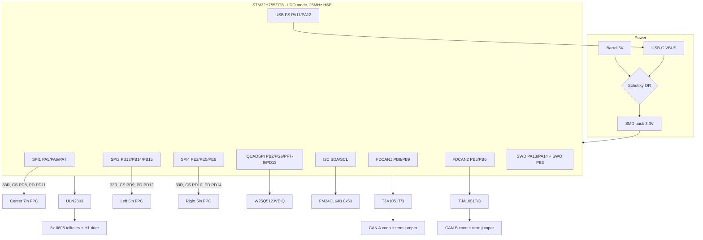

# Board3 H755 Carrier - Plan

## Goal Capsule

- **Objective:** Redesign EasyEDA Board3 (a full copy of Board2) from a Teensy 4.1 module carrier into a self-contained STM32H755 carrier that JLCPCB can fully assemble and that runs the existing firmware's generic-carrier pin contract with only enumerated glue edits.
- **Product authority:** Kevin. Board1 and Board2 are locked references — no edits to them.
- **Executor:** Kevin drives the EasyEDA Pro app (bridge APIs unreliable for autoroute/pour — known gap); the agent supplies per-unit specs, verifies via `.eprj2` reads and thumbnails, and owns the documents. Hardware orders and flashes are Kevin-initiated.
- **Open blockers:** none for planning. H755ZIT6 sourcing-at-JLC is an order-time risk, not a planning blocker.
- **Product Contract preservation:** changed R5, R8, the pin-map Key Decision, Success Criteria, and Outstanding Questions after Phase 1 research — pin-map base moved to the firmware's generic-carrier branch, CAN became dual-bus, button polarity flipped to active-low; each change user-confirmed at the scoping synthesis (2026-07-25).

---

## Product Contract

### Summary

Board3 replaces the Teensy 4.1 socket with a bare STM32H755ZIT6 (LQFP-144) in LDO power mode, and absorbs every off-board module onto the PCB: 512 Mbit QSPI NOR, FM24CL64B FRAM, an automotive TJA1051T/3 CAN transceiver, and SMD telltale LEDs. The assembled board is complete — flash it over USB and it runs.

### Problem Frame

Board2 is a bench-style carrier: the MCU is a socketed Teensy module, CAN rides on hand-placed Waveshare breakouts, the odometer FRAM hangs off a header, and the telltales are 5 mm through-hole LEDs. The firmware has already migrated to STM32 (F767 Nucleo, verified on glass), and the firmware image at ~1.81 MB of 2 MB internal flash needs external NOR for asset headroom. The existing migration plan (docs/plans/2026-07-21-001-refactor-stm32-migration-plan.md) originally chose the single-core H743 (its KTD1) and later retargeted to the H755ZIT6 in its open questions (2026-07-21), leaving schematic capture as its next phase; this plan executes that capture, and a hand-populated module board cannot be ordered as a finished assembly.

### Key Decisions

- **STM32H755ZIT6, LQFP-144** — supersedes migration-plan KTD1 (H743VIT6 LQFP-100). Rationale: dual-core M7+M4 headroom, reserved for a concrete consumer — the M4 taking CAN decode and lap-timing ingest off the render core once RaceCapture integration lands, per the migration plan's direction. Consequence accepted: no LQFP-100 dual-core exists, so the package floor rises to LQFP-144; the chip is the exact silicon on the NUCLEO-H755ZI-Q the EVE library upstream validated (DMA caveat noted there; the dash uses polled SPI).
- **LDO power mode, not SMPS** — simpler wiring (no inductor, no SMPS pin network) and the only mode that reaches VOS0/480 MHz; direct-SMPS caps the part at 400 MHz. Accepted cost: up to ~0.5 W extra package dissipation at full load — mitigated by ground-pour thermal relief, and the 60 fps dash workload sits well below full load.
- **Adopt the firmware's generic-carrier pin table as the base net list** — the sketch's generic-carrier branch (its comment: "the carrier schematic owns the final assignment") was purpose-built for this board and avoids the H755 LQFP-144 traps by construction: no PF13 (not bonded on this package), no PC2_C analog dual-pad (left MISO is PB14), USB (PA11/PA12), FDCAN (PB5/PB6/PB8/PB9), and I2C (PB10/PB11) pins held clear. Base assignments: center SPI1 SCLK PA5 / MISO PA6 / MOSI PA7; left SPI2 SCLK PB13 / MISO PB14 / MOSI PB15; right SPI4 SCLK PE2 / MISO PE5 / MOSI PE6; CS PD8/PD9/PD10; PD-reset PD11/PD12/PD13 (QUADSPI IO3 lives on PF6, so the branch's table applies verbatim — zero pin-constant edits); button PC13 active-LOW on the internal pull-up (pressed connects to GND — no external parts, the branch's default contract); lamps PD0–PD7. Schematic rules: no `_C` dual-pad pins on any SPI net; no pull-down on PB15 (a low PB15 blocks every non-USB ROM-bootloader interface per AN2606). U1 verifies every pin against the DS12923 Table 8 pin table (PF13 absence, PC2_C, PB14, and the QUADSPI set already datasheet-confirmed 2026-07-25).
- **Absorb all modules; no hand-populated parts** — CAN transceiver, NOR, FRAM, and telltale LEDs become soldered SMD parts. "JLC full assembly" then means the board arrives functional.
- **Genuine parts over clones** — the JLC catalog carries same-name CAN transceiver clones (Tudi, Tokmas, JSMSEMI); the BOM pins the genuine NXP part by LCSC code.
- **Dual programming path** — USB DFU (BOOT0 + native USB-C) is the everyday flash path; SWD remains for debug and recovery as a populated 5-pin 2.54 mm header plus an unpopulated TC2030 footprint that rehearses the Tag-Connect land pattern for the future production design.
- **Industrial-grade memories on Board3; automotive-grade deferred to production** — the MCU (−40…+85 °C), buffers, and panels set an 85 °C board envelope that AEC-Q100 memories cannot raise, and JLC holds no I2C FRAM above 85 °C and only 11 units of 125 °C 512 Mbit NOR. Board3 keeps the industrial FM24CL64B + W25Q512JVEIQ; the production board upgrades NOR and FRAM to AEC-Q100 parts (DigiKey-sourced or consigned), where the MCU temperature grade gets revisited in the same pass. The CAN transceiver is the exception — it faces the vehicle bus and is automotive-grade now.

### Requirements

**MCU block**

- R1. Board3 carries a bare STM32H755ZIT6 (LQFP-144) with full support circuitry: VCAP caps, VDDA/VREF+ filtering, decoupling, NRST with reset button, and BOOT0 strapping reachable as a jumper or button.
- R2. The power tree uses LDO mode; unused SMPS pins are strapped per the datasheet.
- R3. The board provides its own HSE crystal (the Nucleo borrowed the ST-LINK clock; a bare board has none).
- R4. A native USB-C connector serves the serial protocol and USB DFU, replacing the Teensy's USB and the Lonely Binary breakout.
- R5. All panel, button, and lamp nets route per docs/hardware/board3-h755-pin-map.md, which starts from the firmware's generic-carrier table and is finalized by layout (KTD1: hardware wins; firmware pin constants are rewritten from the as-routed map). Known firmware edits so far: the FRAM Wire pin selection (the sketch's `Wire.begin()` default collides with FDCAN1) plus whatever pin reassignments U8's routing earns. The mode/trip button is wired active-low: pressed connects it to GND, no external resistor, matching the branch's internal-pull-up contract; this supersedes Board2's copied button wiring for that net.

**Absorbed peripherals**

- R6. 512 Mbit NOR flash (W25Q512JVEIQ, WSON-8) wired to the H755 QUADSPI pins — quad-rate capable even if firmware starts in single-SPI mode.
- R7. FM24CL64B-GTR FRAM on I2C at address 0x50, matching the existing odometer backend; the off-board FRAM header goes away.
- R8. Two automotive CAN transceivers — 2× TJA1051T/3/1J (genuine NXP, LCSC C38695), one per FDCAN peripheral (FDCAN1 PB8/PB9, FDCAN2 PB5/PB6): 5 V supply, VIO tied to 3.3 V, split termination (2× 60.4 Ω + capacitor) jumper-selectable per bus, per the migration plan's KTD3. CN4/CN5 Waveshare module headers are deleted; two screw-terminal or header CAN connectors replace them.
- R9. The eight telltale LEDs become on-board 0805 SMD parts in the same colors (green ×2, white, blue, amber, red ×2, yellow); series resistor values are re-derived for SMD Vf/brightness. The ULN2803 driver and channel logic are unchanged.
- R10. The H1 off-board telltale header stays as a deliberate zero-cost rider for the future car-bezel build — outside Board3's own success criteria, independent of the on-board indicators.

**Carried-over sections (unchanged from Board2)**

- R11. The three RiBus 20-pin FPC connectors, the four tactile buttons, power switch, and barrel-jack 5 V input carry over as copied. The 3.3 V regulation does not: the K7803 THT buck module is replaced by a discrete SMD synchronous buck per KTD3, satisfying R15's no-hand-population mandate. The SN74LVC244 SCLK/MOSI fan-out and SN74LVC125 MISO combine do NOT carry over — they implement Board2's shared Teensy bus, while the mirrored firmware drives three dedicated SPI peripherals; Board3 wires three point-to-point SPI buses with per-line 33 Ω series resistors at each MCU output, per the migration plan's hardware contract (docs/solutions/architecture-patterns/dash-carrier-pcb-buffered-spi-topology-30mhz-clock-contract.md).

**Programming and debug**

- R12. Populated 5-pin 2.54 mm SWD header (SWDIO, SWCLK, NRST, 3V3, GND) — works with the Nucleo's on-board ST-LINK in external-probe mode.
- R13. Unpopulated TC2030 Tag-Connect footprint in parallel with the header — a deliberate zero-BOM-cost rider that rehearses the land pattern for the future production design; validating it is opportunistic, outside Board3's own success criteria.
- R14. USB DFU is reachable with no tools beyond a USB-C cable and the BOOT0 jumper/button.

**Assembly and sourcing**

- R15. Every part on Board3 is SMD or JLC-assemblable; the finished order requires no hand population.
- R16. The BOM pins parts by LCSC code where clones or multiple variants exist.
- R17. The BOM records the NOR and FRAM as industrial-grade with a named AEC-Q100 upgrade path for the production board (automotive part candidates listed alongside), so the grade gap is a tracked decision, not an accident.
- R18. USB-C VBUS is Schottky-OR'd with the barrel-jack 5 V rail, with CC pulldowns for UFP enumeration — a lone USB-C cable genuinely powers DFU (R14) and dual-source plugging (barrel supply + laptop) is safe in both orders.

### Success Criteria

- The assembled board reaches dash first light on all three panels (REG_ID 0x7C and rendering on center, left, and right) with firmware whose only changes are board-glue: clock/PWR config, build env, CM4 parking, and a Board3 pin table written verbatim from the as-routed pin-map doc. No logic changes — the pin table is data, not design.
- One JLC order produces a board needing no soldering before power-up.

### Scope Boundaries

- Firmware changes — out of scope (the LDO/PWR flag and H755 build env are firmware-side work this board imposes but does not contain).
- Board1 and Board2 — locked; no edits.
- M4-core provisions beyond what the chip provides (spare-peripheral stub headers declined).
- Panel QSPI flash — retired; the panels' own flash stays unused.
- Session-timer / RaceCapture features — firmware/CAN-payload work, not board work.

### Dependencies / Assumptions

- Dependency (pre-order gate): an H755 build env exists and the firmware reaches dash first light on a NUCLEO-H755ZI-Q mule (SMPS-flag build, CM4 parked) — including serial-protocol acks over native USB CDC on the Nucleo's user USB connector (same PA11/PA12 the board wires) and one verified DFU entry-and-flash cycle on the dual-core ROM bootloader — before the Board3 JLC assembly order is submitted. This de-risks the build env, dual-core boot, the PWR-flag mechanism, and the board's only serial/flash paths while the design is still free to change; schematic capture proceeds in parallel and is not gated.
- Dependency: the unused CM4 must be parked — clear the BCM4 option byte at first programming, or ship a minimal CM4 park stub — decided alongside the LDO flag; a factory-fresh H755 boots both cores and the CM4 vectors into erased flash otherwise. Verify DFU behavior on the dual-core bootloader per AN2606.
- Dependency: the Board3 build selects the sketch's generic-carrier branch (the `#else` pin table in MustangDash/MustangDash.ino) — not the Nucleo-F767 branch — with the one enumerated constant edit. No host test currently guards the `.ino` per-board pin tables (only dash_panels.h's canonical table is pinned); adding one is firmware-side follow-up work.
- Dependency (firmware framework path — contested, decided at mule-gate setup): the mule gate's build target is an open fork. The migration plan records "KTD2 breaks" for the H755 — STM32duino does not support dual-core H7, and it verified `framework = stm32cube` with the EVE library's native `EVE_target_STM32H7.h` as the path. The alternative is a custom STM32duino M7-only H755 variant (the parked-M4 chip behaves like the supported H743 at the silicon level, but no such variant is known to exist). Kevin picks at mule-gate setup; the board netlist is identical either way. See Outstanding Questions.
- Assumption: prototype quantity is small (single-digit boards), so extended-part fees and unit prices are acceptable.
- Dependency: PWR supply configuration is boot-latched — firmware for Board3 must select LDO before clock ramp, and a binary built for an SMPS-wired Nucleo-H755ZI-Q mule will not boot on Board3 (and vice versa) without a board-selects-power-scheme build flag.
- Sourcing snapshot (2026-07-24): H755ZIT6 — JLC 37 units ($27.21, extended), DigiKey 2,676 ($18.70), Mouser 2,240 ($18.70). W25Q512JVEIQ — JLC 2,163 ($10.30). FM24CL64B-GTR — JLC 30,786 ($1.34). TJA1051T/3/1J — JLC 155,894 ($0.59). SMD LEDs — basic library, all colors.

### Outstanding Questions

**Resolve before ordering (not before planning)**

- H755ZIT6 at JLC: accept the extended stock on hand at order time, use JLC Global Sourcing, or consign chips bought from DigiKey/Mouser. (U10 owns the decision point; the H743ZIT6 same-footprint fallback verified at U1 is the design-side hedge.)

**Resolve at mule-gate setup (firmware-side; board netlist unaffected)**

- Build framework for the H755: `stm32cube` + the EVE library's native `EVE_target_STM32H7.h` (the migration plan's verified "KTD2 breaks" path) vs a custom STM32duino M7-only H755 variant (none known to exist). Kevin decides when standing up the mule build; the choice sets whether "build env" glue is a flag flip or a glue port.

**Deferred to execution**

- Telltale series resistor values for the 0805 LEDs (computed at U7 from the selected LEDs' Vf).
- Exact buck regulator part and CAN connector style (selected at U1/U6 from JLC basic-library stock at that moment).

Formerly-open items now resolved in the Planning Contract: crystal choice (KTD4 — DFU is crystal-free on this family), pin-table verification and center-CS question (KTD1 — generic-carrier base, datasheet-confirmed), unused-SMPS strapping (KTD3), CAN termination form (KTD5), and the K7803 module replacement (KTD3 — discrete SMD buck).

### Sources / Research

- docs/plans/2026-07-21-001-refactor-stm32-migration-plan.md — KTD1 (superseded here), U-phases, and its own later H755ZIT6/NUCLEO-H755ZI-Q mule references.
- MustangDash/MustangDash.ino — F767 pin map (lines ~118-187), FRAM backend at 0x50 (~890-949).
- libraries/FT800-FT813/README.md:28 — H755 Nucleo validation note (DMA caveat).
- docs/hardware/nucleo-f767-center-panel-wiring.md — bench wiring the pin-map mirror preserves.
- ST community threads confirming VOS0/480 MHz requires LDO (direct-SMPS limited to 400 MHz): community.st.com t5/stm32cubemx-mcus/stm32h755-nucleo-and-pwr-direct-smps-supply, t5/stm32-mcus-products/configuring-nucleo-h755zi-q-at-480mhz.
- EasyEDA project structure: Board3 uuid 79a1660f748a29ce (Schematic3 5c94ffaeaa2e60dd, PCB3 f24837ee085c951d), copied 2026-07-24 from Board2.
- ST primary sources (verified 2026-07-25): AN2606 §52 (H74x/75x bootloader — USB DFU on HSI48+CRS, no HSE dependency; PB15-low blocks non-USB interfaces; V9.0 CM4_BOOT_ADD option-byte limitation fixed in V9.1); DS12923 Table 8 (pin bonding) and §3.5.1 (VDDSMPS must tie to VDD); ES0445 Rev 2 (rev V is the only H755 silicon; QUADSPI last-byte memory-mapped read erratum; FDCAN minor errata, all with workarounds).
- docs/solutions/integration-issues/multi-panel-shared-ground-ir-drop-floats-spi-reference.md (2026-07-24) — ground IR-drop is the multi-panel failure mode; drives the KTD6 layout laws.
- docs/solutions/architecture-patterns/dash-carrier-pcb-buffered-spi-topology-30mhz-clock-contract.md (2026-07-19) — Board2's buffered single-bus contract; its per-line passives (33 Ω, 10 kΩ CS pull-ups, 100 kΩ MISO pull-downs, test points) carry over to the three-bus topology; its buffer ICs do not.
- docs/solutions/integration-issues/f767-spi-prescaler-quantization-27mhz-hard-wedge.md and backlight-pwm-4khz-audible-whine.md — bring-up constraints carried into the Verification Contract.

---

## Planning Contract

### Key Technical Decisions

- KTD1. **Pin map: hardware-optimized; firmware follows the board.** The generic-carrier table (as verified at U1, DS12923 Rev 3) is the *starting draft* — it happens to need zero firmware edits — but layout quality outranks firmware convenience: pin constants are one-line edits, copper is per-spin. U8 has authority to reassign any GPIO-class net (CS, PD-reset, lamps, button) to whatever pin routes cleanest, and to swap which SPI peripheral serves which panel, provided every peripheral signal lands on a pin carrying its required AF per docs/hardware/board3-h755-pin-map.md. Hard constraints that never move: AF-capable pins for SPI/QUADSPI/FDCAN/I2C/USB, the dedicated pins (BOOT0/NRST/OSC/VCAP/SWD/PA9), no `_C` dual-pads on SPI nets, no pull-down on PB15. After layout freeze, the pin-map doc is updated to the as-routed table and the firmware's Board3 pin branch is written from it (user-directed 2026-07-25: optimize for hardware, not software).
- KTD2. **QUADSPI pin set (all datasheet-confirmed on LQFP-144):** CLK PB2, NCS PG6, IO0 PF8, IO1 PF9, IO2 PF7, IO3 PF6 — the PF6–PF9 cluster sits on adjacent pins 20–23 for tight layout. Firmware note carried from ES0445: memory-mapped reads of the configured region's last byte return 0x00 and can stall the AXI bus — pad `FSIZE` or avoid the last byte.
- KTD3. **Power tree:** barrel-jack 5 V in (bench posture; the car's 12 V front-end is the production board's problem) → discrete SMD synchronous buck (JLC basic part, selected at U1, ≥1.5 A budget) → 3.3 V rail; K7803 THT module deleted per R15. MCU in LDO mode: 3× 2.2 µF ceramic — one per VCAP pin (pins 68/103/140 per DS12923; count re-verified visually at U2), close, not tied together — 100 nF per VDD pin + bulk per cluster, VDDA/VREF+ via ferrite + 1 µF/100 nF. Unused-SMPS strapping per DS12923 §3.5.1: **VDDSMPS ties to VDD** (hard sequencing requirement), VSSSMPS to GND, VLXSMPS/VFBSMPS floating (community-confirmed for H745/755; verify against the final datasheet rev at U2).
- KTD4. **Crystal: 25 MHz HSE + load caps for the application clock tree only.** The ROM bootloader's USB DFU runs on HSI48+CRS with zero HSE dependency (AN2606 §52), so DFU imposes no crystal constraint. 25 MHz divides cleanly to 480 MHz (÷5 ×192 ÷2) and matches common STM32duino H7 variants.
- KTD5. **Dual CAN:** 2× TJA1051T/3/1J on FDCAN1 (PB8/PB9) and FDCAN2 (PB5/PB6); split termination 2× 60.4 Ω + capacitor per bus, jumper-enabled (pin jumper, not solder bridge — bench-flippable); carried from migration-plan KTD3.
- KTD6. **Grounding and power layout laws** (from the 2026-07-24 IR-drop learning): one continuous ground pour bonded with stitching vias; each panel's FPC ground pins tie to the pour with multiple vias directly at the connector; the 5 V backlight distribution is sized for ≥0.5 A summed return with its return path over the pour, never a thin single trace. SPI runs are short, over unbroken ground reference, roughly length-matched per bus.
- KTD7. **Thermal:** LDO mode dissipates up to ~0.5 W extra in-package at full load — the MCU sits on a generous ground pour with thermal vias; no heatsink provision needed at dash workloads.

### High-Level Technical Design

Prose is authoritative where the diagram compresses: per-line passives (33 Ω series at MCU on every SPI output, 10 kΩ CS pull-ups, 100 kΩ MISO pull-downs per bus), BOOT0 strap (10 kΩ pull-down + button to 3V3), NRST button, and the TC2030 rider are in the unit specs below.

---

## Implementation Units

Execution posture: Kevin performs all EasyEDA operations in the app (Board3 documents only — Board1/Board2 locked); the agent supplies each unit's spec, then verifies the result by re-reading the `.eprj2` (structure, thumbnails) and reviewing exports. Firmware-side items are dependencies, not units.

### Phase A — Definitive references

### U1. Definitive pin map and electrical budget

- **Goal:** One authoritative Board3 pin-map document plus the part selections the schematic needs.
- **Requirements:** R1, R2, R3, R5, R6, R8; KTD1–KTD5.
- **Dependencies:** none.
- **Files:** docs/hardware/board3-h755-pin-map.md (new — full pin table: three SPI buses, CS/PD, QUADSPI, I2C, FDCAN×2, USB, SWD/SWO, BOOT0, NRST, lamps PD0–PD7, button PC13, telltale channels; every row carrying the DS12923 Table 8 pin number).
- **Approach:** Start from the Key Decisions net list + KTD2's QUADSPI set; assign the I2C peripheral/pins for the FRAM from the free set (PB10/PB11 reserved for this); select the buck regulator and CAN connectors from JLC basic stock; pick the crystal footprint + load caps per KTD4. Verify the H743ZIT6/H753ZIT6 footprint-fallback claim (same LQFP-144 land pattern, strap differences noted) as the stock hedge.
- **Test scenarios:** every pin row cross-checked against DS12923 Table 8 (exists on LQFP-144, carries the needed AF); zero collisions across the full table; no `_C` pads on SPI nets; no pull-down reachable from PB15; SWD pins clear of all assignments; QUADSPI_BK1_IO3 alternates PF6 and PA1 checked for bonding — if either is bonded, IO3 moves there and the PD13→PD14 edit is deleted from KTD1/R5; the FRAM Wire pin selection recorded in the pin-map doc's firmware-edit list.
- **Verification:** the pin-map doc reviewed against the firmware's generic-carrier branch constants — the only delta is right PD-reset PD13→PD14.

### Phase B — Schematic capture (Schematic3)

### U2. MCU core block

- **Goal:** The H755ZIT6 placed with its full support circuitry, replacing the Teensy socket symbol.
- **Requirements:** R1, R2, R3; KTD3, KTD4, KTD7.
- **Dependencies:** U1.
- **Files:** EasyEDA Schematic3 (5c94ffaeaa2e60dd); BOM rows for MCU (C730212), crystal, VCAP/decoupling set, buck.
- **Approach:** JLC part C730212 symbol/footprint; power tree per KTD3 (VCAPs, VDD decoupling, VDDA/VREF+ filter, VDDSMPS→VDD tie, VSSSMPS→GND, VLX/VFB floating); 25 MHz crystal + load caps; NRST with button + 100 nF; BOOT0 10 kΩ pull-down + button to 3V3. Delete the Teensy module and Lonely Binary USB-C breakout symbols.
- **Test scenarios:** ERC clean on the block; netlist spot-checks — VDDSMPS net merged with VDD, both VCAP pins on separate caps, BOOT0 defaults low.
- **Verification:** agent reviews the updated schematic thumbnail + netlist extract; every new part carries an LCSC code and value silkscreen field (standing rule).

### U3. Three point-to-point SPI buses

- **Goal:** The panel interconnect converted from Board2's buffered single bus to three dedicated buses.
- **Requirements:** R5, R11; KTD1, KTD6.
- **Dependencies:** U1, U2.
- **Files:** Schematic3 — FPC1/FPC2/FPC3 nets, U12/U13 deletion.
- **Approach:** Delete SN74LVC244 + SN74LVC125 and the `_PRE`/`MISO_NODE` net structure; wire each panel's SCLK/MOSI/MISO/CS/PD point-to-point per U1's table; per line 33 Ω series at the MCU pin; 10 kΩ CS pull-up and 100 kΩ MISO pull-down per bus; keep one test point per bus signal group (SCLK/MISO/CS + GND spring point).
- **Test scenarios:** netlist shows no remaining `_PRE`/`MISO_NODE` nets; each FPC's 20 pins fully assigned (RiBus mapping unchanged from Board2); CS pull-ups present on all three.
- **Verification:** thumbnail + netlist review; ERC clean.

### U4. USB-C, power entry, and programming provisions

- **Goal:** Native USB-C (serial + DFU), safe dual power sourcing, and debug access.
- **Requirements:** R4, R12, R13, R14, R18.
- **Dependencies:** U1, U2.
- **Files:** Schematic3 — USB-C connector, power-entry nets, SWD header, TC2030 footprint.
- **Approach:** USB-C receptacle with CC1/CC2 5.1 kΩ pull-downs (UFP), D+/D− to PA11/PA12 with ESD protection array; VBUS Schottky-OR'd with the barrel rail per R18; PA9 (the dedicated OTG_FS_VBUS sense input, pin 98) wired to VBUS via a removable link — the Nucleo's SB21 arrangement — so both sense-enabled and sense-disabled USB configs are reachable without rework; 5-pin 2.54 mm SWD header (SWDIO PA13, SWCLK PA14, NRST, 3V3, GND) populated per R12; TC2030 footprint in parallel, unpopulated (rider); SWO PB3 to a test point (the header stays 5-pin).
- **Test scenarios:** power-flow check — lone USB-C powers the 3.3 V rail through the OR; barrel + USB simultaneously back-feed nothing; DFU entry path = BOOT0 button + reset with only a cable; PA9 VBUS-sense decision recorded with its source.
- **Verification:** ERC clean; netlist spot-check of the OR orientation.

### U5. QUADSPI NOR and I2C FRAM

- **Goal:** Both memories on-board per the absorbed-peripherals contract.
- **Requirements:** R6, R7, R17; KTD2.
- **Dependencies:** U1, U2.
- **Files:** Schematic3 — NOR (C7389628), FRAM (C9829) blocks.
- **Approach:** W25Q512JVEIQ on the KTD2 pin set with 100 nF decoupling and a series-resistor provision on CLK; FM24CL64B-GTR on the U1-assigned I2C pins at address 0x50 (A0–A2 to GND), 4.7 kΩ pull-ups; delete the off-board FRAM header.
- **Test scenarios:** QUADSPI nets match KTD2 exactly (no PE2/PD11/PD12 usage); FRAM address straps ground all three address pins; pull-ups present once (not duplicated from Board2 remnants).
- **Verification:** ERC clean; netlist review against the pin-map doc.

### U6. Dual CAN blocks

- **Goal:** Two vehicle-grade CAN interfaces replacing the Waveshare headers.
- **Requirements:** R8; KTD5.
- **Dependencies:** U1, U2.
- **Files:** Schematic3 — 2× TJA1051T/3/1J (C38695), termination networks, connectors; CN4/CN5 deletion.
- **Approach:** Per bus: TXD/RXD to the FDCAN pins per U1, VCC 5 V, VIO 3.3 V, S pin to GND (normal mode), split termination 60.4 Ω + 60.4 Ω with 4.7 nF to GND behind a pin jumper; connector per U1's selection.
- **Test scenarios:** the two transceivers land on distinct FDCAN peripherals; termination is jumpered, not hardwired; genuine-NXP LCSC code C38695 on both BOM rows.
- **Verification:** ERC clean; BOM shows quantity 2.

### U7. Telltales to SMD

- **Goal:** Eight on-board 0805 telltale LEDs with correct series resistors; H1 rider intact.
- **Requirements:** R9, R10.
- **Dependencies:** U1.
- **Files:** Schematic3 — D1–D8 replacements, R16–R23-class series resistors.
- **Approach:** Replace the 5 mm LEDs with JLC basic 0805 parts in the same eight colors; recompute each series resistor from the selected part's Vf at the ULN2803's 5 V feed for matched apparent brightness; keep the ULN2803 and channel wiring untouched; H1 stays.
- **Test scenarios:** eight channels map to the same telltale order as Board2; resistor values documented per color in the BOM comment field.
- **Verification:** ERC clean; BOM rows all basic-library.

### Phase C — Layout, outputs, order

### U8. PCB3 layout pass

- **Goal:** Placement and routing honoring the layout laws.
- **Requirements:** R15; KTD6, KTD7.
- **Dependencies:** U2–U7 complete.
- **Files:** EasyEDA PCB3 (f24837ee085c951d).
- **Approach:** MCU central; VCAP/decoupling immediately at pins; crystal adjacent with keepout; QUADSPI as a short matched cluster; three SPI runs short over unbroken pour, panel FPCs at board edge as on Board2; USB differential pair coupled; ground pour both sides with stitching, multi-via FPC ground lands (KTD6); 5 V backlight distribution sized ≥0.5 A; autoroute/pour via the app UI (bridge unreliable for both). **Pin-swap authority (KTD1):** where routing benefits, reassign GPIO-class nets (CS/PD/lamps/button) to better pins and swap SPI-peripheral↔panel pairings within AF constraints; back-annotate every swap to the schematic and the pin-map doc before U9's freeze.
- **Test scenarios:** none — layout quality is verified by the U9 gates, not tests.
- **Verification:** visual review of the layout thumbnail against KTD6's laws; no SPI trace crosses a pour split.

### U9. DRC, silkscreen, and design freeze

- **Goal:** A clean, convention-complete board ready for export.
- **Requirements:** R15, R16, R17.
- **Dependencies:** U8.
- **Files:** PCB3.
- **Approach:** Run DRC to zero errors; apply the standing silkscreen rule (every R/C/IC carries its value/model on its own footprint body); confirm every BOM row carries an LCSC code; record industrial-grade memory rows with their AEC-Q100 production-upgrade note per R17.
- **Test scenarios:** DRC report zero errors; silkscreen audit of the thumbnail; BOM audit — no missing LCSC codes, no hand-placed parts.
- **Verification:** agent reviews DRC output, BOM export, and thumbnails; design frozen.

### U10. Order package and stock decision

- **Goal:** JLC-orderable outputs with the sourcing decision made.
- **Requirements:** R15, R16; the pre-order gates.
- **Dependencies:** U9; the Dependencies section's mule gate (firmware first light on NUCLEO-H755ZI-Q) must be satisfied before submission.
- **Files:** Gerber/BOM/CPL exports (out-of-repo deliverables); docs/hardware/board3-h755-pin-map.md updated with any late changes.
- **Approach:** Export fabrication files; re-run live stock checks on H755ZIT6 and the memories; decide the H755 sourcing path (JLC stock / Global Sourcing / consignment) with real-time numbers; Kevin submits the order — orders are Kevin-initiated, never automatic.
- **Test scenarios:** BOM cross-check against live JLC stock (every row orderable or consigned); assembly quote covers every placement.
- **Verification:** order confirmation; the plan's Sources sourcing-snapshot updated with order-day numbers.

---

## Verification Contract

| Gate | Applies to | Pass signal |
|---|---|---|
| Pin-map cross-check | U1 | Every row verified against DS12923 Table 8; delta vs firmware generic-carrier branch is exactly one constant |
| ERC | U2–U7 | Zero errors on Schematic3 after each unit |
| Netlist spot-checks | U2, U4, U5 | VDDSMPS–VDD tie present; VCAPs separate; Schottky-OR orientation; QUADSPI set matches KTD2 |
| DRC | U9 | Zero errors on PCB3 |
| BOM audit | U9, U10 | 100% LCSC-coded; genuine-NXP C38695 ×2; no hand-placed parts; memory rows carry the R17 grade note |
| Silkscreen audit | U9 | Standing rule satisfied on every R/C/IC |
| Pre-order mule gate | U10 | Dash first light on NUCLEO-H755ZI-Q (M7-only build, CM4 parked) + serial acks over native USB CDC on the Nucleo user USB + one DFU entry-and-flash cycle, before order submission |
| Bring-up (post-delivery, out of plan scope) | — | Three-panel first light per Success Criteria; clock walk starts 8 MHz, records attained (not requested) clocks; 30 MHz BT817 ceiling and ≤11 MHz init unchanged; backlight PWM override at 10 kHz |

Board1 and Board2 remain untouched throughout — any edit touching their UUIDs fails review.

---

## Definition of Done

- All ten units verified per the Verification Contract; Schematic3/PCB3 contain no Teensy-era remnants (module, USB breakout, '244/'125, `_PRE`/`MISO_NODE` nets, 5 mm LEDs, CN4/CN5, off-board FRAM header).
- docs/hardware/board3-h755-pin-map.md exists and matches the frozen design; the firmware constant edit (right PD-reset) is enumerated there.
- The JLC order package exists with the sourcing decision recorded; the order itself is submitted by Kevin after the mule gate passes.
- Cleanup: no experimental copies of Board3 documents left in the EasyEDA project; the plan's sourcing snapshot reflects order-day reality.
