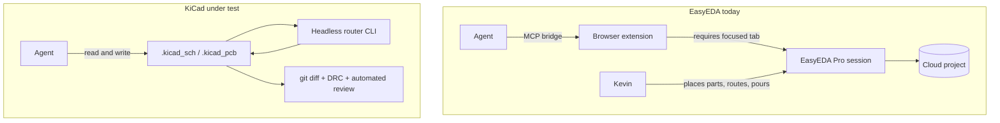
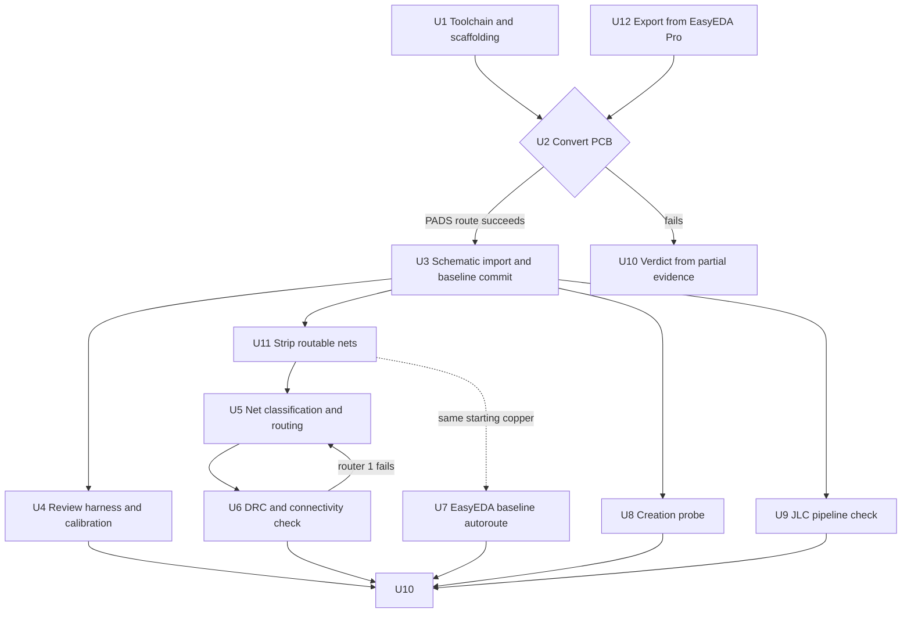

# KiCad Evaluation Against EasyEDA - Plan

## Goal Capsule

- **Objective:** Decide whether Board3-class PCB work moves from EasyEDA Pro to KiCad, by importing Board3 as a parallel copy and measuring whether an agent can drive routing, creation, and design review without a human at a GUI.
- **Product authority:** Kevin owns the verdict. This document owns the scope and the bars. Where the two disagree, Kevin wins and the document is corrected.
- **Open blockers:** None blocking a start. One unit-scoped blocker: the 107→94 net drop across save must be explained before U5 or U7 treats this board as the routing baseline.
- **Execution profile:** Investigative. Units produce measurements and a verdict, not shippable firmware. Tooling written along the way is disposable if the verdict goes against KiCad.
- **Stop conditions:** Stop and report if conversion fails on both Windows and WSL2 (U2 is a kill gate); if any step would modify the EasyEDA Board3 project; or if a router writes a board that fails connectivity against the netlist.
- **Tail ownership:** Kevin runs anything that touches EasyEDA or requires the KiCad GUI. Everything else is agent-run.

---

## Product Contract

### Summary

Import Board3 into KiCad as a non-destructive parallel copy, route it with headless file-based tooling driven by an agent, and run automated design review over the result. The outcome decides whether the next board spin moves; EasyEDA Board3 stays authoritative throughout.

### Problem Frame

The EasyEDA MCP bridge can edit what already exists but cannot create. Every failure that has cost real time is a write that brings a new primitive into existence: `schematic_place_component` times out at 15 s, `pcb_place_component` cannot complete `PCB_PrimitiveComponent.create()`, `modify_primitive` silently ignores `deviceUuid` and writes only BOM metadata, `pcb_autoroute` has no API implementation on Pro v3, and copper pour creation is unreachable through any argument shape. Placement and device swaps are permanently manual.

Two further costs compound it. Several wrapped tools report success without acting — `delete_primitive` returns `success: true` on components that survive, and `SCH_PrimitiveComponent.modify` with a partial state corrupts `otherProperty` while looking like it worked. And every schematic-side call depends on which browser tab has focus, with no programmatic way to detect or change it; a blank canvas capture and an empty region are indistinguishable.

Board3 carries roughly 274 unrouted airwires across ~100 nets. The inability to route programmatically is what forced the question.

### Key Decisions

**Judge headless drivability, not routing quality.** KiCad's own IPC API is PCB-editor only in versions 9 and 10, cannot export or plot, and requires a running GUI instance — on an API-to-API comparison it is weaker than EasyEDA's bridge. The evaluation therefore tests the file layer: designs stored as S-expression text, edited by scripts, verified by git. The relevant difference is architectural, not a question of who wrote better tool wrappers.

The human sits on the critical path by construction in the first path and nowhere in the second. That is the claim under test.

**Parallel copy; EasyEDA stays authoritative.** Conversion is one-way and non-destructive. Round-trip conversion accumulates error, so nothing returns to EasyEDA.

**Route first, parts later.** The JLC/LCSC part-preparation cost is a chore to absorb, not a gate that can fail the evaluation. Measuring it comes after the routing and creation bars resolve.

**Automated design review is in scope.** Read-only analysis of the design files expands the test from "can KiCad be driven" to "can the design loop be driven," and produces a PR-time surface this repo can use.

**A converter failure is not a KiCad verdict.** The two weakest links in the chain are the EasyEDA-to-KiCad conversion path, not KiCad itself. Results are attributed accordingly.

**The routing bar is a head-to-head, not an absolute number.** EasyEDA's in-app autorouter sets the completion baseline on the same board, and KiCad must match or beat it. An absolute coverage target would be arbitrary; the incumbent's own result is not. The baseline runs on a duplicate so the original project stays untouched.

### Requirements

**Import and baseline**

- R1. Board3's PCB converts to KiCad with footprints, tracks, vias, zones, nets, board outline, and silkscreen intact.
- R2. Board3's schematic reaches KiCad; a one-time manual GUI import is acceptable.
- R3. The converted design is committed to git before any edit, establishing a diffable baseline.
- R4. The EasyEDA Board3 project is not modified for the duration of the evaluation.

**Agent-driven routing**

- R5. An agent routes nets by invoking a router on the board file and reading the result back, with no GUI interaction at any step.
- R6. Routed output passes KiCad DRC.
- R7. Post-routing connectivity matches the netlist, with no dropped or shorted nets.
- R8. The routing bar is reachable through more than one router; no single tool's failure ends the evaluation.
- R9. Signal-integrity-sensitive nets are excluded from autorouting and reserved for deliberate routing.

**Agent-driven creation**

- R10. An agent adds a component to the schematic and places its footprint on the board by writing files directly.
- R11. Every write is confirmed by reading the file back or by git diff, never by canvas screenshot.

**Automated design review**

- R12. Automated review runs against the converted design and produces findings without KiCad installed.
- R13. The reviewer is calibrated against Board3's known USB VBUS inrush violation before its findings on unknown issues are trusted.
- R14. Review runs as a repeatable command, with PR-time automation as the target shape.

**Manufacturing pipeline**

- R15. LCSC part numbers survive to a JLCPCB-format BOM and CPL.
- R16. Per-part preparation cost is measured and recorded, whether or not it proves acceptable.

**Baseline comparison**

- R17. EasyEDA's in-app autorouter establishes a completion baseline on a duplicate of Board3, leaving the original project unmodified.
- R18. The routing bar is met when KiCad's agent-driven completion matches or exceeds that baseline over the same net set.

**Verdict**

- R19. The evaluation ends in a written verdict citing evidence for each bar.
- R20. Every bar records a result, including "not reached."

### Key Flows

- F1. Import and baseline
  - **Trigger:** KiCad 10 installed; Board3 exported from EasyEDA Pro.
  - **Steps:** Convert the PCB headlessly; import the schematic through the GUI; commit both to git untouched.
  - **Outcome:** A KiCad copy of Board3 with a clean baseline commit.
  - **Covered by:** R1, R2, R3, R4

- F2. Agent routing loop
  - **Trigger:** Baseline commit exists.
  - **Steps:** Agent builds the net list excluding SI-sensitive nets; invokes a headless router on the board file; runs DRC and a connectivity check; iterates or falls back to a second router.
  - **Outcome:** A routed board with a DRC result and a record of which router produced it.
  - **Covered by:** R5, R6, R7, R8, R9

- F3. EasyEDA baseline
  - **Trigger:** Board3 duplicated inside EasyEDA Pro.
  - **Steps:** Run the in-app autorouter on the duplicate over the same net set the KiCad side was offered; record completion count and DRC result.
  - **Outcome:** A completion figure the KiCad result is judged against.
  - **Covered by:** R17, R18

- F4. Review calibration
  - **Trigger:** Converted design exists; routing may or may not have run.
  - **Steps:** Run automated review against the unfixed design; check whether the known inrush violation appears in its findings; only then read its other findings.
  - **Outcome:** A review capability marked calibrated or uncalibrated.
  - **Covered by:** R12, R13, R14

### Acceptance Examples

- AE1. **Covers R8.** Given the first router produces a board that fails DRC, when the agent falls back to a second router through a different file interchange, then the routing bar is still reachable and the result records which router produced the output.
- AE2. **Covers R13.** Given automated review runs on the converted design before any fix lands, when it does not independently report the USB VBUS inrush violation, then its other findings are recorded as uncalibrated and the review bar is marked not met.
- AE3. **Covers R1, R2.** Given the headless converter fails on Windows, when the conversion is retried under WSL2 and still fails, then the outcome is recorded as a converter limitation and the evaluation continues from a manually imported board rather than terminating.
- AE4. **Covers R9.** Given the router is offered the full net list, when that list is constructed, then USB D+/D− and QSPI nets are excluded by name before the router runs.
- AE5. **Covers R11.** Given an agent reports a successful schematic write, when the claim is checked, then it is checked by git diff or file read — a canvas capture is not accepted as evidence.

### Scope Boundaries

- The USB VBUS inrush fix stays un-landed in both tools until the verdict. Neither board diverges during the evaluation.
- The 4-layer stackup is already applied in the design; what remains un-landed is the write-up of why 6-layer was rejected. That document is not this plan's work.
- Board1 and Board2 stay locked in EasyEDA. Nothing migrates but the Board3 copy.
- The EasyEDA baseline run is a measurement, not design work. Its routed output is discarded; no copper from it lands on a real board.
- No round-trip back to EasyEDA at any point.
- Not repairing or extending the EasyEDA bridge.
- Not authoring a new KiCad MCP server. The evaluation measures what already exists.
- Paid and cloud routers are fallbacks recorded for later, not part of the first pass.

### Dependencies and Assumptions

- KiCad 10.0.5 is installed at `C:\Program Files\KiCad\10.0\`, with a bundled Python 3.11.5. `kicad-cli` is not on PATH, so scripts invoke it by absolute path or PATH is amended once.
- `epro2kicad` is unused. It requires a `.epro` export EasyEDA Pro v3 does not produce; the route is PADS instead, per KTD9. WSL2 Ubuntu remains available as a fallback host but was not needed.
- Board3 as converted: 140 footprints, 3147 track segments, 122 vias, 6 zones, 4 copper layers, 250.25 × 50.25 mm outline, 93 of 94 nets carrying copper. These are measured, not estimated, and supersede the earlier net figures.
- The 4-layer stackup is already applied in the design — confirmed independently by the PADS export's `MAXIMUMLAYER 4` and ODB++'s four copper layers.
- KiCad's schematic importer accepts Altium, CADSTAR, EAGLE, EasyEDA, LTspice, and OrCAD — not PADS-LOGIC, which is the format `Schematic3.txt` uses. R2 has no confirmed path.
- The IPC API is PCB-only in KiCad 9 and 10, with export and headless operation arriving in KiCad 11. The evaluation does not depend on it.
- Automated review requires Python 3.10+; the workstation has Python 3.13.
- Freerouting requires a JRE or its Docker image; WSL2 makes the container the lower-friction path.
- Board3's pin count exceeds the 650-pin free tier of at least one candidate router.

### Outstanding Questions

**Resolve before U5 or U7 runs**

- Net count drops 107 on import to 94 after save. Most likely KiCad pruning empty nets, but that is a hypothesis. Silent net loss is what R7 exists to catch, so it must be confirmed before this board is trusted as the routing baseline.

**Deferred to planning**

- R2's schematic path. No KiCad importer reads PADS-LOGIC, and EasyEDA's Altium schematic export is Protel ASCII, which the Altium schematic importer will reject the same way its PCB counterpart did. The EasyEDA export menu was truncated below `T/DISA 4001` — check the remainder with a schematic tab active before concluding no path exists.
- How the EasyEDA duplicate is produced, and whether its autorouter run needs the same layer stackup the KiCad copy uses for the comparison to be fair.

- Which router runs first — the `.kicad_pcb`-native tooling or Freerouting through DSN/SES.
- Whether automated review runs first as a CLI, as a Claude Code plugin, or as a GitHub Action.
- Whether the creation bar (R10) is tested with a real LCSC part or a generic one.

### Sources and Research

| Tool | Role in the evaluation | Agent-drivable | Cost |
|---|---|---|---|
| [Freerouting](https://github.com/freerouting/freerouting) | Router candidate; DSN/SES, [headless CLI](https://github.com/freerouting/freerouting/blob/master/docs/command_line_arguments.md), REST API, Python SDK, Docker | Yes | Free |
| [KiCadRoutingTools](https://github.com/drandyhaas/KiCadRoutingTools) | Router candidate; `.kicad_pcb` in/out, planes and via placement, ships a Claude skill | Yes | Free |
| [kicad-happy](https://github.com/aklofas/kicad-happy) | Automated design review; parses S-expressions without KiCad installed | Yes | Free |
| [epro2kicad](https://github.com/enkhbold470/epro2kicad) | Rejected — needs a `.epro` export EasyEDA Pro v3 does not produce | n/a | Free |
| [DeepPCB](https://deeppcb.ai/deeppcb-api-your-pcb-design-ai-agent/) | Fallback router; place and route via API, 8 layers / 1200 airwires | Yes | ~30 credits/hr |
| [Quilter](https://www.quilter.ai/blog/the-true-cost-of-pcb-tools-in-2026-altium-vs-kicad-vs-quilter) | Fallback; physics-driven place and route, cloud | Unconfirmed | Pay on download |
| [Electra](https://konekt.com/products/) | Fallback; DSN in, batch mode and TCL-scriptable strategy files | Partly | Commercial |
| [KiCad AI Assistant](https://github.com/paul356/KiCad-AI-Assistant) | Creation candidate; schematic editing tools, standalone MCP server | Yes | Free |

Independent testing of DeepPCB by EEVblog was unflattering; Quilter's published comparisons against KiCad are authored by Quilter. Treat both as unverified until measured here.

Existing EasyEDA constraints this evaluation is measured against are recorded in [docs/solutions/developer-experience/easyeda-bridge-schematic-authoring-workflow.md](docs/solutions/developer-experience/easyeda-bridge-schematic-authoring-workflow.md).

---

## Planning Contract

Product Contract unchanged. Requirements R1–R20, flows F1–F4, and acceptance examples AE1–AE5 carry over from the brainstorm verbatim. Execution corrected two factual premises the Product Contract rested on — the routing volume is ~274 airwires rather than nets, and the 4-layer stackup is already applied — but neither changes a requirement.

### Key Technical Decisions

KTD1. **Headless invocation is the rule; the GUI is a recorded exception.** Every step runs from a script or CLI except the one-time EasyEDA Pro schematic import (KiCad's importer has no headless path) and the EasyEDA baseline autoroute. Both exceptions are units of their own so the GUI dependency stays visible rather than diffusing through the plan.

KTD2. **Conversion is attempted on Windows first, WSL2 second, and the fallback is a result — not a silent retry.** `epro2kicad` reports Windows as untested. Which host succeeds is a finding the verdict depends on, so U2 records the Windows attempt's outcome even when it fails and WSL2 carries the run.

KTD3. **Net classification lives in a checked-in data file, not inline logic.** R9's exclusion of USB D+/D− and QSPI from autorouting is a design claim someone will want to audit. A `tools/kicad_netclass.json` listing excluded nets by name is reviewable in a diff; a regex buried in a script is not.

KTD4. **Board files are committed under `kicad/`.** R11 makes git diff the verification mechanism, which only works if the design is in the repo. Cost is a few MB of board files in a firmware repo; the alternative — a sibling repo — forfeits the verification story the evaluation is testing.

KTD5. **Two routers, tried in order, with the winner recorded.** `KiCadRoutingTools` operates on `.kicad_pcb` directly and is the first attempt; Freerouting via DSN/SES is the fallback. R8 requires the bar be reachable through more than one, so a first-router failure advances the plan rather than ending it.

KTD6. **Review calibration gates trust, not execution.** Automated review runs regardless, but its findings on unknown issues are not acted on until it independently reproduces the known USB VBUS inrush violation. An uncalibrated reviewer's output is recorded, not believed.

KTD7. **New tooling is Python in `tools/`,** matching the existing `make_dash_fonts.py` / `make_splash_flash.py` convention. The C host-test suite in `tests/` pins firmware invariants and is not extended by this work.

KTD8. **Both routers start from the same stripped board, and the strip is partial.** Board3 is already partly routed, some of it by hand. Leaving that copper in place would measure whether a router can finish someone else's layout — and `KiCadRoutingTools` has no push-and-shove, so every existing trace is a hard constraint that biases the result pessimistically. Stripping everything is equally wrong: it would hand the R9-excluded nets to an autorouter that must not touch them. The strip therefore removes exactly the nets offered to the router, driven by the same `kicad_netclass.json`, and U7's EasyEDA baseline starts from that identical state. Different starting copper voids the comparison entirely.

KTD9. **The conversion route is PADS ASCII, and importers must be validated before they are called.** EasyEDA Pro v3 offers no `.epro` export, so `epro2kicad` and KiCad's `EASYEDAPRO` importer are both unusable. EasyEDA exports PADS PowerPCB ASCII; KiCad reads it natively through `PCB_IO_MGR` plugin 17. Two rejected routes explain the constraints this places on the tooling: `EASYEDA` (9) on a `.eprj2` and `ALTIUM_DESIGNER` (6) on EasyEDA's Altium export — which is Protel ASCII where KiCad expects binary OLE/CFB — both terminate the process with a stack buffer overrun rather than raising, and the crash takes stdout's buffer with it, so the symptom is a silent hang. `EASYEDAPRO` (10) fails worse: it accepts a `.eprj2` without complaint and returns an empty board. Any caller of `PCB_IO_MGR.Load` therefore pins one plugin id, never iterates to find one that works, checks the container's magic bytes first, and treats an empty result as a failed conversion.

### High-Level Technical Design

The plan is a gated pipeline, not a linear sequence. U2 is a kill gate; the routing units carry a router fallback; review runs on a branch that does not depend on routing at all.

U11 is the fairness pivot: it defines the one starting state both routers are measured from. U7 needs no KiCad tooling, but it cannot run before U11 fixes what "unrouted" means for the comparison.

### Assumptions

- The EasyEDA Pro export produces an `.epro` file `epro2kicad` recognizes. If the export shape has changed, U2 absorbs the normalization work.
- Board3's schematic import through the KiCad GUI is a single manual pass, not an iterative one.
- Routing quality is judged only by DRC and connectivity. Impedance, crosstalk, and thermal adequacy are out of scope for the routing bar and belong to U4's review.
- U5's Freerouting fallback assumes a container runtime or a JRE is available under WSL2. Neither is confirmed installed. If both are absent, the fallback costs an install step U5 must absorb, or the bar rests on the first router alone — which would weaken R8.

---

## Implementation Units

| U-ID | Title | Key files | Depends on |
|---|---|---|---|
| U1 | Toolchain and repo scaffolding | `tools/kicad_env.py`, `.gitignore` | — |
| U12 | Export Board3 from EasyEDA Pro | `kicad/_import/PADS_*.zip` | — |
| U2 | Convert Board3 PCB (kill gate) | `tools/kicad_convert.py`, `kicad/board3/` | U1, U12 |
| U3 | Schematic import and baseline commit | `kicad/board3/` | U2 |
| U4 | Review harness and calibration | `tools/kicad_review.py` | U3 |
| U11 | Strip routable nets to a common start | `tools/kicad_netclass.json`, `tools/kicad_strip.py` | U3 |
| U5 | Net classification and routing | `tools/kicad_route.py` | U11 |
| U6 | DRC and connectivity verification | `tools/kicad_verify.py` | U5 |
| U7 | EasyEDA baseline autoroute | none (manual) | U11 |
| U8 | Agent-driven creation probe | `kicad/board3/` | U3 |
| U9 | JLC pipeline check | `tools/kicad_fab.py` | U3 |
| U10 | Verdict | `docs/solutions/developer-experience/kicad-vs-easyeda-evaluation.md` | U4, U6, U7, U8, U9 |

### U1. Toolchain and repo scaffolding

**Goal:** Make KiCad 10.0.5 invocable from scripts and give the converted design a home in the repo.

**Requirements:** Supports R3, R11.

**Dependencies:** None.

**Files:** `tools/kicad_env.py`, `.gitignore`, `kicad/` (new directory)

**Approach:** Resolve `kicad-cli` and the bundled Python by absolute path rather than assuming PATH — KiCad 10.0.5 installs to `C:\Program Files\KiCad\10.0\bin\` and does not amend PATH. `kicad_env.py` exposes those paths and a `run_kicad_cli()` helper so no other script hardcodes them, and detects whether it is running under Windows or WSL2 so U2 can target either. Add `kicad/**/*-backups/`, `*.kicad_prl`, and `fp-info-cache` to `.gitignore` so per-user churn stays out of diffs.

**Patterns to follow:** `tools/make_splash_flash.py` for script structure and argument handling.

**Test scenarios:**
- `kicad_env.py` resolves `kicad-cli` and reports version `10.0.5` on Windows.
- Under WSL2, resolution falls back to the Linux KiCad install or reports a clear absence rather than returning a Windows path that will not execute.
- Missing KiCad produces an actionable error naming the expected install location, not a traceback.

**Verification:** `kicad_env.py` run standalone prints the resolved CLI path, KiCad version, and detected host.

### U12. Export Board3 from EasyEDA Pro

**Goal:** Produce the interchange file U2 converts, and keep it in the repo so the conversion is reproducible.

**Requirements:** Supports R1, R4.

**Dependencies:** None.

**Files:** `kicad/_import/PADS_*.zip`, `.gitignore`

**Approach:** Kevin exports from EasyEDA Pro with the Board3 PCB tab active — File → Export → PADS. The export is per-document, so it carries Board3 alone and no board-selection step is needed downstream. It contains `PCB3.asc` (PADS PowerPCB ASCII) and `Schematic3.txt` (PADS-LOGIC). The archive is committed alongside the converted board: it is the provenance of everything downstream. Extracted trees and rejected-format exports stay ignored.

Altium and ODB++ exports were evaluated and rejected — see KTD9 for Altium, and ODB++ carries fabrication geometry without design intent.

**Execution note:** Manual, Kevin-run. Fire nothing against EasyEDA unprompted.

**Test scenarios:**
- The archive contains a `.asc` opening with the `!PADS-POWERPCB` signature.
- Covers R4. The EasyEDA project's own file is unmodified by the export, checked against its recorded baseline hash.
- The export covers Board3 only, not Board1 or Board2.

**Verification:** A PADS archive is committed and its `.asc` passes the signature check.

### U2. Convert Board3 PCB — kill gate

**Goal:** Produce a KiCad PCB from the EasyEDA Pro export, and record which host succeeded.

**Requirements:** R1. Advances R4.

**Dependencies:** U1, U12.

**Files:** `tools/kicad_convert.py`, `kicad/board3/`

**Approach:** Read the PADS ASCII export produced by U12 and load it through `PCB_IO_MGR` plugin 17, then save as `.kicad_pcb`. Per KTD9 the plugin id is pinned, never discovered, and the container is validated before `Load()` — a PADS ASCII board opens with the `!PADS-POWERPCB` signature, and anything else is refused without calling into KiCad. Run under KiCad's bundled Python, which is where `pcbnew` lives. The EasyEDA project is read-only input; the script never writes back to it.

Two behaviours the importer forces. An empty board — no footprints and no segments — is a conversion failure, not a success. And `SaveBoard` can crash the interpreter during teardown *after* the file is written, so success is judged by re-reading the saved board rather than by the process exit code.

**Execution note:** Attempt one conversion by hand before writing the wrapper, and run any KiCad probe unbuffered. A crashing importer loses buffered stdout, which reads as a hang and hides how far the run got.

**Patterns to follow:** `tools/kicad_env.py` for interpreter and CLI resolution — never hardcode paths. `wsl -- bash -lc "..."` invocation as used for the host test suite, if a WSL fallback is ever needed.

**Test scenarios:**
- Covers R1. The converted board carries footprints, tracks, vias, zones, board outline, and silkscreen, verified by counting each primitive class.
- A board that loads with zero footprints and zero segments is reported as a failed conversion and exits non-zero.
- A file failing the `!PADS-POWERPCB` signature check is refused before `Load()` is called, so no crash is possible.
- The saved `.kicad_pcb` re-reads through KiCad's own parser with matching primitive counts, proving the write is sound even when the process crashed at teardown.
- Covers AE3. A conversion failure is recorded with the route and the reason, and does not leave a partial `kicad/board3/`.
- Re-running conversion over an existing `kicad/board3/` refuses rather than silently overwriting a baseline.

**Verification:** `kicad/board3/board3.kicad_pcb` re-reads with primitive counts matching the import. If conversion fails, the plan proceeds directly to U10.

### U3. Schematic import and baseline commit

**Goal:** Get Board3's schematic into KiCad and freeze the untouched state in git.

**Requirements:** R2, R3, R4.

**Dependencies:** U2.

**Files:** `kicad/board3/`

**Approach:** The baseline commit is the unit's load-bearing half and does not depend on the schematic. Commit the converted board before any edit; this is the diff baseline every later unit measures against, so it must contain no agent-authored changes.

The schematic half is contingent. KiCad reads Altium, CADSTAR, EAGLE, EasyEDA, LTspice, and OrCAD schematics — not the PADS-LOGIC that EasyEDA produced. Resolve the open question on R2's path before attempting an import; if no path exists, record R2 as not reached and continue. The routing and review units need only the board, so a missing schematic does not gate them.

**Execution note:** Manual step where a GUI import turns out to be possible. Stage and commit the board baseline regardless — it must not wait on the schematic question.

**Test scenarios:**
- Covers R3. The baseline commit contains only converted output — `git diff` between the commit and the conversion tool's output is empty.
- Covers R4. The EasyEDA project is unchanged across U2 and U3, checked against its recorded baseline hash.
- Covers R2. Where an import path is found, the imported schematic's component count matches the EasyEDA source. Where none is found, R2 is recorded as not reached with the formats tried.

**Verification:** A commit exists whose tree is the unmodified board conversion, and its hash is recorded for later diffs. R2 carries either an imported schematic or an explicit not-reached result.

### U4. Review harness and calibration

**Goal:** Run automated design review over the converted design and establish whether its findings can be trusted.

**Requirements:** R12, R13, R14.

**Dependencies:** U3.

**Files:** `tools/kicad_review.py`

**Approach:** Drive `kicad-happy` against `kicad/board3/` as a standalone CLI. It parses S-expressions without KiCad installed, so this unit does not depend on U1's toolchain resolution. Run it against the pre-fix design and check its output for the known USB VBUS inrush violation before reading anything else it reports. Record the verdict as calibrated or uncalibrated in the harness output itself, not just in prose.

**Test scenarios:**
- Covers R12. Review completes and emits findings with KiCad not on PATH.
- Covers R13, AE2. The known inrush violation on the VBUS bulk capacitors is present in the findings; if absent, the harness marks the run uncalibrated and exits with a distinct code.
- Covers R14. A second invocation with no changes produces the same findings, proving repeatability.
- Findings are emitted as structured output a PR comment could consume, not free prose.

**Verification:** The harness runs to completion, states calibrated or uncalibrated, and its findings file is committed.

### U11. Strip routable nets to a common start

**Goal:** Produce the one board state both routers are measured from, and quantify how much copper it removed.

**Requirements:** Supports R8, R9, R17, R18.

**Dependencies:** U3.

**Files:** `tools/kicad_netclass.json`, `tools/kicad_strip.py`

**Approach:** Read the baseline board, classify every net against `kicad_netclass.json`, and delete track segments and vias belonging to the routable set only. Excluded nets — USB D+/D−, QSPI, and any net the classification marks hand-routed — keep their copper untouched. Write the result as a separate file so the baseline stays intact. Report the before/after routed-net counts: this is the number that tells you whether the comparison is a light top-up or a near-full reroute, and it is the number U7 must reproduce in EasyEDA.

**Execution note:** Report the census in **airwires**, not nets, and report it before deleting anything. Nets are the wrong unit here — 93 of Board3's 94 nets already carry copper, so a net-level count says almost nothing about how much routing work remains. If the strip removes far more than the ~274 airwires the board was thought to have outstanding, that materially changes the size of both runs and is worth a decision before proceeding.

**Test scenarios:**
- Every net in the exclusion list retains its exact track and via count after the strip.
- Every net in the routable set has zero track segments after the strip.
- Covers R9. USB D+/D− and QSPI copper survives the strip.
- Pad-level connectivity — which pads belong to which net — is unchanged; the strip removes copper, never netlist membership.
- The baseline board file is byte-identical after the strip runs.
- Before/after routed-net counts are emitted and recorded.

**Verification:** A stripped board exists alongside the untouched baseline, with a recorded census of what was removed.

### U5. Net classification and routing

**Goal:** Route the stripped board with an agent-invoked headless router, excluding the nets that must be routed deliberately.

**Requirements:** R5, R8, R9.

**Dependencies:** U11.

**Files:** `tools/kicad_route.py`

**Approach:** Take U11's stripped board as input and hand its routable net set — the same set U11 stripped, from the same `kicad_netclass.json` — to a router. Try `KiCadRoutingTools`' `route.py` first — it takes `.kicad_pcb` in and out. On failure or unusable output, export DSN via `kicad-cli`, run Freerouting headless (Docker under WSL2 is the lower-friction path), and import the SES back. Record which router produced the result. No GUI at any step.

**Patterns to follow:** `tools/make_dash_fonts.py` for the read-transform-write shape over a binary-ish artifact.

**Test scenarios:**
- Covers R9, AE4. USB D+/D− and QSPI nets appear in the exclusion list and are absent from the net set handed to the router.
- Covers R5. Routing completes with no GUI process launched — verified by the absence of a KiCad GUI invocation in the command log.
- Covers R8, AE1. When the first router errors or produces a board that fails U6, the fallback router runs and the result records which one produced it.
- An empty or malformed exclusion file fails loudly rather than routing everything.
- The router writes to a new file; `kicad/board3/board3.kicad_pcb` at the baseline commit is never overwritten in place.

**Verification:** A routed board file exists, names its producing router, and reports completion count against the offered net set.

### U6. DRC and connectivity verification

**Goal:** Prove the routed output is real — clean under DRC and electrically identical to the netlist.

**Requirements:** R6, R7.

**Dependencies:** U5.

**Files:** `tools/kicad_verify.py`

**Approach:** Run `kicad-cli pcb drc` for the rule check, then compare post-routing connectivity against the pre-routing netlist. DRC alone does not catch a dropped net, so the connectivity comparison is the load-bearing half — a router that silently drops a connection produces a DRC-clean board that is wrong.

**Test scenarios:**
- Covers R6. DRC runs against the routed board and its violation count is reported.
- Covers R7. Every net present before routing is present after, with identical pad membership.
- A deliberately corrupted board (one net's pad removed) is caught by the connectivity check, proving the check has teeth.
- Shorts introduced between two nets are reported as net-membership changes, not just DRC noise.

**Verification:** DRC violation count and a connectivity pass/fail are recorded. A connectivity failure sends U5 to its fallback router.

### U7. EasyEDA baseline autoroute

**Goal:** Establish the completion figure KiCad is judged against.

**Requirements:** R17, R18.

**Dependencies:** U11.

**Files:** None in this repo — the work happens in EasyEDA Pro.

**Approach:** Kevin duplicates Board3 inside EasyEDA Pro, deletes the same nets' copper U11 stripped on the KiCad side, then runs the in-app autorouter over that set. The original project is not touched, and the routed duplicate is discarded after its completion count is recorded. Record layer stackup alongside the number — a baseline run on a different stackup is not a fair comparison.

**Execution note:** Manual, Kevin-run, and the strip has to match U11's census before the autorouter runs. A baseline started from different copper produces a number that cannot be compared, which would waste the session.

Fire nothing against EasyEDA unprompted — Kevin initiates.

**Test scenarios:**
- Covers R17. The original Board3 project is unmodified after the baseline run.
- The duplicate's starting copper matches U11's stripped board: same nets stripped, same nets left intact, verified against U11's census.
- The duplicate's net set matches the set handed to KiCad's router, verified by count and by name.
- The completion count and the stackup it was produced under are both recorded.

**Verification:** A recorded completion figure with its stackup, produced from a starting state matching U11's census, and an unmodified original project.

### U8. Agent-driven creation probe

**Goal:** Test whether an agent can bring a new part into existence — the class EasyEDA's bridge cannot do at all.

**Requirements:** R10, R11.

**Dependencies:** U3.

**Files:** `kicad/board3/`

**Approach:** Add one component to the schematic and place its footprint on the board by writing the S-expression files directly. Verify by reading the files back and by git diff. Revert afterward — this is a capability probe, not a design change, and leaving it in would contaminate the routing baseline.

**Test scenarios:**
- Covers R10. A component added by file write appears in KiCad's own view of the schematic when opened.
- Covers R11, AE5. The write is confirmed by git diff showing the expected S-expression change; no canvas capture is used as evidence.
- The corresponding footprint lands on the board with its pads on the intended nets.
- The probe is fully reverted; `git status` is clean against the baseline before U10 runs.

**Verification:** A diff demonstrating a successful create-and-place, and a clean tree after revert.

### U9. JLC pipeline check

**Goal:** Measure what leaving EasyEDA's LCSC integration actually costs.

**Requirements:** R15, R16.

**Dependencies:** U3.

**Files:** `tools/kicad_fab.py`

**Approach:** Generate a JLCPCB-format BOM and CPL from the converted design and check how many parts carry usable LCSC numbers versus how many need hand-assignment. The absolute count matters less than whether the gap is scriptable — a per-part manual lookup on every board is a different cost than a one-time mapping pass.

**Test scenarios:**
- Covers R15. A BOM emits with LCSC part numbers for parts that carried them through conversion.
- Covers R15. A CPL emits with designator, mid X, mid Y, rotation, and layer columns in JLCPCB's expected order.
- Covers R16. Parts missing LCSC numbers are counted and listed, not silently dropped from the BOM.
- Rotation values are checked against at least one known-orientation part, since rotation convention differs between tools and a silent mismatch is an assembly defect.

**Verification:** A BOM and CPL exist, and the count of parts needing hand-assignment is recorded with a note on whether the fix is scriptable.

### U10. Verdict

**Goal:** Write the decision down with evidence, including for bars that were never reached.

**Requirements:** R17, R18, R19, R20.

**Dependencies:** U4, U6, U7, U8, U9, U11.

**Files:** `docs/solutions/developer-experience/kicad-vs-easyeda-evaluation.md`

**Approach:** One row per bar — routing, creation, review, JLC pipeline, verifiability — each citing the unit that produced its evidence. State the comparison against U7's EasyEDA baseline explicitly. Attribute converter failures to the converter, per the Product Contract's decision. Recommend for or against moving the next board, and say what would change the answer.

**Test scenarios:**
- Covers R19. Every bar cites a specific unit output as evidence rather than asserting a conclusion.
- Covers R18, R20. Bars not reached are recorded as "not reached" with the reason, not omitted.
- Covers AE3. A conversion failure is attributed to the converter and named as such, not reported as a KiCad limitation.
- The verdict names what would reverse it.

**Verification:** The document exists, follows the frontmatter shape used by existing `docs/solutions/` entries, and carries a recommendation.

---

## Verification Contract

| Gate | Command | Applies to |
|---|---|---|
| KiCad toolchain resolves | `python tools/kicad_env.py` | U1 |
| Conversion produces a board | `python tools/kicad_convert.py kicad/_import/<pads-export>.zip` | U2, U12 |
| Strip census | `python tools/kicad_strip.py kicad/board3/board3.kicad_pcb` | U11 |
| Board DRC | `& 'C:\Program Files\KiCad\10.0\bin\kicad-cli.exe' pcb drc kicad/board3/board3.kicad_pcb` | U6 |
| Connectivity unchanged | `python tools/kicad_verify.py kicad/board3/board3.kicad_pcb` | U6 |
| Review calibrated | `python tools/kicad_review.py kicad/board3/` | U4 |
| Fab outputs | `python tools/kicad_fab.py kicad/board3/` | U9 |
| Firmware suite still green | `wsl -- bash -lc "./tests/run-tests.sh"` | Any unit touching `tools/` |

The firmware suite gate exists because this work adds files under `tools/`, which the existing suite scans. It should stay at 14/14 throughout — this plan changes no firmware.

`kicad-cli` is invoked by absolute path because KiCad 10.0.5 does not amend PATH on this workstation. All repo file paths above are repo-relative.

---

## Definition of Done

Global:

- Every bar in the Product Contract has a recorded result, including "not reached" with a reason.
- The routing comparison states the starting copper both sides began from. A completion count without a matching starting state is not a result.
- The EasyEDA Board3 project is byte-identical to its state before this work started.
- The verdict document exists and recommends for or against moving the next board.
- Scratch scripts, abandoned conversion attempts, and the U8 probe's changes are removed. A dead-end approach that did not pan out does not ship in the diff.
- `wsl -- bash -lc "./tests/run-tests.sh"` passes 14/14.

Per unit: each unit's Verification line is satisfied and its evidence is recorded somewhere U10 can cite.

U2 is a kill gate. If conversion fails on both Windows and WSL2, U3 through U9 do not run, U10 writes the verdict from what U1 and U2 established, and the plan is complete.
