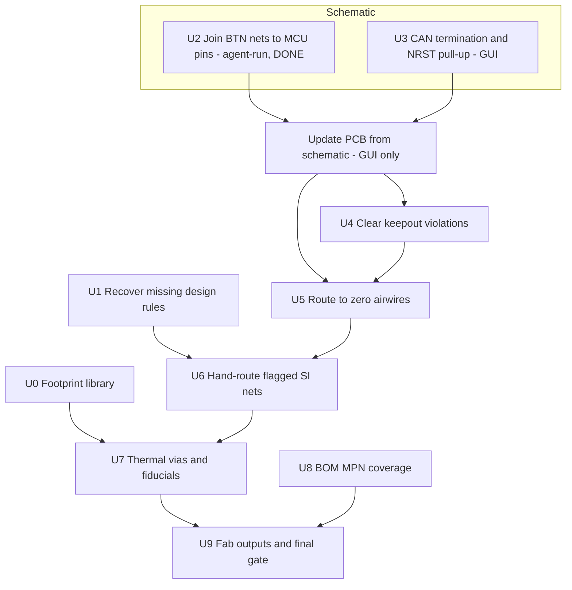

# Board3 Fab-Ready in KiCad - Plan

## Goal Capsule

- **Objective:** Take Board3 from its imported KiCad state to a board that can be ordered from JLCPCB — connectivity complete, DRC clean against real rules, signal-integrity defects fixed deliberately, and a BOM that can actually be assembled.
- **Product authority:** Kevin owns design decisions. This document owns sequencing and the completion bar.
- **Execution profile:** Real design work on a board headed for fabrication. Unlike its predecessor, mistakes here reach copper.
- **Stop conditions:** Stop and report if a fix would change circuit intent rather than implementation; if the recovered design rules contradict what the board was drawn to; or if DRC violations rise above the imported baseline of 41 after any unit.
- **Tail ownership:** Agent-run throughout, including connection-level schematic edits (see KTD4). Kevin runs **Update PCB from Schematic**, which has no CLI equivalent, and owns component-adding schematic work (U3). Layout, routing, verification and fab outputs are agent-run.
- **Open blockers:** Two design rules are unrecovered — the CAN differential value and the intended USB width. U1 resolves them and gates the signal-integrity work.

---

## Product Contract

### Summary

Board3 exists in KiCad, converted faithfully and 78% routed. This plan closes the remaining 58 airwires, fixes the defects automated review found, resolves the four signal-integrity nets held out of autorouting, and produces JLCPCB-ready fabrication outputs. KiCad becomes the authoritative source for this board.

### Problem Frame

The board arrived carrying defects nobody had catalogued. Automated review over the imported design returned 128 findings, and several are fab-stopping rather than cosmetic.

Four buttons are dead: `BTN1`–`BTN4` are single-pin nets terminating at `R28.2`–`R31.2`, because each pull-up net was never joined to its switch's `BTN*_SW` net. Neither CAN transceiver has 120 Ω termination. `NRST` has no pull-up. Six vias sit inside an `Inner2` keepout. `U2` has 5 thermal vias where it needs 9 and `U4` has none where it needs 5, with untented vias that can wick solder during reflow. There are no fiducials on a board with 122 SMD parts and fine-pitch packages. The BOM carries MPNs for **0 of 48** unique parts, which alone blocks assembly.

Separately, four nets were deliberately held out of autorouting because an autorouter would have made them worse, and they carry real defects: `OSC_OUT` runs 11.17 mm against `OSC_IN`'s 6.39 mm with two vias and half its length on the bottom layer; `USB_DP_CONN` takes two vias to the bottom layer that its differential partner does not; the QSPI bus spans 10.14–39.48 mm across five different layer strategies; and both CAN `_H` legs carry vias their `_L` partners lack.

None of this was visible before the board reached a tool that could be analyzed programmatically.

### Requirements

**Connectivity**

- R1. `BTN1`–`BTN4` pull-up nets are joined to their corresponding `BTN*_SW` switch nets, so all four buttons function.
- R2. Both CAN transceivers (`U8`, `U9`) carry 120 Ω differential termination.
- R3. `NRST` carries a pull-up resistor.
- R4. The board has zero airwires — every netlist connection is realised in copper.

**Signal integrity**

- R5. The CAN differential and USB width rules are recovered from the original design and applied to the netclass.
- R6. `OSC_OUT` is rerouted short and on a single layer, with loop area comparable to `OSC_IN`.
- R7. `USB_DP_CONN` and `USB_DM_CONN` take symmetric layer transitions.
- R8. The QSPI bus is length-matched over a consistent reference plane.
- R9. `CAN1` and `CAN2` are routed as differential pairs, with symmetric vias and layer usage.

**Manufacturability**

- R10. No via or track sits inside a keepout rule area.
- R11. `U2` and `U4` carry their required thermal via counts, tented.
- R12. The board carries fiducials appropriate to its SMD population.
- R13. DRC against JLCPCB 4-layer standard rules reports no violations beyond the 41 present at import, and ideally fewer.

**Fabrication handoff**

- R14. Every unique part in the BOM carries an MPN or LCSC part number.
- R15. BOM and CPL generate in JLCPCB's expected format, with rotations verified against at least one known-orientation part.
- R16. Gerbers generate and pass a fabrication-readiness check.

**Provenance**

- R17. The EasyEDA Board3 project is not modified. KiCad is the authoritative source for this board from this plan forward.

### Scope Boundaries

- No comparison against EasyEDA. The evaluation that produced this plan is closed; its head-to-head was never run and is not wanted.
- No round-trip back to EasyEDA at any point.
- Board1 and Board2 stay in EasyEDA, untouched.
- Component placement changes only where a defect requires it. This is not a re-layout.
- The USB inrush question is not settled here — see Open Questions.

### Dependencies and Assumptions

- KiCad 10.0.5 at `C:\Program Files\KiCad\10.0\`, with `kicad-cli` invoked by absolute path via `tools/kicad_env.py`.
- Design rules come from `tools/kicad_rules.json` (JLCPCB 4-layer standard), never from the board's own `.kicad_pro` — the importer wrote KiCad's factory defaults there. See [the migration learning](../solutions/integration-issues/easyeda-pro-to-kicad-migration-silent-data-loss.md).
- Board3 as imported: 144 footprints, 107 nets, 4 copper layers, 250.25 × 50.25 mm, 41 DRC violations, 0 airwires before the strip.
- The routed board carries 58 airwires and 37 new violations over baseline.
- Schematic *editing* has no headless **API** in KiCad 10 — `pcbnew` exposes no `SCH_IO_MGR`, and `kicad-cli sch` offers only `erc`, `export`, `upgrade`. It does have a headless **path**: the file is text. See KTD4 for when to take it.
- **Update PCB from Schematic is the one genuinely GUI-only step**, and it must be run with "Re-link footprints to schematic symbols based on their reference designators" ticked. Without that box, it reports one `Cannot add <ref>` error per component (140 of them), invariant to every other option — the importer produces a schematic and board whose symbol↔footprint UUID paths do not correspond.
- **ERC is measured as a delta, like DRC.** The imported schematic carries 1265 ERC violations; 477 of those are `unconnected_wire_endpoint` from the import's own pin-stub convention. An absolute ERC count is not a quality signal here.
- `kicad-happy` and `KiCadRoutingTools` are cloned beside the repo; `KICAD_HAPPY` and `KICAD_ROUTING_TOOLS` override their locations.

### Open Questions

**Resolve before the signal-integrity units**

- The CAN differential value, recorded from memory as "10mm" — which cannot be a width, since 10 mil is 0.254 mm and that is every track on the board. Likely a gap or an impedance target. U1 recovers it.
- The intended USB differential width. An action item existed to narrow it; the value was never recorded.

**Deferred**

- Whether the `+5V` bulk capacitance charging through the `U5`/`U6` ideal-diode FETs violates USB-C inrush. The original claim — 880 µF on VBUS — was disproven: VBUS carries a single 100 nF part. Whether a real inrush problem exists behind the ORing has never been analyzed, and it is a circuit question rather than a layout one.
- Whether the `starved_thermal` findings indicate real thermal relief problems or an artifact of zone refill parameters.

---

## Planning Contract

Product Contract authored here (`ce-plan-bootstrap`); the predecessor plan supplied the board state and the defect list, not the requirements.

### Key Technical Decisions

KTD1. **KiCad is authoritative for Board3 from this plan forward.** The predecessor treated the KiCad copy as a parallel experiment with EasyEDA as the source of truth. That inverts here: fixes land in KiCad and are never back-ported. EasyEDA's copy is frozen as history, which is what makes R17 a preservation requirement rather than a synchronisation one.

KTD2. **Design rules come from `tools/kicad_rules.json`, never from the board's `.kicad_pro`.** The importer wrote KiCad's factory defaults, and measuring against those reports 544 violations on a clean board. Every DRC invocation in this plan stages the real rules first.

KTD3. **The DRC bar is a delta, not an absolute.** The imported board carries 41 pre-existing violations, so "DRC clean" is unachievable by construction and would fail the source design too. R13 therefore requires no *new* violations against that baseline. `tools/kicad_verify.py` already measures this way.

KTD4. **Schematic units are agent-run by direct file edit; only the sync-to-PCB step is GUI-bound.** *(Corrected 2026-07-27 — the original wording confused "no API" with "no access".)* KiCad 10 genuinely exposes no headless schematic API: `pcbnew` has no `SCH_IO_MGR` and `kicad-cli sch` offers only `erc`, `export`, `upgrade`. But `.kicad_sch` is a plain S-expression text file, and editing it is neither exotic nor especially risky when three conditions hold:

- the edit **copies a convention already present on the sheet** rather than inventing geometry (U2's fix is four wire stubs plus four labels, identical in shape to the `VBUS_SENSE` / `USB_DP` / `+3V3` stubs on the same pin column);
- it is parsed with a **tokenizer, never a regex** — regex parsing of these files failed five times in the evaluation session;
- it is verified by **`kicad-cli sch export netlist`**, which is the same netlist KiCad syncs the board from, so a passing export is not a proxy for correctness but the thing itself.

Adding *components* (U3) is materially riskier than adding *connections* (U2), because it needs symbol-library entries, unit and pin mapping, and footprint association — rather than two node types the sheet already contains. Treat U3 as GUI-first and U2-class edits as agent-run.

What remains GUI-bound is **Update PCB from Schematic**, which has no CLI equivalent and additionally requires "Re-link footprints to schematic symbols based on their reference designators" to be ticked.

KTD5. **The four flagged nets are hand-routed, never autorouted.** They are held out in `tools/kicad_netclass.json` precisely because an autorouter degrades them. Fixing them means deliberate routing against a stated intent — loop area for the crystal, symmetry for the pairs, length matching for QSPI — which no router optimises for.

KTD6. **Fix connectivity before layout.** U2 and U3 change the netlist by adding components and joining nets, which changes what needs routing. Routing first would mean routing twice.

### High-Level Technical Design

Three phases with a hard boundary between them: the netlist must be final before copper is finished, and copper must be final before fab outputs mean anything.



U8 runs independently of copper — it is a data problem, not a layout one — but gates U9, because a BOM without MPNs cannot be assembled regardless of how good the board is.

---

## Implementation Units

| U-ID | Title | Key files | Depends on |
|---|---|---|---|
| U0 | Give the project a footprint library | `kicad/board3/fp-lib-table`, `kicad/board3/*.pretty/` | — |
| U1 | Recover the missing design rules | `tools/kicad_rules.json` | — |
| U2 | Join BTN switch nets to their MCU pins | `kicad/board3/*.kicad_sch` | — |
| U3 | CAN termination and NRST pull-up | `kicad/board3/*.kicad_sch` | — |
| U4 | Clear the keepout violations | `kicad/board3/*.kicad_pcb` | U2, U3 |
| U5 | Route to zero airwires | `tools/kicad_route.py`, `kicad/board3/` | U2, U3, U4 |
| U6 | Hand-route the four flagged nets | `kicad/board3/*.kicad_pcb`, `tools/kicad_netclass.json` | U1, U5 |
| U7 | Thermal vias and fiducials | `kicad/board3/*.kicad_pcb` | U6 |
| U8 | BOM MPN coverage | `tools/kicad_fab.py` | — |
| U9 | Fab outputs and final gate | `tools/kicad_fab.py` | U7, U8 |

### U0. Give the project a footprint library — DONE 2026-07-27

**Goal:** Make the project able to rebuild its own footprints. Right now it cannot.

**Requirements:** Supports R17 (KiCad as authoritative source) — a source that cannot reproduce its own parts is not authoritative.

**Dependencies:** None. Should run early; it is a safety net for every later unit that touches copper.

**Files:** `kicad/board3/fp-lib-table`, `kicad/board3/ProPrj_New-easyedapro.pretty/`

**Approach:** The EasyEDA Pro import handled symbols and footprints asymmetrically, and only the symbol half is complete:

| | symbols | footprints |
|---|---|---|
| library file | `ProPrj_New-easyedapro.kicad_sym` (446 KB) | **none** |
| library table | `sym-lib-table` | **no `fp-lib-table`** |
| where the data lives | library + `lib_symbols` cache in `.kicad_sch` | **only embedded in `.kicad_pcb`** |

Every footprint on the board names the library `ProPrj_New-easyedapro:`, and that nickname resolves to nothing. The geometry survives only because `.kicad_pcb` embeds a full copy of each footprint it uses. So the board renders and fabricates correctly today, while the project has no way to place any of these parts again, and no way to propagate a footprint correction to more than one instance.

This is a genuine migration gap of the same family as the design rules (KTD2) — the importer translated *objects* and skipped the *library* they came from. It is worth its own unit for the same reason: it is invisible until the moment you need it, and by then the source project may be gone.

Fix with **File → Export → Footprints to Library…** in the PCB editor, targeting a new `ProPrj_New-easyedapro.pretty` beside the existing `.kicad_sym`, then add the matching `fp-lib-table` with a `${KIPRJMOD}` URI mirroring `sym-lib-table`.

**Execution note:** GUI export (no CLI equivalent), then the `fp-lib-table` can be written directly. Do this *before* U7 adds vias and fiducials, so the library reflects the board as imported rather than as amended.

**Test scenarios:**
- `fp-lib-table` exists, and its nickname matches the `ProPrj_New-easyedapro:` prefix every board footprint already uses.
- The `.pretty` directory holds one `.kicad_mod` per distinct footprint on the board — count it against the board's distinct `fpid` set, not against 144 (instances ≠ distinct footprints).
- Opening the board reports no unresolved-footprint warnings.
- A footprint opened from the library is geometrically identical to its embedded copy on the board.

**Verification:** The board's distinct footprint set is fully resolvable from the project's own library, with the board unchanged. ✅ **DONE** — `fp-lib-table` written with nickname `ProPrj_New-easyedapro` and a `${KIPRJMOD}` URI mirroring `sym-lib-table`; `ProPrj_New-easyedapro.pretty/` holds 30 `.kicad_mod`. The board uses 30 distinct fpids (26 library-prefixed, 4 bare `Pad_e67*` corner free pads); **all 26 prefixed footprints resolve, none unresolved**. Because the new library's nickname matches the prefix the board already used, "Update board footprints to link to exported footprints" was left unticked and the `.kicad_pcb` was not rewritten.

### U1. Recover the missing design rules

**Goal:** Establish the CAN differential and USB width constraints the board was actually drawn to, so the signal-integrity work has a target.

**Requirements:** R5.

**Dependencies:** None.

**Files:** `tools/kicad_rules.json`

**Approach:** Read the values from EasyEDA Pro's net-class panel — they exist there and did not survive the import. Record them in the netclass block, replacing the two `unresolved` entries. If the CAN value turns out to be a differential *gap* or an impedance target rather than a width, the rules file needs a field for it rather than forcing it into `track_width`.

**Execution note:** Read-only against EasyEDA; Kevin reads the panel. Do not modify the EasyEDA project.

**Test scenarios:**
- The recovered CAN value is expressible in the netclass and is not simply the board-wide 0.254 mm.
- The recovered USB width, applied as a rule, either passes against the current `USB_DP`/`USB_DM` geometry or names exactly what fails.
- Covers R17. The EasyEDA project is unmodified, checked against its recorded hash.

**Verification:** `tools/kicad_rules.json` has no remaining `unresolved` entries, and a DRC run with the new values reports a coherent result rather than a flood.

### U2. Join BTN switch nets to their MCU pins — SCHEMATIC DONE 2026-07-27

**Goal:** Make all four buttons functional.

**Requirements:** R1.

**Dependencies:** None.

**Files:** `kicad/board3/ProPrj_New Project_2026-07-15_23-14-34_2026-07-27.kicad_sch`

**Approach:** *(The original framing of this unit was wrong and is corrected here.)* `BTN1`–`BTN4` were single-pin nets ending at `R28.2`–`R31.2`, and the plan read that as "the pull-up net was never joined to the switch net". It is not: `R28.1` and `SW1.1` were already joined on `/BTN1_SW`. **The missing link was on the MCU side** — `R28.2`–`R31.2` never reached `U1.93`–`U1.96` (`PC6`–`PC9`). The unit's own caution ("the MCU-side connection is what the single-pin net proves is missing") was the correct reading.

The measured topology, and the reason the "pull-up" label is a misnomer:

```
SW*.1 ──/BTN*_SW── R28..R31 (1 kΩ, SERIES) ──/BTN*── U1.93..96 (PC6..PC9)
SW*.4 ── /GND                       SW*.2, SW*.3 unconnected
```

There is **no external pull-up anywhere on these nets**. `R28`–`R31` are 1 kΩ series resistors between switch and MCU, and the switch pulls to ground. The buttons therefore work only with the **STM32's internal pull-ups enabled on PC6–PC9 in firmware**. Electrically that is sound — pressed, the pin sits at ≈0.08 V through 1 kΩ against a ~40 kΩ internal pull-up — but it is a firmware dependency, not a board one, and R2/R3's sibling findings should not be read as implying these nets have pull-ups too.

**Implementation, as executed:** four 2.54 mm wire stubs `(48.26,y) → (50.8,y)` with local labels `BTN1`–`BTN4` at `(49.53,y)`, for y = 215.9 / 213.36 / 210.82 / 208.28. This copies exactly the stub-and-label convention the same pin column already uses for `VBUS_SENSE`, `USB_DP`, `USB_DM`, `QSPI_NCS`, `+3V3` and `GND`.

**Execution note:** Agent-run by direct file edit (KTD4). **A prior attempt placed bare labels directly on the pin points with no wire; that worked electrically but was deleted by a later "remove orphaned residue" cleanup**, because a label sitting on a pin has no wire under it and reads as orphaned. The stub form is not cosmetic — it is what makes the connection survive cleanup.

**Test scenarios:**
- Each of `BTN1`–`BTN4` has at least two pins after the edit. ✅ measured: `/BTN1`=[R28.2, U1.93], `/BTN2`=[R29.2, U1.94], `/BTN3`=[R30.2, U1.95], `/BTN4`=[R31.2, U1.96]
- `analyze_schematic.py` no longer reports `NT-001` single-pin warnings for the BTN nets. ✅ ERC `isolated_pin_label` 13 → 9
- The MCU pin each button reaches is a valid input, confirmed against the H755 pin map. ✅ PC6–PC9, all GPIO-capable
- Covers R1. Sync-to-PCB produces four new ratlines rather than silently changing existing nets. ✅ measured: airwires 1 → 5, nets 221 → 217 (the four `unconnected-(U1-PC*-Pad9*)` placeholders consumed), tracks+vias unchanged at 2557, footprints 144 with zero zero-pad footprints

**Verification:** Zero single-pin BTN nets ✅, and the PCB shows the new connections as airwires awaiting routing ✅. **U2 COMPLETE** — R1 satisfied; the four ratlines are U5's to route.

**Trap that cost two failed sync attempts — `Update PCB from Schematic` does not read `.kicad_sch` from disk.** It asks the Kiway's eeschema instance, which caches the schematic from earlier in the session. After an out-of-editor edit to the schematic file, the first sync reported *no changes* and saved a board byte-identical to HEAD — twice — while the file on disk was demonstrably correct. **Restarting KiCad cleared it.** This is the mirror image of the known stale-file trap: there, the file lagged the editor; here, the editor lagged the file. Check both directions. `git status` on the `.kicad_pcb` is the cheapest detector — an unmodified board after a sync that should have changed something means the sync saw stale input.

ERC delta is zero (1265 → 1265) and fully accounted: −4 `isolated_pin_label`, −4 `pin_not_connected`, +4 `pin_to_pin` (imported symbols carry `unspecified` pin types; 317 such already existed), +4 `unconnected_wire_endpoint` (the far end of each stub — identical to the 477 the import's own stubs already produce).

**Test scenarios:**
- Each of `BTN1`–`BTN4` has at least two pins after the edit.
- `analyze_schematic.py` no longer reports `NT-001` single-pin warnings for the BTN nets.
- The MCU pin each button reaches is a valid input, confirmed against the H755 pin map.
- Covers R1. Sync-to-PCB produces four new ratlines rather than silently changing existing nets.

**Verification:** Zero single-pin BTN nets, and the PCB shows the new connections as airwires awaiting routing.

### U3. CAN termination and NRST pull-up

**Goal:** Add the two missing passive networks automated review identified.

**Requirements:** R2, R3.

**Dependencies:** None.

**Files:** `kicad/board3/ProPrj_New Project_2026-07-15_23-14-34_2026-07-27.kicad_sch`

**Approach:** ~~Add 120 Ω termination across each CAN pair.~~ **R2 IS ALREADY SATISFIED — measured 2026-07-27. The plan's premise ("Neither CAN transceiver has 120 Ω termination") is false.** Both networks already carry complete, independently-jumpered split termination:

```
CAN1:  U8.7 CANH ──[H1 jumper]── R10 60.4Ω ──┬── R14 60.4Ω ── U8.6 CANL
                                    CAN1_CT ─┴── C57 4.7nF ── GND
CAN2:  U9.7 CANH ──[H3 jumper]── R15 60.4Ω ──┬── R24 60.4Ω ── U9.6 CANL
                                    CAN2_CT ─┴── C58 4.7nF ── GND
```

60.4 + 60.4 = **120.8 Ω** across each pair, with the centre tap bypassed to ground through 4.7 nF — textbook AC/split termination, which damps common-mode noise as well as terminating the differential line. **Each network has its own jumper** (`H1` → CAN1, `H3` → CAN2), which is exactly the required topology: either bus can be terminated or not, independently, depending on whether this board sits at a bus end.

`kicad-happy`'s `PR-003` is a **false positive**: it looks for a single ~120 Ω part across CANH/CANL and cannot see termination split across two resistors with a jumper in series.

*Minor, non-blocking:* the jumper interrupts only the CANH leg, so with it open CANL still sees 60.4 Ω + 4.7 nF to ground (≈127 Ω at 500 kHz) — a slightly asymmetric AC stub. Normal practice for a 2-pin header and not worth a redesign; noted so it is not rediscovered as a defect.

**Remaining in this unit: `NRST` only.** Measured `/NRST` = `C46` (100 nF), `H2.4`, `SW6.1`, `U1.27` — a reset cap and switch, no pull-up. The STM32H755 has an **internal** NRST pull-up (~30–50 kΩ), so the pin is not floating and `PU-001` is also arguably a false positive. An external 10 kΩ is optional; for a board going into a car, the EMI margin makes it worth adding.

**Execution note:** GUI, Kevin-run — and now scoped to at most one resistor. Nothing to do for CAN.

**Test scenarios:**
- `analyze_schematic.py` no longer reports `PR-003` for `U8` or `U9`.
- `PU-001` for `U1` pin `NRST` clears.
- Covers R2. Termination across each pair measures 120 Ω in the intended jumper configuration.
- Any newly added part carries an MPN at creation, so it does not enlarge U8's gap.

**Verification:** Both `PR-003` findings and the `NRST` `PU-001` finding are absent from a fresh review run.

### U4. Clear the keepout violations

**Goal:** Remove the six vias sitting inside the `Inner2` rule area.

**Requirements:** R10.

**Dependencies:** U2, U3.

**Files:** `kicad/board3/ProPrj_New Project_2026-07-15_23-14-34_2026-07-27.kicad_pcb`

**Approach:** Six vias fall inside the rule area bounded by (161.64, 101.56)–(167.02, 111.65) on `Inner2`. Establish why the keepout exists before moving anything — a rule area on one inner layer usually protects a specific structure, and the right fix depends on what. Move the vias clear, or reroute their nets around the region.

**Test scenarios:**
- Covers R10. DRC reports zero `KO-001` violations.
- The nets those vias served remain connected — removing a via without rerouting creates an airwire.
- No new via lands inside either `Inner2` rule area.

**Verification:** `KO-001` count is zero and airwire count has not increased.

### U5. Route to zero airwires

**Goal:** Complete the remaining connectivity.

**Requirements:** R4.

**Dependencies:** U2, U3, U4.

**Files:** `tools/kicad_route.py`, `kicad/board3/`

**Approach:** Run the existing routing pipeline, which applies real rules, passes geometry explicitly, refuses to rewrite DRC settings, and refills zones. It closed 208 of 266 connections unattended; the remaining work is the tail it could not solve, plus whatever U2 and U3 added.

Expect the tail to need hand-routing. A router that stalls at 78% is usually blocked by congestion or by a region it cannot rip up, not by a systematic failure — inspect what is left rather than re-running with different parameters and hoping.

**Execution note:** Run the pipeline first and inspect the residue before hand-routing. The net set comes from `tools/kicad_netclass.json` so the flagged nets stay untouched.

**Test scenarios:**
- Covers R4. Airwire count reaches zero.
- The nets in `kicad_netclass.json` retain their exact track and via counts — the router must not have touched them.
- Pad-level net membership is unchanged from before routing.
- Covers R13. New DRC violations over the 41-violation baseline do not increase.

**Verification:** Zero airwires, flagged nets untouched, DRC delta no worse than before the unit.

### U6. Hand-route the four flagged nets — DONE 2026-07-27

**Goal:** Fix the signal-integrity defects deliberately excluded from autorouting.

**Requirements:** R6, R7, R8, R9.

**Dependencies:** U1, U5.

**Files:** `kicad/board3/ProPrj_New Project_2026-07-15_23-14-34_2026-07-27.kicad_pcb`, `tools/kicad_netclass.json`

**Approach:** Each net has a stated defect and a stated intent, recorded in `tools/kicad_netclass.json`:

- **`OSC_OUT`** — 11.17 mm with 2 vias and 5.3 mm on the bottom layer, against `OSC_IN`'s 6.39 mm single-layer run. Reroute short, single-layer, tight to the load caps. Loop area is the objective, not length parity.
- **`USB_DP_CONN`** — 2 vias to the bottom layer its partner does not take. Match the transitions or remove them. At 480 Mbps this matters more than the 0.39 mm length skew.
- **QSPI** — 29 mm spread across five layer strategies. Length-match over one reference plane; `QSPI_NCS` at 39.48 mm is the outlier.
- **`CAN1_H` / `CAN2_H`** — vias their `_L` partners lack, and 8.62% skew on CAN1. Route as pairs.

As each net is fixed, move it from `preserve_flagged` to `preserve` in the netclass with its measurement updated — that file is the record of what has been dealt with.

**Execution note:** Deliberate routing against stated intent, not optimisation. Measure each net after routing and compare against the recorded defect rather than assuming the fix worked.

**Test scenarios:**
- Covers R6. `OSC_OUT` length is within a stated factor of `OSC_IN` and uses one copper layer. ✅ 8.340 mm / **0 vias / top layer only**, against `OSC_IN`'s 6.385 mm — 1.31x, down from 1.75x.
- Covers R7. `USB_DP_CONN` and `USB_DM_CONN` have equal via counts and the same layer set. ✅ 2 vias each, `{Top, Bottom}` each, skew unchanged at 0.408 mm.
- Covers R8. QSPI length spread is within a stated tolerance and every member shares a reference plane. ✅ all six on the Bottom layer with top stubs; CLK-to-data spread 14.684 mm ≈ 95 ps, **1.9% of the 5000 ps sampling window** at 100 MHz SDR. `QSPI_NCS` exempted with a recorded reason.
- Covers R9. Each CAN pair has equal via counts, matching layer usage, and skew within tolerance for 1 Mbps. ⚠️ CAN1 ✅ (0 vias both legs, top only). CAN2_H keeps **one forced via** — see below.
- `USB_DP` / `USB_DM` are unchanged. ✅ measured byte-identical: 118.739 / 118.481 mm, 0 vias, 437 / 448 segments.
- Covers R13. DRC delta does not worsen. ✅ **35 violations, NEW = 0** against the 41-violation import baseline; airwires 0.

**Verification:** All four `preserve_flagged` groups are promoted to `preserve` in `tools/kicad_netclass.json`, each carrying its fresh measurement and, where a defect survived, a `residual` field saying why. ✅ **U6 COMPLETE.**

**As executed.** Copper was authored as coordinates rather than dragged, through a new `tools/kicad_handroute.py`, with every edit logged in `tools/handroutes/u6-flagged-nets.json` and measured by a new `tools/kicad_measure.py`. A net-level diff against HEAD shows **exactly 12 nets changed** — the four groups plus `GND` (+0.073 mm, the crystal's re-routed case-ground trace) — so the other ~95 nets are provably untouched.

Three of the four defects had a **topologically forced** element, which the plan's defect list could not see:

- **USB's crossing cannot be removed.** USB-C interleaves the pair at the receptacle (DP on A6/B6, DM on B7/A7) while D9 fixes DP on the west pad and DM on the east, so DM's lane leaves the connector west of DP's and must end east of it. Swapping the lanes only moves the crossing into the fanout. Per the unit's own wording — "match the transitions or remove them" — it was matched: DM's two compensating vias sit *on* its existing 45° approach, so both legs now present one identical discontinuity and the length is unchanged.
- **CAN2_H's via cannot be removed.** U9 puts H south of L; P2 puts H on the near pin. One leg must cross, and the north band is fully occupied by `CAN2_RX` (y=127.333) and `CAN2_TX` (y=128.531). What *was* removable is the 8.53 mm the jumper stub cut through the Inner2 **+5V plane** — both its endpoints are through-hole, so the same path on the bottom layer costs zero vias.
- **CAN1_H's two vias were removable, but not by rerouting CAN1_H.** The bottom hop avoided nothing; it existed because `CAN1_L`'s termination branch looped east and enclosed it. Moving L's branch to the free north corridor at y=128.6 left the south lane to H alone.

**R6 needed a placement change, and the plan's scope explicitly allows one.** `X1`'s ground pad sat 0.243 mm from U1's pad wall where a 0.254 mm track needs 0.457, and the MCU's 0.5 mm pad pitch leaves 0.22 mm between pads — so *every* escape from U1.26 was a via, whatever the route. `X1` moved 0.5 mm east. That only became possible mid-unit: the crystal's east side was blocked by three QSPI vias at x=166.6–166.8 until the QSPI reroute removed them.

**The QSPI defect was mis-framed, and the correction matters.** "Five layer strategies" reads as an anomaly; in fact this board routes **932 mm through Inner1 and 675 mm through Inner2** across ~40 nets, so signals in the planes are its normal construction, not a QSPI defect. The real requirement is that every bit line have the *same* cross-section, which is what putting all six on the Bottom layer achieves. It also removed 27.65 mm of cut from the GND plane and 36.24 mm from the +5V plane as a side effect.

**Two findings for later units:**

- **The tracked `.kicad_pro` still carries the importer's factory defaults** (clearance 0.2 mm against the board's real 0.1016). Zone fills are clearance-dependent, so *anyone who opens this project in the GUI and refills zones silently changes the copper* — a first attempt here did exactly that and invented two `starved_thermal` violations. `kicad_handroute.py` now stages the real rules before filling, but the landmine remains for GUI work. U9 should decide whether to write the real rules into the project file.
- **`CAN1_TERM` (9.70 mm) and `SWDIO` (11.27 mm) still cut the Inner2 +5V plane.** Neither is in a flagged group, so both were left alone. `CAN1_TERM` is the twin of the CAN2 stub fixed here and is a one-line change if wanted.

### U7. Thermal vias and fiducials — DONE 2026-07-27

**Goal:** Close the assembly and thermal findings.

**Requirements:** R11, R12.

**Dependencies:** U6.

**Files:** `kicad/board3/ProPrj_New Project_2026-07-15_23-14-34_2026-07-27.kicad_pcb`

**Approach:** `U2` needs 9 thermal vias and has 5; `U4` needs 5 and has none. Five existing vias are untented, which lets solder wick through during reflow and creates voids under the thermal pad — tenting is part of the fix, not a separate concern. Add fiducials appropriate to a 122-part SMD board with fine-pitch packages; three per populated side is the convention the review tool applies.

**Test scenarios:**
- Covers R11. `TV-001` clears for both `U2` and `U4`, and no via under either thermal pad is untented. ✅ both now report **adequate** — U2 13/9, U4 5/5 — and all 14 added vias carry `(tenting (front yes) (back yes))`. See the parser caveat below.
- Covers R12. `FD-001` clears. ✅ 1 → 0.
- Added vias do not land in a keepout or violate hole-to-hole spacing. ✅ both pads sit outside the Inner2 rule areas, and positions were generated with a 0.5 mm hole-to-hole floor.
- Fiducials sit clear of copper and silkscreen, with adequate mask openings. ✅ `Fiducial_1mm_Mask2mm` at the three clearest points on the top layer, with 2.33 / 4.51 / 9.13 mm of bare space around them.
- DRC delta. ✅ **35 violations, NEW = 0** against the 41-violation baseline; airwires 0.

**Verification:** `FD-001` is gone and both `TV-001` findings dropped from warning to info. ✅ **U7 COMPLETE.**

**As executed.** The counts came out slightly different from the plan's: `U2` had **0** vias in its thermal pad rather than 5, and `U4` 0 as stated. Nine were added to U2 and five to U4, all 0.6/0.3 — a 0.15 mm annular ring, exactly JLC's minimum. The 0.45 mm via that also fits U4's smaller pad was rejected because it leaves 0.075 mm.

**A plain 3×3 grid would have shorted three vias**, which is worth recording because the obstruction was invisible from the top: U2's thermal pad has `QSPI_IO2` and `QSPI_IO1` running underneath it on the bottom layer — put there by U6 — and `MOSI_R_MCU` crossing **Inner1 diagonally, corner to corner**. Positions were therefore generated by a clearance-aware grid search over all four copper layers rather than by hand. This is the same lesson `kicad_handroute.py`'s trap 2 records: on this board, "the outer layers look clear" tells you nothing.

**Two reviewer defects found, neither of them board defects:**

- **`kicad-happy` cannot read KiCad 10's via tenting.** It still reports "13 via(s) are not tented" for pads whose vias all carry `(tenting (front yes) (back yes))` in the file, and which `pcbnew` confirms as `TENTING_MODE_TENTED`. Same false-positive class as the `PR-003` CAN-termination miss U3 documented. Trust the file, not the finding.
- **`tools/kicad_review.py`'s calibration gate is now stale and fails every run.** Its known-defect probe is the BTN1–4 single-pin nets — which **U2 fixed**. The harness therefore reports `MISSED`, whose documented meaning is "the reviewer is unreliable; do not act on its other findings". That verdict is wrong here: the reviewer is fine, the fixture is out of date. **U9 must not run its review gate until this is repointed** at a defect that still exists, or the gate will either block on a false negative or be waved through by hand, which defeats it.

### U8. BOM MPN coverage

**Goal:** Make the board assemblable.

**Requirements:** R14.

**Dependencies:** None.

**Files:** `tools/kicad_fab.py`

**Approach:** 0 of 48 unique parts carry an MPN, which `kicad-happy` reports as `SS-001`, a sourcing blocker. The parts came from EasyEDA with LCSC identity that did not survive as KiCad fields. Recover them — the schematic and the source project both hold supplier data, and `mcp__pcbparts__jlc_search` can resolve the remainder by parameters.

Measure the per-part cost while working. If recovery is scriptable from the source project, that is a very different migration story than 48 manual lookups, and it is worth knowing which.

**Execution note:** Work the recoverable bulk programmatically first, then count what is genuinely manual. The count is itself a finding.

**Test scenarios:**
- Covers R14. Every unique part resolves to an MPN or LCSC number.
- `SS-001` clears.
- Parts that cannot be resolved are listed explicitly rather than silently omitted from the BOM.
- Resolved numbers are stock-checked — an LCSC number with zero stock blocks assembly as effectively as no number.

**Verification:** MPN coverage reaches 48 of 48, or the shortfall is enumerated with reasons.

### U9. Fab outputs and final gate

**Goal:** Produce the files JLCPCB needs, and prove the board is ready.

**Requirements:** R13, R15, R16.

**Dependencies:** U7, U8.

**Files:** `tools/kicad_fab.py`

**Approach:** Generate gerbers, BOM and CPL in JLCPCB's expected format. Verify CPL rotation against at least one part whose correct orientation is known — rotation convention differs between tools, and a silent mismatch is an assembly defect rather than a warning.

Run the full gate last: DRC against real rules with baseline attribution, a fresh review pass, and zero airwires. This is where R13 is finally judged.

**Test scenarios:**
- Covers R15. BOM carries designator, MPN and quantity; CPL carries designator, mid X, mid Y, rotation and layer in JLC's column order.
- Covers R15. At least one known-orientation part's rotation is verified against its datasheet pin 1.
- Covers R16. Gerbers generate and the layer set matches the 4-layer stackup.
- Covers R13. DRC reports no new violations over the 41-violation import baseline.
- Covers R4. Airwire count is zero.
- A fresh `tools/kicad_review.py` run reports `CALIBRATED` with no `error`-severity findings that were absent at import.

**Verification:** A complete fab package exists and the final gate passes on every criterion above.

---

## Verification Contract

| Gate | Command | Applies to |
|---|---|---|
| Toolchain resolves | `python tools/kicad_env.py` | any |
| Automated review | `python tools/kicad_review.py kicad/board3/` | U2, U3, U7, U8, U9 |
| Routing pipeline | `python tools/kicad_route.py <board> --out <out>` | U5 |
| DRC with baseline attribution | `python tools/kicad_verify.py <board> --baseline <imported>` | U4–U9 |
| Fab outputs | `python tools/kicad_fab.py kicad/board3/` | U9 |
| Firmware suite | `wsl -- bash -lc "./tests/run-tests.sh"` | any unit touching `tools/` |

`kicad_verify.py` stages `tools/kicad_rules.json` before every DRC run; never measure against the board's own `.kicad_pro`. The firmware suite must stay at 14/14 — this plan changes no firmware, so any movement is a regression.

---

## Definition of Done

Global:

- Zero airwires.
- DRC against JLCPCB 4-layer standard rules shows no violations beyond the 41 present at import.
- Every `preserve_flagged` group in `tools/kicad_netclass.json` is resolved, or carries a recorded reason it was not.
- Automated review reports `CALIBRATED` with no new `error`-severity findings.
- BOM and CPL generate in JLCPCB format with full MPN coverage and verified rotation.
- The EasyEDA Board3 project is byte-identical to its state at the start of this plan.
- Scratch scripts and abandoned attempts are removed; a dead-end does not ship in the diff.

Per unit: each unit's Verification line is satisfied, measured rather than assumed.
