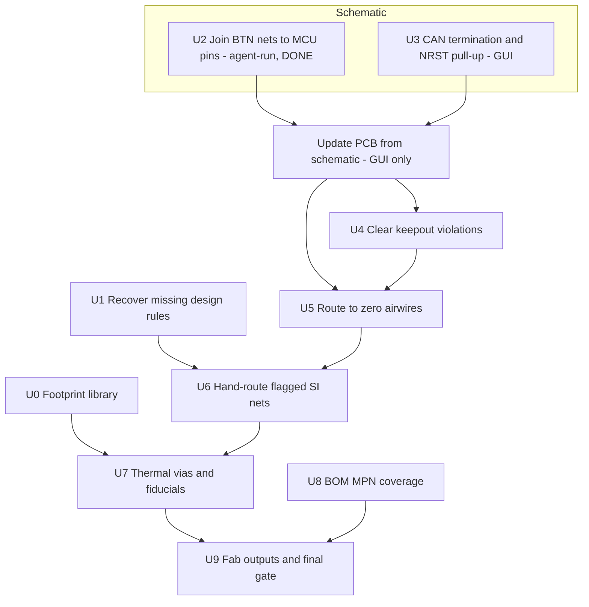

# Board3 Fab-Ready in KiCad - Plan

## Goal Capsule

- **Objective:** Take Board3 from its imported KiCad state to a board that can be ordered from JLCPCB — connectivity complete, DRC clean against real rules, signal-integrity defects fixed deliberately, and a BOM that can actually be assembled.
- **Product authority:** Kevin owns design decisions. This document owns sequencing and the completion bar.
- **Execution profile:** Real design work on a board headed for fabrication. Unlike its predecessor, mistakes here reach copper.
- **Stop conditions:** Stop and report if a fix would change circuit intent rather than implementation; if the recovered design rules contradict what the board was drawn to; or if DRC violations rise above the imported baseline of 41 after any unit.
- **Tail ownership:** Agent-run throughout, including connection-level schematic edits (see KTD4). Kevin runs **Update PCB from Schematic**, which has no CLI equivalent, and owns component-adding schematic work (U3). Layout, routing, verification and fab outputs are agent-run.
- **Open blockers:** Two design rules are unrecovered — the CAN differential value and the intended USB width. U1 resolves them and gates the signal-integrity work.

---

## Product Contract

### Summary

Board3 exists in KiCad, converted faithfully and 78% routed. This plan closes the remaining 58 airwires, fixes the defects automated review found, resolves the four signal-integrity nets held out of autorouting, and produces JLCPCB-ready fabrication outputs. KiCad becomes the authoritative source for this board.

### Problem Frame

The board arrived carrying defects nobody had catalogued. Automated review over the imported design returned 128 findings, and several are fab-stopping rather than cosmetic.

Four buttons are dead: `BTN1`–`BTN4` are single-pin nets terminating at `R28.2`–`R31.2`, because each pull-up net was never joined to its switch's `BTN*_SW` net. Neither CAN transceiver has 120 Ω termination. `NRST` has no pull-up. Six vias sit inside an `Inner2` keepout. `U2` has 5 thermal vias where it needs 9 and `U4` has none where it needs 5, with untented vias that can wick solder during reflow. There are no fiducials on a board with 122 SMD parts and fine-pitch packages. The BOM carries MPNs for **0 of 48** unique parts, which alone blocks assembly.

Separately, four nets were deliberately held out of autorouting because an autorouter would have made them worse, and they carry real defects: `OSC_OUT` runs 11.17 mm against `OSC_IN`'s 6.39 mm with two vias and half its length on the bottom layer; `USB_DP_CONN` takes two vias to the bottom layer that its differential partner does not; the QSPI bus spans 10.14–39.48 mm across five different layer strategies; and both CAN `_H` legs carry vias their `_L` partners lack.

None of this was visible before the board reached a tool that could be analyzed programmatically.

### Requirements

**Connectivity**

- R1. `BTN1`–`BTN4` pull-up nets are joined to their corresponding `BTN*_SW` switch nets, so all four buttons function.
- R2. Both CAN transceivers (`U8`, `U9`) carry 120 Ω differential termination.
- R3. `NRST` carries a pull-up resistor.
- R4. The board has zero airwires — every netlist connection is realised in copper.

**Signal integrity**

- R5. The CAN differential and USB width rules are recovered from the original design and applied to the netclass.
- R6. `OSC_OUT` is rerouted short and on a single layer, with loop area comparable to `OSC_IN`.
- R7. `USB_DP_CONN` and `USB_DM_CONN` take symmetric layer transitions.
- R8. The QSPI bus is length-matched over a consistent reference plane.
- R9. `CAN1` and `CAN2` are routed as differential pairs, with symmetric vias and layer usage.

**Manufacturability**

- R10. No via or track sits inside a keepout rule area.
- R11. `U2` and `U4` carry their required thermal via counts, tented.
- R12. The board carries fiducials appropriate to its SMD population.
- R13. DRC against JLCPCB 4-layer standard rules reports no violations beyond the 41 present at import, and ideally fewer.

**Fabrication handoff**

- R14. Every unique part in the BOM carries an MPN or LCSC part number.
- R15. BOM and CPL generate in JLCPCB's expected format, with rotations verified against at least one known-orientation part.
- R16. Gerbers generate and pass a fabrication-readiness check.

**Provenance**

- R17. The EasyEDA Board3 project is not modified. KiCad is the authoritative source for this board from this plan forward.

**Buck-block layout (U15)**

*R18–R32 are claimed by the telltale/rail plan; this group continues at R33 because the two plans share one ID space.*

*Amended 2026-07-28: R33 and R36 are **blocked, not dropped** — an adversarial pass proved both are geometrically unreachable while `/CS_L` runs on Inner1 under the buck. R35 is deferred as disproportionate. See the U15 amendment.*

- R33. The buck's input commutation loop is closed by a high-frequency ceramic across the `VIN` and `GND` pins, not by a bulk capacitor millimetres away.
- R34. The `+5V` branch feeding `VIN` is sized to the copper table in `docs/hardware/board3-pcb-layout-guide.md`, and `U3`'s ground return reaches a plane via without a multi-millimetre top-layer detour.
- R35. The bootstrap capacitor sits adjacent to `VBST`, and no switching-node copper exists solely to reach it.
- R36. The feedback divider sits at the IC beside `VFB`, only a sense line returns from an output-capacitor terminal, and the feedback node runs neither under the inductor nor alongside the switching node.
- R37. No SPI, USB or crystal net moves, and none ends up closer to the switching node than it is today.
- R38. The fabrication package is regenerated from the amended board under KiCad's own interpreter, with `fab/gerbers/` emptied first.

### Scope Boundaries

- No comparison against EasyEDA. The evaluation that produced this plan is closed; its head-to-head was never run and is not wanted.
- No round-trip back to EasyEDA at any point.
- Board1 and Board2 stay in EasyEDA, untouched.
- Component placement changes only where a defect requires it. This is not a re-layout.
- The USB inrush question is not settled here — see Open Questions.

### Dependencies and Assumptions

- KiCad 10.0.5 at `C:\Program Files\KiCad\10.0\`, with `kicad-cli` invoked by absolute path via `tools/kicad_env.py`.
- Design rules come from `tools/kicad_rules.json` (JLCPCB 4-layer standard), never from the board's own `.kicad_pro` — the importer wrote KiCad's factory defaults there. See [the migration learning](../solutions/integration-issues/easyeda-pro-to-kicad-migration-silent-data-loss.md).
- Board3 as imported: 144 footprints, 107 nets, 4 copper layers, 250.25 × 50.25 mm, 41 DRC violations, 0 airwires before the strip.
- The routed board carries 58 airwires and 37 new violations over baseline.
- Schematic *editing* has no headless **API** in KiCad 10 — `pcbnew` exposes no `SCH_IO_MGR`, and `kicad-cli sch` offers only `erc`, `export`, `upgrade`. It does have a headless **path**: the file is text. See KTD4 for when to take it.
- **Update PCB from Schematic is the one genuinely GUI-only step**, and it must be run with "Re-link footprints to schematic symbols based on their reference designators" ticked. Without that box, it reports one `Cannot add <ref>` error per component (140 of them), invariant to every other option — the importer produces a schematic and board whose symbol↔footprint UUID paths do not correspond.
- **ERC is measured as a delta, like DRC.** The imported schematic carries 1265 ERC violations; 477 of those are `unconnected_wire_endpoint` from the import's own pin-stub convention. An absolute ERC count is not a quality signal here.
- `kicad-happy` and `KiCadRoutingTools` are cloned beside the repo; `KICAD_HAPPY` and `KICAD_ROUTING_TOOLS` override their locations.

### Open Questions

**Resolve before the signal-integrity units**

- The CAN differential value, recorded from memory as "10mm" — which cannot be a width, since 10 mil is 0.254 mm and that is every track on the board. Likely a gap or an impedance target. U1 recovers it.
- The intended USB differential width. An action item existed to narrow it; the value was never recorded.

**Deferred**

- Whether the `+5V` bulk capacitance charging through the `U5`/`U6` ideal-diode FETs violates USB-C inrush. The original claim — 880 µF on VBUS — was disproven: VBUS carries a single 100 nF part. Whether a real inrush problem exists behind the ORing has never been analyzed, and it is a circuit question rather than a layout one.
- Whether the `starved_thermal` findings indicate real thermal relief problems or an artifact of zone refill parameters.

---

## Planning Contract

Product Contract authored here (`ce-plan-bootstrap`); the predecessor plan supplied the board state and the defect list, not the requirements.

### Key Technical Decisions

KTD1. **KiCad is authoritative for Board3 from this plan forward.** The predecessor treated the KiCad copy as a parallel experiment with EasyEDA as the source of truth. That inverts here: fixes land in KiCad and are never back-ported. EasyEDA's copy is frozen as history, which is what makes R17 a preservation requirement rather than a synchronisation one.

KTD2. **Design rules come from `tools/kicad_rules.json`, never from the board's `.kicad_pro`.** The importer wrote KiCad's factory defaults, and measuring against those reports 544 violations on a clean board. Every DRC invocation in this plan stages the real rules first.

KTD3. **The DRC bar is a delta, not an absolute.** The imported board carries 41 pre-existing violations, so "DRC clean" is unachievable by construction and would fail the source design too. R13 therefore requires no *new* violations against that baseline. `tools/kicad_verify.py` already measures this way.

KTD4. **Schematic units are agent-run by direct file edit; only the sync-to-PCB step is GUI-bound.** *(Corrected 2026-07-27 — the original wording confused "no API" with "no access".)* KiCad 10 genuinely exposes no headless schematic API: `pcbnew` has no `SCH_IO_MGR` and `kicad-cli sch` offers only `erc`, `export`, `upgrade`. But `.kicad_sch` is a plain S-expression text file, and editing it is neither exotic nor especially risky when three conditions hold:

- the edit **copies a convention already present on the sheet** rather than inventing geometry (U2's fix is four wire stubs plus four labels, identical in shape to the `VBUS_SENSE` / `USB_DP` / `+3V3` stubs on the same pin column);
- it is parsed with a **tokenizer, never a regex** — regex parsing of these files failed five times in the evaluation session;
- it is verified by **`kicad-cli sch export netlist`**, which is the same netlist KiCad syncs the board from, so a passing export is not a proxy for correctness but the thing itself.

Adding *components* (U3) is materially riskier than adding *connections* (U2), because it needs symbol-library entries, unit and pin mapping, and footprint association — rather than two node types the sheet already contains. Treat U3 as GUI-first and U2-class edits as agent-run.

What remains GUI-bound is **Update PCB from Schematic**, which has no CLI equivalent and additionally requires "Re-link footprints to schematic symbols based on their reference designators" to be ticked.

KTD5. **The four flagged nets are hand-routed, never autorouted.** They are held out in `tools/kicad_netclass.json` precisely because an autorouter degrades them. Fixing them means deliberate routing against a stated intent — loop area for the crystal, symmetry for the pairs, length matching for QSPI — which no router optimises for.

KTD6. **Fix connectivity before layout.** U2 and U3 change the netlist by adding components and joining nets, which changes what needs routing. Routing first would mean routing twice.

KTD7. **The buck's input loop is closed with a new 0603 at the pins, not by relocating `C51`.** Moving the existing 10 µF looks cheaper — no schematic edit, no GUI sync — and it cannot work. `C51` is a `C0805` at rot -90 with its pads offset in Y, so translation can never straddle a north-row pin pair; its verified headroom is +0.275 mm with `C52` in place, and even with `C52` gone the ground leg only falls 4.287 → 2.849 mm. Rotating it would work electrically but `kicad_handroute.py` has no rotate op, and a `C0805`'s 3.91 mm courtyard overlaps `U3` or `L2` at every legal y. `C0603` is the only package on this board that straddles the 1.900 mm pin span with zero courtyard overlap, and cloning `C14663` — already placed 24 times, `C52` among them — makes it a no-new-symbol, no-new-footprint, no-new-BOM-line change. The cheap option was evaluated and is geometrically impossible, not merely worse.

KTD8. **This plan and the telltale/rail plan share one U-ID and R-ID space.** `docs/plans/2026-07-27-003-feat-telltale-driver-and-rail-decoupling-plan.md` continues from this plan's U9/R17 with U10–U14 and R18–R32, so U15 and R33 are where this plan resumes. Both documents describe the same board and are read together; duplicate IDs across them would be ambiguous in a way duplicate IDs across unrelated plans are not. Check both files before claiming an ID.

### High-Level Technical Design

Three phases with a hard boundary between them: the netlist must be final before copper is finished, and copper must be final before fab outputs mean anything.



U8 runs independently of copper — it is a data problem, not a layout one — but gates U9, because a BOM without MPNs cannot be assembled regardless of how good the board is.

---

## Implementation Units

| U-ID | Title | Key files | Depends on |
|---|---|---|---|
| U0 | Give the project a footprint library | `kicad/board3/fp-lib-table`, `kicad/board3/*.pretty/` | — |
| U1 | Recover the missing design rules | `tools/kicad_rules.json` | — |
| U2 | Join BTN switch nets to their MCU pins | `kicad/board3/*.kicad_sch` | — |
| U3 | CAN termination and NRST pull-up | `kicad/board3/*.kicad_sch` | — |
| U4 | Clear the keepout violations | `kicad/board3/*.kicad_pcb` | U2, U3 |
| U5 | Route to zero airwires | `tools/kicad_route.py`, `kicad/board3/` | U2, U3, U4 |
| U6 | Hand-route the four flagged nets | `kicad/board3/*.kicad_pcb`, `tools/kicad_netclass.json` | U1, U5 |
| U7 | Thermal vias and fiducials | `kicad/board3/*.kicad_pcb` | U6 |
| U8 | BOM MPN coverage | `tools/kicad_fab.py` | — |
| U9 | Fab outputs and final gate | `tools/kicad_fab.py` | U7, U8 |
| U15 | Buck block to TI's layout guidelines | `kicad/board3/*.kicad_sch`, `*.kicad_pcb`, `tools/handroutes/u15-buck-block.json` | U9 |
| U16 | Push U2 2.5 mm east to open the crystal lane | `kicad/board3/*.kicad_pcb`, `tools/handroutes/u16-qspi-u2-east.json` | U9 |
| U17 | Slide the QSPI escape vias east (partial) | `kicad/board3/*.kicad_pcb`, `tools/handroutes/u17-qspi-escape-vias-east.json` | U16 |
| U18 | CS_R to PE3, PD_R off the +5V plane | `kicad/board3/*.kicad_sch`, `*.kicad_pcb`, `tools/handroutes/u18-csr-pe3-pdr-off-inner2.json`, `docs/hardware/board3-h755-pin-map.md` | — *(landed after U17)* |

### U0. Give the project a footprint library — DONE 2026-07-27

**Goal:** Make the project able to rebuild its own footprints. Right now it cannot.

**Requirements:** Supports R17 (KiCad as authoritative source) — a source that cannot reproduce its own parts is not authoritative.

**Dependencies:** None. Should run early; it is a safety net for every later unit that touches copper.

**Files:** `kicad/board3/fp-lib-table`, `kicad/board3/ProPrj_New-easyedapro.pretty/`

**Approach:** The EasyEDA Pro import handled symbols and footprints asymmetrically, and only the symbol half is complete:

| | symbols | footprints |
|---|---|---|
| library file | `ProPrj_New-easyedapro.kicad_sym` (446 KB) | **none** |
| library table | `sym-lib-table` | **no `fp-lib-table`** |
| where the data lives | library + `lib_symbols` cache in `.kicad_sch` | **only embedded in `.kicad_pcb`** |

Every footprint on the board names the library `ProPrj_New-easyedapro:`, and that nickname resolves to nothing. The geometry survives only because `.kicad_pcb` embeds a full copy of each footprint it uses. So the board renders and fabricates correctly today, while the project has no way to place any of these parts again, and no way to propagate a footprint correction to more than one instance.

This is a genuine migration gap of the same family as the design rules (KTD2) — the importer translated *objects* and skipped the *library* they came from. It is worth its own unit for the same reason: it is invisible until the moment you need it, and by then the source project may be gone.

Fix with **File → Export → Footprints to Library…** in the PCB editor, targeting a new `ProPrj_New-easyedapro.pretty` beside the existing `.kicad_sym`, then add the matching `fp-lib-table` with a `${KIPRJMOD}` URI mirroring `sym-lib-table`.

**Execution note:** GUI export (no CLI equivalent), then the `fp-lib-table` can be written directly. Do this *before* U7 adds vias and fiducials, so the library reflects the board as imported rather than as amended.

**Test scenarios:**
- `fp-lib-table` exists, and its nickname matches the `ProPrj_New-easyedapro:` prefix every board footprint already uses.
- The `.pretty` directory holds one `.kicad_mod` per distinct footprint on the board — count it against the board's distinct `fpid` set, not against 144 (instances ≠ distinct footprints).
- Opening the board reports no unresolved-footprint warnings.
- A footprint opened from the library is geometrically identical to its embedded copy on the board.

**Verification:** The board's distinct footprint set is fully resolvable from the project's own library, with the board unchanged. ✅ **DONE** — `fp-lib-table` written with nickname `ProPrj_New-easyedapro` and a `${KIPRJMOD}` URI mirroring `sym-lib-table`; `ProPrj_New-easyedapro.pretty/` holds 30 `.kicad_mod`. The board uses 30 distinct fpids (26 library-prefixed, 4 bare `Pad_e67*` corner free pads); **all 26 prefixed footprints resolve, none unresolved**. Because the new library's nickname matches the prefix the board already used, "Update board footprints to link to exported footprints" was left unticked and the `.kicad_pcb` was not rewritten.

### U1. Recover the missing design rules

**Goal:** Establish the CAN differential and USB width constraints the board was actually drawn to, so the signal-integrity work has a target.

**Requirements:** R5.

**Dependencies:** None.

**Files:** `tools/kicad_rules.json`

**Approach:** Read the values from EasyEDA Pro's net-class panel — they exist there and did not survive the import. Record them in the netclass block, replacing the two `unresolved` entries. If the CAN value turns out to be a differential *gap* or an impedance target rather than a width, the rules file needs a field for it rather than forcing it into `track_width`.

**Execution note:** Read-only against EasyEDA; Kevin reads the panel. Do not modify the EasyEDA project.

**Test scenarios:**
- The recovered CAN value is expressible in the netclass and is not simply the board-wide 0.254 mm.
- The recovered USB width, applied as a rule, either passes against the current `USB_DP`/`USB_DM` geometry or names exactly what fails.
- Covers R17. The EasyEDA project is unmodified, checked against its recorded hash.

**Verification:** `tools/kicad_rules.json` has no remaining `unresolved` entries, and a DRC run with the new values reports a coherent result rather than a flood.

### U2. Join BTN switch nets to their MCU pins — SCHEMATIC DONE 2026-07-27

**Goal:** Make all four buttons functional.

**Requirements:** R1.

**Dependencies:** None.

**Files:** `kicad/board3/ProPrj_New Project_2026-07-15_23-14-34_2026-07-27.kicad_sch`

**Approach:** *(The original framing of this unit was wrong and is corrected here.)* `BTN1`–`BTN4` were single-pin nets ending at `R28.2`–`R31.2`, and the plan read that as "the pull-up net was never joined to the switch net". It is not: `R28.1` and `SW1.1` were already joined on `/BTN1_SW`. **The missing link was on the MCU side** — `R28.2`–`R31.2` never reached `U1.93`–`U1.96` (`PC6`–`PC9`). The unit's own caution ("the MCU-side connection is what the single-pin net proves is missing") was the correct reading.

The measured topology, and the reason the "pull-up" label is a misnomer:

```
SW*.1 ──/BTN*_SW── R28..R31 (1 kΩ, SERIES) ──/BTN*── U1.93..96 (PC6..PC9)
SW*.4 ── /GND                       SW*.2, SW*.3 unconnected
```

There is **no external pull-up anywhere on these nets**. `R28`–`R31` are 1 kΩ series resistors between switch and MCU, and the switch pulls to ground. The buttons therefore work only with the **STM32's internal pull-ups enabled on PC6–PC9 in firmware**. Electrically that is sound — pressed, the pin sits at ≈0.08 V through 1 kΩ against a ~40 kΩ internal pull-up — but it is a firmware dependency, not a board one, and R2/R3's sibling findings should not be read as implying these nets have pull-ups too.

**Implementation, as executed:** four 2.54 mm wire stubs `(48.26,y) → (50.8,y)` with local labels `BTN1`–`BTN4` at `(49.53,y)`, for y = 215.9 / 213.36 / 210.82 / 208.28. This copies exactly the stub-and-label convention the same pin column already uses for `VBUS_SENSE`, `USB_DP`, `USB_DM`, `QSPI_NCS`, `+3V3` and `GND`.

**Execution note:** Agent-run by direct file edit (KTD4). **A prior attempt placed bare labels directly on the pin points with no wire; that worked electrically but was deleted by a later "remove orphaned residue" cleanup**, because a label sitting on a pin has no wire under it and reads as orphaned. The stub form is not cosmetic — it is what makes the connection survive cleanup.

**Test scenarios:**
- Each of `BTN1`–`BTN4` has at least two pins after the edit. ✅ measured: `/BTN1`=[R28.2, U1.93], `/BTN2`=[R29.2, U1.94], `/BTN3`=[R30.2, U1.95], `/BTN4`=[R31.2, U1.96]
- `analyze_schematic.py` no longer reports `NT-001` single-pin warnings for the BTN nets. ✅ ERC `isolated_pin_label` 13 → 9
- The MCU pin each button reaches is a valid input, confirmed against the H755 pin map. ✅ PC6–PC9, all GPIO-capable
- Covers R1. Sync-to-PCB produces four new ratlines rather than silently changing existing nets. ✅ measured: airwires 1 → 5, nets 221 → 217 (the four `unconnected-(U1-PC*-Pad9*)` placeholders consumed), tracks+vias unchanged at 2557, footprints 144 with zero zero-pad footprints

**Verification:** Zero single-pin BTN nets ✅, and the PCB shows the new connections as airwires awaiting routing ✅. **U2 COMPLETE** — R1 satisfied; the four ratlines are U5's to route.

**Trap that cost two failed sync attempts — `Update PCB from Schematic` does not read `.kicad_sch` from disk.** It asks the Kiway's eeschema instance, which caches the schematic from earlier in the session. After an out-of-editor edit to the schematic file, the first sync reported *no changes* and saved a board byte-identical to HEAD — twice — while the file on disk was demonstrably correct. **Restarting KiCad cleared it.** This is the mirror image of the known stale-file trap: there, the file lagged the editor; here, the editor lagged the file. Check both directions. `git status` on the `.kicad_pcb` is the cheapest detector — an unmodified board after a sync that should have changed something means the sync saw stale input.

ERC delta is zero (1265 → 1265) and fully accounted: −4 `isolated_pin_label`, −4 `pin_not_connected`, +4 `pin_to_pin` (imported symbols carry `unspecified` pin types; 317 such already existed), +4 `unconnected_wire_endpoint` (the far end of each stub — identical to the 477 the import's own stubs already produce).

**Test scenarios:**
- Each of `BTN1`–`BTN4` has at least two pins after the edit.
- `analyze_schematic.py` no longer reports `NT-001` single-pin warnings for the BTN nets.
- The MCU pin each button reaches is a valid input, confirmed against the H755 pin map.
- Covers R1. Sync-to-PCB produces four new ratlines rather than silently changing existing nets.

**Verification:** Zero single-pin BTN nets, and the PCB shows the new connections as airwires awaiting routing.

### U3. CAN termination and NRST pull-up

**Goal:** Add the two missing passive networks automated review identified.

**Requirements:** R2, R3.

**Dependencies:** None.

**Files:** `kicad/board3/ProPrj_New Project_2026-07-15_23-14-34_2026-07-27.kicad_sch`

**Approach:** ~~Add 120 Ω termination across each CAN pair.~~ **R2 IS ALREADY SATISFIED — measured 2026-07-27. The plan's premise ("Neither CAN transceiver has 120 Ω termination") is false.** Both networks already carry complete, independently-jumpered split termination:

```
CAN1:  U8.7 CANH ──[H1 jumper]── R10 60.4Ω ──┬── R14 60.4Ω ── U8.6 CANL
                                    CAN1_CT ─┴── C57 4.7nF ── GND
CAN2:  U9.7 CANH ──[H3 jumper]── R15 60.4Ω ──┬── R24 60.4Ω ── U9.6 CANL
                                    CAN2_CT ─┴── C58 4.7nF ── GND
```

60.4 + 60.4 = **120.8 Ω** across each pair, with the centre tap bypassed to ground through 4.7 nF — textbook AC/split termination, which damps common-mode noise as well as terminating the differential line. **Each network has its own jumper** (`H1` → CAN1, `H3` → CAN2), which is exactly the required topology: either bus can be terminated or not, independently, depending on whether this board sits at a bus end.

`kicad-happy`'s `PR-003` is a **false positive**: it looks for a single ~120 Ω part across CANH/CANL and cannot see termination split across two resistors with a jumper in series.

*Minor, non-blocking:* the jumper interrupts only the CANH leg, so with it open CANL still sees 60.4 Ω + 4.7 nF to ground (≈127 Ω at 500 kHz) — a slightly asymmetric AC stub. Normal practice for a 2-pin header and not worth a redesign; noted so it is not rediscovered as a defect.

**Remaining in this unit: `NRST` only.** Measured `/NRST` = `C46` (100 nF), `H2.4`, `SW6.1`, `U1.27` — a reset cap and switch, no pull-up. The STM32H755 has an **internal** NRST pull-up (~30–50 kΩ), so the pin is not floating and `PU-001` is also arguably a false positive. An external 10 kΩ is optional; for a board going into a car, the EMI margin makes it worth adding.

**Execution note:** GUI, Kevin-run — and now scoped to at most one resistor. Nothing to do for CAN.

**Test scenarios:**
- `analyze_schematic.py` no longer reports `PR-003` for `U8` or `U9`.
- `PU-001` for `U1` pin `NRST` clears.
- Covers R2. Termination across each pair measures 120 Ω in the intended jumper configuration.
- Any newly added part carries an MPN at creation, so it does not enlarge U8's gap.

**Verification:** Both `PR-003` findings and the `NRST` `PU-001` finding are absent from a fresh review run.

### U4. Clear the keepout violations

**Goal:** Remove the six vias sitting inside the `Inner2` rule area.

**Requirements:** R10.

**Dependencies:** U2, U3.

**Files:** `kicad/board3/ProPrj_New Project_2026-07-15_23-14-34_2026-07-27.kicad_pcb`

**Approach:** Six vias fall inside the rule area bounded by (161.64, 101.56)–(167.02, 111.65) on `Inner2`. Establish why the keepout exists before moving anything — a rule area on one inner layer usually protects a specific structure, and the right fix depends on what. Move the vias clear, or reroute their nets around the region.

**Test scenarios:**
- Covers R10. DRC reports zero `KO-001` violations.
- The nets those vias served remain connected — removing a via without rerouting creates an airwire.
- No new via lands inside either `Inner2` rule area.

**Verification:** `KO-001` count is zero and airwire count has not increased.

### U5. Route to zero airwires

**Goal:** Complete the remaining connectivity.

**Requirements:** R4.

**Dependencies:** U2, U3, U4.

**Files:** `tools/kicad_route.py`, `kicad/board3/`

**Approach:** Run the existing routing pipeline, which applies real rules, passes geometry explicitly, refuses to rewrite DRC settings, and refills zones. It closed 208 of 266 connections unattended; the remaining work is the tail it could not solve, plus whatever U2 and U3 added.

Expect the tail to need hand-routing. A router that stalls at 78% is usually blocked by congestion or by a region it cannot rip up, not by a systematic failure — inspect what is left rather than re-running with different parameters and hoping.

**Execution note:** Run the pipeline first and inspect the residue before hand-routing. The net set comes from `tools/kicad_netclass.json` so the flagged nets stay untouched.

**Test scenarios:**
- Covers R4. Airwire count reaches zero.
- The nets in `kicad_netclass.json` retain their exact track and via counts — the router must not have touched them.
- Pad-level net membership is unchanged from before routing.
- Covers R13. New DRC violations over the 41-violation baseline do not increase.

**Verification:** Zero airwires, flagged nets untouched, DRC delta no worse than before the unit.

### U6. Hand-route the four flagged nets — PARTIALLY DONE 2026-07-27 (CAN + USB kept; crystal + QSPI walked back)

> **Read this before the section below.** Two of the four groups landed and hold: the CAN pairs (R9) and the USB connector segment (R7). The other two — the crystal (R6) and QSPI (R8) — were fixed, verified DRC-clean, committed, and then **reverted the same day** during U7, because the QSPI fix had quietly buried six escape vias inside U2's SMD pads and the crystal fix had taken the only lane those vias could escape to. The detail below describes what was built; the amendment at the end of the section describes why half of it is no longer on the board. Both are kept: the analysis is the recipe if that corner is ever re-planned.

**Goal:** Fix the signal-integrity defects deliberately excluded from autorouting.

**Requirements:** R6, R7, R8, R9.

**Dependencies:** U1, U5.

**Files:** `kicad/board3/ProPrj_New Project_2026-07-15_23-14-34_2026-07-27.kicad_pcb`, `tools/kicad_netclass.json`

**Approach:** Each net has a stated defect and a stated intent, recorded in `tools/kicad_netclass.json`:

- **`OSC_OUT`** — 11.17 mm with 2 vias and 5.3 mm on the bottom layer, against `OSC_IN`'s 6.39 mm single-layer run. Reroute short, single-layer, tight to the load caps. Loop area is the objective, not length parity.
- **`USB_DP_CONN`** — 2 vias to the bottom layer its partner does not take. Match the transitions or remove them. At 480 Mbps this matters more than the 0.39 mm length skew.
- **QSPI** — 29 mm spread across five layer strategies. Length-match over one reference plane; `QSPI_NCS` at 39.48 mm is the outlier.
- **`CAN1_H` / `CAN2_H`** — vias their `_L` partners lack, and 8.62% skew on CAN1. Route as pairs.

As each net is fixed, move it from `preserve_flagged` to `preserve` in the netclass with its measurement updated — that file is the record of what has been dealt with.

**Execution note:** Deliberate routing against stated intent, not optimisation. Measure each net after routing and compare against the recorded defect rather than assuming the fix worked.

**Test scenarios:**
- Covers R6. `OSC_OUT` length is within a stated factor of `OSC_IN` and uses one copper layer. ✅ 8.340 mm / **0 vias / top layer only**, against `OSC_IN`'s 6.385 mm — 1.31x, down from 1.75x.
- Covers R7. `USB_DP_CONN` and `USB_DM_CONN` have equal via counts and the same layer set. ✅ 2 vias each, `{Top, Bottom}` each, skew unchanged at 0.408 mm.
- Covers R8. QSPI length spread is within a stated tolerance and every member shares a reference plane. ✅ all six on the Bottom layer with top stubs; CLK-to-data spread 14.684 mm ≈ 95 ps, **1.9% of the 5000 ps sampling window** at 100 MHz SDR. `QSPI_NCS` exempted with a recorded reason.
- Covers R9. Each CAN pair has equal via counts, matching layer usage, and skew within tolerance for 1 Mbps. ⚠️ CAN1 ✅ (0 vias both legs, top only). CAN2_H keeps **one forced via** — see below.
- `USB_DP` / `USB_DM` are unchanged. ✅ measured byte-identical: 118.739 / 118.481 mm, 0 vias, 437 / 448 segments.
- Covers R13. DRC delta does not worsen. ✅ **35 violations, NEW = 0** against the 41-violation import baseline; airwires 0.

**Verification:** All four `preserve_flagged` groups are promoted to `preserve` in `tools/kicad_netclass.json`, each carrying its fresh measurement and, where a defect survived, a `residual` field saying why. ✅ **U6 COMPLETE.**

**As executed.** Copper was authored as coordinates rather than dragged, through a new `tools/kicad_handroute.py`, with every edit logged in `tools/handroutes/u6-flagged-nets.json` and measured by a new `tools/kicad_measure.py`. A net-level diff against HEAD shows **exactly 12 nets changed** — the four groups plus `GND` (+0.073 mm, the crystal's re-routed case-ground trace) — so the other ~95 nets are provably untouched.

Three of the four defects had a **topologically forced** element, which the plan's defect list could not see:

- **USB's crossing cannot be removed.** USB-C interleaves the pair at the receptacle (DP on A6/B6, DM on B7/A7) while D9 fixes DP on the west pad and DM on the east, so DM's lane leaves the connector west of DP's and must end east of it. Swapping the lanes only moves the crossing into the fanout. Per the unit's own wording — "match the transitions or remove them" — it was matched: DM's two compensating vias sit *on* its existing 45° approach, so both legs now present one identical discontinuity and the length is unchanged.
- **CAN2_H's via cannot be removed.** U9 puts H south of L; P2 puts H on the near pin. One leg must cross, and the north band is fully occupied by `CAN2_RX` (y=127.333) and `CAN2_TX` (y=128.531). What *was* removable is the 8.53 mm the jumper stub cut through the Inner2 **+5V plane** — both its endpoints are through-hole, so the same path on the bottom layer costs zero vias.
- **CAN1_H's two vias were removable, but not by rerouting CAN1_H.** The bottom hop avoided nothing; it existed because `CAN1_L`'s termination branch looped east and enclosed it. Moving L's branch to the free north corridor at y=128.6 left the south lane to H alone.

**R6 needed a placement change, and the plan's scope explicitly allows one.** `X1`'s ground pad sat 0.243 mm from U1's pad wall where a 0.254 mm track needs 0.457, and the MCU's 0.5 mm pad pitch leaves 0.22 mm between pads — so *every* escape from U1.26 was a via, whatever the route. `X1` moved 0.5 mm east. That only became possible mid-unit: the crystal's east side was blocked by three QSPI vias at x=166.6–166.8 until the QSPI reroute removed them.

**The QSPI defect was mis-framed, and the correction matters.** "Five layer strategies" reads as an anomaly; in fact this board routes **932 mm through Inner1 and 675 mm through Inner2** across ~40 nets, so signals in the planes are its normal construction, not a QSPI defect. The real requirement is that every bit line have the *same* cross-section, which is what putting all six on the Bottom layer achieves. It also removed 27.65 mm of cut from the GND plane and 36.24 mm from the +5V plane as a side effect.

**Two findings for later units:**

- **The tracked `.kicad_pro` still carries the importer's factory defaults** (clearance 0.2 mm against the board's real 0.1016). Zone fills are clearance-dependent, so *anyone who opens this project in the GUI and refills zones silently changes the copper* — a first attempt here did exactly that and invented two `starved_thermal` violations. `kicad_handroute.py` now stages the real rules before filling, but the landmine remains for GUI work. U9 should decide whether to write the real rules into the project file.
- **`CAN1_TERM` (9.70 mm) and `SWDIO` (11.27 mm) still cut the Inner2 +5V plane.** Neither is in a flagged group, so both were left alone. `CAN1_TERM` is the twin of the CAN2 stub fixed here and is a one-line change if wanted. *(Amended: it was not a one-line change — see the amendment below — but it was fixed, down to a 1.51 mm crossing.)*

---

#### Amendment, 2026-07-27: the crystal and QSPI fixes were reverted

**What went wrong.** Routing the QSPI bus onto the bottom layer left the router nowhere to escape U2's pads, so it placed all six escape vias **inside** them. An unplugged via in an SMD pad wicks solder off the joint during reflow — a 0.3 mm barrel holds more volume than a small pad's entire paste deposit — and these were the flash's six signal pins. The imported layout had those vias correctly outside; U6 made it worse.

**Why it was invisible.** Via-in-pad is not a DRC rule, so `kicad_verify.py` stayed green at 35 violations with NEW = 0. It is not a length, via-count or layer fact either, so `kicad_measure.py` — which is what U6's verification leaned on — could not see it. It took `kicad-happy`'s pad audit, run only because U7 needed its thermal-via findings. **"DRC clean and measured" is not "assemblable"**, and that is the durable lesson of this unit.

**Why the crystal went too.** The escapes could not simply be moved back out: the only lane wide enough is the 0.96 mm between the Inner2 keepout edge (x=166.129) and U2's west pads (x=167.090), and the crystal fix had pushed X1's case-ground guard from x=165.959 to 166.45 — into that lane. The guard is not redundant (deleting it leaves an airwire, tested). The two fixes are geometrically incompatible: with X1 moved east by Δ, the guard moves with it, and the QSPI escape needs Δ ≤ 0.149 while OSC_OUT's escape corridor needs Δ ≥ 0.214. **A starved joint on the flash beats an oscillator's loop area**, so both were restored to the imported geometry.

**What that costs.** R6 is not met — `OSC_OUT` is back to 11.171 mm with 2 vias, 5.3 mm of it on the bottom layer over the region where the Inner2 keepout voids the +5V plane. R8 is not met — the bus is back to five layer strategies, and the 72 mm of plane cut U6 removed is back. Both are recorded in `tools/kicad_netclass.json` under `$walked_back`, with the geometry, so a future re-plan of that corner starts from the analysis rather than repeating it.

**What survives from U6:** the CAN fixes (CAN1_H 2 vias → 0; CAN2_H's stub off the +5V plane), the USB symmetry fix, and `CAN1_TERM`'s plane slot cut from 9.70 mm to 1.51 mm.

### U7. Thermal vias and fiducials — DONE 2026-07-27

**Goal:** Close the assembly and thermal findings.

**Requirements:** R11, R12.

**Dependencies:** U6.

**Files:** `kicad/board3/ProPrj_New Project_2026-07-15_23-14-34_2026-07-27.kicad_pcb`

**Approach:** `U2` needs 9 thermal vias and has 5; `U4` needs 5 and has none. Five existing vias are untented, which lets solder wick through during reflow and creates voids under the thermal pad — tenting is part of the fix, not a separate concern. Add fiducials appropriate to a 122-part SMD board with fine-pitch packages; three per populated side is the convention the review tool applies.

**Test scenarios:**
- Covers R11. `TV-001` clears for both `U2` and `U4`, and no via under either thermal pad is untented. ✅ both now report **adequate** — U2 13/9, U4 5/5 — and all 14 added vias carry `(tenting (front yes) (back yes))`. See the parser caveat below.
- Covers R12. `FD-001` clears. ✅ 1 → 0.
- Added vias do not land in a keepout or violate hole-to-hole spacing. ✅ both pads sit outside the Inner2 rule areas, and positions were generated with a 0.5 mm hole-to-hole floor.
- Fiducials sit clear of copper and silkscreen, with adequate mask openings. ✅ `Fiducial_1mm_Mask2mm` at the three clearest points on the top layer, with 2.33 / 4.51 / 9.13 mm of bare space around them.
- DRC delta. ✅ **35 violations, NEW = 0** against the 41-violation baseline; airwires 0.

**Verification:** `FD-001` is gone and both `TV-001` findings dropped from warning to info. ✅ **U7 COMPLETE.**

**As executed.** The counts came out slightly different from the plan's: `U2` had **0** vias in its thermal pad rather than 5, and `U4` 0 as stated. Nine were added to U2 and five to U4, all 0.6/0.3 — a 0.15 mm annular ring, exactly JLC's minimum. The 0.45 mm via that also fits U4's smaller pad was rejected because it leaves 0.075 mm.

**A plain 3×3 grid would have shorted three vias**, which is worth recording because the obstruction was invisible from the top: U2's thermal pad has `QSPI_IO2` and `QSPI_IO1` running underneath it on the bottom layer — put there by U6 — and `MOSI_R_MCU` crossing **Inner1 diagonally, corner to corner**. Positions were therefore generated by a clearance-aware grid search over all four copper layers rather than by hand. This is the same lesson `kicad_handroute.py`'s trap 2 records: on this board, "the outer layers look clear" tells you nothing.

**Two reviewer defects found, neither of them board defects:**

- **`kicad-happy` cannot read KiCad 10's via tenting.** It still reports "13 via(s) are not tented" for pads whose vias all carry `(tenting (front yes) (back yes))` in the file, and which `pcbnew` confirms as `TENTING_MODE_TENTED`. Same false-positive class as the `PR-003` CAN-termination miss U3 documented. Trust the file, not the finding.
- **`tools/kicad_review.py`'s calibration gate is now stale and fails every run.** Its known-defect probe is the BTN1–4 single-pin nets — which **U2 fixed**. The harness therefore reports `MISSED`, whose documented meaning is "the reviewer is unreliable; do not act on its other findings". That verdict is wrong here: the reviewer is fine, the fixture is out of date. **U9 must not run its review gate until this is repointed** at a defect that still exists, or the gate will either block on a false negative or be waved through by hand, which defeats it. ✅ **Fixed 2026-07-27** — see the amendment below.

---

#### Amendment, 2026-07-27: the six problems this unit uncovered, and their fixes

Running the review for U7's findings turned up more than thermal vias. All six are now closed:

1. **Six QSPI escape vias inside U2's SMD pads** — U6's regression. Fixed by walking U6's QSPI and crystal work back; see the U6 amendment. The one remaining via-in-pad, `U1.93`, cannot escape (0.28 × 2.0 mm QFP pad on 0.5 mm pitch, `+3V3` diagonal 1.6 mm east, GND trace 0.295 mm west — and that GND is not redundant either, tested). Its **annular ring was the hard breach**: 0.10 mm against JLC's published 0.15 mm absolute minimum. Since the neighbours cap the diameter at 0.517 mm, the drill shrank instead — **0.5/0.2 gives exactly 0.15 mm**. Residual, recorded not fixed: it is still a via in a pad. Remedy if the assembler objects is JLCPCB's plugged-via option, or re-planning the BTN1–4 / `+3V3` escape fan.
2. **`R28.2` via-in-pad** — moved 0.8 mm out to open copper.
3. **`tools/kicad_rules.json` never encoded an annular-ring rule.** For four units, every DRC run measured rings against the importer's 0.1 mm default, which is why a 0.10 mm ring survived since U5. `min_via_annular_width: 0.15` is now encoded. **A rule you do not encode is a rule you are not checking.**
4. **JLC's real capabilities were re-verified** (multilayer 1oz): 0.09 mm track/space, 0.15–6.3 mm drill, annular ring 0.15 mm minimum / 0.20 recommended. `min_through_hole_diameter` was a *cost* floor (0.3 mm) masquerading as a capability floor, and it flagged the deliberate 0.2 mm drill as a violation. Capability floors now live in `rules_mm`; cost floors live in a new `cost_floors_mm` block that `kicad_verify.py` reports as an **advisory line, never a failure** — because a gate that is permanently red is a gate that gets waved through.
5. **The tracked `.kicad_pro` now carries the real rules.** It held the importer's defaults (clearance 0.2 mm vs the real 0.1016), so any GUI zone refill silently changed copper — as one did here, inventing two `starved_thermal` violations. `kicad_rules.json` remains the source of truth per KTD2; the project file is now a synced copy of it.
6. **The review harness's calibration gained a fourth verdict, `STALE`.** A probe now carries a `presence` check evaluated against the design files themselves, so "the reviewer missed it" and "somebody fixed it" stop being the same answer. Repointed at USBC1's 0.37 mm courtyard overhang — independently confirmed by KiCad DRC's ten `copper_edge_clearance` violations, which is what makes it a calibration case rather than an opinion. Verdict is now `CALIBRATED`.

**Three `kicad-happy` false positives are now annotated rather than rediscovered** (`KNOWN_FALSE_POSITIVES` in the harness, 10 findings tagged): `PR-003` cannot see split CAN termination; `KO-001` tests vias against the keepout's **bounding box** instead of its L-shaped outline (all three "violations" are outside the polygon — verified point-in-polygon, and KiCad DRC agrees); `TV-001`'s tenting clause cannot read KiCad 10's per-via `(tenting …)` block. They are annotated, not suppressed — a reviewer you silently edit is a reviewer you have stopped reading.

### U8. BOM MPN coverage

**Goal:** Make the board assemblable.

**Requirements:** R14.

**Dependencies:** None.

**Files:** `tools/kicad_fab.py`

**Approach:** 0 of 48 unique parts carry an MPN, which `kicad-happy` reports as `SS-001`, a sourcing blocker. The parts came from EasyEDA with LCSC identity that did not survive as KiCad fields. Recover them — the schematic and the source project both hold supplier data, and `mcp__pcbparts__jlc_search` can resolve the remainder by parameters.

Measure the per-part cost while working. If recovery is scriptable from the source project, that is a very different migration story than 48 manual lookups, and it is worth knowing which.

**Execution note:** Work the recoverable bulk programmatically first, then count what is genuinely manual. The count is itself a finding.

**Test scenarios:**
- Covers R14. Every unique part resolves to an MPN or LCSC number.
- `SS-001` clears.
- Parts that cannot be resolved are listed explicitly rather than silently omitted from the BOM.
- Resolved numbers are stock-checked — an LCSC number with zero stock blocks assembly as effectively as no number.

**Verification:** MPN coverage reaches 48 of 48, or the shortfall is enumerated with reasons.

### U9. Fab outputs and final gate — DONE 2026-07-27

**Goal:** Produce the files JLCPCB needs, and prove the board is ready.

**Requirements:** R13, R15, R16.

**Dependencies:** U7, U8.

**Files:** `tools/kicad_fab.py`

**Approach:** Generate gerbers, BOM and CPL in JLCPCB's expected format. Verify CPL rotation against at least one part whose correct orientation is known — rotation convention differs between tools, and a silent mismatch is an assembly defect rather than a warning.

Run the full gate last: DRC against real rules with baseline attribution, a fresh review pass, and zero airwires. This is where R13 is finally judged.

**Test scenarios:**
- Covers R15. BOM carries designator, MPN and quantity; CPL carries designator, mid X, mid Y, rotation and layer in JLC's column order. ✅ `fab/bom.csv` 51 lines, **51 of 51 sourced**; `fab/bom-jlcpcb.csv` and `fab/cpl-jlcpcb.csv` re-emit both under JLC's own column names (`Comment,Designator,Footprint,LCSC Part #` and `Designator,Mid X,Mid Y,Layer,Rotation`). CPL is 140 rows after dropping 4 free pads that are board features, not parts.
- Covers R15. At least one known-orientation part's rotation is verified against its datasheet pin 1. ✅ **`D9` verified** — SOT-23-6 at 0°, pad 1 south-west of centre, which is JEDEC's pin-1-bottom-left. Then verified for the whole board against the JLCPCB-tools correction table: **zero correction needed** — see below.
- Covers R16. Gerbers generate and the layer set matches the 4-layer stackup. ✅ 14 files: 4 copper, 2 mask, 2 silk, 2 paste, edge cuts, drill map, job file, Excellon `.drl`. Zipped to `fab/gerbers-jlcpcb.zip`.
- Covers R13. DRC reports no new violations over the 41-violation import baseline. ✅ **36 violations, NEW = 0.**
- Covers R4. Airwire count is zero. ✅
- A fresh `tools/kicad_review.py` run reports `CALIBRATED` with no `error`-severity findings that were absent at import. ✅ **CALIBRATED**, and an error-by-error diff against the imported board gives **0 introduced** (`FD-001` fiducials 1 → 0; everything else unchanged).

**Verification:** The fab package exists and every gate criterion passes. ✅ **U9 COMPLETE** — with one open item the board cannot self-certify, below.

**Two things the export had to fix before the package was safe.**

**The board outline was shipping under a name that means something else.** KiCad names each gerber after the layer's *user* name, and the EasyEDA importer had renamed `Edge.Cuts` to **"Multi-Layer"** — so the outline exported as `…-Multi-Layer.gbr`. In Altium and EasyEDA vocabulary "multi-layer" describes copper present on every layer, a pad property, so a fab reading that filename learns the opposite of the truth and the package appears to have no outline at all. `kicad_fab.py` now renames every exported gerber to KiCad's canonical layer name (`Edge_Cuts.gbr`, `In1_Cu.gbr`, …) from the board's own layer table, and `check_gerber_layers()` says so loudly if a required layer is absent. Renaming the *outputs* is safe in a way renaming the board's layers would not be.

**Stale gerbers used to survive a re-export.** Files are named per layer, so a run that renamed or dropped a layer left the previous file sitting in the package. The export now clears `*.gbr`/`*.drl`/`*.gbrjob` first — a fab reads what is in the folder, not what you meant.

**✅ RESOLVED — rotation convention: no correction needed, and applying one would break the board.**

The first pass flagged this as open, because the audit showed the library is not internally consistent — `D9` (SOT-23-6) and `U2` (WSON-8) match the IPC convention while `U1` (LQFP-144) and `U8` (SOIC-8) put pin 1 at the south-west, a quarter turn from it. Resolved by measuring against the reference implementation rather than guessing.

The `kicad-jlcpcb-tools` plugin (installed here) ships the community's rotation-correction table: `^LQFP- → +270`, `^SOIC- → +270`, `^SOT-23 → −90`, applied as `jlc_rotation = kicad_rotation + C`. Those constants encode *(JLC's zero) − (KiCad **official library** zero)*. Board3's footprints are EasyEDA's, so the constants only transfer if both libraries draw the package alike. Comparing pin-1 datums directly:

| Part | Package | EasyEDA pin 1 | KiCad stock pin 1 | plugin `C` | **`C` for this board** |
|---|---|---|---|---|---|
| `U1` | LQFP-144 | south-west | north-west | +270 | **0** |
| `U8` | SOIC-8 | south-west | north-west | +270 | **0** |
| `D9` | SOT-23-6 | south-west | north-west | −90 | **0** |

Three package families, two different plugin constants, all resolving to **zero correction** — a coincidence that would not survive a sign error. EasyEDA/LCSC footprints are already drawn to JLC's own datum, which is what you would expect from the ecosystem that assembles the board. The plugin's own documentation agrees: its rules target KiCad's official libraries, and EasyEDA-derived footprints need per-footprint overrides "so the over-correction does not apply."

**So `fab/cpl-jlcpcb.csv` is correct as exported, and the real hazard is the opposite of the one first suspected.** The plugin matches on footprint *name*, and Board3's names still begin `LQFP-`, `SOIC-`, `SOT-23`. Running its fabrication export against this project would match those rules and rotate the ICs a quarter turn they do not need — a board of backwards parts produced by the tool you reached for to prevent exactly that. `tools/kicad_fab.py` now carries the derivation in its docstring and prints the warning on every run.

Not resolvable by this method, and not needing to be: `USBC1`. The two libraries name that receptacle's pads differently (`A1` versus numeric), so no single pad is a shared datum — the comparison returns a meaningless 73°. Its orientation is mechanically constrained by the board edge, so a rotation error would be obvious in the placement preview.

---

### U15. Buck block to TI's layout guidelines

**Goal:** Close the TPS563201's input commutation loop at the pins, get the switching node off the feedback trace and out from under the inductor, and put the bootstrap capacitor where its pin is — without moving an SPI or USB net.

**Requirements:** R33, R34, R35, R36, R37, R38.

**Dependencies:** U9. This reopens copper on a board whose fab package is already exported, so U9's gate re-runs at the end.

**Files:** `kicad/board3/ProPrj_New Project_2026-07-15_23-14-34_2026-07-27.kicad_sch`, `kicad/board3/ProPrj_New Project_2026-07-15_23-14-34_2026-07-27.kicad_pcb`, `tools/handroutes/u15-buck-block.json`, `fab/`

**What is wrong, measured.** The buck was imported, not laid out to the guide, and it violates six of TI's ten layout rules:

| Defect | Measured |
|---|---|
| No HF bypass at `VIN` | Only input cap is `C51` (10 µF 0805), its `+5V` pad 3.51 mm from the pin through 3.64 mm of 0.254 mm trace |
| Ground return is a trace, not a plane bond | `U3.1` → 5.723 mm of 0.254 mm copper → the only via, at (105.253, 103.890). Nearest via of any net to `U3.1` is 5.145 mm |
| Commutation loop | 21.73 mm² — the return detours to the Bottom layer and back, which is why it is larger than a top-layer bbox suggests |
| Bootstrap cap on the wrong side | `C52` at x=106.820; its `VBST` pin is at x=110.310. `/BUCK_VBST` wraps 5.540 mm; `/BUCK_SW` is 8.010 mm when the IC-to-inductor leg alone is 4.2 mm |
| Feedback node | 15.920 mm, 0.1410 mm from the SW trace (0.039 mm above the DRC floor), 43.1% inside `L2`'s courtyard, 3.795 mm under the inductor body |
| Feedback crosses a plane split | 1.9577 mm of `S6` has no Inner1 GND beneath it, and inside that void it passes over the SPI chip-select `/CS_L` at **0.0000 mm** plan separation |

The `VFB` node is a 7.674 kΩ source with a ±19 mV total window. At 1 V/ns on SW, 0.01 pF of coupling injects 77 mV — four times the entire window. That is the quantitative reason the feedback work is not cosmetic.

**Authority.** TI SLVSD90B §7.4.1 (Sept 2024 revision, which hardened every item from "should" to "must") requires the input capacitor at the device, sufficient vias for it, the SW trace short and narrow, the feedback loop away from the switching trace, the `VFB` node as small as possible, and a Kelvin connection to the `GND` pin. §7.2.2.4 explicitly sanctions "an additional 0.1-µF capacitor from pin 3 to ground"; TI's own EVM populates exactly that, a 0603, nearest the IC with bulk outboard. Two deliberate departures: TI's Figure 7-18 suggests pouring SW on an inner layer, which is refused here because TI's own SLVAER0B says a large SW plane "will cause severe radiated emissions" and there is no thermal need at 0.8 A; and no ripple-injection network is added, because D-CAP2 supplies its own internal ramp.

**Ordered steps.** The order is forced, and getting it wrong shorts the board.

1. **Feedback first.** Delete all 9 `/BUCK_FB` segments. Move the tap from `C49.1` to `C48.1` — the `C49` spur is 8.85 mm and runs 1.36 mm from `/USB_DP` while crossing `/VBUS_SENSE`; `C48` is the near cap and pulls the sense line out of the USB band entirely. Route the sense line in the verified y ≈ 103.0 lane (probed clean at 0.763 mm minimum clearance over 11.286 mm). Relocate `R3`/`R2` — both are rot 0, so this is a pure translation — to sit beside `VFB` on the south side, per TI guidelines 6 and 9: divider at the IC, only the sense line travels. Cross `/CS_L` and `/PD_L` with the low-impedance sense line, perpendicular, never with the high-impedance `VFB` node (today `S6` runs near-collinear with `/PD_L` at 0.0057 mm lateral).
2. **Floorplan east**, which only becomes legal once the feedback trace is gone. `C52` +5.170 → (111.990, 106.444); `L2` +2.000 → (115.170, 106.190); `C48` +0.600 → (118.596, 106.190). `C52` is already rot 90 with pad 1 (`VBST`) south and pad 2 (`SW`) north, which is the sense the new lane wants — no rotation needed, and `kicad_handroute.py` has no rotate op. Delete the `/GND` via at (116.982, 106.684), which would otherwise sit 0.206 mm from the moved `L2.2` pad, and re-stitch at (117.600, 109.600). Result: `/BUCK_SW` 8.010 → 4.892 mm, `/BUCK_VBST` 5.540 → 1.844 mm, bootstrap gate loop 9.792 → 3.204 mm², SW copper west of the IC 1.239 → 0.000 mm². The `U3`↔`L2` courtyard overlap that exists today disappears, so `courtyards_overlap` should fall 25 → 24.
3. **Add C61**, a 100 nF 0603 straddling `VIN` and `GND` from the north at (109.360, 103.200). Clone the existing `C14663` symbol block in the schematic per the R49 recipe — 24 are already placed, `C52` is this exact part — so there is no new symbol, no new footprint, no new BOM line, only a quantity bump 24 → 25. `C0603` is the only package that straddles the 1.900 mm pin span with zero courtyard overlap anywhere on the board; there is no 0402 land pattern in this project, and a `C0805`'s 3.91 mm courtyard collides with `U3` or `L2` at every legal y. Kevin runs Update PCB from Schematic (re-link by reference designator **ticked**, delete-footprints-with-no-symbols **unticked** — the mounting holes and fiducials are board-only).
4. **Rebuild the input feed.** Land `C61`, delete the old `+5V` run and the `y=103.890` `/GND` trace, and re-feed at 0.600/0.800 mm rather than 0.254 mm — the first non-0.254 mm copper on this board, which is what the project's own table asks for at 0.6 A. Widen `C51`'s legs in the same change: a lone small cap anti-resonates with distant bulk, which Richtek AN045 measured at 25 MHz. Hot loop 21.73 → 3.12 mm²; loop inductance ~21.7 → ~2.60 nH.

**The unresolved part, stated plainly.** Steps 1–4 come from three independent design passes that were each measured against the board file, but the adversarial verification stage and the cross-proposal compatibility critic **did not run** — the workflow was stopped early. Two conflicts are already visible and are not yet settled:

- **The ground-stitching approach is contested.** One pass says delete the Inner2 rule area (a 14-vertex comb, 15.025 mm², not its 24.741 mm² bbox) because Inner1 GND is solid under 100% of the SW node — 571/571 sample points — so the Inner2 cutout shields nothing while being the sole blocker for a via anywhere along the buck's ground return; that unlocks two `/GND` vias at (107.800, 103.890) and (106.900, 103.890) and cuts the return 5.723 → 3.176 mm. The other pass says the rule area is doing real work and routes the return the long way instead. The first argument is the stronger one — Inner1 sits between SW and Inner2, so Inner2 genuinely cannot see the switching node — but it is unadjudicated, and the two are mutually exclusive because step 4 deletes the very trace those vias land on. Settle this before writing the spec. Note there is no tooling to delete a zone: `move_zones` translates only, and it cannot even discriminate between the two netless Inner2 rule areas, so this is a GUI step or a new `delete_zones` op.
- **The north lane is oversubscribed.** `C61` claims x[108.010, 110.710] y[102.500, 103.905] and the rebuilt ground return claims y[101.980, 102.580]. Both feedback-divider relocation sites the recon verified in that lane are destroyed by it. This is why step 1 puts the divider south instead — but the southern approach to pin 4 is itself blocked today by the `+5V` `EN` feed at y=108.492, so that feed has to move. Confirm the divider lands before committing `C61`'s position.

**Execution note:** one atomic multi-step handroute spec, in the order above, `--dry-run` first — but do not trust dry-run: `add` and `add_vias` call `board.Add()` unconditionally regardless of the flag, so it reports coordinates and never legality. `add_vias` performs no pad, keepout, annular or inner-layer checking at all.

**Test scenarios:**

- Covers R33. Hot-loop area from the applied board measures ≤ 3.5 mm² against 21.73 mm² today, computed over the real commutation path including the plane return, not a top-layer bbox.
- Covers R34. `/BUCK_SW` and `/BUCK_VBST` measure 4.892 ± 0.010 and 1.844 ± 0.010 mm with zero vias and layer set `{Top Layer}`; the graph-walk from `U3` pad 1 to the nearest `/GND` via returns ≤ 3.20 mm, down from 5.723 mm.
- Covers R35. `C52` pad 1 sits within 2.0 mm of `U3` pad 6, and no `/BUCK_SW` copper exists west of x=109.060.
- Covers R36. `/BUCK_FB` clears `/BUCK_SW`, `L2`'s pads and `/BUCK_VBST` by ≥ 0.30 mm everywhere (0.1410 mm today), routes 0 mm inside `L2`'s courtyard (6.862 mm today), and has solid Inner1 GND beneath 100% of its length, sampled against the filled polygon.
- Covers R37. Recompute minimum edge-to-edge distance from `/BUCK_SW` to every victim net and assert each is unchanged or larger: `/CS_L` 0.513, `/PD_L` 0.925, `/VBUS_SENSE` 2.354, `/SCLK_L_MCU` 5.307, `/USB_DP` 6.479, `/USB_DM` 6.885, `/OSC_OUT` 43.75. Any decrease means a sibling change moved copper the wrong way.
- **Via-in-pad audit — the check this repo cannot currently perform.** `tools/kicad_review.py` invokes kicad-happy with `--compact` only, and the `VP-001` detector is gated behind `--full`, so it has never run. Invoke `analyze_pcb.py "<board>" --full --compact` explicitly and assert zero `VP-001`. Separately assert by point-in-rect that no proposed via centre lies within 0.305 mm of any pad. `U3` is a SOT-23-6 with no thermal pad, so it is inside `VP-001`'s coverage — unlike `U2` and `U4`, which it skips outright.
- Covers R32-class safety. `python tools/kicad_verify.py <board> --baseline <52586d4 extract>` reports NEW = 0 and unconnected = 0, with the carried-type breakdown unchanged except `courtyards_overlap` 25 → 24. An `items_not_allowed` of 2 means something entered an Inner2 rule area.
- Schematic side. `kicad-cli sch export netlist` shows `/+5V` and `/GND` each gaining exactly one node; ERC delta is +6, matching the R49 signature. Measure it with both schematics in the **same** directory or `${KIPRJMOD}` misresolves and invents a ~140-violation improvement.
- Covers R38. `python tools/kicad_lcsc.py check` exits 0 with `C61` sourced. Empty `fab/gerbers/` first — the tool only unlinks `.gbr`/`.gbrjob`/`.drl`, and a stale protel-extension set is currently doubling the zip — then run `kicad_fab.py` under `C:/Program Files/KiCad/10.0/bin/python.exe` (it has no self-reexec, and without pcbnew the gerber renaming and rotation audit silently skip). BOM stays 51 rows with `C14663` going 24 → 25; CPL gains one row.
- Bench, the actual goal. With the buck at 0.8 A, probe SW at `U3` pin 2 with a ground-spring tip and assert undershoot stays above the −2.0 V absolute maximum. Then capture `/CS_L` and `/SCLK_L_MCU` at FPC1 before and after. Expect a residual: this unit does **not** move `/CS_L` off Inner1, which remains the highest-value SPI action available and is out of scope here.

**Verification:** The buck block satisfies TI's ten layout rules except the two deliberate departures recorded above, DRC delta is no worse, no via sits in a pad, no victim net moved, and the fab package regenerates clean.

---

#### Amendment, 2026-07-28: the adversarial pass ran, and three of the four changes are dropped

Four skeptics attacked the proposals above and a critic cross-checked them. **Three of four failed. The unit shrinks to two vias and a 2.2 mm² zone reshape.** The analysis above is kept, per the U6 precedent — it is the recipe if this corner is re-planned once the prerequisite below is met.

**Two baseline corrections first, because everything downstream mis-scores without them.** Live DRC on the current board is `courtyards_overlap 25 + copper_edge_clearance 10 + starved_thermal 1 = 36`, and **`items_not_allowed` is 0**. The `14 / 25 / 1 / 1 = 41` table elsewhere in this plan describes the *import baseline*, not the current state. That zero also settles a question three reviewers left open: an Inner2-only rule area does **not** flag F.Cu pads or tracks — only vias, which physically cross Inner2. `L2.1` sits fully inside the comb today and is not flagged.

**Why `C61` is dropped, and it is not a process objection.** Sweeping every courtyard-legal position for a 0603 straddling `VIN` and `GND`, the best achievable image-plane coverage is **52.6%** — half of `C61`'s copper would sit over the `/CS_L` plane void on Inner1. It cannot be nudged out: the solid Inner1 ground strip between the `/PD_L` void (y 102.1025–102.5565) and the `/CS_L` void (y 103.0230–103.4770) is **0.4665 mm** tall and a 0603 pad is 0.900 mm. A low-inductance input loop cannot be built there at all. The proposal's headline 21.73 → 3.12 mm² was computed for a loop whose return image is half missing, and it would have laid the board's highest-di/dt copper directly on top of the SPI chip-select this unit exists to protect.

**The pairwise checks found shorts nobody's own review caught** — the exact failure mode that forced the U6 revert. `T4` (`/+5V`, w 0.800 at x=108.410) overlaps stitch's via V1 copper by **−0.095 mm**. The feedback sense lane shorts to `C61` pad 2 (−0.127), `T5` (−0.327) and `T6a` (−0.427), and clears `T4` by 0.0022 mm once the track's **round end cap** is modelled — rectangle-only math says 0.116 mm and passes. `sw-node`'s delete list leaves three `/+3V3`-to-`/GND` overlaps and a retained `/+3V3` diagonal crossing the moved `L2.1` switch pad.

**The Inner2 comb: both earlier readings were wrong, in opposite directions.** Resampling at 0.05 mm across all three SW pads and all 8 SW segments including edges gives **4064/4064 points over solid Inner1 GND — 100%, zero gaps**. So the comb shields nothing; Inner1 already does it, and In2 is behind Inner1. But the comb is still load-bearing through a mechanism neither proposal named: its `vias not_allowed` flag is what has stopped anyone slotting the SW node's image plane, since a through via punches Inner1 too. It is byte-identical back to the original EasyEDA import and its shape follows the SW *pads* (100% coverage) rather than the SW copper (49.7%). **Reshape it, do not delete it:** drop only the ~0.22 mm connective bar below y=103.905 — 2.212 mm², with zero switch-node copper above it — and keep the three lobes.

**What U15 actually is now.** Two `/GND` vias, 0.610/0.305, tented, at **(110.310, 103.870)** and **≈(109.300, 103.855)**, plus that bar reshape. The first sits **0.970 mm** from `U3.1`, against 2.684 mm for the position originally proposed and 5.145 mm today. Predicted DRC: 36, NEW = 0.

Three corrections to claims made above, all of which overstated the problem:

- **"`U3.1`'s only return is the 5.723 mm trace" is false.** The pad is 45/121 covered by the Top `/GND` pour and its centre sits over solid Inner1. The "before" is a pour, not a wire, so the improvement ratios and every nH figure in this unit are withdrawn — and with no `(stackup)` block in the file, no mm² converts to nH anyway.
- **`sw-node`'s only DRC-visible gain is the `U3`↔`L2` courtyard overlap**, which is the single one of the board's 36 errors in this region. Everything else it moves is uncosted churn, and its central justification — Inner2 plane shadow — is shielding Inner1 already provides.
- **Zone reshaping has no operation in `tools/kicad_handroute.py`** and no scripted inverse. This is a GUI edit; record before/after DRC against `tools/kicad_rules.json` in the commit.

**One genuinely new risk, which none of the four addressed.** The DDC package has no thermal pad — heat leaves through the leads. At 0.8 A, Pdiss 0.23–0.36 W into θJA 140–220 °C/W gives ΔT 41–79 °C, so Tj at 85 °C ambient is **126–164 °C against a 150 °C maximum**. Marginal in a dash enclosure. `U3.1` is the main heat exit and has no via within 5.145 mm, which makes the two vias a thermal fix as much as an electrical one.

**The honest bottom line: the buck is fine.** Inner1 is solid under 100% of the switch node — the single most important layout property of a synchronous buck, and this board already has it. The part runs at 0.8 A against a 3 A rating. One of the board's 36 errors is in the region and it is a drawing artifact. There is no measured victim.

**The real prerequisite, and it is out of this unit's scope: get `/CS_L` off Inner1 under the buck.** It is what makes the input-capacitor fix geometrically impossible, what makes the feedback lane impossible, and the only place on this board where the buck can plausibly hurt something else. Until that moves, `C61` and the feedback reroute should not be re-attempted — they are competing for a lane neither can have.

### U16. Push U2 2.5 mm east to open the crystal lane — DONE 2026-07-28

**Goal:** End the contention between X1's case-ground guard and the QSPI escape vias over the 0.96 mm lane — the contention that forced both of U6's walk-backs.

**Requirements:** No new R-ID. The intent is the shared R32-class fab-ready bar (DRC delta NEW = 0, zero airwires, no via-in-pad) plus the `crystal` and `qspi` `preserve_flagged` groups in `tools/kicad_netclass.json` — this is the first move of the re-plan their `$walked_back` records call for.

**Dependencies:** U9 (reopens copper on a board whose fab package is exported, like U15).

**Files:** `kicad/board3/ProPrj_New Project_2026-07-15_23-14-34_2026-07-27.kicad_pcb`, `tools/handroutes/u16-qspi-u2-east.json`

**What shipped** (commit `3959beb`): U2, the NOR flash, translated **+2.500 mm east**. Electrically near-free — translation is common mode, not skew (22 µm shift across 7 mm of travel, ~16 ps of flight time against a 5000 ps sampling window), and bus coverage over solid Inner1 GND improves 76% → 86%. X1, R9 and C41/C42 do not move: all four were swept at 0.1 mm over ±2.5 mm and are already optimal, and R9 must stay at the driver. Rotation was evaluated and rejected (180° already best; both quarter-turns fail courtyard), as was a firmware pin remap (both BK1_IO2 alternates are on the east edge, so the bus cannot leave the crystal's side). Threading around the existing copper failed at three displacements in three different ways, so the destination window was cleared and re-established by `tools/kicad_route.py` instead. The spec's `$comment` carries the full failure history, the forbidden displacement band, and the two edits *not* captured in the spec (a ripped `/GND` top track; U2 pads 4/9 set to solid zone connection) that would need redoing by hand on replay.

**Verification:** DRC NEW = 0 against the pre-move board, unconnected 0, via-in-pad unchanged (only the pre-existing `U1.93`); nine nets changed and no others (the six QSPI nets plus `/GND`, `/+3V3`, `/+5V` — `/CS_R` explicitly excluded and unmoved). **U2→X1 courtyard gap 0.86 → 3.36 mm.**

### U17. Slide the QSPI escape vias east — PARTIAL 2026-07-28 (CLK + IO3 moved; IO0 blocked)

**Goal:** Vacate the crystal guard lane that U16 widened, so the walked-back X1 move becomes attemptable.

**Requirements:** No new R-ID — same R32-class bar and `preserve_flagged` groups as U16.

**Dependencies:** U16 (the corridor these vias move into is the one U16 opened).

**Files:** `kicad/board3/ProPrj_New Project_2026-07-15_23-14-34_2026-07-27.kicad_pcb`, `tools/handroutes/u17-qspi-escape-vias-east.json`

**What shipped** (commit `5a66579`): `QSPI_CLK`'s escape via moved **166.764 → 167.900** and `QSPI_IO3`'s **166.670 → 168.200**. IO3 could not slide along its own y — `/QSPI_IO1` runs the bottom layer 0.091 mm away, the exact short U16's revision 2 hit — so it escapes north-east to y=108.480, and the `/+3V3` via blocking that thread (0.174 mm gap) was ripped for the router. **IO0 is dropped and its via stays at x=166.642**: Inner1 is full through its window (CLK's Inner1 wall at x=167.272, the `/GND` diagonal south of it). Consequence, stated plainly: a 0.254 mm guard at x=166.450 has its east edge at 166.577 against IO0's via west edge at 166.342 — **the guard lane is still blocked and the crystal fix is still not enabled**. Root cause is upstream: U1 pins 20–26 (four QSPI data lines plus both oscillator pins) all escape into the ~2 mm gap between U1 and X1, and finishing this wants that escape region re-planned as a whole rather than more incremental via moves. The spec's `$comment` records the geometry.

**Verification:** DRC NEW = 0, unconnected 0. Two of three vias moved — real progress, not sufficient.

### U18. CS_R to PE3, PD_R off the +5V plane — DONE 2026-07-28

**Goal:** Fix the two pin-assignment artifacts the U1 placement review found: `/CS_R` crossing the entire package from the west edge, and `/PD_R`'s 71 mm Inner2 run cutting the +5V plane diagonally through the crystal region.

**Requirements:** No new R-ID; R32-class fab-ready bar. Independent of the QSPI/crystal chain.

**Dependencies:** None (independent; landed after U17).

**Files:** `kicad/board3/ProPrj_New Project_2026-07-15_23-14-34_2026-07-27.kicad_sch`, `*.kicad_pcb`, `tools/handroutes/u18-csr-pe3-pdr-off-inner2.json`, `docs/hardware/board3-h755-pin-map.md`, `MustangDash/MustangDash.ino`

**What shipped** (commits `58fb2dc`, `7062811`): `CS_R` moved **PD10 (pin 78, west edge) → PE3 (pin 2, east edge)** — a free full-speed GPIO in the middle of the right-panel SPI escape group — and now escapes east, riding the empty bottom layer at y=118.9 to its kept FPC3 tail. `PD_R` keeps PD13 (its defect was the route, not the pin — the PE3/PE4 escape pocket fits exactly one more via, which CS_R took) and inherits CS_R's vacated corridor, rejoining its tail through the kept through-via at (222.842, 93.532); the +5V wall at FPC3 makes a top-layer approach impossible by construction, which is why the original route was on Inner2. Follow-on `7062811` landed the move in the pin map and in the sketch's `DASH_CS_PINS` — the STM32 pin table was wired the whole time, so the commit's "carrier firmware doesn't exist yet" assumption was wrong. Residual, stated plainly: the y=103.496 bottom crossing under the crystal corner still exists — it belongs to `PD_R` now — so the note that `QSPI_CLK` carries 4 vias to cross it still stands. Three revisions to land it, each driven by a measured failure; the spec records all three.

**Verification:** DRC NEW = 0 against the pre-change board, unconnected 0, **exactly two nets changed** (`CS_R`, `PD_R`), ERC delta 0, netlist diff exactly `/CS_R −(U1,78) +(U1,2)`. **The +5V plane under the right-panel bus is whole again.** Firmware edit verified by `pio run -e h743` SUCCESS.

---

## Verification Contract

| Gate | Command | Applies to |
|---|---|---|
| Toolchain resolves | `python tools/kicad_env.py` | any |
| Automated review | `python tools/kicad_review.py kicad/board3/` | U2, U3, U7, U8, U9 |
| Routing pipeline | `python tools/kicad_route.py <board> --out <out>` | U5 |
| DRC with baseline attribution | `python tools/kicad_verify.py <board> --baseline <imported>` | U4–U9 |
| Via-in-pad audit | `python <kicad-happy>/skills/kicad/scripts/analyze_pcb.py <board> --full --compact` | any unit adding a via |
| Fab outputs | `python tools/kicad_fab.py kicad/board3/` | U9 |
| Firmware suite | `wsl -- bash -lc "./tests/run-tests.sh"` | any unit touching `tools/` |

`kicad_verify.py` stages `tools/kicad_rules.json` before every DRC run; never measure against the board's own `.kicad_pro`. The firmware suite must stay at 14/14 — this plan changes no firmware, so any movement is a regression.

The via-in-pad gate is listed separately because `tools/kicad_review.py` cannot reach it: it invokes kicad-happy with `--compact` only, and the `VP-001` detector is gated behind `--full`, so it has never run on this board. That is the blind spot U6 fell into. `VP-001` also skips every pad on a footprint that owns a thermal pad, which exempts `U2` and `U4` — the two parts whose pads swallowed vias — so a manual point-in-rect pass is still required for those.

---

## Definition of Done

Global:

- Zero airwires.
- DRC against JLCPCB 4-layer standard rules shows no violations beyond the 41 present at import.
- Every `preserve_flagged` group in `tools/kicad_netclass.json` is resolved, or carries a recorded reason it was not.
- Automated review reports `CALIBRATED` with no new `error`-severity findings.
- No via sits inside an SMD pad, proved by an explicit `--full` run rather than inferred from a clean DRC.
- The buck block satisfies TI SLVSD90B §7.4.1 except the two departures U15 records, and no SPI, USB or crystal net is closer to the switching node than it was at the start of U15.
- BOM and CPL generate in JLCPCB format with full MPN coverage and verified rotation.
- The EasyEDA Board3 project is byte-identical to its state at the start of this plan.
- Scratch scripts and abandoned attempts are removed; a dead-end does not ship in the diff.

Per unit: each unit's Verification line is satisfied, measured rather than assumed.
