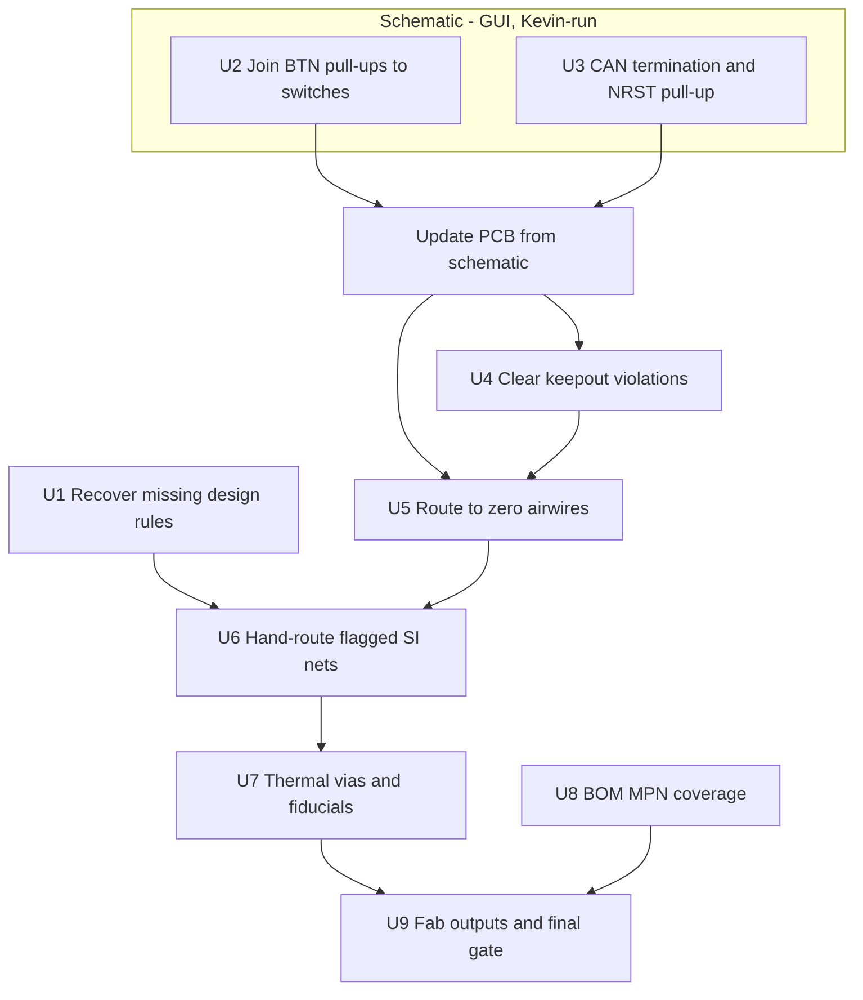

# Board3 Fab-Ready in KiCad - Plan

## Goal Capsule

- **Objective:** Take Board3 from its imported KiCad state to a board that can be ordered from JLCPCB — connectivity complete, DRC clean against real rules, signal-integrity defects fixed deliberately, and a BOM that can actually be assembled.
- **Product authority:** Kevin owns design decisions. This document owns sequencing and the completion bar.
- **Execution profile:** Real design work on a board headed for fabrication. Unlike its predecessor, mistakes here reach copper.
- **Stop conditions:** Stop and report if a fix would change circuit intent rather than implementation; if the recovered design rules contradict what the board was drawn to; or if DRC violations rise above the imported baseline of 41 after any unit.
- **Tail ownership:** Kevin runs every schematic edit — KiCad exposes no headless schematic API, so those units are GUI-only by architecture. Layout, routing, verification and fab outputs are agent-run.
- **Open blockers:** Two design rules are unrecovered — the CAN differential value and the intended USB width. U1 resolves them and gates the signal-integrity work.

---

## Product Contract

### Summary

Board3 exists in KiCad, converted faithfully and 78% routed. This plan closes the remaining 58 airwires, fixes the defects automated review found, resolves the four signal-integrity nets held out of autorouting, and produces JLCPCB-ready fabrication outputs. KiCad becomes the authoritative source for this board.

### Problem Frame

The board arrived carrying defects nobody had catalogued. Automated review over the imported design returned 128 findings, and several are fab-stopping rather than cosmetic.

Four buttons are dead: `BTN1`–`BTN4` are single-pin nets terminating at `R28.2`–`R31.2`, because each pull-up net was never joined to its switch's `BTN*_SW` net. Neither CAN transceiver has 120 Ω termination. `NRST` has no pull-up. Six vias sit inside an `Inner2` keepout. `U2` has 5 thermal vias where it needs 9 and `U4` has none where it needs 5, with untented vias that can wick solder during reflow. There are no fiducials on a board with 122 SMD parts and fine-pitch packages. The BOM carries MPNs for **0 of 48** unique parts, which alone blocks assembly.

Separately, four nets were deliberately held out of autorouting because an autorouter would have made them worse, and they carry real defects: `OSC_OUT` runs 11.17 mm against `OSC_IN`'s 6.39 mm with two vias and half its length on the bottom layer; `USB_DP_CONN` takes two vias to the bottom layer that its differential partner does not; the QSPI bus spans 10.14–39.48 mm across five different layer strategies; and both CAN `_H` legs carry vias their `_L` partners lack.

None of this was visible before the board reached a tool that could be analyzed programmatically.

### Requirements

**Connectivity**

- R1. `BTN1`–`BTN4` pull-up nets are joined to their corresponding `BTN*_SW` switch nets, so all four buttons function.
- R2. Both CAN transceivers (`U8`, `U9`) carry 120 Ω differential termination.
- R3. `NRST` carries a pull-up resistor.
- R4. The board has zero airwires — every netlist connection is realised in copper.

**Signal integrity**

- R5. The CAN differential and USB width rules are recovered from the original design and applied to the netclass.
- R6. `OSC_OUT` is rerouted short and on a single layer, with loop area comparable to `OSC_IN`.
- R7. `USB_DP_CONN` and `USB_DM_CONN` take symmetric layer transitions.
- R8. The QSPI bus is length-matched over a consistent reference plane.
- R9. `CAN1` and `CAN2` are routed as differential pairs, with symmetric vias and layer usage.

**Manufacturability**

- R10. No via or track sits inside a keepout rule area.
- R11. `U2` and `U4` carry their required thermal via counts, tented.
- R12. The board carries fiducials appropriate to its SMD population.
- R13. DRC against JLCPCB 4-layer standard rules reports no violations beyond the 41 present at import, and ideally fewer.

**Fabrication handoff**

- R14. Every unique part in the BOM carries an MPN or LCSC part number.
- R15. BOM and CPL generate in JLCPCB's expected format, with rotations verified against at least one known-orientation part.
- R16. Gerbers generate and pass a fabrication-readiness check.

**Provenance**

- R17. The EasyEDA Board3 project is not modified. KiCad is the authoritative source for this board from this plan forward.

### Scope Boundaries

- No comparison against EasyEDA. The evaluation that produced this plan is closed; its head-to-head was never run and is not wanted.
- No round-trip back to EasyEDA at any point.
- Board1 and Board2 stay in EasyEDA, untouched.
- Component placement changes only where a defect requires it. This is not a re-layout.
- The USB inrush question is not settled here — see Open Questions.

### Dependencies and Assumptions

- KiCad 10.0.5 at `C:\Program Files\KiCad\10.0\`, with `kicad-cli` invoked by absolute path via `tools/kicad_env.py`.
- Design rules come from `tools/kicad_rules.json` (JLCPCB 4-layer standard), never from the board's own `.kicad_pro` — the importer wrote KiCad's factory defaults there. See [the migration learning](../solutions/integration-issues/easyeda-pro-to-kicad-migration-silent-data-loss.md).
- Board3 as imported: 144 footprints, 107 nets, 4 copper layers, 250.25 × 50.25 mm, 41 DRC violations, 0 airwires before the strip.
- The routed board carries 58 airwires and 37 new violations over baseline.
- Schematic editing has no headless path in KiCad 10 — `pcbnew` exposes no `SCH_IO_MGR`, and `kicad-cli sch` offers only `erc`, `export`, `upgrade`.
- `kicad-happy` and `KiCadRoutingTools` are cloned beside the repo; `KICAD_HAPPY` and `KICAD_ROUTING_TOOLS` override their locations.

### Open Questions

**Resolve before the signal-integrity units**

- The CAN differential value, recorded from memory as "10mm" — which cannot be a width, since 10 mil is 0.254 mm and that is every track on the board. Likely a gap or an impedance target. U1 recovers it.
- The intended USB differential width. An action item existed to narrow it; the value was never recorded.

**Deferred**

- Whether the `+5V` bulk capacitance charging through the `U5`/`U6` ideal-diode FETs violates USB-C inrush. The original claim — 880 µF on VBUS — was disproven: VBUS carries a single 100 nF part. Whether a real inrush problem exists behind the ORing has never been analyzed, and it is a circuit question rather than a layout one.
- Whether the `starved_thermal` findings indicate real thermal relief problems or an artifact of zone refill parameters.

---

## Planning Contract

Product Contract authored here (`ce-plan-bootstrap`); the predecessor plan supplied the board state and the defect list, not the requirements.

### Key Technical Decisions

KTD1. **KiCad is authoritative for Board3 from this plan forward.** The predecessor treated the KiCad copy as a parallel experiment with EasyEDA as the source of truth. That inverts here: fixes land in KiCad and are never back-ported. EasyEDA's copy is frozen as history, which is what makes R17 a preservation requirement rather than a synchronisation one.

KTD2. **Design rules come from `tools/kicad_rules.json`, never from the board's `.kicad_pro`.** The importer wrote KiCad's factory defaults, and measuring against those reports 544 violations on a clean board. Every DRC invocation in this plan stages the real rules first.

KTD3. **The DRC bar is a delta, not an absolute.** The imported board carries 41 pre-existing violations, so "DRC clean" is unachievable by construction and would fail the source design too. R13 therefore requires no *new* violations against that baseline. `tools/kicad_verify.py` already measures this way.

KTD4. **Schematic units are GUI-only and Kevin-run.** KiCad 10 exposes no headless schematic API. Rather than pretend otherwise, R1–R3 are grouped into schematic units executed in the GUI, each followed by an explicit sync-to-PCB step. Scripting them would mean hand-editing `.kicad_sch` S-expressions, which risks the netlist for no gain.

KTD5. **The four flagged nets are hand-routed, never autorouted.** They are held out in `tools/kicad_netclass.json` precisely because an autorouter degrades them. Fixing them means deliberate routing against a stated intent — loop area for the crystal, symmetry for the pairs, length matching for QSPI — which no router optimises for.

KTD6. **Fix connectivity before layout.** U2 and U3 change the netlist by adding components and joining nets, which changes what needs routing. Routing first would mean routing twice.

### High-Level Technical Design

Three phases with a hard boundary between them: the netlist must be final before copper is finished, and copper must be final before fab outputs mean anything.

U8 runs independently of copper — it is a data problem, not a layout one — but gates U9, because a BOM without MPNs cannot be assembled regardless of how good the board is.

---

## Implementation Units

| U-ID | Title | Key files | Depends on |
|---|---|---|---|
| U1 | Recover the missing design rules | `tools/kicad_rules.json` | — |
| U2 | Join BTN pull-ups to their switches | `kicad/board3/*.kicad_sch` | — |
| U3 | CAN termination and NRST pull-up | `kicad/board3/*.kicad_sch` | — |
| U4 | Clear the keepout violations | `kicad/board3/*.kicad_pcb` | U2, U3 |
| U5 | Route to zero airwires | `tools/kicad_route.py`, `kicad/board3/` | U2, U3, U4 |
| U6 | Hand-route the four flagged nets | `kicad/board3/*.kicad_pcb`, `tools/kicad_netclass.json` | U1, U5 |
| U7 | Thermal vias and fiducials | `kicad/board3/*.kicad_pcb` | U6 |
| U8 | BOM MPN coverage | `tools/kicad_fab.py` | — |
| U9 | Fab outputs and final gate | `tools/kicad_fab.py` | U7, U8 |

### U1. Recover the missing design rules

**Goal:** Establish the CAN differential and USB width constraints the board was actually drawn to, so the signal-integrity work has a target.

**Requirements:** R5.

**Dependencies:** None.

**Files:** `tools/kicad_rules.json`

**Approach:** Read the values from EasyEDA Pro's net-class panel — they exist there and did not survive the import. Record them in the netclass block, replacing the two `unresolved` entries. If the CAN value turns out to be a differential *gap* or an impedance target rather than a width, the rules file needs a field for it rather than forcing it into `track_width`.

**Execution note:** Read-only against EasyEDA; Kevin reads the panel. Do not modify the EasyEDA project.

**Test scenarios:**
- The recovered CAN value is expressible in the netclass and is not simply the board-wide 0.254 mm.
- The recovered USB width, applied as a rule, either passes against the current `USB_DP`/`USB_DM` geometry or names exactly what fails.
- Covers R17. The EasyEDA project is unmodified, checked against its recorded hash.

**Verification:** `tools/kicad_rules.json` has no remaining `unresolved` entries, and a DRC run with the new values reports a coherent result rather than a flood.

### U2. Join BTN pull-ups to their switches

**Goal:** Make all four buttons functional.

**Requirements:** R1.

**Dependencies:** None.

**Files:** `kicad/board3/ProPrj_New Project_2026-07-15_23-14-34_2026-07-27.kicad_sch`

**Approach:** Each of `BTN1`–`BTN4` is a single-pin net ending at `R28.2`–`R31.2`; each `BTN1_SW`–`BTN4_SW` carries the switch and ground. The two were never joined. Connect them in the schematic editor, then Update PCB from Schematic.

Confirm the intended topology before wiring. A pull-up to the MCU pin with the switch pulling to ground is the obvious reading, but the MCU-side connection is what the single-pin net proves is missing — so check which pin each was meant to reach rather than assuming.

**Execution note:** GUI, Kevin-run. Verify with ERC before syncing to the PCB, not after.

**Test scenarios:**
- Each of `BTN1`–`BTN4` has at least two pins after the edit.
- `analyze_schematic.py` no longer reports `NT-001` single-pin warnings for the BTN nets.
- The MCU pin each button reaches is a valid input, confirmed against the H755 pin map.
- Covers R1. Sync-to-PCB produces four new ratlines rather than silently changing existing nets.

**Verification:** Zero single-pin BTN nets, and the PCB shows the new connections as airwires awaiting routing.

### U3. CAN termination and NRST pull-up

**Goal:** Add the two missing passive networks automated review identified.

**Requirements:** R2, R3.

**Dependencies:** None.

**Files:** `kicad/board3/ProPrj_New Project_2026-07-15_23-14-34_2026-07-27.kicad_sch`

**Approach:** Add 120 Ω termination across each CAN pair at the transceivers (`U8`, `U9`), and a pull-up on `NRST`.

Note first that `CAN1_TERM` and `CAN2_TERM` nets already exist, with `R14`/`R24` at 60.4 Ω and `H1`/`H3` jumper headers. Split termination may already be intended and merely unpopulated or unjoined — establish which before adding parts. The fix may be wiring rather than components.

**Execution note:** GUI, Kevin-run. Determine whether the existing 60.4 Ω pair plus jumpers is the intended split termination before adding anything.

**Test scenarios:**
- `analyze_schematic.py` no longer reports `PR-003` for `U8` or `U9`.
- `PU-001` for `U1` pin `NRST` clears.
- Covers R2. Termination across each pair measures 120 Ω in the intended jumper configuration.
- Any newly added part carries an MPN at creation, so it does not enlarge U8's gap.

**Verification:** Both `PR-003` findings and the `NRST` `PU-001` finding are absent from a fresh review run.

### U4. Clear the keepout violations

**Goal:** Remove the six vias sitting inside the `Inner2` rule area.

**Requirements:** R10.

**Dependencies:** U2, U3.

**Files:** `kicad/board3/ProPrj_New Project_2026-07-15_23-14-34_2026-07-27.kicad_pcb`

**Approach:** Six vias fall inside the rule area bounded by (161.64, 101.56)–(167.02, 111.65) on `Inner2`. Establish why the keepout exists before moving anything — a rule area on one inner layer usually protects a specific structure, and the right fix depends on what. Move the vias clear, or reroute their nets around the region.

**Test scenarios:**
- Covers R10. DRC reports zero `KO-001` violations.
- The nets those vias served remain connected — removing a via without rerouting creates an airwire.
- No new via lands inside either `Inner2` rule area.

**Verification:** `KO-001` count is zero and airwire count has not increased.

### U5. Route to zero airwires

**Goal:** Complete the remaining connectivity.

**Requirements:** R4.

**Dependencies:** U2, U3, U4.

**Files:** `tools/kicad_route.py`, `kicad/board3/`

**Approach:** Run the existing routing pipeline, which applies real rules, passes geometry explicitly, refuses to rewrite DRC settings, and refills zones. It closed 208 of 266 connections unattended; the remaining work is the tail it could not solve, plus whatever U2 and U3 added.

Expect the tail to need hand-routing. A router that stalls at 78% is usually blocked by congestion or by a region it cannot rip up, not by a systematic failure — inspect what is left rather than re-running with different parameters and hoping.

**Execution note:** Run the pipeline first and inspect the residue before hand-routing. The net set comes from `tools/kicad_netclass.json` so the flagged nets stay untouched.

**Test scenarios:**
- Covers R4. Airwire count reaches zero.
- The nets in `kicad_netclass.json` retain their exact track and via counts — the router must not have touched them.
- Pad-level net membership is unchanged from before routing.
- Covers R13. New DRC violations over the 41-violation baseline do not increase.

**Verification:** Zero airwires, flagged nets untouched, DRC delta no worse than before the unit.

### U6. Hand-route the four flagged nets

**Goal:** Fix the signal-integrity defects deliberately excluded from autorouting.

**Requirements:** R6, R7, R8, R9.

**Dependencies:** U1, U5.

**Files:** `kicad/board3/ProPrj_New Project_2026-07-15_23-14-34_2026-07-27.kicad_pcb`, `tools/kicad_netclass.json`

**Approach:** Each net has a stated defect and a stated intent, recorded in `tools/kicad_netclass.json`:

- **`OSC_OUT`** — 11.17 mm with 2 vias and 5.3 mm on the bottom layer, against `OSC_IN`'s 6.39 mm single-layer run. Reroute short, single-layer, tight to the load caps. Loop area is the objective, not length parity.
- **`USB_DP_CONN`** — 2 vias to the bottom layer its partner does not take. Match the transitions or remove them. At 480 Mbps this matters more than the 0.39 mm length skew.
- **QSPI** — 29 mm spread across five layer strategies. Length-match over one reference plane; `QSPI_NCS` at 39.48 mm is the outlier.
- **`CAN1_H` / `CAN2_H`** — vias their `_L` partners lack, and 8.62% skew on CAN1. Route as pairs.

As each net is fixed, move it from `preserve_flagged` to `preserve` in the netclass with its measurement updated — that file is the record of what has been dealt with.

**Execution note:** Deliberate routing against stated intent, not optimisation. Measure each net after routing and compare against the recorded defect rather than assuming the fix worked.

**Test scenarios:**
- Covers R6. `OSC_OUT` length is within a stated factor of `OSC_IN` and uses one copper layer.
- Covers R7. `USB_DP_CONN` and `USB_DM_CONN` have equal via counts and the same layer set.
- Covers R8. QSPI length spread is within a stated tolerance and every member shares a reference plane.
- Covers R9. Each CAN pair has equal via counts, matching layer usage, and skew within tolerance for 1 Mbps.
- `USB_DP` / `USB_DM` are unchanged — audited good at 0.22% skew with zero vias, and must not be disturbed.
- Covers R13. DRC delta does not worsen.

**Verification:** Every `preserve_flagged` group is promoted to `preserve` with fresh measurements, or carries a recorded reason it could not be.

### U7. Thermal vias and fiducials

**Goal:** Close the assembly and thermal findings.

**Requirements:** R11, R12.

**Dependencies:** U6.

**Files:** `kicad/board3/ProPrj_New Project_2026-07-15_23-14-34_2026-07-27.kicad_pcb`

**Approach:** `U2` needs 9 thermal vias and has 5; `U4` needs 5 and has none. Five existing vias are untented, which lets solder wick through during reflow and creates voids under the thermal pad — tenting is part of the fix, not a separate concern. Add fiducials appropriate to a 122-part SMD board with fine-pitch packages; three per populated side is the convention the review tool applies.

**Test scenarios:**
- Covers R11. `TV-001` clears for both `U2` and `U4`, and no via under either thermal pad is untented.
- Covers R12. `FD-001` clears.
- Added vias do not land in a keepout or violate hole-to-hole spacing.
- Fiducials sit clear of copper and silkscreen, with adequate mask openings.

**Verification:** `TV-001` and `FD-001` absent from a fresh review run; DRC delta not worsened.

### U8. BOM MPN coverage

**Goal:** Make the board assemblable.

**Requirements:** R14.

**Dependencies:** None.

**Files:** `tools/kicad_fab.py`

**Approach:** 0 of 48 unique parts carry an MPN, which `kicad-happy` reports as `SS-001`, a sourcing blocker. The parts came from EasyEDA with LCSC identity that did not survive as KiCad fields. Recover them — the schematic and the source project both hold supplier data, and `mcp__pcbparts__jlc_search` can resolve the remainder by parameters.

Measure the per-part cost while working. If recovery is scriptable from the source project, that is a very different migration story than 48 manual lookups, and it is worth knowing which.

**Execution note:** Work the recoverable bulk programmatically first, then count what is genuinely manual. The count is itself a finding.

**Test scenarios:**
- Covers R14. Every unique part resolves to an MPN or LCSC number.
- `SS-001` clears.
- Parts that cannot be resolved are listed explicitly rather than silently omitted from the BOM.
- Resolved numbers are stock-checked — an LCSC number with zero stock blocks assembly as effectively as no number.

**Verification:** MPN coverage reaches 48 of 48, or the shortfall is enumerated with reasons.

### U9. Fab outputs and final gate

**Goal:** Produce the files JLCPCB needs, and prove the board is ready.

**Requirements:** R13, R15, R16.

**Dependencies:** U7, U8.

**Files:** `tools/kicad_fab.py`

**Approach:** Generate gerbers, BOM and CPL in JLCPCB's expected format. Verify CPL rotation against at least one part whose correct orientation is known — rotation convention differs between tools, and a silent mismatch is an assembly defect rather than a warning.

Run the full gate last: DRC against real rules with baseline attribution, a fresh review pass, and zero airwires. This is where R13 is finally judged.

**Test scenarios:**
- Covers R15. BOM carries designator, MPN and quantity; CPL carries designator, mid X, mid Y, rotation and layer in JLC's column order.
- Covers R15. At least one known-orientation part's rotation is verified against its datasheet pin 1.
- Covers R16. Gerbers generate and the layer set matches the 4-layer stackup.
- Covers R13. DRC reports no new violations over the 41-violation import baseline.
- Covers R4. Airwire count is zero.
- A fresh `tools/kicad_review.py` run reports `CALIBRATED` with no `error`-severity findings that were absent at import.

**Verification:** A complete fab package exists and the final gate passes on every criterion above.

---

## Verification Contract

| Gate | Command | Applies to |
|---|---|---|
| Toolchain resolves | `python tools/kicad_env.py` | any |
| Automated review | `python tools/kicad_review.py kicad/board3/` | U2, U3, U7, U8, U9 |
| Routing pipeline | `python tools/kicad_route.py <board> --out <out>` | U5 |
| DRC with baseline attribution | `python tools/kicad_verify.py <board> --baseline <imported>` | U4–U9 |
| Fab outputs | `python tools/kicad_fab.py kicad/board3/` | U9 |
| Firmware suite | `wsl -- bash -lc "./tests/run-tests.sh"` | any unit touching `tools/` |

`kicad_verify.py` stages `tools/kicad_rules.json` before every DRC run; never measure against the board's own `.kicad_pro`. The firmware suite must stay at 14/14 — this plan changes no firmware, so any movement is a regression.

---

## Definition of Done

Global:

- Zero airwires.
- DRC against JLCPCB 4-layer standard rules shows no violations beyond the 41 present at import.
- Every `preserve_flagged` group in `tools/kicad_netclass.json` is resolved, or carries a recorded reason it was not.
- Automated review reports `CALIBRATED` with no new `error`-severity findings.
- BOM and CPL generate in JLCPCB format with full MPN coverage and verified rotation.
- The EasyEDA Board3 project is byte-identical to its state at the start of this plan.
- Scratch scripts and abandoned attempts are removed; a dead-end does not ship in the diff.

Per unit: each unit's Verification line is satisfied, measured rather than assumed.
