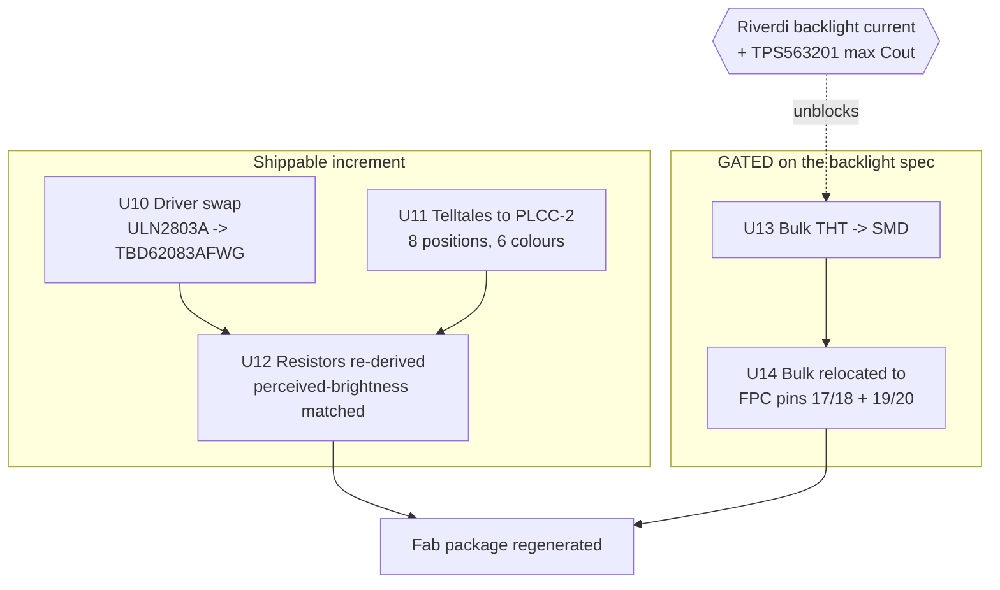
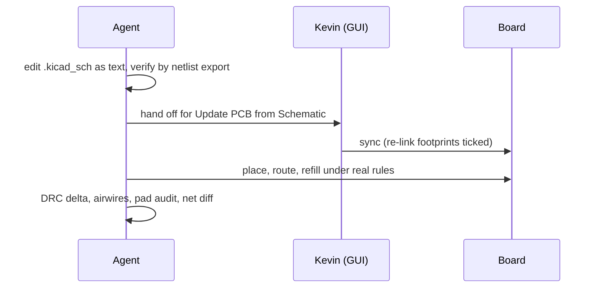

# Telltale Driver Chain and Rail Decoupling - Plan

## Goal Capsule

- **Objective:** Replace Board3's Darlington telltale driver with a DMOS array, move the telltales to the PLCC-2 package the automotive industry uses for cluster indicators, re-derive the series resistors from the resulting electrical and photometric reality, and convert the rail bulk capacitance from through-hole to SMD sited at the loads that need it.
- **Continuity:** Units continue the fab-ready plan's numbering at **U10**; requirement IDs continue at **R18**. That plan closed at U9 with the board fab-ready (36 DRC violations, NEW = 0 against the 41-violation import baseline, 0 airwires).
- **Product authority:** Kevin owns the design decisions. This document owns sequencing and the completion bar.
- **Execution profile:** Real design work on a board already declared fab-ready. Every unit must leave it fab-ready.
- **Delivery split (decided 2026-07-27):** U10-U12 are a self-contained, shippable increment. **U13-U14 are GATED** and must not be started until their blocking input arrives.
- **Stop conditions:** Stop and report if DRC rises above the 41-violation import baseline; if a part cannot be sourced with complete LCSC metadata; if the PLCC-2 pitch does not fit; or if a change would alter circuit intent rather than implementation.

---

## Product Contract

### Summary

Board3's eight telltales are driven by a ULN2803A Darlington array whose ~0.8 V saturation drop consumes up to 44% of the available headroom on the high-Vf colours, holding the blue telltale to 5 mA. Replacing it with a pin-compatible DMOS array drops that to ~5 mV and unlocks the brightness the design was aiming for. Once the driver changes, the series resistors must be re-derived anyway — which makes it the right moment to move the LEDs from 0805 to PLCC-2, the package automotive clusters use because it couples into an icon mask or light pipe instead of producing a hot spot.

Separately, the rail bulk is six 8 mm through-hole cans. Four sit on +5V clustered at the board's east end; two put 440 µF on the 3V3 buck output. They force a through-hole assembly step on an otherwise all-SMT board, and their placement serves only one of three panels.

### Problem Frame

**The driver wastes the headroom the high-Vf telltales need.** Measured from the parts themselves:

| LED | Colour | Vf | R now | I now (ULN2803A, ~0.8 V) |
|---|---|---|---|---|
| LED1/2 | green NCD0805G1 | 2.5 V | 390 Ω | 4.4 mA |
| LED3 | white KT-0805W | 2.6 V | 300 Ω | 5.3 mA |
| LED4 | blue XL-2012UBC | 3.2 V | 200 Ω | 5.0 mA |
| LED5 | orange XL-2012UOC | 2.3 V | 470 Ω | 4.0 mA |
| LED6/7 | red NCD0805R1 | 1.6 V | 270 Ω | 9.6 mA |
| LED8 | yellow KT-0805Y | 1.8 V | 300 Ω | 8.0 mA |

On the blue telltale the Darlington takes 0.8 V of the 1.8 V that remains after Vf. A Darlington's drop also never falls below ~0.7 V and varies with current and temperature, so brightness tracks part spread rather than design intent.

**A second, quieter problem:** the ULN2803A's inputs are current-driven through internal 2.7 kΩ base resistors and are specified against 5 V logic. The H755 drives them at 3.3 V. It works, but with reduced margin — and it is not a condition anyone chose.

**The telltale package is wrong for the job.** 0805 LEDs are small, narrow emitters. Cluster telltales sit behind icon masks or light pipes, which is why PLCC-2 (Osram TOPLED and equivalents) is the industry package: a large emitting surface, ~120° beam, 30-50 mA capability, and an AEC-Q102 inventory that does not exist for these generic 0805 parts.

**The bulk capacitance is in the wrong package and the wrong place.** Six `ERS1EM221F12OT` (220 µF 25 V, THT, LCSC C160162): C1/C12/C13/C14 on +5V at x=260-269, plus C2 and C16 on +3V3. Each FPC already carries a local 10 µF ceramic (C30/C31/C29), and the buck has its input cap (C51). So the 880 µF is additional, is the rail's entire electrolytic budget, and sits at one end — 18 mm from FPC3, 111 mm from FPC2, 210 mm from FPC1. If PWM'd backlight droop justifies it at FPC3, FPC1 and FPC2 are under-provisioned by two orders of magnitude. If it does not, FPC3 does not need it either. Both cannot be true.

### Requirements

**Driver**

- R18. `U10` is a DMOS/MOSFET array whose on-state drop at telltale currents is under 50 mV, replacing the ULN2803A Darlington.
- R19. The replacement is pin-compatible with the existing SOIC-18-300mil land pattern, so the swap changes parts and not layout.
- R20. The replacement's input thresholds are specified for 3.3 V logic.

**Telltales**

- R21. All eight telltales use a PLCC-2 package.
- R22. Parts are AEC-Q102 automotive grade **where that colour is stocked at LCSC**, commercial grade otherwise, with the grade recorded per part.
- R23. The LED row's existing pitch accommodates the larger package without moving neighbouring parts.

**Brightness**

- R24. Series resistors are derived from each chosen LED's Vf and luminous intensity so the eight telltales are matched in **perceived** brightness, not in current.
- R25. Each telltale runs at the highest current the chosen part and driver allow within their continuous ratings, since global dimming is done in firmware by PWM.

**Bulk capacitance** *(gated — see Scope Boundaries)*

- R26. Rail bulk capacitance is SMD, eliminating the through-hole assembly step.
- R27. Bulk is sited at each FPC's backlight supply pins (17/18 and 19/20), not clustered at one end of the board.
- R28. Total +5V bulk is sized from the panel's actual backlight current, and the resulting USB-C inrush through the U5/U6 ideal-diode ORing is stated.
- R29. The +3V3 bulk is reconciled against the TPS563201's maximum output capacitance for reliable start-up.

**Sourcing and provenance**

- R30. Every part added or changed carries the full metadata set the existing parts carry: `Supplier Part`, `Manufacturer Part`, `Manufacturer`, `JLCPCB Part Class`, `Datasheet`, `LCSC Part Name`.
- R31. Every new R/C/IC carries its value or model number in silkscreen on its own footprint body (standing project rule).
- R32. The board stays fab-ready at every unit boundary: DRC no worse than the 41-violation import baseline, zero airwires, no via inside an SMD pad.

### Scope Boundaries

- **Gated, not deferred: U13 and U14.** The bulk work is fully specified here but must not start until the Riverdi RVT70HSBNWN00 backlight current is known. Riverdi does not publish it in any indexed page; the datasheet PDF or a bench measurement is the unblocking input.
- No 6-layer restack. The reviewer's Top/GND/GND/5V proposal is directionally right about return-path integrity and infeasible on four layers — 2,072 mm of routing currently lives on the three non-top layers and would have to fit on a top layer already carrying 3,308 mm. That is a respin decision with its own plan.
- No inner-plane routing rework. Inner1 carries 934 mm of signal and Inner2 656 mm; that is the board's architecture, not a defect this plan fixes.
- No reopening of U6's walked-back crystal and QSPI work.
- No change to telltale colour assignment or count — eight positions, six colours, as built.
- Firmware is untouched. PWM dimming already exists and is how brightness is trimmed at runtime.

### Dependencies and Assumptions

- KiCad 10.0.5; `kicad-cli` and `pcbnew` reached through `tools/kicad_env.py`.
- Design rules come from `tools/kicad_rules.json`, never the board's `.kicad_pro` (KTD2 of the origin plan). The project file now carries a synced copy of those rules.
- **Update PCB from Schematic is GUI-only and Kevin-run**, with "Re-link footprints to schematic symbols based on their reference designators" ticked. It reads eeschema's cached copy, not the file — restart KiCad after any out-of-editor schematic edit or the sync silently reports no changes.
- Board3 as it stands: 36 DRC violations, NEW = 0 over the 41-violation import baseline, 0 airwires, 145 distinct references, CPL 141 rows, BOM 51 lines all sourced.
- `tools/kicad_fab.py` builds the JLC BOM from the `Supplier Part` field. A part added without it does not warn — it silently drops out of the BOM. This is why R30 is a build dependency rather than a preference.
- Assumed: the LED row's pitch accommodates PLCC-2. **U11 measures this first and stops if it does not.**

### Open Questions

**Blocking for U13-U14 only**

- Riverdi RVT70HSBNWN00 backlight LED current at full brightness, and whether the module's backlight driver takes PWM on its own dim pin. If it does, its input capacitance smooths the 5 V draw and the bulk requirement collapses.
- The TPS563201's maximum output capacitance for reliable soft-start, against the present 440 µF.

**Resolvable inside U11-U12**

- Which of the six colours are stocked at LCSC in AEC-Q102 PLCC-2, and what each one's Vf and mcd-at-test-current are.

---

## Planning Contract

Product Contract authored here (`ce-plan-bootstrap`) from the design review discussion of 2026-07-27; the origin plan supplied board state and the verification bar, not these requirements. **Product Contract preservation:** origin plan unchanged — this is a successor, not an edit.

### Key Technical Decisions

**KTD7. The driver is `TBD62083AFWG` (LCSC C165895, SOIC-18-300mil).** RDS(on) 325 mΩ, 8 channels, 2.5-30 V input, 2503 in stock. At 15 mA per channel the drop is **4.9 mV** against the Darlington's ~800 mV, and its input thresholds are specified for 3 V logic. It is the industry drop-in for the ULN2803A and matches U10's existing `SOIC-18_L11.6-W7.5-H2.7-LS10.3-P1.27` land pattern, so the board change is a part swap. `C108880` is the same die in SOP-18-300mil at roughly half the price if that land pattern turns out to suit better.

**KTD8. The LED package changes before the resistors are calculated, not after.** Both inputs to the resistor derivation — Vf and mcd — are properties of the LED. Calculating resistors for the 0805s and then swapping the package throws the calculation away. U11 therefore precedes U12, and U12 consumes U11's chosen parts.

**KTD9. Resistors are derived for equal PERCEIVED brightness, not equal current.** The eye's photopic response peaks near 555 nm, so equal current across six colours produces visibly unequal telltales. The derivation is: for each part, read luminous intensity at its test current, pick a target perceived output achievable by every colour within its continuous rating, then solve `R = (5 − V_f − I·R_DS(on)) / I` per colour. Equal-current is the starting point and the wrong answer.

**KTD10. Mixed-grade BOM, tracked per part.** AEC-Q102 where a colour is stocked in it, commercial otherwise. This maximises availability without silently downgrading the whole row, and the grade is recorded per part so a future production run can close the gaps deliberately.

**KTD11. Every unit ends fab-ready, and "DRC clean" is not the bar.** U6's regression is the standing lesson: six vias buried inside the flash's SMD pads passed DRC and passed a length/via/layer measurement, because via-in-pad is neither. Each unit's verification therefore includes the pad audit and a `kicad_measure --against` diff proving only the intended nets moved.

**KTD12. The schematic-to-board loop has a human in it.** Each unit that changes parts follows: agent edits the schematic as text → **Kevin runs Update PCB from Schematic in the GUI** → agent places, routes, verifies. This is not a limitation to engineer around; it is the one step with no CLI equivalent. Units are shaped so each needs exactly one crossing of it.

### High-Level Technical Design

The dependency that matters is U10 **and** U11 both feeding U12: the resistor value for each telltale depends on the driver's drop and on that LED's Vf and mcd. U10 and U11 are independent of each other and can be authored in either order, but both must land before U12's arithmetic is real.

Per-unit, the loop is the same shape:

---

## Implementation Units

| U-ID | Title | Key files | Depends on |
|---|---|---|---|
| U10 | Driver swap to TBD62083AFWG | `kicad/board3/*.kicad_sch`, `*.kicad_pcb` | — |
| U11 | Telltales to PLCC-2 | `kicad/board3/*.kicad_sch`, `*.pretty/`, `*.kicad_pcb` | — |
| U12 | Resistors re-derived | `kicad/board3/*.kicad_sch`, `*.kicad_pcb` | U10, U11 |
| U13 | Bulk THT to SMD **(gated)** | `kicad/board3/*.kicad_sch`, `*.pretty/` | backlight spec |
| U14 | Bulk relocated to FPC pins **(gated)** | `kicad/board3/*.kicad_pcb` | U13 |

### U10. Swap the Darlington array for a DMOS array

**Goal:** Get the ~0.8 V driver drop out of the telltale chain.

**Requirements:** R18, R19, R20, R30, R31.

**Dependencies:** None.

**Files:** `kicad/board3/ProPrj_New Project_2026-07-15_23-14-34_2026-07-27.kicad_sch`, `kicad/board3/ProPrj_New Project_2026-07-15_23-14-34_2026-07-27.kicad_pcb`

**Approach:** Change U10's part from `ULN2803A` (C181731) to `TBD62083AFWG` (C165895) by editing the symbol's properties in place — value, footprint if the land pattern differs, `Supplier Part`, `Manufacturer Part`, `Manufacturer`, `JLCPCB Part Class`, `Datasheet`, `LCSC Part Name`. Confirm before editing that the two parts agree on all 18 pins: inputs 1-8, GND 9, COM 10, outputs 11-18, and that the replacement carries the output clamp diodes to COM that the flyback path relies on. If the existing SOIC-18 land pattern matches, the PCB change is nil and no re-placement is needed.

**Execution note:** Verify the pinout against the datasheet before touching the schematic. A "pin-compatible" part that is not is the failure mode here, and it is silent until assembly.

**Patterns to follow:** The property set on any existing sourced part; `tools/kicad_lcsc.py` documents which field names this project reads.

**Test scenarios:**
- Covers R18. Netlist export shows U10's eight input nets and eight output nets unchanged, node-for-node, against the pre-edit netlist.
- Covers R19. The footprint property is unchanged, or if changed, the new land pattern is verified against the part's datasheet dimensions.
- Covers R30. `python tools/kicad_fab.py kicad/board3/ --out fab/` reports the same "51 sourced, 0 without LCSC or MPN" — the new part appears with its LCSC code, not blank.
- Covers R32. DRC delta is zero and airwires stay at 0.
- ERC delta is zero or fully attributable to the part change.

**Verification:** U10 carries the DMOS part with complete metadata, the netlist is unchanged, and the board is untouched or re-verified.

### U11. Move the telltales to PLCC-2

**Goal:** Put the eight telltales in the package cluster indicators actually use.

**Requirements:** R21, R22, R23, R30, R31.

**Dependencies:** None.

**Files:** `kicad/board3/ProPrj_New Project_2026-07-15_23-14-34_2026-07-27.kicad_sch`, `kicad/board3/ProPrj_New-easyedapro.pretty/`, `kicad/board3/ProPrj_New Project_2026-07-15_23-14-34_2026-07-27.kicad_pcb`

**Approach:** **Measure the LED row pitch first.** LED1-8 sit evenly spaced along the visible edge; PLCC-2 is ~3.5 × 2.8 mm against the 0805's 2.0 × 1.25 mm. If the pitch does not take the larger body with courtyard clearance, stop and report rather than compressing the row — telltale spacing is a human-factors decision, not a layout one.

Then select parts per colour — green ×2, white, blue, orange, red ×2, yellow — taking AEC-Q102 where that colour is stocked and commercial where it is not, recording grade, Vf and luminous-intensity-at-test-current for each, because U12 consumes all three. Add the PLCC-2 footprint to the project library if the stock KiCad land pattern is not appropriate, then swap each symbol's part and footprint.

**Execution note:** The pitch measurement gates everything else in this unit. Take it before selecting a single part.

**Test scenarios:**
- Covers R23. Measured centre-to-centre pitch of LED1-8 minus the PLCC-2 courtyard width leaves non-negative clearance, reported as a number.
- Covers R21/R22. Each of the eight positions carries a PLCC-2 part; a grade column records AEC-Q102 or commercial per part.
- Covers R30. All eight carry complete supplier metadata and appear in the regenerated BOM.
- Covers R32. Post-sync DRC delta is zero, airwires 0, and no via lands inside any new LED pad.
- The eight LED nets keep their existing node sets — the swap changes parts, not connectivity.

**Verification:** Eight PLCC-2 telltales on the board, pitch verified by measurement, every part sourced, board fab-ready.

### U12. Re-derive the series resistors for matched perceived brightness

**Goal:** Set each telltale's current so the row looks even at full brightness, with firmware PWM as the global dimmer.

**Requirements:** R24, R25, R30, R31.

**Dependencies:** U10, U11.

**Files:** `kicad/board3/ProPrj_New Project_2026-07-15_23-14-34_2026-07-27.kicad_sch`, `kicad/board3/ProPrj_New Project_2026-07-15_23-14-34_2026-07-27.kicad_pcb`

**Approach:** For each of the eight positions, solve `R = (5 − V_f − I·R_DS(on)) / I`, where `I` comes from equalising luminous intensity across colours rather than equalising current. Bound `I` by the lower of the LED's continuous rating and a sane derate; the driver is not the constraint (500 mA/channel, and eight channels at 15 mA dissipates under a milliwatt in total). Snap to E24 values available as LCSC Basic parts and record the resulting current and the deviation from target for each position.

Worth stating for review: at a uniform 15 mA the values would be green 160 Ω, white 160 Ω, blue 120 Ω, orange 180 Ω, red 220 Ω, yellow 220 Ω. **These are the equal-current answer and therefore the wrong one** — they are included only as the sanity check the real derivation should beat.

**Execution note:** Show the arithmetic in the commit. Someone will want to re-derive this when a colour goes out of stock, and the inputs (Vf, mcd, test current) matter more than the answer.

**Test scenarios:**
- Covers R24. A table records, per position: part, Vf, mcd at test current, chosen I, chosen R, resulting I, and relative perceived output — with the spread across the eight positions stated.
- Covers R25. No position exceeds its LED's continuous current rating; the margin is stated per position.
- Covers R30. Every changed resistor value resolves to an in-stock LCSC Basic part with complete metadata.
- Covers R32. DRC delta zero, airwires 0.
- Sum of telltale currents is within the driver's per-channel and package limits, stated as a number.

**Verification:** Eight resistors re-valued from measured part data, the derivation recorded, board fab-ready.

### U13. Convert rail bulk from through-hole to SMD — **GATED**

> **Do not start.** Blocked on the Riverdi RVT70HSBNWN00 backlight current and the TPS563201's maximum output capacitance. Starting this without those numbers means guessing at a rail whose IR-drop behaviour has already cost a bench night.

**Goal:** Remove the through-hole assembly step and size the bulk to the actual load.

**Requirements:** R26, R28, R29, R30, R31.

**Dependencies:** Backlight current spec; TPS563201 max Cout.

**Files:** `kicad/board3/ProPrj_New Project_2026-07-15_23-14-34_2026-07-27.kicad_sch`, `kicad/board3/ProPrj_New-easyedapro.pretty/`

**Approach:** Size total +5V bulk from the backlight current and the PWM behaviour, then choose SMD parts. `189RV0019` (LCSC C7471881, 220 µF 35 V, D6.3 × 7.7 mm, **ESR 160 mΩ, 600 mA ripple**) is the leading candidate precisely because it publishes ESR and ripple; the cheaper 220 µF SMD parts rate 120-150 mA ripple, which matters if these absorb PWM pulses. Separately, reconcile the 440 µF on +3V3 (C2, C16) against the buck's stated maximum and reduce if it exceeds it.

**Test scenarios:**
- Covers R28. Total +5V bulk is stated with the calculation from backlight current, and the resulting inrush through the U5/U6 ideal diodes at USB-C attach is stated in amps.
- Covers R29. The +3V3 bulk is at or under the TPS563201's documented maximum, with the figure cited.
- Covers R26. No through-hole capacitor remains on either rail; the CPL shows the parts as SMD.
- Covers R30/R32. All parts sourced; DRC delta zero; airwires 0.

**Verification:** Rail bulk is SMD, sized from a cited number rather than inherited, and the inrush consequence is written down.

### U14. Relocate bulk to the FPC backlight pins — **GATED**

> **Do not start.** Depends on U13.

**Goal:** Put the bulk where the current is drawn.

**Requirements:** R27, R31, R32.

**Dependencies:** U13.

**Files:** `kicad/board3/ProPrj_New Project_2026-07-15_23-14-34_2026-07-27.kicad_pcb`

**Approach:** Place bulk adjacent to each FPC's backlight supply pins — 17/18 (BLVDD) and 19/20 (BLGND) — on FPC1, FPC2 and FPC3, rather than the present cluster at x=260-269. Present distances to the nearest +5V bulk are FPC1 210 mm, FPC2 111 mm, FPC3 18 mm; the target is comparable and short for all three. Route the connections short and wide, and take the ground return to the pour rather than a thin trace — the shared-ground IR-drop learning in `docs/solutions/` is exactly this failure.

**Test scenarios:**
- Covers R27. Distance from each FPC's backlight pins to its nearest bulk capacitor is stated for all three and is within the target set in U13.
- Covers R32. DRC delta zero, airwires 0, and the pad audit shows no via inside an SMD pad.
- `kicad_measure --against` shows only the intended nets changed.
- Each FPC's backlight ground return reaches the pour with at least two vias.

**Verification:** All three panels have local bulk, measured; board fab-ready.

---

## Verification Contract

| Gate | Command | Applies to |
|---|---|---|
| Toolchain resolves | `python tools/kicad_env.py` | any |
| Schematic connectivity | `kicad-cli sch export netlist` — the netlist KiCad syncs from | U10-U13 |
| DRC with baseline attribution | `python tools/kicad_verify.py <board> --baseline <import>` | U10-U14 |
| Net-level change proof | `python tools/kicad_measure.py <board> --against <before>` | U10-U14 |
| Via-in-pad audit | pad-vs-via scan across all four layers | U11, U12, U14 |
| Sourcing and fab outputs | `python tools/kicad_fab.py kicad/board3/ --out fab/` | U10-U14 |
| Automated review | `python tools/kicad_review.py kicad/board3/` | U11, U14 |

The DRC bar is a delta, not an absolute: no new violations over the 41-violation import baseline. The review harness's calibration must report `CALIBRATED` — if it reports `STALE`, its fixture needs repointing before its findings mean anything.

## Definition of Done

- U10-U12 complete: the DMOS driver is in place, eight PLCC-2 telltales are fitted, and the series resistors are derived from measured Vf and mcd for matched perceived brightness.
- Every added or changed part carries complete LCSC metadata and a silkscreened value on its own footprint body.
- The board is fab-ready at the same bar the origin plan set: DRC no worse than the 41-violation import baseline, zero airwires, no via inside an SMD pad.
- `fab/` is regenerated so the BOM, CPL and gerbers reflect the new parts.
- U13 and U14 remain explicitly gated, with their blocking inputs named, until the backlight current and the buck's maximum output capacitance are known.
