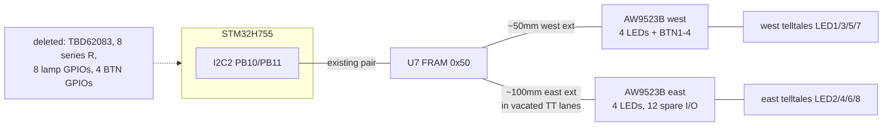

# I2C Peripheral Consolidation — Board3 Revision — Plan

## Goal Capsule

- **Objective:** Move Board3's eight telltales and four user buttons onto the existing I2C bus: two AW9523B expander/LED-driver ICs replace the TBD62083 DMOS array, all eight series resistors, and the four button home-runs. Brightness matching moves from resistor derivation to a per-channel firmware calibration table seeded with measured photometry.
- **Branch:** `feat/board3-i2c-revision`, cut from `main` after PR #9 (the KiCad evaluation campaign) merges. This is the next board revision's opening campaign.
- **Continuity:** Units continue the shared ID space (KTD8 of plan 002) at **U19**; requirements at **R39**. Check plans 002 and 003 before claiming any ID.
- **Product authority:** Kevin owns the design decisions; the two-IC topology, the bus tap at the FRAM, and superseding the resistor derivation were each discussed and confirmed 2026-07-28.
- **Stop conditions:** Stop if the AW9523B's LED-mode current ceiling cannot reach the calibration targets; if the freed-pin or copper accounting turns out materially worse than estimated; or if a change would alter telltale colour assignment or count.

---

## Product Contract

### Summary

Consolidate the telltale drive and button input onto I2C2 (already routed for the FRAM), freeing 12 MCU pins and a net ~0.9 m of copper, and replacing the six-datasheet resistor-matching problem with a calibratable firmware table. The landed six-LED 3528 set stays exactly where U11 put it.

### Problem Frame

The current architecture spends copper and pins on slow signals. Eight lamp lines run from U1's south edge to the DMOS driver, whose outputs return across the board as 79–111 mm Inner1 runs to reach the east LED cluster; four button lines run ~100 mm each from the bottom-left corner to U1's west edge. All twelve are static or human-speed signals.

Meanwhile the matching problem U12 was written to solve got harder the more it was measured: the six single-colour LEDs span two vendor series (mcd figures not comparable — see `docs/solutions/conventions/luminous-intensity-is-not-comparable-across-parts.md`), the white publishes flux rather than intensity, and bin spreads cap any resistor derivation at roughly ±30%. Fixed resistors freeze those errors into copper; per-channel current/PWM control makes them a calibration table instead.

The AW9523B resolves both at once: 16 I/O per device, a built-in 256-step per-channel LED current driver (no series resistors), interrupt output and input anti-jitter for buttons, 400 kHz I2C, −40~+85 °C, $0.34 at 65k stock.

### Requirements

- R39. All eight telltales are driven by AW9523B LED-mode channels; the TBD62083 and all eight series resistors are removed. Per-position brightness is set in firmware, seeded from the measured photometry in plan 003's KTD13 and the white-LED datasheet answer.
- R40. BTN1–BTN4 are read through AW9523B GPIO inputs; their four home-run traces are removed. The trip button stays on PC13; NRST and BOOT0 stay hardwired.
- R41. Both ICs sit on I2C2, tapped forward from the FRAM (U7) as a continuous trunk — no new MCU pins. PD0–PD7 and the four BTN pins become unassigned in the pin map.
- R42. Telltale behaviour visible to the dash logic is unchanged: `dash_telltales.h` consumers and `dash_button.h` debounce logic keep their contracts; only the sample/drive glue in the `.ino` changes. Host tests stay green untouched.
- R43. The board stays fab-ready at every unit boundary per the standing bar (identity-keyed DRC NEW = 0, 0 airwires, no via in pad), with full LCSC metadata and silkscreen values on every new part (standing R30/R31 rules).
- R44. Plans 002 and 003 carry explicit supersession notes for everything this revision obsoletes; nothing is deleted from `docs/plans/`.

### Scope Boundaries

- **Not obsoleted, still gated:** U13/U14 (bulk capacitance SMD conversion and relocation) remain live in plan 003, gated on the Riverdi backlight current. This plan does not touch the rails.
- The crystal-lane thread (IO0's escape via, X1's walked-back move) is a separate open item; this plan must not touch the crystal/QSPI corner.
- No change to telltale colour assignment or count — eight positions, six colours, the U11 part set as landed.
- Trip button (PC13), NRST, BOOT0 stay physically wired — straps and a nothing-else-useful pin.
- The F767/Teensy bench firmware branches are untouched; only the STM32 carrier branch changes.

#### Deferred to Follow-Up Work

- Repurposing the 12 freed MCU pins (contiguous PD0–PD7 bank plus four west-edge pins) — record as available, design nothing against them here.
- The 12 spare I/O on the east AW9523B — same treatment.

### Dependencies and Assumptions

- PR #9 merged; branch cut from that baseline. All layout work applies the standing toolchain (`tools/kicad_env.py`, rules from `tools/kicad_rules.json`, gates below).
- KTD12 discipline holds: schematic edits as text → **Kevin runs Update PCB from Schematic in the GUI** (KiCad restarted first) → agent places, routes, verifies. Footprint changes in this plan genuinely need the sync.
- **Assumption to verify at execution (stop condition if false):** the AW9523B's LED-dim mode reaches ≥ 20 mA per channel with usable resolution at the row's target currents (10–20 mA). The LCSC listing supports it (IOL 20 mA, "built-in LED driver"); the datasheet's I_LED curve is the authority.
- Bus health: trunk grows to ~200 mm with 4 devices (FRAM, 2× AW9523B, headroom) — well inside 400 pF at 400 kHz. R5/R8 pull-up values checked at execution; drop toward 2.2–4.7 kΩ if edges sag.

### Open Questions

- AW9523B I2C addresses (two AD pins → 4 addresses): pick two that cannot collide with the FRAM's 0x50-block; record in the pin map. Execution-time, from the datasheet.
- Whether the expander INT line is wired to a freed MCU pin or left unused (default: unused — `dash_button.h` polls at loop rate with 30 ms debounce, and the AW9523B's anti-jitter stacks under it harmlessly).
- Fate of R28–R31 (the button-line resistors): delete if they are pull-ups the expander makes redundant, keep if they are series/ESD. Execution-time, from the schematic.

---

## Planning Contract

### Key Technical Decisions

**KTD15. One part number, two ICs, placed by cluster.** AW9523BTQR (`C148077`, TQFN-24, $0.34, 65k stock) at both LED clusters: the west IC (at/near the vacated TBD62083 site, x≈85) drives the four west telltales and reads BTN1–4 — buttons and west LEDs share the same board corner; the east IC (near x≈230) drives the four east telltales. One extended-part fee covers both. Fallback pair if the LED-mode current check fails: TLC59108IPWR (`C130031`, true constant-current 120 mA/ch, but 2.1k stock at $1.85) + PCF8574DWR (`C22396383`) for buttons — three ICs, two part numbers, same topology.

**KTD16. The bus taps forward from the FRAM, not from U1.** I2C is a trunk topology; U7 sits at the west end of the north corridor with the U1→U7 pair already routed. West extension ~50 mm to the vacated driver site; east extension ~100 mm **reusing the lanes the deleted TT runs free up**. Copper accounting: ~900 mm removed (8× MCU→driver traces, long TT_OUT runs, button home-runs) against ~300 mm added.

**KTD17. U12 is superseded unfabbed.** The resistor derivation dies without ever reaching copper: its inputs (KTD13's photometry, the white's 7.5/8.5 lm datasheet answer) become the seed values of the firmware calibration table instead. The current board rev is *not* taken through a resistor-matched intermediate state. Confirmed 2026-07-28.

**KTD18. Firmware keeps its seams.** `dash_telltales.h` and `dash_button.h` are host-tested pure headers that consume state; they do not change. The `.ino`'s STM32 branch swaps `digitalWrite`/`digitalRead` glue for I2C register writes/reads against the two devices. The calibration table is a pure-header data structure (host-testable) mapping position → 8-bit dim code, seeded from measured mcd ratios, trimmed on the bench.

**KTD19. Known accepted risk: common-mode bus failure.** Buttons, lamps, and FRAM share two wires; a wedged SDA takes all three down. Accepted because the alarm path is the three EVE panels over SPI, the car's real input arrives by CAN, and standard bus recovery (clock-out-9 + re-init on watchdog) is cheap firmware. Recorded here so nobody rediscovers it as a surprise.

### High-Level Technical Design

Removed against added, per side: MCU→driver 8×~65 mm and the 79–111 mm TT_OUT Inner1 runs go; the bus extensions ride the vacated lanes. LED cathode wiring becomes local to each cluster IC.

---

## Implementation Units

| U-ID | Title | Key files | Depends on |
|---|---|---|---|
| U19 | Schematic: two AW9523B, deletions, bus tap | `kicad/board3/*.kicad_sch` | — |
| U20 | Board: place, rip, route, verify | `kicad/board3/*.kicad_pcb` | U19 + GUI sync |
| U21 | Firmware glue + calibration table | `MustangDash/MustangDash.ino`, `MustangDash/dash_calibration.h` (new), `tests/` | — (parallel) |
| U22 | Docs: pin map, supersession notes, fab regen | `docs/hardware/board3-h755-pin-map.md`, plans 002/003, `fab/` | U19–U21 |

### U19. Schematic — two AW9523B, the deletions, the bus tap

**Goal:** The netlist describes the consolidated architecture.

**Requirements:** R39, R40, R41, R43.

**Files:** `kicad/board3/ProPrj_New Project_2026-07-15_23-14-34_2026-07-27.kicad_sch`

**Approach:** Import AW9523BTQR via `python tools/kicad_lcsc.py add C148077` (never a stock symbol). Delete the TBD62083 (U10), the eight telltale series resistors, and the BTN home-run connectivity; resolve R28–R31 per the open question. Wire: west IC — 4 LED cathodes + BTN1–4 + I2C + AD pins strapped to its chosen address + decoupling; east IC — 4 LED cathodes + I2C + address + decoupling. LED anodes stay on +5V as today. Verify by netlist export: the eight `TT*_LED_K` nets terminate at AW9523B pins; `BTN1–4` terminate at the west IC; the I2C nets gain exactly two device loads.

**Test scenarios:**
- Netlist diff against pre-change: only the intended nets change; each LED keeps its position↔net identity (the U11 polarity lesson — verify by export, not inspection).
- ERC delta zero or fully attributable; `kicad_lcsc.py check` PASS with the new parts mapped and modelled; `duplicates` reports no code/value conflict.
- Address strap check: the two AD configurations differ and neither lands in the FRAM's address block.

**Verification:** Netlist proves the topology; all gates green; board deliberately not yet synced (not fab-ready at this boundary — say so on any interim commit).

### U20. Board — place, rip, route, verify

**Goal:** The copper matches U19, and the board is fab-ready again.

**Requirements:** R39, R40, R41, R43.

**Dependencies:** U19, then Kevin's GUI sync (restart KiCad first; re-link by reference ticked).

**Files:** `kicad/board3/ProPrj_New Project_2026-07-15_23-14-34_2026-07-27.kicad_pcb`, `tools/handroutes/u20-*.json`

**Approach:** West IC at/near the vacated TBD62083 site; east IC adjacent to the east cluster, clear of the y=90–95 band U11 marked as spoken for and clear of the crystal/QSPI corner. Rip the TT_OUT runs, the MCU→driver traces, and the button home-runs; route bus extensions in the vacated lanes as handroute specs (house style — reviewable text, applied atomically). **Search every copper layer before placing any via** (the session's thrice-paid lesson: read board facts through `pcbnew`, never regex).

**Test scenarios:**
- Identity-keyed `kicad_verify` NEW = 0 against pre-U20; unconnected 0; airwires 0.
- Via-in-pad audit: `analyze_pcb.py --full` shows only the pre-existing U1:93 finding.
- `kicad_measure --against` lists exactly the intended nets — anything else moving means a rip caught foreign copper.
- Inner1 signal length shrinks by roughly the TT_OUT total (~300 mm) — measured, stated in the commit.

**Verification:** Fab-ready at the standing bar; renders refreshed; `fab/` regenerated under KiCad's interpreter.

### U21. Firmware — I2C glue and the calibration table

**Goal:** Same dash behaviour, new transport; matching becomes data.

**Requirements:** R39, R40, R42.

**Files:** `MustangDash/MustangDash.ino` (STM32 branch only), `MustangDash/dash_calibration.h` (new pure header), `tests/test_dash_calibration.c` (new)

**Approach:** The STM32 branch's lamp-write and button-read glue becomes AW9523B register I/O over I2C2 (bus shared with the FRAM per the pin map's existing Wire note). `dash_telltales.h` and `dash_button.h` are not modified. The calibration table is a pure header: per-position 8-bit dim codes, seeded from the measured row (green 1300, white ~2700 typ/2390 min, blue 350, red 270, yellow 210, orange ~1800-loose mcd at 20 mA), normalised so the dimmest position sets the ceiling. Include bus recovery (clock-out-9 + re-init) in the glue per KTD19.

**Execution note:** table logic test-first on the host (it is pure math); the I2C glue is compile-gated, not host-tested.

**Test scenarios:**
- Host: seed table maps the measured mcd row to monotone dim codes; dimmest position pegs at maximum; a per-position trim override survives normalisation; white uses the min-bin figure per plan 003's guidance.
- Host: existing `dash_button.h` tests stay green untouched (R42 proof).
- Compile: `pio run -e h743` SUCCESS; Teensy target unaffected (branch is `#ifdef`'d out).

**Verification:** Host suite green including the new table tests; both compile targets clean.

### U22. Docs — pin map, supersession, fab

**Goal:** Every document that claims to be authoritative agrees with the new architecture (R44).

**Requirements:** R41, R44.

**Dependencies:** U19–U21.

**Files:** `docs/hardware/board3-h755-pin-map.md`, `docs/plans/2026-07-27-003-feat-telltale-driver-and-rail-decoupling-plan.md`, `docs/plans/2026-07-27-002-fix-board3-fab-ready-in-kicad-plan.md`, `CLAUDE.md`

**Approach:** Pin map first (its own rule: changes land there first): PD0–PD7 and the four BTN pins unassigned; the two AW9523B addresses and INT disposition recorded; lamps/buttons rows re-pointed at the expanders. Plan 003: supersession note on U12 and KTD9 (resistor derivation superseded by firmware calibration, photometry retained as seed data); U13/U14 explicitly reaffirmed as live-gated. Plan 002: one cross-reference. CLAUDE.md: the telltale/button architecture summary updated.

**Test scenarios:** Test expectation: none — documentation unit; verification is the cross-document consistency check (pin map, sketch pin table, schematic, and plans name the same pins and addresses).

**Verification:** No document still claims the DMOS/resistor architecture as current.

---

## Alternatives Considered

- **Analog RGB (one part, colour by channel mix):** rejected — washed-out orange/yellow (620+522 nm mixing), redoes the just-landed LED row, still needs 12 resistors.
- **Addressable RGB (WS2812-class):** rejected — chain failure topology on indicator lamps, 800 kHz protocol firmware, marginal temp bins, level-shift part; the AW9523B route gets the same wire savings without replacing the LED set.
- **White LEDs + colour-printed mask:** parked, not rejected — depends on whether the bezel/icon film will carry colour; revisit at enclosure design.
- **Soft-PWM on existing hardware (zero cost):** genuinely viable and rejected only because this plan is a board revision anyway; its insight (per-channel duty beats resistor precision) survives as the calibration table.

## Verification Contract

| Gate | Command | Applies to |
|---|---|---|
| Toolchain resolves | `python tools/kicad_env.py` | any |
| Netlist connectivity | `kicad-cli sch export netlist` diff | U19 |
| DRC identity delta | `python tools/kicad_verify.py <board> --baseline <pre>` | U20 |
| Net-level change proof | `python tools/kicad_measure.py <board> --against <pre>` | U20 |
| Via-in-pad | `analyze_pcb.py --full --compact`, zero new VP-001 | U20 |
| Parts | `python tools/kicad_lcsc.py check` + `duplicates` | U19, U20 |
| Host tests | `./tests/run-tests.sh` (WSL) | U21 |
| Firmware compile | `pio run -e h743` | U21 |
| Fab package | `kicad_fab.py` under KiCad's interpreter, `fab/gerbers/` emptied first | U22 |

## Definition of Done

- Both AW9523Bs on the schematic and board with full metadata; TBD62083, eight resistors, and twelve home-run traces gone; board fab-ready at the standing bar with `fab/` regenerated.
- Firmware compiles for the carrier target with the calibration table host-tested; existing host suite untouched and green.
- Pin map, plans 002/003, and CLAUDE.md agree with the built architecture; U12 carries its supersession note; U13/U14 remain visibly live-gated.
- The AW9523B LED-current assumption verified against the datasheet before any copper moves — or the stop condition fired and the fallback pair was substituted with the same topology.
