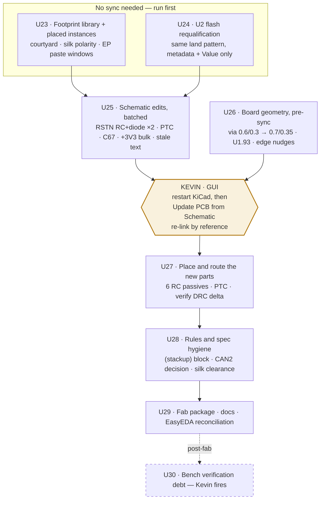

# Board3 Pre-Fab Blocker Close-Out — Plan

## Goal Capsule

- **Objective:** Close the 1 CRITICAL + 5 HIGH confirmed findings from the 2026-07-31 six-lens pre-fab review, plus the recommended MEDIUM sweep, so Board3 can be released to JLCPCB. The copper is already clean (0 DRC violations, all nets connected); this campaign is footprint-library, schematic, sourcing, and rules work — not a re-route.
- **Branch:** `fix/board3-prefab-blockers`, cut from `main`.
- **Continuity:** Units continue the shared ID space at **U23**; requirements at **R45**; decisions at **KTD21**. Check plans `2026-07-24-001`, `2026-07-27-002`, `2026-07-27-003`, and `2026-07-28-001` before claiming any ID.
- **Product authority:** Kevin owns the design decisions. Five scope forks were presented at plan time and are recorded as KTD21–KTD25 under stated defaults — each is cheap to flip before execution starts, expensive after.
- **Stop conditions:** Stop if the Riverdi backlight-current measurement lands outside the range the PTC was sized for (re-size, do not proceed); if the AW9523B RSTN input threshold turns out incompatible with an RC from `/+5V`; if the U2 replacement's pinout is not pin-for-pin against the incumbent; or if the via-diameter bump introduces any new DRC violation that cannot be cleared without moving copper.

---

## Product Contract

### Summary

Board3's pre-fab review returned NO-GO on four conditions. Two are electrical and need new parts on the schematic (AW9523B reset sequencing; no overcurrent protection anywhere). One is a footprint-library defect class that makes three separate assembly checks silently vacuous (no courtyard on the AW9523B, no printed polarity mark on three telltale LEDs, unwindowed paste over all three exposed pads). One is sourcing (the QSPI flash has four units of stock). The recommended MEDIUM sweep — capacitor value reconciliation, via annular-ring margin, via-in-pad, edge clearance, an explicit stackup, and the CAN impedance target — is cheap now and expensive once gerbers ship.

The campaign's load-bearing structure is that **schematic changes require a manual Kevin-in-the-GUI sync (KTD12) and footprint-library changes do not.** Every schematic edit is therefore batched behind a single sync gate, and every non-schematic fix is sequenced to land either side of it without needing a second one.

### Problem Frame

The review verdict is NO-GO with six findings that each survived two independent refutation attempts (12 attempts, 0 refutations). Nothing in it questions the copper: DRC is clean at all severities via two independent tool paths, every multi-pad net is connected including the historically fragile `/+5V` telltale daisy-chain, and all measured geometry sits inside JLCPCB's capability envelope. The defects are in categories the routing work never touched.

Two of them exist *because* of a decision this project made deliberately. KTD17 removed the eight telltale series resistors and the DMOS driver in favour of the AW9523B's POR-default-safe GPIO state — and plan `2026-07-28-001` recorded the exposure at the time ("Removing all series resistors leaves no passive current limit in unconfigured states; POR defaults unchecked", P2, adversarial, confidence 75). The pre-fab review closed that loop with a vendor citation: the datasheet requires RSTN held low ~100 µs after VCC, and RSTN is hard-tied to `/+5V` on both ICs. The safety argument and the sequencing violation are the same mechanism seen from two ends.

The footprint findings are a different failure shape and the more instructive one: a check that cannot fail is not a passing check. `check_courtyard_overlaps` reported U11/U12 clean because the AW9523B footprint contains zero courtyard geometry. This is the same class already banked in `docs/solutions/conventions/a-gate-that-cannot-pass-gets-waved-through.md`, and it is why the plan verifies each footprint fix by asserting the check now *has something to test*, not merely that it passes.

### Requirements

- **R45.** Both AW9523B expanders (U11, U12) hold RSTN low for ≥100 µs after `/+5V` establishes, per the datasheet's Figure 6 power-on sequence, and recover correctly across a brownout-and-restore cycle rather than only a cold start.
- **R46.** The `/+5V_BARREL` input carries a resettable overcurrent element between DC1 and the Q2/U6 ideal-diode path, sized from a stated load figure with its temperature derating shown.
- **R47.** The AW9523BTQR footprint carries courtyard geometry in both the library and both placed board instances, so courtyard tooling tests real geometry on U11 and U12.
- **R48.** Every telltale LED position carries a cathode indicator on printed silkscreen (`F.SilkS`), not only on `F.Fab`. LED4, LED6, and LED7 are the three that do not today.
- **R49.** All three exposed-pad parts (U11, U12 QFN-24 EP 2.8 × 2.8 mm; U2 WSON-8 EP 5.2 × 4.65 mm) print windowed paste apertures in the 50–70 % coverage band, in both library and placed instances.
- **R50.** U2 is sourced to a part whose JLCPCB stock carries real order margin, on the identical land pattern, with its pinout verified pin-for-pin against the incumbent. U1's stock is re-verified in the same pass.
- **R51.** Every schematic artifact, its sourced LCSC part, and the board footprint's `Value` agree on component value — C67 is the known disagreement (schematic "22 µF" / sourced C19702 10 µF / board footprint "10 µF").
- **R52.** The board-wide default via carries annular-ring margin above JLCPCB's 0.15 mm absolute floor, and the one via-in-pad at U1.93 is either plugged by an explicit fab option or re-fanned.
- **R53.** P1, P2, and DC1 sit ≥0.5 mm from the board edge; USBC1's courtyard overhang is either nudged clear or recorded as a deliberate edge-launch exception.
- **R54.** The `.kicad_pcb` carries an explicit `(stackup)` block matching the ordered JLCPCB template, so no impedance number rests on an unenforced assumption.
- **R55.** CAN2's differential geometry and the 120 Ω target in `tools/kicad_rules.json` agree — either the routing is opened to the target gap, or the target is retired with the reasoning recorded.
- **R56.** Schematic annotations describe the as-built architecture. The `U10`/TBD62083 telltale-chain text, the `R25`–`R48` series-resistor table, the `CN4`/`CN5` SN65HVD230 breakout text, and the "5V/15A" supply note are all superseded.
- **R57.** The `+3V3` bulk capacitance sits inside the TPS563201's D-CAP2 stability window (20–68 µF), independent of the backlight-current gate blocking plan 003's U13/U14.
- **R58.** ERC and power-tree analysis are re-run against the authoritative EasyEDA project before sign-off, since the entire review ran against the KiCad copy with the bridge down.

### Scope Boundaries

**In scope.** The four blocking conditions; the MEDIUM sweep listed in R51–R57; the schematic-annotation cleanup; regeneration of the fab package and renders; the EasyEDA reconciliation pass.

**Deferred to follow-up work.**

- **The +5 V bulk relocation and THT→SMD conversion** stays with plan `2026-07-27-003` U13/U14, still gated on the Riverdi backlight current. Only the `+3V3` half (R57) is pulled forward, on the review's own reasoning that it is independent of that gate.
- **AW9523B decoupling C61/C62 100 nF → 1 µF.** Same-footprint 0603 value change, but it is a datasheet-typical-vs-datasheet-minimum argument with no measured droop behind it. Fold into the next schematic pass or resolve on the bench; it does not block fabrication.
- **I2C pull-up re-sizing (R5/R8).** Only bites at 400 kHz Fast-mode, and the firmware's configured SCL rate is not yet fixed. Bench measurement item, not a fab blocker.
- **Local fiducials near U11/U12.** Optional at 0.5 mm pitch; the board's 250 mm length is the only reason to consider it.
- **Repo hygiene: the ~2.9 MB of unreferenced JLCImport footprints from `a995349`.** Worth answering ("was a swap intended?") but changes no fabricated artifact.

**Out of scope (KTD25).** The U4 CH224K → CH221K downgrade. It is a real simplification — a 100 W/20 V PD trigger on a board that only consumes 5 V, with the legacy fast-charge paths wired inert — but the package differs (ESSOP-10 → SOT-23-6), so it needs a full KTD12 GUI sync *plus* re-placement and re-routing of a working power-entry block. That is a redesign of a subsystem the review found sound, inserted into a campaign whose whole point is to stop touching working copper.

### Dependencies and Assumptions

- **KTD12 holds and is the campaign's critical path.** Schematic → board reconciliation is GUI-only; nothing automates it (all three candidate routes were tested and failed on this board — `kicad-cli pcb import` means foreign format, the `pcbnew` API exposes no netlist updater, and the KiCad MCP's `sync_schematic_to_board` returns `success: true` while assigning zero pads). KiCad must be **restarted** before the sync, since it syncs from eeschema's cache rather than the file.
- **EasyEDA is authoritative for schematic; the KiCad copy holds the routed, DRC-clean, fab-ready artifact, and conversion is one-way and lossy at six documented points.** Both statements are true and they conflict for this campaign — see KTD21.
- **The PTC sizing depends on the Riverdi RVT70HSBNWN00 backlight current**, the same unmeasured number that has gated plan 003's U13/U14 since 2026-07-27. KTD23 states the assumption the plan proceeds under.
- **Bench operations are Kevin-initiated.** Every measurement and soak in this plan is staged, never fired.
- The AW9523B datasheet (AWINIC, Mar 2024 V2.4) is the source for the RSTN sequencing requirement, the internal 100 kΩ RSTN pull-down, and the input threshold the RC must clear. The review cites the first two directly; the third is an execution-time read.

### Open Questions

- **The AW9523B RSTN input threshold is not yet in hand.** The review quotes the timing requirement and the 100 kΩ internal pull-down but not V<sub>IH</sub>. The RC values in U25 are sized against a conservative 0.7 × VCC assumption and must be re-checked against the datasheet before parts are ordered.
- **Whether JLCPCB's plugged/tented via option can be applied per-via or only board-wide.** Determines whether R52's U1.93 fix is an order-form checkbox or a re-fan. Answer at order time.
- **Whether the review's estimated U12-refdes/C62 silkscreen overlap is real.** Explicitly the weakest finding in the report, derived from estimated text width because the tooling was wedged. Resolve with a rendered check in U28, not by re-deriving the estimate.
- **What U2 is actually for on this board, and therefore whether 32 MB is genuinely ample.** KTD24's capacity argument is built from the *firmware image's* current asset budget (~1.66 MB splash pack, ~324 KB fonts) — but that budget describes the embedded-flash architecture, and the panel-QSPI render path was deleted on 2026-07-21 for a bandwidth reason, not a capacity one. If U2 exists to hold assets for three panels or anything video-shaped, the headroom argument needs re-deriving from that intent rather than from today's image. Confirm before U24 commits the swap; it does not change the stock problem, only the size of the answer.

**Baseline convention for the DRC gates.** Each unit's "DRC delta zero" is measured against the board as that unit found it, not against `main` — U26 deliberately expects to introduce clearance violations from the via bump and then clear them, so a fixed campaign-wide baseline would either mask that or fail it spuriously. The Definition of Done's single campaign-level assertion is the end-to-end check: `main`'s board and the final board both report clean, with no violation surviving in between.

---

## Planning Contract

### Key Technical Decisions

**KTD21. The KiCad copy is the fab source for this spin; EasyEDA is updated in parallel as the record.** `kicad/README.md` says EasyEDA stays authoritative and conversion is one-way. That rule was written for a board that had not yet been routed in KiCad. It has now absorbed a full fab-readiness campaign, a telltale revision, three routing passes, and 150 resolved DRC violations, and `docs/solutions/integration-issues/easyeda-pro-to-kicad-migration-silent-data-loss.md` documents six separate silent losses on import — a re-import to recover authority would discard every one of those and re-open 41 baseline violations. So: the schematic edits are authored in **both** projects, the KiCad copy produces the gerbers, and U29 runs an explicit netlist-level reconciliation plus the EasyEDA ERC/power-tree pass (R58) to prove the two agree rather than assuming it. This is a one-spin exception with a stated reason, not a repeal of the rule.

**KTD22. RSTN gets an RC with a discharge diode, not a supervisor and not an MCU GPIO.** Three options were live. A **reset supervisor** ×2 is the most rigorous — a real threshold detector, correct brownout behaviour by construction — but it adds two ICs and two more parts to source, place, and route in a campaign whose thesis is minimal disturbance. **Driving RSTN from a freed PD pin** is the most elegant (zero new parts; the chip's internal 100 kΩ pull-down holds RSTN low at POR while the MCU's GPIOs are still high-Z, which is exactly the required behaviour). Be precise about why it loses, because the obvious reason is wrong: no option here restores a passive current limit on the LEDs — KTD17 spent that and none of these three give it back. All three only guarantee the expander's POR completes so its safe default is actually reached. The difference is *what the guarantee depends on*. The RC's guarantee is a time constant; the GPIO's guarantee is that the MCU boots, does not hang before de-asserting, and holds the pin correctly through every brownout the expander also sees. That makes the last passive layer under the telltales contingent on firmware and on two devices' reset domains agreeing — a coupling worth six passives to avoid. The **RC plus a Schottky from RSTN back to `/+5V`** is the datasheet-canonical answer: the resistor and cap set the power-on delay, and the diode discharges the cap when the rail collapses, which is what makes it survive the brownout-and-restore cycle a plain RC does not. Six passives across two ICs, all 0603, all in part classes already on this board. The plain-RC-without-diode variant is explicitly rejected — on a fast brownout the cap holds charge, RSTN never goes low, and the fix silently does not fire in the exact scenario the CRITICAL was raised for.

**KTD23. The PTC is sized now against a stated worst case, not held for the backlight measurement.** Holding it would park a confirmed HIGH behind a number that has already blocked other work for four days.

**The assumed load, stated so it can be falsified:** one 7" RVT70H plus two 5" RVT50H backlights at full duty, taken at 500 mA and 300 mA each respectively as the unmeasured placeholder, plus the H755, three EVE panels' logic, the QSPI flash, the FRAM, two AW9523Bs with eight telltales lit, and two CAN transceivers — call the logic side 400 mA. That is **~1.5 A worst case, ~1.1 A typical**. Every one of those backlight figures is an assumption; the logic side is bounded by parts whose datasheets are known.

Against that, a 2 A hold / 4 A trip 1812 part (`C960026`, BSMD1812-200-30V, ~20 mΩ initial, 174 k stock) derates to roughly 1.4 A hold at 60 °C ambient — under the 1.5 A worst case, which is the honest reading: it is sized for typical draw with headroom, not for every backlight at full duty in a hot cabin simultaneously. Its ~20 mΩ costs about 30 mV at 1.5 A, negligible against the shared-ground IR drop this project has already been bitten by. If the measured backlight current puts steady-state draw above ~1.3 A, the stop condition fires and the part moves up a size before order. The measurement is bench debt in U30 either way, because a PTC sized against an assumption is a protection element whose trip point nobody has confirmed.

**KTD24. U2 moves to the same-land-pattern 256 Mbit part rather than gambling on four units.** The review recommended qualifying a pin-compatible alternative "different W25Q512JV package/reel". Live re-verification today shows there is no such thing: at 512 Mbit, `C7389628` is still 4, `C2986165` (the other WSON-8-EP 6×8) is 3, and every other variant is 0 stock or a different package — the only healthy-stock 512 Mbit is `C2962011` in SOIC-16-300mil, which is a footprint change and a full GUI sync. One package step down solves it outright: **`C97522`, W25Q256JVEIQ, WSON-8-EP(6×8), 23,522 in stock, $4.37** — same manufacturer, same series, same land pattern, same 2.7–3.6 V / 133 MHz / SPI envelope, cheaper than the incumbent. Capacity is a non-issue: the entire current asset budget is the ~1.66 MB splash pack plus ~324 KB of fonts, against 32 MB. Because the land pattern is identical this is the U10 precedent exactly — supplier metadata plus a `Value` update, **no GUI sync** — and it converts a sourcing blocker into a sourcing surplus. Keeping the 512 and re-checking at order time stays available as the do-nothing alternative, but it accepts a one-customer-away stall on a single-instance required part.

**KTD25. The CH224K stays.** See Scope Boundaries. Retire the question, do not carry it as an open item into the fab decision.

**KTD26. Every footprint fix lands in the library *and* the placed board instances, in the same unit.** KiCad embeds a copy of each footprint into the `.kicad_pcb`, so a library-only fix changes nothing that gets fabricated, and an instance-only fix regresses the moment anyone re-links from the library. Fixing both also makes the U27 sync **order-independent**: whether or not Kevin ticks "replace footprints with those from the library", the result is correct. That property is why this unit runs before the sync rather than after.

### High-Level Technical Design

The campaign's shape is set by one constraint: the GUI sync is a manual, human-gated, once-per-campaign step. Everything is arranged around crossing it exactly once.



Two orderings in that graph are load-bearing and neither is obvious:

**U26 runs before the sync, not after.** The via default changes from 0.6/0.3 to 0.7/0.35 mm. If the sweep ran after U27, the new copper laid for the RC networks and the PTC would be placed at the old size and then need a second sweep. Setting the default first means U27's routing is born at the new size.

**U23 runs before the sync, not after.** Per KTD26 — fixing library and instances together makes the sync's footprint-replacement checkbox a non-decision.

The RSTN network per IC, in the abstract (values are directional; the resistor is sized against the datasheet V<sub>IH</sub> at execution, and must stay well below the internal 100 kΩ pull-down so RSTN actually reaches a valid high):

```
  /+5V ──┬──────────────[ R ]──────┬────── RSTN (pin 23)
         │                          │
         └────────|◀|───────────────┘        Schottky: discharges C when the rail
              (discharge path)               collapses, so a brownout re-arms the delay
                                             │
                                            === C
                                             │
                                            GND

  ~100 kΩ internal pull-down at RSTN holds the pin low until C charges.
  Directional only — not an implementation specification.
```

---

## Implementation Units

### U23. Footprint library and placed instances — courtyard, polarity, paste windows

**Goal:** Close the three DFA blockers in one pass, in both the library and the embedded board copies, so the sync that follows cannot regress or contradict them.

**Requirements:** R47, R48, R49.

**Dependencies:** None. Run first.

**Files:**
- `kicad/board3/JLCImport.pretty/AW9523BTQR.kicad_mod`
- `kicad/board3/JLCImport.pretty/HL-A-3528H203BC-S1-13HL.kicad_mod`
- `kicad/board3/JLCImport.pretty/HL-A-3528S35FC-S1-13HL.kicad_mod`
- `kicad/board3/ProPrj_New-easyedapro.pretty/WSON-8_L8.0-W6.0-P1.27-TL-EP.kicad_mod`
- `kicad/board3/ProPrj_New Project_2026-07-15_23-14-34_2026-07-27.kicad_pcb` (embedded instances: U11, U12, U2, LED4, LED6, LED7)

**Approach:** Three independent edits, one unit because they share a verification pass and a blast radius of zero nets.

*Courtyard.* The AW9523BTQR footprint carries only `F.Cu`, `F.Fab`, and `F.SilkS` geometry — no courtyard at all. Add an `F.CrtYd` rectangle sized to the 4 × 4 mm body plus standard QFN margin (~4.3 × 4.3 mm), matching the stroke convention the other footprints in this library already use (0.05 mm). Then re-check U12 against LED6, whose bodies the review reconstructed as ~0.4–0.55 mm apart — a real clearance question that no tool has ever actually evaluated.

*Polarity.* Both affected LED footprints already carry a cathode-corner triangle on `F.Fab` and two plain symmetric lines on `F.SilkS`. Mirror the existing `F.Fab` mark onto `F.SilkS`, matching the pattern the other four LED footprints on this board already use (they carry 6–19 `F.SilkS` elements against these three's 2 lines plus a hidden ref). Confirm the mark lands on the cathode side by checking against the pad the schematic drives, not by assuming pad 1.

*Paste windows.* Every exposed pad on this board prints a single unwindowed deposit — a whole-board grep for `solder_paste_margin` returns zero matches. Segment each into a grid: keep the pad on `F.Cu`/`F.Mask`, drop `F.Paste` from it, and add paste-only apertures forming ~50–70 % coverage (a 3 × 3 grid on the 2.8 × 2.8 mm QFN EP lands near 73 % at 0.8 mm squares; a 2 × 2 at 1.0 mm lands near 51 % — pick inside the band and state the computed percentage). The 5.2 × 4.65 mm WSON EP needs its own grid.

**Patterns to follow:** `kicad/board3/JLCImport.pretty/HL-A-3528U51GC-S1-13HL.kicad_mod` (LED1/LED2) is the in-repo example of a correct silk polarity mark. Any footprint in `kicad/board3/ProPrj_New-easyedapro.pretty/` carrying `F.CrtYd` shows the house stroke width.

**Execution note:** Edit the `.kicad_mod` files as text and the board instances via `pcbnew`. Nothing is deleted here, so the SWIG proxy-lifetime trap does not apply — but the one-board-per-process rule does.

**Test scenarios:**
- Covers R47. `check_courtyard_overlaps` run against U11 and U12 now evaluates real geometry — assert the footprint's courtyard element count is non-zero *before* trusting the pass. A clean result on zero geometry is the defect, not the fix.
- Covers R47. U12-vs-LED6 courtyard clearance is measured and stated as a number; if it is negative, the plan gains a placement nudge and the DRC delta gate applies to it.
- Covers R48. Each of LED4, LED6, LED7 has ≥1 asymmetric `F.SilkS` element, and it sits on the cathode side as determined from the net the schematic drives.
- Covers R48. The five previously-correct LED positions are unchanged — element counts identical to pre-edit.
- Covers R49. Every exposed pad on U11, U12, U2 has paste coverage in [50 %, 70 %], computed as aperture area over EP area and stated per part.
- Covers R49. No pad lost its `F.Cu` or `F.Mask` layer in the process; pad count per footprint is unchanged except for added paste-only apertures.
- Library and board instances agree: re-reading the placed footprint yields the same courtyard/silk/paste geometry as the library file.
- DRC delta is zero against the pre-edit board.

**Verification:** All three checks now test something, and both the library and the fabricated artifact carry the fix.

---

### U24. U2 flash — requalify, swap to the same land pattern, re-verify U1

**Goal:** Convert a 4-unit sourcing blocker into surplus without touching a net, a pad, or a position.

**Requirements:** R50.

**Dependencies:** None (parallel with U23).

**Files:**
- `kicad/board3/ProPrj_New Project_2026-07-15_23-14-34_2026-07-27.kicad_sch`
- `kicad/board3/ProPrj_New Project_2026-07-15_23-14-34_2026-07-27.kicad_pcb` (U2 instance `Value` only)
- `kicad/board3/JLCImport.kicad_sym`, `kicad/board3/JLCImport.pretty/` (via `kicad_lcsc.py add`)

**Approach:** Per KTD24, the target is `C97522` (W25Q256JVEIQ, WSON-8-EP 6×8, 23,522 stock). Import it with `python tools/kicad_lcsc.py add C97522` so supplier metadata lands in `Supplier Part` — never a hand-placed symbol, and never left in the `LCSC` property the JLCImport plugin writes, which the BOM builder does not read.

**The pinout check is the gate, not a formality.** Winbond's W25Q series is pin-compatible across capacities within a package, but "series convention" is not evidence. Pull the pinout for both `C7389628` and `C97522` and compare pin-for-pin including the exposed pad's net before changing anything. If they differ, stop — the fallback is the SOIC-16 part with a full footprint change and a GUI sync, which is a different plan.

Then update the schematic symbol's supplier/manufacturer/value fields and the board footprint's `Value` via `fp.SetValue(...)` + save. That last step is not cosmetic: `Value` prints on the Component Marking Layer, so leaving it stale means fabricating a board marked with a part that is not fitted (the U10 precedent, 2026-07-28 — DRC, net count, and footprint count all unchanged). Because the land pattern is identical there is no footprint change and no net change, so **no GUI sync** — verify that against KTD12's actual wording rather than taking it from this plan.

Re-verify U1 (`C730212`, last seen at 37) in the same pass and record the number with its date.

**Test scenarios:**
- Covers R50. `C97522` and `C7389628` pinouts match pin-for-pin, exposed pad included, evidenced by the retrieved pinout data rather than asserted.
- Covers R50. Live stock for the chosen U2 part and for U1 is re-queried and recorded with the query date in the plan's sign-off notes.
- The board's footprint reference for U2 is unchanged (`ProPrj_New-easyedapro:WSON-8_L8.0-W6.0-P1.27-TL-EP`), and its position, rotation, and pad-to-net assignments are byte-identical.
- `python tools/kicad_lcsc.py check` passes with no gap, and the LCSC code appears in `Supplier Part`, not only in `LCSC`.
- The generated JLCPCB BOM row for U2 carries the new code and the matching value label — the failure mode this guards is a part silently vanishing from the BOM.
- Firmware asset budget still fits: the splash pack plus fonts against 32 MB, stated as a number.
- DRC delta zero; footprint count and net count unchanged.

**Verification:** U2 is sourced to a part with four orders of magnitude more stock, on the same land pattern, with the pinout proven rather than presumed.

---

### U25. Schematic — RSTN networks, PTC, C67, +3V3 bulk, stale annotations

**Goal:** Land every schematic-side change in one batch, so the campaign crosses the manual sync gate exactly once.

**Requirements:** R45, R46, R51, R56, R57.

**Dependencies:** U24 — it edits the same `.kicad_sch`, and letting both units write it concurrently is how a value edit gets clobbered by a metadata edit. U23 is independent of this unit and can run in parallel; it is sequenced before the sync for KTD26's reason, not this one.

**Files:**
- `kicad/board3/ProPrj_New Project_2026-07-15_23-14-34_2026-07-27.kicad_sch`
- `EasyEDA/New Project_2026-07-15_23-14-34.eprj2` (the parallel authoring per KTD21)
- `kicad/board3/JLCImport.kicad_sym`, `kicad/board3/JLCImport.pretty/` (new parts)

**Approach:** Five edits, batched deliberately.

*RSTN (R45).* Per KTD22, an RC plus a Schottky discharge diode between `/+5V` and each IC's pin 23, breaking RSTN out of the `/+5V` net onto its own net per IC. Size R and C against the datasheet's RSTN V<sub>IH</sub> and the internal 100 kΩ pull-down — R must be far below 100 kΩ or RSTN never reaches a valid high, and RC must clear 100 µs with real margin. A 10 kΩ / 100 nF pair gives τ ≈ 1 ms and a ~4.55 V final level against the internal pull-down; treat those as the starting point to confirm, not the answer. Import all three part classes through `kicad_lcsc.py add`.

*PTC (R46).* Per KTD23, insert the resettable fuse between DC1 and the Q2/U6 ideal-diode path on `/+5V_BARREL`. Record the sizing arithmetic — assumed load, hold current, derated hold at 60 °C, series resistance and its voltage drop — in the schematic or the plan, not only in a commit message. A protection part whose trip point is unrecorded is the same defect class as an unenforced stackup.

*C67 (R51).* Three artifacts, two answers. The sibling group (C29/C30/C31/C48/C49/C66/C68) uses `C45783` at 22 µF/0805 while C67 points at `C19702` at 10 µF/0603 with a "22uF" label. The board footprint already says 10 µF and is 0603, so the sourced part and the physical land pattern agree and only the label is wrong — resolve toward 10 µF unless the circuit genuinely wanted 22 µF, in which case the part *and* footprint change and this becomes a sync item rather than a label fix.

*+3V3 bulk (R57).* C2 + C16 = 440 µF against the TPS563201's 20–68 µF D-CAP2 window — roughly 6.5× over, and for this topology more capacitance lowers crossover frequency and degrades phase margin, so "more is safer" is false. Bring the total inside the window by the least invasive route available (depopulating one and re-valuing the other, or a single in-window part). The +5 V half stays with plan 003's gated U13/U14.

*Annotations (R56).* Delete or mark SUPERSEDED: the `U10`/TBD62083 driver text, the `R25`–`R48` telltale-chain resistor table, the `CN4`/`CN5` SN65HVD230 breakout description (the board carries on-board TJA1051s), and the "J1: +5V IN (dedicated 5V/15A supply)" note — the last one only after the real supply spec is confirmed, since if 15 A is real the PTC sizing conversation changes rather than closes.

**Execution note:** Author in both projects per KTD21, but treat the KiCad `.kicad_sch` as the artifact the sync reads. Do not begin the sync in this unit.

**Test scenarios:**
- Covers R45. Netlist export shows `U11` pin 23 and `U12` pin 23 on their own nets, each with exactly one resistor and one diode terminal, and no longer members of `/+5V`. This is the direct inverse of the review's netlist proof.
- Covers R45. The RC time constant is stated with the datasheet V<sub>IH</sub> it was computed against, and the resulting delay exceeds 100 µs with margin.
- Covers R45. The discharge diode's orientation is verified from the netlist — cathode toward `/+5V` — because a reversed diode turns the fix into a permanent RSTN clamp.
- Covers R46. Netlist shows the PTC in series between DC1 and Q2/U6 on `/+5V_BARREL`, not bridged across it.
- Covers R46. The sizing record states assumed load, derated hold current at 60 °C, and the series voltage drop at that load.
- Covers R51. C67's `Value`, its `Supplier Part`, and the board footprint's value all agree, and the JLCPCB BOM row reflects it.
- Covers R57. Total `+3V3` bulk is ≤68 µF and ≥20 µF, stated as a number against the datasheet table.
- Covers R56. Grep for `U10`, `TBD62083`, `SN65HVD230`, `5V/15A`, and the `R25`–`R48` designators in the schematic returns only text explicitly marked superseded, or nothing.
- All new parts pass `kicad_lcsc.py check` with supplier metadata and 3D models.
- The `/BTN1`–`/BTN4` nets and every telltale net are unchanged — a diff against the pre-edit netlist proves this unit touched only what it meant to.

**Verification:** Every schematic-side fix is in, the netlist proves each one at the pin level, and the board has not been touched yet.

---

### U26. Board geometry, pre-sync — via margin, via-in-pad, edge clearance

**Goal:** Give the whole board real annular-ring margin and clear the edge-clearance and via-in-pad residuals, before any new copper is laid.

**Requirements:** R52, R53.

**Dependencies:** U23 (footprint geometry settled first, since edge-clearance measurement uses courtyards).

**Files:**
- `kicad/board3/ProPrj_New Project_2026-07-15_23-14-34_2026-07-27.kicad_pcb`
- `tools/kicad_rules.json` (default netclass via dimensions)

**Approach:** Roughly 198 of 199 vias sit within 0.0025 mm of JLCPCB's 0.15 mm absolute annular-ring floor — 98 at 0.6/0.3 and 100 at 0.61/0.305 (the U7 thermal batch) — which passes DRC with literally zero registration margin against a fab whose own guidance recommends 0.20 mm. Raise the default to 0.7/0.35 mm (0.175 mm ring), keeping the 0.35 mm drill comfortably above the 0.3 mm cost floor recorded in `tools/kicad_rules.json`.

**This bump is not free and the plan must treat it as a real change.** Growing every via's diameter by 0.1 mm adds 0.05 mm of copper radius on 198 vias on a board routed at 0.1016 mm clearance with 0.254 mm tracks. New clearance violations are the expected outcome in tight areas, not a surprise — the QFN escape mouths and the telltale restack are the likely sites. Sweep, re-run DRC, and resolve each new violation individually; if any cannot clear without moving copper, the stop condition fires and that via keeps its old size with a recorded exception, exactly as U1.93's 0.2 mm drill already does.

For U1.93 (R52): prefer JLCPCB's plugged/tented via-in-pad option if it can be specified for this order — an unplugged 0.2 mm barrel in a small pad wicks solder off a live MCU I/O during reflow, and KiCad's DRC cannot see it at all. If the option is board-wide-only and unwanted, re-fan the BTN1 escape.

For edge clearance (R53): P1 and P2 sit ~0.195 mm from the bottom edge and DC1 ~0.224 mm from the left/bottom — all inside typical ±0.1–0.2 mm depaneling tolerance, where a routing deviation clips a connector flange. Nudge each inward to ≥0.5 mm. USBC1's courtyard overhangs the left edge by ~0.37 mm while its real pads stay >3 mm clear; nudge or record the edge-launch exception, and say which.

**Execution note:** Read every board fact through `pcbnew`, never regex — this project has produced three separate wrong conclusions from parsing `.kicad_pcb` as text, including "the board has no tracks" against 2,487 of them. When checking what a nudge disturbs, clip segments against the query window (Liang-Barsky); do not filter by endpoint containment, which hid a full-width Inner1 river twice in one session.

**Test scenarios:**
- Covers R52. Minimum annular ring across all vias is ≥0.175 mm, measured from the board rather than assumed from the rule.
- Covers R52. DRC after the sweep has zero new violations against the pre-sweep baseline; any via that kept its old size carries a recorded reason.
- Covers R52. U1.93 is either plugged by a stated fab option or no longer has a via inside the pad — a pad audit confirms which.
- Covers R53. P1, P2, and DC1 courtyard-to-`Edge.Cuts` clearance is ≥0.5 mm, each stated.
- Covers R53. USBC1 is nudged clear or the exception is written down where a future reviewer will find it.
- `kicad_measure --against` shows only the intended nets changed by the connector nudges, and airwires remain 0.
- Zone fills are refreshed before any post-nudge measurement — an unrefilled zone measures the old copper.

**Verification:** Every via has registration margin, no connector sits inside depaneling tolerance, and the via-in-pad residual is resolved or explicitly plugged.

---

### U27. Sync gate, then place and route the new parts

**Goal:** Get the RSTN networks and the PTC onto copper, cleanly, in one pass through the manual gate.

**Requirements:** R45, R46.

**Dependencies:** U25 and U26 both complete. **This unit opens with a Kevin-in-the-GUI step and cannot start without it.**

**Files:** `kicad/board3/ProPrj_New Project_2026-07-15_23-14-34_2026-07-27.kicad_pcb`

**Approach:** The gate first: **restart KiCad**, then Update PCB from Schematic with re-link-by-reference ticked. The restart is not optional — KiCad syncs from eeschema's cache rather than the file, and an out-of-editor schematic edit without a restart silently reports no changes. Per KTD26, U23 already fixed both library and instances, so the footprint-replacement option is safe either way.

Then place: the six RSTN passives go adjacent to their respective ICs — U11 at approximately (85, 95), U12 at (227, 100) — with the cap nearest the pin, since a decoupling-style network sited 5 mm out is the review's separate complaint about C61/C62 and there is no reason to repeat it. The PTC goes between DC1 and Q2/U6 in the power-entry corner; it is an 1812 part and needs the room.

Then route. Two traps this board has already paid for apply directly. **Search every copper layer before placing any via** — the thrice-paid lesson. And route the most boxed-in pad first so fanouts nest: at the QFN mouths, the last of several nets sharing one escape always loses, and a mouth between a pad column and a wall fits exactly two 0.254 mm tracks. Exact point-segment and segment-segment math from raw endpoints is the clearance oracle here; `GetEffectiveShape().Collide()` under-covers segment midpoints and misreports vias on inner layers, and `tools/kicad_verify.py` is the only judge.

Note that `/+5V` daisy-chains *through* the telltale pads — the topology that forced U11's telltale swap to be reverted. Any new `/+5V` tap for the RSTN networks joins a chain, not an independent stub.

**Test scenarios:**
- Covers R45, R46. All new parts are placed, and airwires are 0 — every RSTN and PTC pad is connected.
- Covers R45. Board-level connectivity confirms each RSTN net reaches exactly its IC's pin 23, its resistor, its diode, and its cap — derived from a `pcbnew` connectivity graph, not from the schematic netlist alone.
- Covers R46. The PTC is in series in the copper, not shorted across by a leftover `/+5V_BARREL` segment from before the insert.
- DRC delta is zero against the post-U26 baseline, at all severities.
- No via lands inside an SMD pad — the pad audit gate, since this is the defect class that survived both DRC and the measurement harness once already.
- Existing telltale, button, SPI, and CAN nets are unchanged; `kicad_measure --against` shows only the new nets and the intended `/+5V`/`/+5V_BARREL` edits.
- Zones refilled and re-measured after routing completes.

**Verification:** The CRITICAL and the protection HIGH are on copper, the board is DRC-clean, and nothing else moved.

---

### U28. Rules and spec hygiene — stackup, CAN target, silk clearance

**Goal:** Stop the remaining specs from resting on assumptions nothing enforces.

**Requirements:** R54, R55.

**Dependencies:** U27.

**Files:**
- `kicad/board3/ProPrj_New Project_2026-07-15_23-14-34_2026-07-27.kicad_pcb` (`(stackup)` block)
- `kicad/board3/ProPrj_New Project_2026-07-15_23-14-34_2026-07-27.kicad_pro` (`min_silk_clearance`)
- `tools/kicad_rules.json` (CAN impedance target)

**Approach:** *Stackup (R54).* The board carries `(general (thickness 1.6))` and no `(stackup)` node at all, so every impedance number in `tools/kicad_rules.json` rests on an assumed JLC04161H-7628 template — currently correct, verified live, and enforced by nothing. Write the block explicitly: 4-layer, 1.6 mm, 1 oz outer, 7628 prepreg 0.2104 mm, 1.065 mm core. Confirm the same template is selected on the order form; a written block that disagrees with the order is worse than none.

*CAN (R55).* CAN2's tightest approach is ~0.406 mm centre-to-centre (~0.15 mm edge gap), which is USB's 90 Ω coupling, not CAN's 120 Ω target; CAN1's legs are ~1.08 mm apart and uncoupled for most of their run. Per the default recorded at plan time, **retire the 120 Ω target** rather than re-route: at 1 Mbps the repo's own analysis argues coupling is not load-bearing given the symmetry and skew already handled, and the two pairs currently disagree with the spec in opposite directions. Retiring means deleting the target from `tools/kicad_rules.json` *with the reasoning written in its place* — an unmet spec sitting next to a design that does something else is the failure this closes, and a silently deleted spec recreates it.

*Silk clearance (LOW, folded in).* `min_silk_clearance` is 0.0, which makes silk-over-pad structurally unable to fail — the same shape as the missing courtyard. Set it to JLCPCB's 0.15 mm and re-run DRC. This also settles the review's weakest finding, the estimated U12-refdes/C62 overlap, with a measurement instead of an estimate.

**Test scenarios:**
- Covers R54. The `.kicad_pcb` contains a `(stackup)` block whose layer count, thickness, copper weight, and dielectric match the JLCPCB template named on the order form.
- Covers R55. `tools/kicad_rules.json` and the routed geometry agree — either CAN2's gap meets the stated target, or no unmet target remains and the reasoning is recorded at the point of deletion.
- Silk clearance is 0.15 mm and DRC re-run reports zero silk-over-pad violations, or each one is listed and resolved.
- The U12-refdes/C62 question is answered from a rendered or measured check, and the answer is written down either way.
- DRC delta against U27's board is zero except for silk findings the new rule newly makes visible.

**Verification:** No spec in the repo is both unmet and unretired, and no check is structurally incapable of failing.

---

### U29. Fab package, docs, and EasyEDA reconciliation

**Goal:** Produce the artifact that gets ordered, and prove the authoritative source agrees with it.

**Requirements:** R58, plus the documentation trail for every decision above.

**Dependencies:** U28.

**Files:**
- `fab/` (regenerated), `kicad/board3/renders/`
- `CLAUDE.md`, `kicad/README.md`
- `docs/plans/2026-07-27-003-feat-telltale-driver-and-rail-decoupling-plan.md` (R57 supersession note on the +3V3 half)
- `docs/plans/2026-07-28-001-feat-i2c-peripheral-consolidation-plan.md` (close the deferred POR question)

**Approach:** Regenerate the fab package with `tools/kicad_fab.py` **launched under KiCad's own interpreter** (`C:/Program Files/KiCad/10.0/bin/python.exe`). It has no self-reexec: under a bare `python` it silently skips gerber renaming and the rotation audit and still reports a written package, just a degraded one whose layers are named `Top Layer.gbr`. Empty `fab/gerbers/` first so stale layers cannot survive into the zip.

Then the reconciliation (R58). The entire review ran against the KiCad copy because the EasyEDA bridge was down and the desktop app was not running. Start the app, toggle the bridge extension, and run `easyeda_semantic_erc_validate`, `easyeda_power_tree_analyze`, and an operating-point pass. Compare the EasyEDA netlist against the KiCad one at the pin level for the nets this campaign touched — the RSTN nets, `/+5V`, `/+5V_BARREL`, `/+3V3` — and record any disagreement as a finding rather than reconciling it silently. Per KTD21 this is the check that earns the one-spin exception; skipping it turns the exception into a fork.

Documentation: CLAUDE.md gains the RSTN sequencing requirement and the PTC as durable hardware truths, plus the KTD21 exception and its expiry condition. Plan 003 gets a note that its `+3V3` half was pulled forward. Plan `2026-07-28-001`'s deferred POR question is closed with a pointer to KTD22 — it was raised at confidence 75 and has now been confirmed and fixed, and leaving it open would re-litigate it.

**Test scenarios:**
- Covers R58. EasyEDA ERC and power-tree run and their findings are recorded; the RSTN, `/+5V`, `/+5V_BARREL`, and `/+3V3` nets match between the two projects at the pin level.
- Fab package regenerates with correctly-named layers (`F_Cu.gbr`, not `Top Layer.gbr`) — the direct symptom of the degraded-interpreter run.
- The rotation audit runs and reports; BOM and CPL contain every part including all new ones, with U2's new code.
- `python tools/kicad_lcsc.py check` and `duplicates` both pass.
- Renders are refreshed and the CI render gate would pass.
- Every finding from the review's "Path to GO" list is either closed with a pointer to the unit that closed it, or explicitly deferred with a reason.

**Verification:** The fab package is complete and correctly named, the authoritative source agrees with what will be ordered, and the docs record why the exception was taken.

---

### U30. Bench verification debt — staged, Kevin fires

**Goal:** Name the measurements that this campaign's assumptions rest on, so none of them silently become permanent.

**Requirements:** Follow-on evidence for R45, R46, and the deferred signal-integrity items.

**Dependencies:** Assembled hardware. **Post-fab. Every step here is staged for Kevin, never initiated.**

**Files:** none in this campaign — findings land in `docs/solutions/` or a follow-up plan.

**Approach:** Four measurements, in descending order of what they would change.

*Brownout soak (R45).* Power-cycle across many cycles including fast brownout-and-restore, which is exactly what a vehicle rail produces and exactly the case a plain RC would fail. Confirm the telltales reach POR-safe with no flash before firmware configures. This is the measurement that proves KTD22's discharge diode does its job.

*Backlight current (R46, and plan 003's U13/U14 gate).* The number that sized the PTC under an assumption, and the same number that has gated the +5 V bulk work since 2026-07-27. One measurement unblocks both. If it lands above ~1.3 A steady state, the PTC is re-sized before order.

*SPI clock walk.* Board3's three independent SPI peripherals with per-line 33 Ω series resistors are a materially different topology from both bench rigs — better, since it removes the shared-bus crosstalk mechanism entirely, but with zero bench data. No CLAUDE.md clock number transfers: the Teensy's 8 MHz and the F767's 13.5 MHz both came from failure at higher clocks, not derivation. Walk it from conservative upward using the same methodology.

*I2C rise time.* Only bites at 400 kHz. Measure actual bus capacitance and edge rate, and confirm the firmware's configured SCL rate, before re-sizing R5/R8.

**Test scenarios:** Each measurement produces a recorded number with its conditions, not a pass/fail impression. A result that contradicts an assumption in this plan opens a follow-up rather than being absorbed silently.

**Verification:** Every assumption this campaign shipped under has a named measurement behind it and an owner.

---

## Alternatives Considered

**Re-import from EasyEDA to restore single-source authority.** Rejected as KTD21. It would discard the routing, the DRC campaign, and the telltale revision, and re-open the 41-violation import baseline plus six documented silent-loss modes — to fix a bookkeeping problem, on a board that is one pass from fabrication.

**Hold the whole campaign until the backlight current is measured.** Rejected as KTD23. It couples a confirmed CRITICAL and three footprint defects to a bench measurement that has already blocked other work for four days, and only one of the four blockers actually depends on it.

**Reset supervisor ICs instead of the RC network.** Genuinely more rigorous and the better answer on a board with room to spare — a real threshold detector rather than a time constant. Rejected as KTD22 on blast radius: two more ICs to source, place, and route in a campaign whose thesis is minimal disturbance to working copper. Reconsider at the next revision if the brownout soak shows the RC marginal.

**Drive RSTN from a freed MCU GPIO.** Elegant and free — PD0–PD7 were vacated by the I2C consolidation, and the AW9523B's internal 100 kΩ pull-down holds RSTN low at POR while the MCU's pins are still high-Z, which is precisely the required behaviour. Rejected because KTD17 already moved the telltales' safety from passive hardware into firmware once, and doing it a second time on the mechanism that guards the first would leave no passive layer at all.

**Keep the 512 Mbit flash and re-verify at order time.** The review's literal recommendation and the do-nothing option. Rejected as KTD24 once live re-verification showed no healthy-stock 512 Mbit part exists on this land pattern — the recommendation could not be satisfied as written, and the same-package capacity step down satisfies its intent with more margin and less cost.

**Re-route CAN2 to a 0.5 mm gap.** Rejected as the default in U28: it is real copper work on a pair whose 120 Ω target the repo's own analysis argues is not load-bearing at 1 Mbps. Flip this if the CAN bus turns out to run faster or longer than assumed.

---

## Verification Contract

| Gate | Command | Applies to |
|---|---|---|
| Toolchain resolves | `python tools/kicad_env.py` | any |
| Courtyard geometry exists before trusting a pass | courtyard element count non-zero, then `check_courtyard_overlaps` | U23 |
| Paste coverage in band | computed aperture area ÷ EP area ∈ [50 %, 70 %] | U23 |
| Pinout equivalence | `jlc_get_pinout` on both parts, pin-for-pin | U24 |
| Netlist connectivity | `kicad-cli sch export netlist` diff vs. pre-edit | U24, U25 |
| DRC identity delta | `python tools/kicad_verify.py <board> --baseline <pre>` | U23, U26, U27, U28 |
| Net-level change proof | `python tools/kicad_measure.py <board> --against <pre>` | U26, U27 |
| Via-in-pad | pad audit, zero new VP-001 | U26, U27 |
| Annular ring floor | minimum ring measured from board ≥0.175 mm | U26 |
| Parts | `python tools/kicad_lcsc.py check` + `duplicates` | U24, U25, U29 |
| EasyEDA agreement | `easyeda_semantic_erc_validate`, `easyeda_power_tree_analyze`, pin-level netlist compare | U29 |
| Fab package | `kicad_fab.py` under `C:/Program Files/KiCad/10.0/bin/python.exe`, `fab/gerbers/` emptied first | U29 |
| Renders | `python tools/kicad_render.py --check` | U29 |

## Definition of Done

- All four blocking conditions closed: RSTN sequencing on both ICs with the netlist proving pin 23 off `/+5V`; a PTC in series on `/+5V_BARREL` with its sizing arithmetic recorded; courtyard, printed polarity marks, and windowed EP paste present in both library and placed instances; U2 sourced with real stock margin and its pinout proven.
- The recommended MEDIUM sweep landed: C67 reconciled, `+3V3` bulk inside the buck's stability window, default via at 0.7/0.35 with no new violations, U1.93 plugged or re-fanned, connectors ≥0.5 mm from the edge, an explicit `(stackup)` block, and the CAN target either met or retired with reasoning in its place.
- Board is DRC-clean at all severities with a zero delta against the campaign's own baseline, airwires 0, no via in any SMD pad, zones refilled.
- The GUI sync was crossed exactly once, after a KiCad restart, with re-link-by-reference.
- Fab package regenerated under KiCad's own interpreter with correctly-named layers; renders refreshed; BOM and CPL complete.
- EasyEDA ERC and power-tree re-run, and the two projects agree at the pin level on every net this campaign touched — or the disagreement is recorded as a finding.
- CLAUDE.md, `kicad/README.md`, and plans 003 and `2026-07-28-001` reflect the built state, including KTD21's exception and its expiry condition and the closure of the deferred POR question.
- Every assumption shipped under has a named bench measurement in U30 with Kevin as the trigger.

## Deferred / Open Questions

- **AW9523B RSTN V<sub>IH</sub>** — not in the review's evidence; the RC values are provisional until it is read from the datasheet (U25).
- **JLCPCB plugged-via granularity** — per-via or board-wide, determines the U1.93 fix shape (U26).
- **The real barrel-supply spec** — the "5V/15A" annotation is either stale or a live hazard, and the two readings point opposite ways on PTC sizing (U25).
- **C61/C62 100 nF → 1 µF** — datasheet-typical vs. datasheet-minimum with no measured droop; next schematic pass or bench (deferred).
- **R5/R8 I2C pull-ups** — gated on the firmware's configured SCL rate (U30).
- **Local fiducials near U11/U12** — optional at 0.5 mm pitch; the board's length is the only argument for them (deferred).
- **The ~2.9 MB of unreferenced JLCImport footprints from `a995349`** — was a bulk-cap footprint swap intended and silently not applied? Changes no fabricated artifact (deferred).
- **Two concurrent `kicad_interface.py` processes** (PIDs 8264, 33472 at review time) — one may be a stale orphan, but they may be shared across agent sessions like the EasyEDA bridge. Confirm before killing either.

## Sources

- `docs/reviews/2026-07-31-board3-prefab-review.html` — the report; six lenses, 19 agents, 637 tool calls, 12/12 adversarial verification votes.
- `docs/reviews/2026-07-31-board3-prefab-review-raw.json` — full evidence: netlist lines, datasheet quotes, live stock queries, file offsets.
- `.claude/agents/pcb-dfa-assembly-reviewer.md`, `pcb-adversarial-ee-reviewer.md`, `pcb-dfm-fab-capability-reviewer.md`, `pcb-fab-readiness-reviewer.md` — the lens definitions, each encoding traps this project already paid for.
- Live JLCPCB stock re-verification, 2026-07-31: `C7389628` = 4, `C2986165` = 3, `C3034691`/`C2895611`/`C2641177` = 0; `C2962011` (SOIC-16) = 836; `C97522` (W25Q256JVEIQ, WSON-8-EP 6×8) = 23,522 @ $4.37; `C960026` (BSMD1812-200-30V, 2 A hold / 4 A trip, ~20 mΩ) = 174,362.
- `docs/solutions/conventions/a-gate-that-cannot-pass-gets-waved-through.md` — the missing-courtyard finding's general form.
- `docs/solutions/conventions/drc-clean-and-measured-is-not-assemblable.md` — why manufacturability is a third category of check.
- `docs/solutions/integration-issues/easyeda-pro-to-kicad-migration-silent-data-loss.md` — the six silent losses that make KTD21's re-import alternative unattractive.
- `docs/plans/2026-07-28-001-feat-i2c-peripheral-consolidation-plan.md` — KTD17, KTD20, and the deferred POR question this campaign closes.
- `docs/plans/2026-07-27-003-feat-telltale-driver-and-rail-decoupling-plan.md` — U13/U14's backlight gate and the TPS563201 stability window.
- `tools/kicad_rules.json` — real design rules, the stackup assumption, and the CAN/USB impedance targets.
