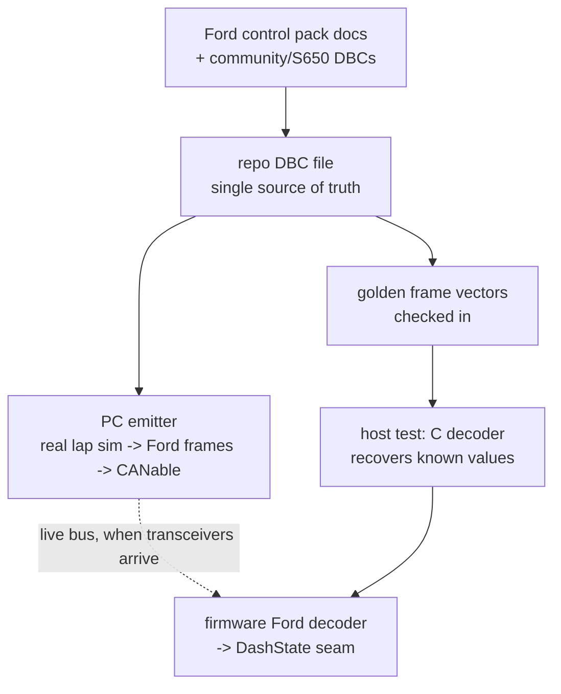
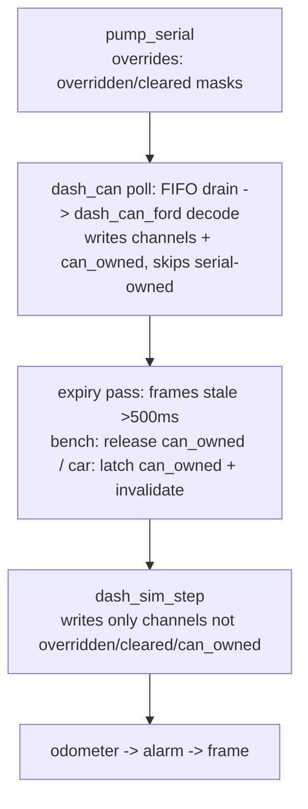
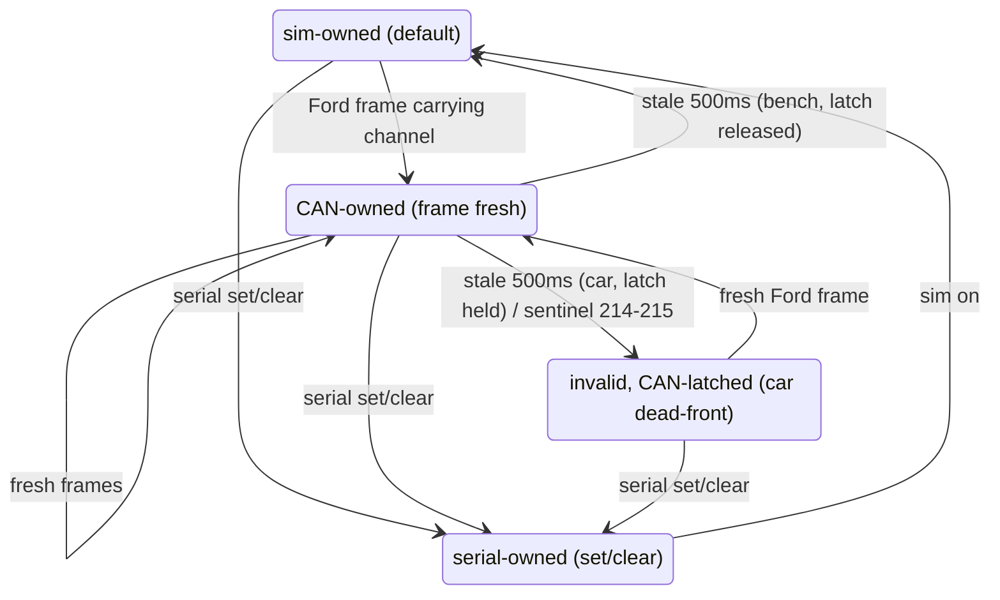

# Ford-Dialect CAN Telemetry - Plan

## Goal Capsule

- **Objective:** Prove the dash's CAN decode seam on the bench, end to end, before the car — by making the bench speak the real Ford control pack frame format, so the decoder we test is the decoder we ship.
- **Product authority:** Kevin (2026-08-15 brainstorm + plan synthesis, both confirmed). The car runs the **Gen 4 dual-throttle-body Coyote control pack (M-6017-M50D family)** with its Gateway Module.
- **Authority hierarchy:** this plan > repo conventions (CLAUDE.md) > implementer judgment on details the plan leaves open.
- **Stop conditions:** surface (don't guess) any conflict between the official Ford tables and what the DBC/decoder can express, and any need to change product scope (channel set, precedence semantics).
- **Open blockers:** none. The live-bus session is parts-gated (transceivers on reorder) and explicitly deferred; nothing else waits on hardware.

---

## Product Contract

*(Preservation note: unchanged from the confirmed brainstorm except — Outstanding Questions resolved in place by planning research; two GWM wiring facts appended to Dependencies; Sources extended with the research results; R2's confidence-tag taxonomy aligned to the four-tier set planning introduced. No scope change.)*

### Summary

A DBC file in the repo — transcribed from the Ford control pack documentation and cross-checked against community/S650 Mustang definitions — becomes the single source of truth for the dash's first CAN dialect. It drives both a PC emitter (the real lap simulator, host-compiled, transmitting Ford-format frames through the bench CANable) and the firmware's first production decoder. Golden-frame host tests prove the whole seam with zero hardware; the live-bus session slots in when transceivers arrive.

### Problem Frame

The dash's data path has a documented, deliberate seam: producers fill `DashState` channels and renderers read only that struct. Today the only producer is the onboard simulator, which writes the struct directly — so twenty clean minutes on the bench prove nothing about the path the car will actually use. The decode side of the seam has never existed: `dash_can.h` stops at loopback-level hardware proof and says so in its header.

Meanwhile the car's bus is not hypothetical. Three CAN sources are already named in the design docs — the Ford control pack (Ford's broadcast format, not ours to define), two ECUMaster PMU16s, and a RaceCapture for lap timing — and Board3 ships with two CAN buses, transceivers, and termination waiting. Every week the decode seam stays unexercised is risk compounding toward first-start day in the car, where debugging a never-run decoder would compete with debugging an engine.

The bench is one part short (transceivers, fried and reordered), but the decode logic itself needs no hardware to prove — which makes now the cheap moment.

### Key Decisions

- **The bench mimics the real Ford dialect, not an invented schema.** The emitter transmits the control pack's actual IDs, byte layouts, and scaling. Consequence: the bench decoder is the production Coyote decoder, and fidelity to the spec — the riskiest part — is exactly what the bench exercises.
- **A DBC file is the single source of truth.** The industry-standard schema format, checked into the repo. The PC emitter encodes from it directly; the firmware decoder is hand-written C (repo idiom: pure, host-testable header) but verified against it by golden frames. A transcription slip must now reproduce identically in two languages to hide.
- **Golden frames are the fidelity gate.** Known channel values encoded via the DBC toolchain into checked-in test vectors; the host test asserts the C decoder recovers them. Runs in `tests/run-tests.sh` under WSL with no hardware and no Python at test time.
- **Dead-front fast in the car.** When the bus goes quiet, CAN-sourced channels drop to invalid within a short staleness window — the glass never shows a number it can't vouch for, and an invalid channel can never assert an alarm (the dash's existing render rule, labeled R11 in the dash layout plan — not this plan's R11).
- **Bench keeps the sim as a fallback.** When the PC stops transmitting, the onboard simulator reclaims its channels rather than dead-fronting. Convenience on the bench, honesty in the car.
- **The dialect architecture plans for three, builds one.** Ford now; RaceCapture and PMU16 later as peer decoders feeding the same seam. Nothing in this round may assume Ford is the only dialect.

### Requirements

**Schema and source of truth**

- R1. The Ford dialect is defined by a DBC file in the repo, transcribed from the Ford control pack documentation.
- R2. The transcription is cross-checked against community sources, using S650 Mustang definitions as a reasonable proxy where the official tables are silent; each signal's confidence (official / official-sibling / community / proxy) is recorded.

**PC emitter**

- R3. A PC-side emitter runs the dash's real simulator (the same host-tested code, not a reimplementation) and transmits its output as Ford-dialect frames through the CANable at 500 kbps classic CAN.
- R4. The emitter uses the bench's proven gs_usb path and runs unattended for soak-length sessions.

**Firmware decoder**

- R5. The firmware decodes Ford-dialect frames into `DashState` through the existing producer seam — channel writes and validity bits only; renderers are untouched.
- R6. Only channels the Ford dialect actually carries are CAN-sourced; all other channels are untouched by the decoder.
- R7. In car semantics, a CAN-sourced channel whose frames stop arriving goes invalid within a short staleness window (dead-front; no alarm can assert from it).
- R8. In bench semantics, the onboard simulator reclaims channels the CAN path has released.
- R9. Serial overrides outrank both CAN and sim, using the existing ownership masks unchanged.

**Verification**

- R10. Golden frames generated from the DBC are checked in; a host test decodes them with the real firmware decoder and asserts the recovered channel values, wired into `tests/run-tests.sh`.
- R11. A host round-trip test runs the simulator, encodes its output as Ford frames, decodes them with the real decoder, and asserts the resulting `DashState` matches the direct-drive result for CAN-covered channels.
- R12. The live-bus bench procedure (emitter → CANable → transceiver → FDCAN1 → glass) is documented and ready to execute when transceivers arrive; it additionally referees the FDCAN kernel-clock/bit-timing assumption.

### Key Flows

- F1. Bench demo
  - **Trigger:** PC emitter starts transmitting on the bench bus.
  - **Steps:** Real sim steps on the host → frames encoded per the DBC → CANable → transceiver → FDCAN1 → firmware decoder → `DashState` → glass.
  - **Outcome:** Engine vitals on all three screens are CAN-real; channels outside the Ford dialect remain simulator-driven (mixed-source glass, accepted).
  - **Covers R3, R4, R5, R6.**
- F2. Bus loss in the car
  - **Trigger:** Ford bus goes quiet (stalled ECU, broken wire, key transient).
  - **Steps:** Staleness window expires → CAN-sourced channels invalidate → renderers dead-front them → alarm classifier ignores invalid channels.
  - **Outcome:** Honest glass; no fabricated values, no false alarms, no stale-value alarms.
  - **Covers R7.**

### Acceptance Examples

- AE1. **Given** the bench emitter is transmitting and the onboard sim is running, **when** a Ford RPM frame arrives, **then** the glass shows the CAN value and the sim's RPM is not rendered. **Covers R5, R6.**
- AE2. **Given** car semantics and flowing frames, **when** the bus goes silent, **then** within the staleness window the CAN-sourced channels render dead-front and no alarm asserts from them. **Covers R7.**
- AE3. **Given** CAN frames flowing, **when** `set rpm 3500` arrives over serial, **then** serial owns RPM until cleared — CAN and sim both locked out. **Covers R9.**
- AE4. **Given** the checked-in golden frames, **when** the host test decodes them, **then** every recovered channel matches the values they were generated from. **Covers R10.**
- AE5. **Given** the bench demo running, **when** the TRACK screen renders lap timing, **then** those values are still simulator-produced (the Ford dialect does not carry them). **Covers R6.**

### Scope Boundaries

Deferred for later (same decoder architecture, own rounds):

- RaceCapture dialect — lap timing, predictive delta, session length/start.
- PMU16 dialect — pump/fan output states and amps.
- CAN-driven TRACK/STREET mode switching (frame unspecified upstream).
- Dash transmitting onto the bus (any dash→car direction).
- CAN FD, other bitrates, or bus topologies beyond the two designed buses.

### Dependencies / Assumptions

- The car's pack is the **Gen 4 dual-throttle-body (M-6017-M50D family)**. Its instruction sheet does not print the CAN table but ships the Gateway Module (GWM) whose documented purpose is the generic-gauges HS-CAN broadcast; the sibling Gen 4X and 7.3L sheets print identical tables (the 0x270-set). Assumption: the GWM emits that same set — **official-sibling inference, verified by a bus sniff at first car contact** (or a Ford Techline question sooner).
- GWM wiring facts for the car install: the four harness-mounted CAN termination resistors are required, and CAN stubs must stay within 20 inches of C9/C175B/the blunt leads — the dash's tap must respect both.
- The CANable + gs_usb PC path is proven on this bench (2026-08-14); transceiver breakouts are on reorder and gate only the live-bus session.
- The FDCAN bit-timing assumption (80 MHz kernel clock) is unverified; the live session referees it. Decode-side work does not depend on it.
- The channel bitmask has a hard ceiling at 32 channels (documented UB at `DASH_CH_COUNT == 32`); this round adds no channels and any growth must respect that ceiling.
- `cantools` is a PC-tooling dependency only; nothing new enters the firmware build or the WSL test path.

### Outstanding Questions

Deferred to first car contact (non-blocking):

- Sniff-verify that the M50D GWM emits the 0x270-set (ten seconds with the CANable on the GWM blunt leads at 500 kbps). If it differs: re-target the DBC, regenerate vectors; decoder architecture survives.

### Sources / Research

- `MustangDash/dash_data.h` — the producer seam, channel enum (26), validity/override masks, and the 32-channel UB ceiling note that names the CAN round.
- `MustangDash/dash_can.h` — loopback-level FDCAN bring-up; "CAN -> DashState decode is explicitly a follow-on plan"; accept-all filter already configured.
- **Ford Performance instruction sheets (official):** IS_M-6017-M50HM (Gen 4X, 09/16/24) p.36 "CAN Message Definition" — the 0x270-set with full bit layouts; IS_M-6017-73M (7.3L, 02/21/23) §12.0 p.29 — byte-identical table; IS_M-6017-M50DAUTO / M50D (04/11/24) §9.0 — no table, but documents the GWM ("translates CAN data into readable messages that generic gauges… need"), its four external resistors, and the 20-inch stub limit. All at `performanceparts.ford.com/download/instructionsheets/`.
- **Community corroboration:** comma.ai opendbc `ford_lincoln_base_pt.dbc` (S550-era production powertrain — different IDs than the control pack set; useful as format reference, not as the dialect); v-ivanyshyn/parse_can_logs "Ford CAN IDs Summary" (measured S550 logs). A 2025 mustang6g request for the Gen 3 pack's protocol went unanswered by Ford — Gen 3 formats are unpublished (not our pack).
- `docs/plans/2026-07-22-001-feat-hpr-lap-simulation-plan.md` — RaceCapture as intended upstream; CAN mode-switch deferred with frame unspecified.
- `assets/dash-design/README.md` — the three-source car bus and live-channel list.
- Bench state 2026-08-14: CANable (candleLight/gs_usb) proven with python-can on the workstation via the PIO penv interpreter; `cantest` cross-bus round-trip exists in firmware, unexercised pending transceivers.

---

## Planning Contract

### Key Technical Decisions

- **KTD1 — The dialect is the 0x270-set.** Four frames, 11-bit IDs, 500 kbps classic CAN, Motorola bit order: `0x270` @100 Hz (engine speed, 14-bit, 1 rpm/bit), `0x274` @50 Hz (AF0/AF1 wideband A/F = raw×0.01+7; fuel pressure kPa; boost), `0x275` @50 Hz (vehicle speed, 0.1 km/h/bit), `0x278` @10 Hz (ECT/EOT/TOT bytes °C = raw−40 with **214 = degraded, 215 = faulted**; EOP 10-bit kPa; VBAT 0.01 V/bit; gear). Source: two official Ford tables that agree byte-for-byte (Sources). Confidence for the M50D GWM: official-sibling inference, sniff-verified at first car contact.
- **KTD2 — Channel mapping: 9 of 26.** RPM, SPEED (km/h→mph), ECT/OILT (°C→°F), OILP (kPa→psi), VOLTS, AFR_L/AFR_R (AF0/AF1), FUELP (kPa→psi). Throttle, IAT, fuel level, and brake are absent from the broadcast and stay sim-owned; unit conversions live in the decoder because `DashState` channels are °F/psi/mph by contract.
- **KTD3 — Sentinels dead-front.** ECT/EOT values 214/215 (degraded/faulted) invalidate the channel instead of converting — Ford's own quality signal mapped onto the dash's existing invalid-renders-`--`/no-alarm rule. TOT is carried by 0x278 but undecoded (no dash channel exists for it; per KTD2/R6 the decoder ignores it, sentinel or not).
- **KTD4 — New pure header `MustangDash/dash_can_ford.h`; `dash_can.h` stays HAL-only.** The decoder takes raw `(id, dlc, bytes[8], now_ms)` plus `DashState*` — no HAL types — making it host-testable like every behavioral header. `dash_can.h` gains only a thin FIFO-drain that hands byte frames over. Its own header text reserved exactly this split.
- **KTD5 — CAN ownership is a new `can_owned` mask in `DashState`.** The sim already yields to `overridden|cleared`; CAN-fresh channels must also win against the sim (the poll runs before `dash_sim_step` in the loop's producer pipeline — labeled KTD8 in `MustangDash.ino`, the dash plan's numbering, not this plan's KTD8), so `dash_ch_sim_owned()` grows to include `can_owned`. The decoder skips channels that are `overridden|cleared` (serial stays supreme, R9); `sim on` wipes serial masks but not `can_owned`, which only the decoder and its expiry manage. Invariant: a `DashState` channel may be claimed by at most one CAN dialect — the Ford claim set (9 channels) is recorded in `dash_data.h`'s doc comment, and a future dialect carrying an already-claimed channel (RaceCapture broadcasts GPS speed) requires revisiting the mask design before it lands.
- **KTD6 — Staleness: per-frame last-seen timestamps, one 500 ms window.** ≥3× the slowest frame period (0x278 at 10 Hz), comfortably sub-second per R7. Expiry behavior is a **runtime parameter** of the decoder's expiry function, not a compile-time fork inside the pure header: bench semantics release `can_owned` (sim reclaims, R8); car semantics **keep `can_owned` latched** — holding the sim out — while clearing the valid bit (dead-front, R7), with the latch released only by a fresh frame carrying that channel. Releasing on expiry would let the still-running sim re-validate the channel one loop (~16 ms) later, putting sim fiction on car glass. The firmware call site passes the flag-derived constant.
- **KTD7 — `DASH_CAN_CAR` build flag, default absent = bench.** Orthogonal-modifier idiom (like `DASH_MULE_H755Q`), consumed only at the `.ino` call site so host tests compile flag-free and can exercise both semantics at runtime through the parameter.
- **KTD8 — Golden vectors are a generated, checked-in test header** (`tests/golden_can_ford.h`), GENERATED-banner idiom, LF-only, deterministic byte-identical regeneration, frame bytes plus expected post-conversion channel values plus sentinel/edge cases. Expected values are computed from the spec constants in the generator — never by calling the C decoder — preserving the two-independent-implementations property (the repo's font-format lesson: a test that pins the generator's own output proves nothing). On DBC edits, regenerate; never widen tolerances (re-derive-the-constant rule).
- **KTD9 — CAN tooling runs on the PIO penv python (Windows), not WSL.** The proven CANable stack (python-can + gs_usb + libusb-package) lives there, and its pip works; `cantools` joins it. Loud import-guard with the exact fix command, per `make_splash_flash.py`'s idiom. The sim feed is a small host C shim (`tools/can_sim_feed.c`) compiled and run under WSL (the box has no Windows C compiler), streaming channel lines over a pipe into the Windows emitter.
- **KTD10 — DBC lives at `assets/can/ford-control-pack-gen4.dbc`** with provenance comments: source document titles/pages/URLs and a per-signal confidence tag (official / official-sibling / community / proxy).
- **KTD11 — The decoder gets a bench observable.** The `status` ack gains CAN decode counters — frames accepted **and lost** on FDCAN1 (the decode bus) plus ms since the last accepted frame; per-bus counters arrive with the second dialect. The forced-alarm lesson: a path that can be dead while everything acks `ok` needs a queryable pulse, and the lost counter is what distinguishes "quiet bus" from "dropping frames".

### Assumptions

- The M50D GWM broadcast matches the published sibling tables (KTD1); wrong ⇒ re-target DBC + regen vectors, architecture unaffected.
- `cantools` installs cleanly into the PIO penv (pure-python package).
- Ford's A/F encoding (raw×0.01+7) yields gasoline AFR directly compatible with the dash's AFR channels as rendered today.

### High-Level Technical Design

Producer pipeline with the CAN poll inserted (the loop's pipeline-order comment — labeled KTD8 in `MustangDash.ino`, from the dash plan — gains a producer):

Per-channel ownership lifecycle:

---

## Implementation Units

### U1. Ford dialect DBC with provenance

- **Goal:** The single source of truth exists: the 0x270-set transcribed into a DBC, every signal carrying scaling, offset, byte order, rate, and a confidence tag.
- **Requirements:** R1, R2.
- **Dependencies:** none.
- **Files:** `assets/can/ford-control-pack-gen4.dbc` (new).
- **Approach:** Transcribe the four messages from the official tables (KTD1) in Motorola bit order; comment block per message citing document title, page, URL, and confidence; record the A/F and temperature encodings exactly as Ford states them (the DBC carries raw scaling; the °F/psi/mph conversions are decoder policy, not DBC content). Cross-check signal positions against community S550 material only as sanity — the control-pack set differs from production IDs by design.
- **Patterns to follow:** provenance-comment style of `assets/splash/` and `assets/dash-design/` READMEs (vendored-source citation).
- **Test scenarios:** Test expectation: none — data artifact; U2's generator parse and U4's golden decode are its executable checks.
- **Verification:** `cantools` parses the file; the four IDs, DLCs, and rates match the official table on eyeball re-read.

### U2. Golden-vector generator

- **Goal:** `tools/make_can_golden.py` deterministically turns the DBC into `tests/golden_can_ford.h` — frames plus spec-derived expected channel values.
- **Requirements:** R10, R2.
- **Dependencies:** U1.
- **Files:** `tools/make_can_golden.py` (new), `tests/golden_can_ford.h` (generated, checked in).
- **Approach:** Encode with `cantools` from the DBC; compute expected dash-channel values (post-conversion °F/psi/mph/AFR) from the spec constants inside the generator — never by importing decoder logic (KTD8). Vector set: nominal values per channel, min/max range edges, the 214/215 sentinels, an unknown-ID frame, a short-DLC frame, an extended-ID frame whose identifier value is 0x270 (must be ignored), and a realistic multi-frame burst. GENERATED banner, `#pragma once`, `<stdint.h>` only, LF-only writes, trailing frame-table comment — the `dash_fonts.h`/`splash_flash.h` idiom.
- **Patterns to follow:** `tools/make_splash_flash.py` (import guard naming the fix command, deterministic regeneration contract, `newline="\n"`); `tools/kicad_lcsc.py` for argparse if flags are needed (default: zero-arg generator).
- **Test scenarios:** re-run produces a byte-identical header (determinism); header compiles standalone under `gcc -std=c11 -Werror` (checked implicitly by U4's stanza).
- **Verification:** header regenerates byte-identically twice; U4's test consumes it green.

### U3. Pure decoder header + ownership mask

- **Goal:** `MustangDash/dash_can_ford.h` decodes the 0x270-set into `DashState`; `dash_data.h` grows the `can_owned` mask and `dash_ch_sim_owned()` honors it.
- **Requirements:** R5, R6, R7, R8, R9.
- **Dependencies:** U1 (spec), parallel with U2.
- **Files:** `MustangDash/dash_can_ford.h` (new), `MustangDash/dash_data.h` (modify: `can_owned` field, ownership predicate, doc comment naming CAN as a live producer).
- **Approach:** A small state struct (per-frame last-seen ms) plus two entry points: decode one raw frame `(id, dlc, bytes, now_ms, DashState*)` — extract signals Motorola-order, convert units, apply sentinels (KTD3), write via `dash_ch_set` only when the channel isn't `overridden|cleared`, set `can_owned`; and an expiry pass `(now_ms, car_semantics, DashState*)` per KTD6 (car semantics latch `can_owned` while invalidating). Invalidation (sentinel and car-expiry) goes through a decoder-owned helper that clears the valid bit while honoring only `overridden|cleared` — never `can_owned` — because `dash_ch_invalidate` early-returns unless sim-owned and would silently no-op on CAN-owned channels; `dash_ch_invalidate` remains the sim-facing variant. The decoder's bit positions, scaling, and sentinels are transcribed directly from the official Ford tables (document + page cited in the header comment), never read out of the DBC — the DBC and `dash_can_ford.h` must remain two independent transcriptions of the spec. No HAL includes, no Arduino types — same purity bar as `dash_sim.h`.
- **Patterns to follow:** `dash_sim.h`'s guarded-write idiom (`if (owned) dash_ch_set(...)`); `dash_data.h`'s mask discipline and comment style.
- **Test scenarios:** covered in U4 (single test file for decoder + masks).
- **Verification:** compiles standalone under the host test flags; U4 green.

### U4. Host tests + runner stanza

- **Goal:** The decode seam is provable with zero hardware, wired into the invariant suite.
- **Requirements:** R10, R11, R7, R8, R9.
- **Dependencies:** U2, U3.
- **Files:** `tests/test_dash_can_ford.c` (new), `tests/run-tests.sh` (modify: new stanza, counters 14→15, header list).
- **Approach:** The repo's `expect()` counting pattern with `_Static_assert`s on frame IDs/DLC/channel count; docstring names the plan and the exact host compile line. R11 is implemented literally via a minimal spec-derived **encode-only** C implementation of the four messages inside the test file — transcribed from the Ford tables, sharing no extraction code with the decoder or the DBC (a third independent transcription): step `dash_sim_step` deterministically N steps, encode the 9 mapped channels, decode with the real decoder, and assert parity against the direct-drive `DashState` within per-channel quantization bounds derived from DBC scaling + unit conversion and recorded as constants in the test (derive once, never widen).
- **Test scenarios:**
  - Covers AE4. Every golden vector decodes to its expected channel value (post-conversion, exact or within the quantization bound the generator emits).
  - Sentinel 214/215 in ECT/EOT invalidates that channel and only that channel — with the sentinel frame arriving AFTER a valid frame has set `can_owned` on it, so the test exercises the guarded invalidation path.
  - Covers AE2. Staleness: after 500 ms without a frame, bench semantics release `can_owned` (a subsequent sim write lands); car semantics invalidate while `can_owned` stays latched (a subsequent sim write does NOT land; a fresh frame revalidates).
  - Covers R11. Sim round-trip: N deterministic `dash_sim_step` runs → test-side spec encoder → real decoder → `DashState` parity with direct-drive on the 9 mapped channels within the recorded quantization bounds.
  - Covers AE3. A channel under serial override (`overridden` set) is not written by a fresh CAN frame; after serial `clear`, still not written (cleared honored); after `sim on` mask wipe, CAN writes resume.
  - Covers AE1 (host form). With `can_owned` set, `dash_ch_sim_owned()` is false — the sim cannot overwrite a CAN-fresh channel.
  - Unknown ID and short-DLC frames are ignored without touching state.
  - Range edges: min/max vectors convert without overflow (OILP 0–1023 kPa, RPM 0–16383, VBAT full range).
  - `sim on` does not clear `can_owned` (only expiry does).
- **Verification:** `wsl -- bash -lc "./tests/run-tests.sh"` reports 15/15.

### U5. PC emitter (real sim → Ford frames → CANable)

- **Goal:** The bench impostor: the dash's real simulator streams through the CANable in Ford frames at spec rates.
- **Requirements:** R3, R4.
- **Dependencies:** U1; U2 (dry-run verification consumes `tests/golden_can_ford.h`).
- **Files:** `tools/can_emit.py` (new), `tools/can_sim_feed.c` (new).
- **Approach:** `can_sim_feed.c` compiles under WSL gcc (the host-test toolchain), steps `dash_sim.h` in real time, and prints channel lines to stdout; `can_emit.py` (PIO penv python, KTD9) reads the pipe, encodes via `cantools` + the DBC, and transmits via python-can/gs_usb with the proven libusb backend pattern (bench sniffer, 2026-08-14), pacing 0x270/0x274/0x275/0x278 at 100/50/50/10 Hz using absolute deadlines (not fixed sleeps — Windows timer granularity is ~15.6 ms) with achieved rates logged. `can_sim_feed.c` sets line-buffered stdout (block-buffered pipes deliver values in stale bursts); `can_emit.py` reads the pipe unbuffered and STOPS transmitting (logging why) on feed EOF or 500 ms without a channel line — a dead feed dead-fronts the glass instead of freezing it fresh. `--dry-run` prints encoded frames instead of transmitting — comparable against golden vectors with no hardware. Document the cross-boundary invocation (`wsl -- <feed> | <penv python> tools/can_emit.py`) in both docstrings.
- **Execution note:** verify `--dry-run` against the golden header before any hardware session — the emitter must be provably correct while the bus is still unbuildable.
- **Test scenarios:** Test expectation: none in the C suite — bench tooling. Its executable check is `--dry-run` output matching golden-vector bytes for the same input values.
- **Verification:** dry-run frames match golden bytes; live TX deferred to the transceiver session (R12).

### U6. Firmware wiring: FIFO drain, pipeline insertion, status counters, flag

- **Goal:** The dash consumes Ford frames end to end: FDCAN1 FIFO → pure decoder → `DashState`, with the bench observable and the bench/car flag.
- **Requirements:** R5, R7, R8, R12 (partially — the runtime half); KTD11.
- **Dependencies:** U3.
- **Files:** `MustangDash/dash_can.h` (modify: RX drain handing `(id, dlc, bytes)` to the decoder; RX counters), `MustangDash/MustangDash.ino` (modify: poll + expiry between `pump_serial()` and `dash_sim_step()`; pipeline-order comment update — the comment `MustangDash.ino` labels KTD8, from the dash plan; `DASH_CAN_CAR` consumption; `status` reply gains `can=` fields — the reply is composed in `pump_serial()`, not `dash_serial.h`), `platformio.ini` (comment note on the flag).
- **Approach:** Narrow FDCAN1's standard filter to the 0x270–0x278 range (`StdFiltersNbr` is already 1 and the range filter type is already in use) and forward only standard-ID frames from the drain (RxHeader IdType check — the current global filter admits extended frames whose identifier value could spoof a Ford ID). Drain FIFO0 each loop bounded at the FIFO capacity (8): at 210 frames/s aggregate and a ~60 Hz loop that clears steady state (~4/loop) with headroom; FIFO0 runs in blocking mode, so a >38 ms loop stall drops newest frames, recovered by the next fresh frame. Feed the decoder; run expiry with the flag-derived semantics constant; count accepted AND lost (RF0L) frames and expose `can=<accepted>,<lost>,<ms-since-last>` in `status`. `DASH_CAN_CAR` follows the overridable-default idiom with a labeled `#endif`; comment states what breaks if wrong (a car build that falls back to sim fiction).
- **Patterns to follow:** `dash_can_init()`'s "logged, never fatal" discipline; the loop's producer-order comment; `DASH_MULE_H755Q` flag block style.
- **Test scenarios:** `tests/test_dash_serial.c` pins only command parsing, not the `status` reply format — no host-test update needed; the `can=` fields are bench-verified via `status`. HAL drain itself is bench-verified (not host-testable, same boundary as the rest of `dash_can.h`).
- **Verification:** `./scripts/compile.sh board3_mule` and `./scripts/compile.sh board3` clean; `status` shows `can=` fields on the bench; full suite green.

### U7. Live-bus procedure + docs

- **Goal:** The transceiver-day session is a checklist, not a design exercise; the repo's docs reflect CAN as a live producer.
- **Requirements:** R12.
- **Dependencies:** U5, U6.
- **Files:** `docs/hardware/board3-bringup-card.md` (modify: CAN live-session procedure — wiring recap, emitter invocation, expected `status` counters, kernel-clock referee via CANable capture, GWM car-install notes), `CLAUDE.md` (modify: dash section gains the Ford dialect + emitter), `MustangDash/dash_can.h` header comment (decode no longer "follow-on").
- **Approach:** Procedure: transceiver on FDCAN1 pins (CN7-4/CN7-2 on the mule), CANable on the same bus, emitter live, glass shows CAN-real vitals, `cantest` still passes on bus 2, CANable capture confirms 500 kbps timing (referees the 80 MHz kernel-clock assumption). Car-side appendix: GWM resistors + 20-inch stub rule, and the sniff checklist includes signal-plausibility spot checks — AFR ≈ 14.7 at warm idle, ECT/EOT in plausible °C, VBAT ≈ 14 V running — confirming each signal's scaling, not just the frames' presence. Deliverable alongside the docs: draft and submit the Ford Techline question on the M50D GWM message set (tracked, non-blocking; the sniff remains the final referee).
- **Test scenarios:** Test expectation: none — documentation.
- **Verification:** a bench operator can run the session from the card alone.

---

## Verification Contract

| Gate | Command / check | Proves |
|---|---|---|
| Host invariant suite | `wsl -- bash -lc "./tests/run-tests.sh"` → 15/15 | decoder fidelity, ownership, staleness, sentinels, serial precedence, and the R11 sim round-trip |
| Golden determinism | re-run `tools/make_can_golden.py` → byte-identical header | regeneration contract |
| Emitter dry-run | `tools/can_emit.py --dry-run` vs golden bytes | python encode side matches the same spec |
| Firmware build | `./scripts/compile.sh board3_mule` (and `board3`) clean | wiring compiles on both targets |
| Bench (deferred, parts-gated) | live session per U7 procedure | electrical path + bit timing + glass |

The first four gates run with zero hardware and are the merge bar. The fifth is explicitly deferred to transceiver arrival and does not block shipping this plan's code.

---

## Definition of Done

- U1–U7 landed; all four hardware-free verification gates green.
- `dash_can_ford.h` compiles standalone under the host flags with no stubs (purity bar).
- The `status` ack demonstrably reports CAN counters on the bench build.
- Docs updated (bring-up card session, CLAUDE.md, `dash_can.h` header no longer says decode is follow-on).
- No dead code from abandoned approaches; generated header carries the GENERATED banner and regenerates byte-identically.
- The live-bus session and the GWM sniff-verify are recorded as deferred gates with their procedures written — not silently dropped.
