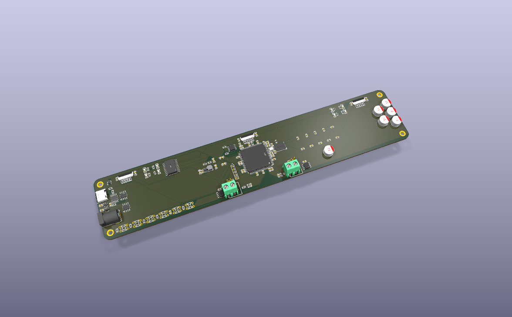
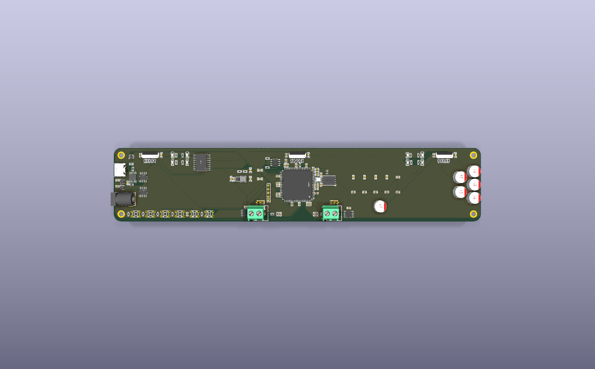
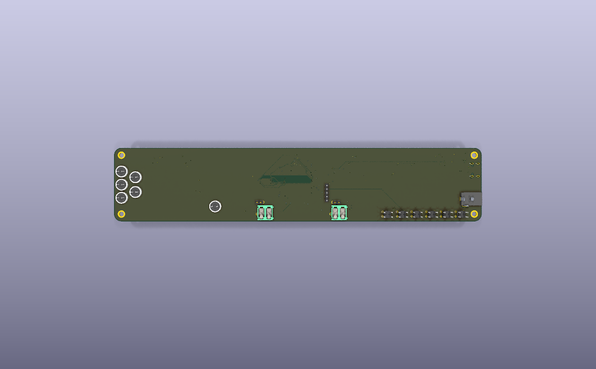

# kicad/

Converted KiCad copies of boards whose authoritative source lives elsewhere.

Today that is **Board3**, imported from EasyEDA Pro for the tooling evaluation in
[docs/plans/2026-07-27-001-chore-kicad-evaluation-plan.md](../docs/plans/2026-07-27-001-chore-kicad-evaluation-plan.md).



| Top | Bottom |
| --- | --- |
|  |  |

These are generated, not drawn — `.kicad_pcb` is the truth. See
[Renders](#renders) for how they stay current.

Three rules govern everything in this directory:

- **EasyEDA stays authoritative.** Conversion is one-way. Nothing here is ever
  converted back — round-trips accumulate error, and the EasyEDA project is the
  source of truth until a verdict says otherwise.
- **The design files are tracked on purpose.** `.kicad_pcb` and `.kicad_sch` are
  S-expression text, and `git diff` is the evaluation's verification mechanism for
  agent-driven writes. Keeping the board out of the repo would forfeit that.
- **The first commit of a converted board is the baseline.** It must contain
  converter output and nothing else. Every later measurement diffs against it.

Toolchain resolution for anything operating on these files is
[tools/kicad_env.py](../tools/kicad_env.py) — do not hardcode `kicad-cli` paths.

## Renders

`board3/renders/*.png` are committed so the board is visible in a diff, a PR, or
a browser without installing KiCad. They are **build output, not source** — the
board is the truth and these are regenerated from it:

```sh
python tools/kicad_render.py            # refresh all three views
python tools/kicad_render.py --check    # exit 2 if older than the board
```

A tracked pre-commit hook keeps them honest. Install it once per clone:

```sh
git config core.hooksPath .githooks
```

The hook only fires when a `.kicad_pcb` is actually staged — each refresh is
~360 KB of binary that lands in history permanently, so regenerating on every
commit would bloat the repo to show a picture that did not change. If rendering
fails (no KiCad on this machine) it warns and lets the commit through: refusing
to commit firmware because a PCB picture could not be drawn is the wrong trade.

Renders are 1200×750 on purpose. Enough to read placement and routing at a
glance; open the board if you need detail.

## Adding a part

**Every part placed on a board here must be an LCSC part, carrying supplier
metadata and a 3D model.** Not a convention — a build dependency. `kicad_fab.py`
builds the JLCPCB BOM by reading the schematic's supplier fields, so a part added
without them does not produce a warning, it produces a BOM that is quietly
missing a component.

Add parts with [tools/kicad_lcsc.py](../tools/kicad_lcsc.py), never by dragging a
generic symbol out of the stock KiCad libraries:

```sh
python tools/kicad_lcsc.py add C116592   # symbol + footprint + STEP/WRL + metadata
python tools/kicad_lcsc.py check         # audit; exits non-zero on any gap
python tools/kicad_lcsc.py models        # fetch any 3D model the board references but lacks
```

`add` drives the JLCImport plugin and then rewrites the imported symbol's fields
into Board3's vocabulary. That rewrite is the whole point: JLCImport writes the
LCSC code to a property named `LCSC`, and this project reads it from
`Supplier Part`. Import without remapping and the part looks sourced in the
schematic editor while being invisible to the BOM.

`LCSC Part Name` is **not** the part number despite its name — it holds
descriptive text. The C-number goes in `Supplier Part`.

Run `check` before generating fab output. It exits non-zero if any placed part
lacks an LCSC code or any referenced 3D model is missing from disk.

3D models live in `board3/EASYEDA_MODELS/` and **are tracked** (~53 MB, ~9.5 MB
in history). They are regenerable from the schematic's LCSC codes via
`kicad_lcsc.py models`, but they are committed anyway so a fresh clone renders
and exports 3D offline, and so the geometry stays pinned to this board revision
rather than to whatever EasyEDA serves later.
